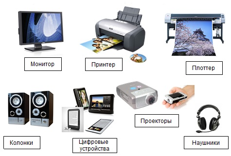
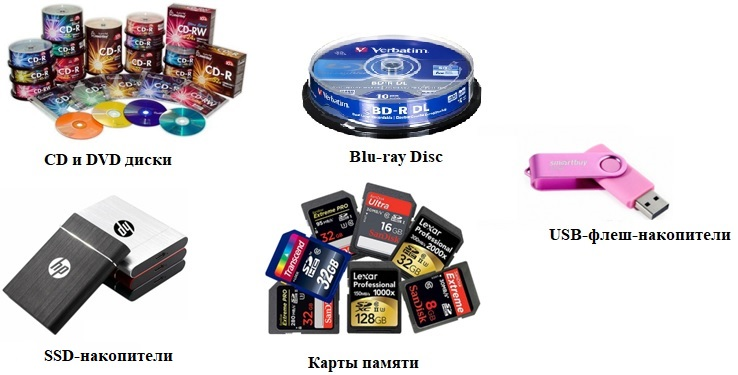
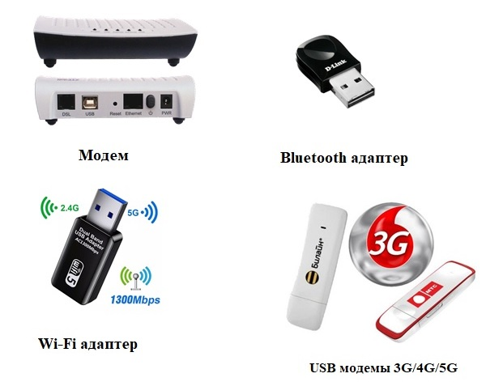
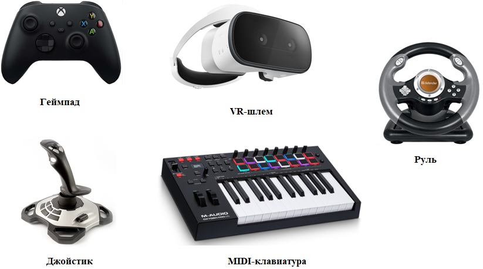
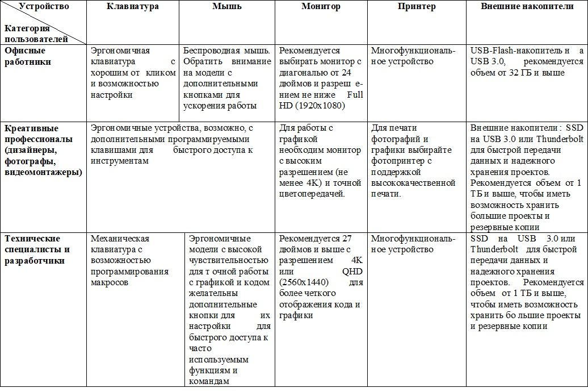

---
## Front matter
lang: ru-RU
title: Доклад
subtitle: Обзор видов внешних устройств современного компьютера
author:
  - Головина М.И.
institute:
  - Российский университет дружбы народов, Москва, Россия
  - Факультет Физико-математических и естественных наук
date: 24 февраля 2025

## i18n babel
babel-lang: russian
babel-otherlangs: english

## Formatting pdf
toc: false
toc-title: Содержание
slide_level: 2
aspectratio: 169
section-titles: true
theme: metropolis
header-includes:
 - \metroset{progressbar=frametitle,sectionpage=progressbar,numbering=fraction}
 - '\makeatletter'
 - '\beamer@ignorenonframefalse'
 - '\makeatother'
---

# Информация

## Докладчик

:::::::::::::: {.columns align=center}
::: {.column width="70%"}

  * Головина Мария Игоревна
  * Бакалавр направления подготовки Математика и механика
  * студентка группы НММбд - 02- 24
  * Российский университет дружбы народов
  * [1132246810@rudn.ru](mailto:1132246810@rudn.ru)

:::
::: {.column width="30%"}

:::
::::::::::::::

## Преподаватель

:::::::::::::: {.columns align=center}
::: {.column width="70%"}

  * Кулябов Дмитрий Сергеевич
  * д.ф.-м.н., профессор
  * профессор кафедры прикладной информатики и теории вероятностей
  * Российский университет дружбы народов
  * [kulyabov-ds@rudn.ru](mailto:kulyabov-ds@rudn.ru)
  * <https://yamadharma.github.io/ru/>

:::
::: {.column width="30%"}

:::
::::::::::::::
# Вводная часть

## Актуальность

- Непрерывное расширение функциональности компьютеров
- Ускоренное развитие рынка внешних устройств
- Влияние внешних устройств на производительность и эффективность работы и тд.

## Объект и предмет исследования

- Объект исследования: Современный компьютер
- Предмет исследования: Виды внешних устройств современных компьютеров

## Цель и задачи

- Цель работы: выполнить обзор видов внешних устройств современных компьютеров, выявить их основные характеристики и область применения для оптимизации выбора и эффективного их использования в различных сферах деятельности
- Задачи:
	- проанализировать виды внешних устройств современного компьютера и классифицировать их; 
	- рассмотреть устройства ввода и вывода информации, внешние запоминающие устройства, внешние устройства связи и телекоммуникаций, а так же специализированные внешние устройства;
	- разработать практические рекомендации по выбору внешних устройств компьютера для различных категорий пользователей.
  
## Методы исследования

- Анализ литературы
- Систематизация данных
- Обобщение полученных результатов

# Классификация видов внешних устройств компьютеров

## Устройства ввода информации
:::::::::::::: {.columns align=center}
::: {.column width="40%"}
Устройства ввода информации (input devices) предназначены для передачи данных и команд от пользователя или из внешней среды в компьютер для дальнейшей обработки.
:::
::: {.column width="60%"}

:::
::::::::::::::

## Устройства вывода информации
:::::::::::::: {.columns align=center}
::: {.column width="40%"}
Устройства вывода информации (output devices) предназначены для представления данных, обработанных компьютером, в форме, понятной пользователю.
:::
::: {.column width="60%"}

:::
::::::::::::::

## Внешние запоминающие устройства
:::::::::::::: {.columns align=center}
::: {.column width="40%"}
Внешние запоминающие устройства, также называемые внешними накопителями, предназначены для длительного хранения информации вне оперативной памяти компьютера. Они обеспечивают возможность переноса данных между компьютерами, создания резервных копий и хранения больших объемов информации.
:::
::: {.column width="60%"}

:::
::::::::::::::

## Средства связи и телекоммуникаций
:::::::::::::: {.columns align=center}
::: {.column width="40%"}
Средства связи и телекоммуникации можно рассматривать как особый вид внешних устройств для ПК, так как они выполняют роль адаптеров, позволяющих компьютеру взаимодействовать с внешним миром - другими компьютерами, сетями и сервисами.
:::
::: {.column width="60%"}

:::
::::::::::::::

## Специализированные внешние устройства
:::::::::::::: {.columns align=center}
::: {.column width="40%"}
Специализированные внешние устройства – это периферийные устройства, разработанные для решения конкретных задач или для работы в определенной сфере деятельности.
:::
::: {.column width="60%"}

:::
::::::::::::::

# Тенденции развития внешних устройств современных компьютеров

## Основные направления развития внешних yстройств

- Повышение производительности и скорости
- Миниатюризация и портативность
- Расширение функциональности и интеграция
- Облачные технологии и периферийные устройства

# Практические рекомендации по выбору внешних устройств
## Рекомендации по выбору внешних устройств для различных категорий пользователей

:::::::::::::: {.columns align=center}

::: {.column width="90%"}

:::
::::::::::::::

# Заключение
## Основные выводы
- Проанализированы и классифицированы внешние устройства современного компьютера
- Рассмотрены устройства ввода и вывода информации, внешние запоминающие устройства, внешние устройства связи и телекоммуникаций, а так же специализированные внешние устройства
- Разработаны практические рекомендации по выбору внешних устройств компьютера для различных категорий пользователей

# Дорогу осилит идущий

