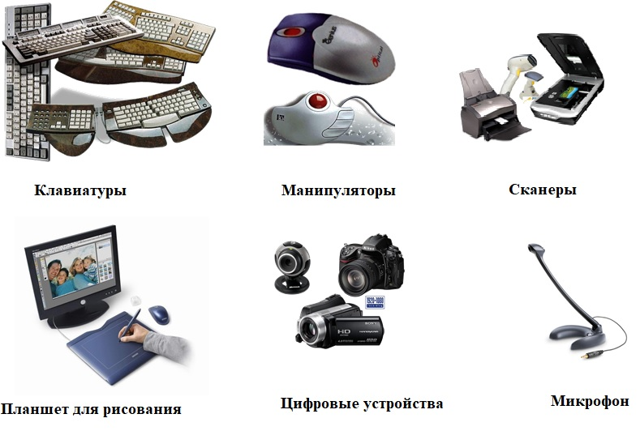
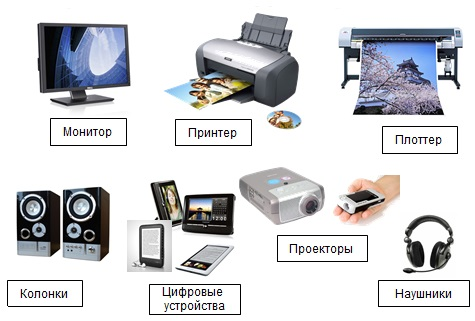
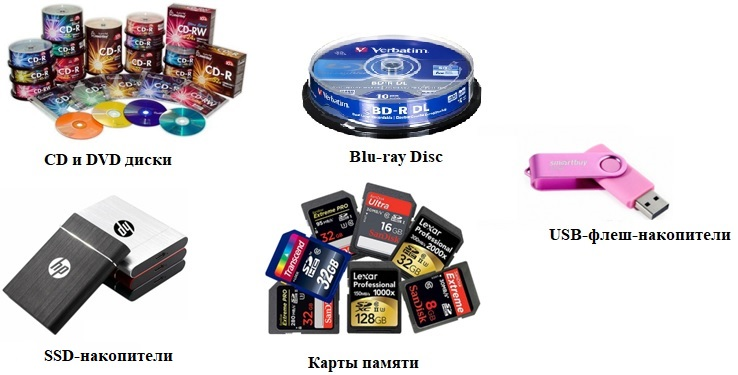
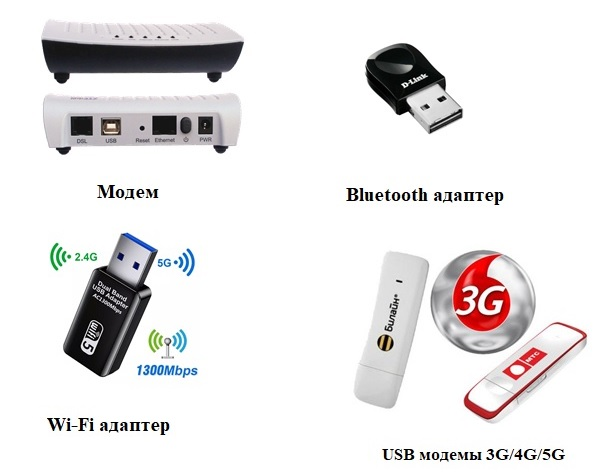
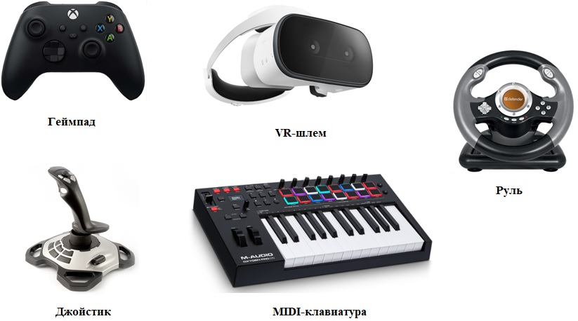

---
## Front matter
title: "ДОКЛАД"
subtitle: "ОБЗОР ВИДОВ ВНЕШНИХ УСТРОЙСТВ В СОВРЕМЕННЫХ КОМПЬЮТЕРАХ"
author: "Головина Мария"

## Generic otions
lang: ru-RU
toc-title: "Содержание"

## Bibliography
bibliography: bib/cite.bib
csl: pandoc/csl/gost-r-7-0-5-2008-numeric.csl

## Pdf output format
toc: true # Table of contents
toc-depth: 2
lof: true # List of figures
lot: true # List of tables
fontsize: 12pt
linestretch: 1.5
papersize: a4
documentclass: scrreprt
## I18n polyglossia
polyglossia-lang:
  name: russian
  options:
	- spelling=modern
	- babelshorthands=true
polyglossia-otherlangs:
  name: english
## I18n babel
babel-lang: russian
babel-otherlangs: english
## Fonts
mainfont: PT Serif
romanfont: PT Serif
sansfont: PT Sans
monofont: PT Mono
mainfontoptions: Ligatures=TeX
romanfontoptions: Ligatures=TeX
sansfontoptions: Ligatures=TeX,Scale=MatchLowercase
monofontoptions: Scale=MatchLowercase,Scale=0.9
## Biblatex
biblatex: true
biblio-style: "gost-numeric"
biblatexoptions:
  - parentracker=true
  - backend=biber
  - hyperref=auto
  - language=auto
  - autolang=other*
  - citestyle=gost-numeric
## Pandoc-crossref LaTeX customization
figureTitle: "Рис."
tableTitle: "Таблица"
listingTitle: "Листинг"
lofTitle: "Список иллюстраций"
lotTitle: "Список таблиц"
lolTitle: "Листинги"
## Misc options
indent: true
header-includes:
  - \usepackage{indentfirst}
  - \usepackage{float} # keep figures where there are in the text
  - \floatplacement{figure}{H} # keep figures where there are in the text
---

# Цель работы

-выполнить обзор видов внешних устройств современных компьютеров, выявить их основные характеристики и область применения для оптимизации выбора и эффективного их использования в различных сферах деятельности

# Задачи

проанализировать виды внешних устройств современного компьютера и классифицировать их; 

рассмотреть устройства ввода и вывода информации, внешние запоминающие устройства, внешние устройства связи и телекоммуникаций, а так же специализированные внешние устройства;

разработать практические рекомендации по выбору внешних устройств компьютера для различных категорий пользователей.

Объект исследования: Современный компьютер.

Предмет исследования: Виды внешних устройств, их характеристики и применение.

Методы исследования: Анализ литературы, систематизация данных, обобщение полученных результатов.

# Классификация видов внешних устройств современных компьютеров

Внешние устройства можно классифицировать по нескольким признакам, однако наиболее распространенным является разделение по функциональному назначению. Выделяют следующие основные категории:

устройства ввода: позволяют пользователю вводить информацию в компьютер; 

устройства вывода: отображают информацию, обработанную компьютером, для пользователя; 

внешние запоминающие устройства: используются для длительного хранения информации вне оперативной памяти;

устройства коммуникации и сетевого взаимодействия: обеспечивают связь компьютера с другими устройствами и сетями; 

специализированные устройства: предназначены для выполнения специфических задач[1].

Устройства ввода информации

Устройства ввода информации (input devices) предназначены для передачи данных и команд от пользователя или из внешней среды в компьютер для дальнейшей обработки. Они преобразуют физические действия пользователя или сигналы из окружающей среды в цифровой формат, понятный компьютеру. На рисунке 1 представлены основные устройства ввода информации.

{#fig:001 width=70%}

Классификация устройств ввода информации:

1.	Устройства для ручного ввода текста и команд:

1.1	Клавиатура - основное устройство для ввода текстовой и числовой информации, команд управления. Существуют различные типы клавиатур: механические (с механическими переключателями, отличаются высокой надежностью и тактильным откликом); мембранные (с мембранными переключателями); ножничные (с ножничным механизмом клавиш, часто используются в ноутбуках); беспроводные (подключаются через Bluetooth или радиоканал).

1.2	Мышь – это устройство для управления курсором и выбора объектов на экране. Типы мышей: оптические (используют светодиод для отслеживания движения); лазерные (используют лазер для более точного отслеживания движения); беспроводные (подключаются через Bluetooth или радиоканал).
Так же можно выделить трекболы (шар для управления курсором, стационарное устройство) и сенсорную панель (Touchpad) - устройство, встроенное в ноутбуки, для управления курсором с помощью касания пальцами.

2.	Устройства для ввода графической информации:

2.1	Графический планшет – это устройство для рисования и цифровой живописи, используется с пером (стилусом). Различают планшеты с пассивным пером (перо не требует батареек), планшеты с активным пером (перо требует батареек или зарядки, обычно обладают большей функциональностью) и планшеты с экраном (позволяют рисовать непосредственно на экране).

2.2	Сканер – это устройство для преобразования изображений и текста с бумажных носителей в цифровой формат. Различают различные типы сканеров: планшетные (наиболее распространенный тип, позволяют сканировать плоские объекты); протяжные (сканируют документы, проходящие через механизм подачи); ручные (портативные сканеры для сканирования небольших участков); 3D-сканеры (для создания трехмерных моделей объектов).

3.	Устройства для ввода звуковой информации:

Микрофон – это устройство для преобразования звуковых волн в электрический сигнал. Можно выделить следующие типы микрофонов: динамические, конденсаторные, USB-микрофоны, беспроводные микрофоны.

4.	Устройства для ввода видеоинформации:

Веб-камера – это устройство для захвата видеоизображения. Веб-камер имеют следующие характеристики: разрешение (определяет качество изображения); частота кадров (определяет плавность видео); угол обзора и наличие встроенного микрофона[2].

Устройства вывода информации

Устройства вывода информации (output devices) предназначены для представления данных, обработанных компьютером, в форме, понятной пользователю. Они преобразуют цифровые сигналы из компьютера в визуальные, звуковые или тактильные формы. На рисунке 2 представлены основные устройства вывода информации

{#fig:002 width=70%}

Классификация устройств вывода информации:

1. Устройства визуального отображения информации:

1.1 Монитор - устройство оперативной визуальной связи пользователя с управляющим устройством и отображением данных, передаваемых с клавиатуры, мыши или центрального процессора. Мониторы обладают такими характеристиками как: разрешение (количество пикселей по горизонтали и вертикали); частота обновления (количество кадров в секунду, измеряется в Гц); время отклика (время, необходимое пикселю для изменения цвета, измеряется в мс); яркость (измеряется в кд/м²); контрастность (отношение яркости самого яркого и самого темного пикселя); углы обзора; тип матрицы (TN, IPS, VA, OLED).

1.2 Проектор  - оптический прибор, предназначенный для создания действительного изображения плоского предмета небольшого размера на большом экране. Типы проекторов: LCD-проекторы, DLP-проекторы (Digital Light Processing), LED-проекторы, Лазерные проекторы. Основные характеристики проекторов это  разрешение, яркость (измеряется в люменах),  контрастность, проекционное отношение и тип источника света.

2. Устройства вывода звуковой информации: акустические системы (колонки) и наушники.

3. Устройства для вывода информации на бумаге:

3.1 Принтер — это периферийное устройство, предназначенное для вывода текстовой или графической информации из электронного вида (компьютера, смартфона и т. д.) на физический носитель, чаще всего на бумагу. 

Принтеры можно классифицировать по различным технологиям печати. Основные из них: 

- Струйные принтеры: используют жидкие чернила, которые распыляются на бумагу через крошечные сопла печатающей головки.

- Лазерные принтеры: используют тонер (порошок) и лазер для создания изображения на барабане, который затем переносит изображение на бумагу с помощью нагрева.

- Матричные принтеры: устаревший тип принтеров, которые используют ударные иглы для формирования изображения на бумаге через красящую ленту. Сейчас практически не используются, но могут встречаться в некоторых специализированных областях, где требуется печать на многослойных бланках.

- Термические принтеры: используют нагрев для создания изображения на специальной термочувствительной бумаге. Часто используются в кассовых аппаратах и для печати этикеток.

- Сублимационные принтеры: используют процесс сублимации красителя для переноса изображения на бумагу или другие материалы (например, пластик). 

Принтеры обладают такими характеристиками как: 

- разрешение (DPI - Dots Per Inch) -количество точек на дюйм. Чем выше DPI, тем более четким и детализированным будет изображение.

- Скорость печати (PPM - Pages Per Minute) - количество страниц, которое принтер может напечатать в минуту. Различают скорость печати в черно-белом и цветном режимах.

- Цветность - принтеры могут быть монохромными (черно-белыми) или цветными.

- Формат бумаги: - максимальный размер бумаги, который может использовать принтер (например, A4, A3, Letter).

- Подключение - нтерфейсы подключения к компьютеру и другим устройствам (USB, Ethernet, Wi-Fi).

Так же существует такая категория принтеров как МФУ (многофункциональное устройство), которое  объединяет в себе функции принтера, сканера, копира и иногда факса. МФУ могут быть струйными или лазерными.

3.2 Плоттер - устройство для вывода графической информации больших размеров (чертежи, плакаты).  Типы плоттеров: перьевые (используют перья для рисования); режущие (используются для резки материалов, таких как винил).

3.3 3D-принтеры - устройства для создания физических объектов на основе цифровых моделей[3].

Внешние запоминающие устройства

Внешние запоминающие устройства (рисунок 3), также называемые внешними накопителями, предназначены для длительного хранения информации вне оперативной памяти компьютера. Они обеспечивают возможность переноса данных между компьютерами, создания резервных копий и хранения больших объемов информации.

{#fig:003 width=70%}

ВЗУ можно классифицировать по различным критериям:

1.	По принципу записи и хранения информации:

- магнитные (жесткие диски, магнитные ленты);

- оптические (CD, DVD, Blu-ray диски);

- полупроводниковые (SSD, USB-флеш-накопители, карты памяти).

2.	По способу подключения:

- внутренние (устанавливаются внутри системного блока компьютера);

- внешние (подключаются к компьютеру через внешние интерфейсы).

3.	По способу доступа к данным:

- последовательный (магнитные ленты);

- прямой (жесткие диски, SSD, оптические диски).

4.	По типу носителя:

- съемные (USB-флеш-накопители, карты памяти, оптические диски);

- несъемные (внутренние жесткие диски, SSD).

Рассмотрим несколько типов внешних закопинающих устройств:

1. Оптические накопители:

- CD (Compact Disc) - оптический диск для хранения цифровой информации. Существуют следующие типы CD: CD-R (однократно записываемые); CD-RW (многократно перезаписываемые).

- DVD (Digital Versatile Disc) - оптический диск с большей емкостью, чем CD. Типы DVD: DVD-R (однократно записываемые); DVD-RW (многократно перезаписываемые); DVD+R и DVD+RW (аналоги DVD-R и DVD-RW, разработанные компанией Philips).
Blu-ray Disc: Оптический диск с еще большей емкостью, чем DVD, используется для хранения видео высокой четкости (HD).

2.  Полупроводниковые накопители:

- Твердотельные накопители (SSD - Solid State Drive) - накопители, использующие флэш-память для хранения данных. Могу устанавливаться внутри компьютера или подключаются через USB или другие интерфейсы.

- USB-флеш-накопители (USB Flash Drives) - компактные переносные устройства хранения данных, подключаемые к компьютеру через USB-порт.

- Карты памяти (Memory Cards) - используются в фотоаппаратах, смартфонах, планшетах и других устройствах для хранения данных.

Средства связи и телекоммуникаций

Средства связи и телекоммуникации можно рассматривать как особый вид внешних устройств для ПК, так как они выполняют роль адаптеров, позволяющих компьютеру взаимодействовать с внешним миром - другими компьютерами, сетями и сервисами. Несмотря на то, что часто они находятся внутри системного блока или интегрированы в материнскую плату, они выполняют функции, аналогичные другим внешним устройствам: обеспечивают ввод и вывод данных (передачу и прием). На рисунке 4 представлены средства связи и телекоммуникаций.

{#fig:004 width=70%}

Далее представлены примеры средств связи и телекоммуникаций как внешних устройств:

1.	Внешняя сетевая карта (USB Ethernet адаптер) - подключается к порту USB и выполняет ту же функцию, что и внутренняя сетевая карта, но имеет преимущество портативности.

2.	Wi-Fi адаптер (USB) - обеспечивает беспроводное подключение к сети Wi-Fi. 

3.	Модем, хотя сейчас используются реже, модемы (например, ADSL-модемы) исторически подключались к ПК как внешние устройства через USB или COM-порт, позволяя подключаться к интернету через телефонную линию.

4.	Bluetooth адаптер - беспечивает беспроводную связь с другими устройствами Bluetooth, такими как наушники, мыши, клавиатуры и мобильные телефоны. 

5.	Устройства мобильной связи (USB модемы 3G/4G/5G) - позволяют подключаться к интернету через сети мобильных операторов. Подключаются к порту USB.

Основное отличие средств связи от обычных периферийных устройств, заключается в их двунаправленности. Они одновременно и принимают информацию, и передают ее, обеспечивая двустороннюю связь. Обычные периферийные устройства чаще всего выполняют либо только ввод, либо только вывод информации.

Специализированные внешние устройства

Специализированные внешние устройства – это периферийные устройства, разработанные для решения конкретных задач или для работы в определенной сфере деятельности. Они отличаются от универсальных устройств (клавиатуры, мыши, монитора) более узкой функциональностью, заточенной под конкретные нужды. На рисунке 5 представлены примеры спецализированных внешних устройств.

{#fig:005 width=70%}

Примеры внешних специализированных устройств.

1.	Игровые контроллеры (геймпады, джойстики, рули). В основном их назначение – это управление в компьютерных играх. Они предоставляют более интуитивный и удобный способ взаимодействия с игровым миром, чем клавиатура и мышь, особенно в определенных жанрах (гонки, авиасимуляторы т.д.).

Геймпады - универсальные контроллеры для различных жанров. Имеют кнопки, крестовину (D-pad) для навигации, аналоговые стики для управления движением и камерой, а также триггеры и бамперы для дополнительных действий.

Джойстики  - используются в основном для авиасимуляторов, космических симуляторов и других игр, требующих точного управления полетом. Имеют ручку, которая наклоняется в разные стороны, и кнопки для дополнительных функций.

Рули - используются в гоночных играх для имитации управления автомобилем. Часто комплектуются педалями газа, тормоза и сцепления, а также коробкой передач для более реалистичного опыта.

2.	Устройства виртуальной реальности (VR-шлемы, контроллеры). Их назначение  - это обеспечение погружения пользователя в виртуальную реальность.  Создают иллюзию присутствия в другом, полностью сгенерированном или записанном окружении.

Существуют VR-шлемы они отображают стереоскопическое изображение для каждого глаза, создавая эффект 3D-пространства.  Имеют датчики отслеживания движений головы, позволяя пользователю осматриваться в виртуальном мире. VR-контроллеры - позволяют пользователю взаимодействовать с виртуальным миром.  Обычно имеют кнопки, трекпады или стики, а также датчики отслеживания движений рук.

3.	MIDI-клавиатура, ее назначение это создание и редактирование музыки.  Это электронный музыкальный инструмент, который не генерирует звук самостоятельно, а передает MIDI-сообщения (Musical Instrument Digital Interface) на компьютер или другое устройство, которое использует эти сообщения для воспроизведения звука[4].

#  Тенденции развития внешних устройств современных компьютеров

Тенденции развития внешних устройств современных компьютеров охватывают широкий спектр улучшений и инноваций, направленных на повышение производительности, удобства использования, функциональности и интеграции с другими устройствами. 

Можно выделить следующие основные направления:

1. Повышение производительности и скорости - более быстрые интерфейсы: переход на более быстрые интерфейсы, такие как USB 4, Thunderbolt 4/5, PCIe 5.0/6.0, позволяет передавать данные с большей скоростью между компьютером и внешними устройствами. Это особенно важно для устройств хранения данных, видеокарт и внешних мониторов. 
Увеличение скорости твердотельных накопителей (SSD) - внешние SSD становятся все более быстрыми, приближаясь к скоростям внутренних SSD благодаря новым технологиям и интерфейсам.
Улучшенные характеристики мониторов - повышение разрешения (4K, 8K), частоты обновления (144Hz, 240Hz, 360Hz), снижение времени отклика (1ms и меньше) и расширение цветового охвата делают мониторы более привлекательными для игр, работы с графикой и просмотра мультимедиа.

2. Миниатюризация и портативность.
Компактные размеры - устройства становятся меньше и легче, что делает их более удобными для переноски и использования в мобильных условиях. Например, внешние SSD теперь могут помещаться в кармане.
Беспроводные технологии - широкое распространение беспроводных технологий, таких как Bluetooth и Wi-Fi, позволяет избавиться от проводов и обеспечивает большую свободу перемещения. Беспроводные клавиатуры, мыши, наушники, колонки и даже мониторы становятся все более популярными.

3. Расширение функциональности и интеграция.
Интеграция с мобильными устройствами - устройства становятся более совместимыми с мобильными телефонами и планшетами, позволяя легко обмениваться данными и использовать их совместно. Например, портативные мониторы, предназначенные для подключения к ноутбукам и телефонам.
Умные устройства - интеграция искусственного интеллекта (ИИ) в периферийные устройства для улучшения их функциональности. Например, умные колонки с голосовым управлением, камеры с функциями распознавания лиц, 

4. Облачные технологии и периферийные устройства.
Устройства, которые выполняют минимальный набор функций и в основном используют облачные ресурсы для обработки данных и хранения информации.

Интеграция с облачными сервисами - многие периферийные устройства интегрируются с облачными сервисами для хранения, синхронизации и обмена данными.
В целом, тенденции развития внешних устройств современных компьютеров направлены на то, чтобы сделать их более мощными, удобными, функциональными, портативными и экологичными. Инновации в технологиях, материалах и дизайне продолжают расширять возможности использования компьютеров в различных сферах деятельности[5].

# Практические рекомендации по выбору внешних устройств

Выбор внешних устройств для современного компьютера может быть сложной задачей, особенно с учетом разнообразия доступных на рынке вариантов. Ниже представлены примерные рекомендации по выбору периферийных устройств, адаптированные для различных категорий пользователей, с учетом их потребностей, и технических требований.

1. Офисные работники

Потребности: Комфортная работа с документами, электронной почтой и офисными приложениями.

Рекомендации:

Клавиатура: Выбирайте эргономичную клавиатуру с хорошим откликом и возможностью настройки. 

Мышь: Оптимально использовать беспроводную мышь с хорошей эргономикой. Обратите внимание на модели с дополнительными кнопками для ускорения работы.

Монитор: Рекомендуется выбирать монитор с диагональю от 24 дюймов и разрешением не ниже Full HD (1920x1080). Модели с IPS-матрицей обеспечивают лучшие углы обзора и цветопередачу.

Принтер: Для офисных нужд лучше выбрать многофункциональное устройство (принтер, сканер, копир) с возможностью беспроводной печати.

Внешние накопители: USB-Flash-накопитель на USB 3.0, рекомендуется объем от 32 ГБ и выше, чтобы иметь возможность хранить большие документы.

2. Креативные профессионалы (дизайнеры, фотографы, видеомонтажеры)

Потребности: Высокая точность и качество изображения, удобство работы с графикой.

Рекомендации:

Графический планшет: Выбирайте планшет с чувствительностью к нажиму и возможностью наклона пера. 

Монитор: Для работы с графикой необходим монитор с высоким разрешением (не менее 4K) и точной цветопередачей.

Клавиатура и мышь: Эргономичные устройства, возможно, с дополнительными программируемыми клавишами для быстрого доступа к инструментам.

Принтер: Для печати фотографий и графики выбирайте фотопринтер с поддержкой высококачественной печати.

Внешние накопители: SSD на USB 3.0 или Thunderbolt для быстрой передачи данных и надежного хранения проектов. Рекомендуется объем от 1 ТБ и выше, чтобы иметь возможность хранить большие проекты и резервные копии.

3. Технические специалисты и разработчики

Потребности: Высокая производительность, надежность и возможность работы с несколькими устройствами.

Рекомендации:	

Клавиатура: Механическая клавиатура с возможностью программирования макросов.

Мышь: Эргономичные модели с высокой чувствительностью для точной работы с графикой и кодом желательны дополнительные кнопки для их настройки для быстрого доступа к часто используемым функциям и командам

Монитор: 

Рекомендации: Рекомендуется 27 дюймов и выше с разрешением 4K или QHD (2560x1440) для более четкого отображения кода и графики. Рекомендуется рассмотреть возможность использования нескольких мониторов для повышения продуктивности. Это позволяет одновременно открывать код, документацию и другие инструменты.

Внешние накопители: SSD на USB 3.0 или Thunderbolt для быстрой передачи данных и надежного хранения проектов. Рекомендуется объем от 1 ТБ и выше, чтобы иметь возможность хранить большие проекты и резервные копии.

#  Заключение

Таким образом, выполненный обзор видов внешних устройств современных компьютеров демонстрирует широкий и постоянно развивающийся спектр технологий, направленных на расширение возможностей, повышение удобства и улучшение пользовательского опыта. От базовых устройств ввода-вывода, таких как клавиатуры, мыши и мониторы, до специализированных периферийных устройств, предназначенных для конкретных задач, – каждый тип играет свою важную роль в современной компьютерной экосистеме.
Современные тенденции в развитии внешних устройств, такие как миниатюризация, беспроводные технологии, расширение функциональности, интеграция с облачными сервисами и повышение энергоэффективности, отражают стремление к созданию более мощных, удобных, портативных и экологичных решений. Специализированные устройства, такие как VR/AR-шлемы, игровые контроллеры, MIDI-клавиатуры и 3D-принтеры, открывают новые горизонты для развлечений, творчества, проектирования и производства.
Развитие интерфейсов, таких как USB 4, Thunderbolt и PCIe, обеспечивает более высокую скорость передачи данных, что необходимо для современных требовательных приложений. Кроме того, интеграция искусственного интеллекта в периферийные устройства начинает оказывать все большее влияние на их функциональность и эффективность.
В конечном итоге, прогресс в области внешних устройств современных компьютеров способствует расширению возможностей пользователей в различных областях, от работы и учебы до развлечений и творчества. По мере развития технологий можно ожидать появления еще более инновационных и функциональных периферийных устройств, которые будут продолжать изменять то, как мы взаимодействуем с компьютерами и окружающим миром. Выбор конкретных устройств всегда будет зависеть от индивидуальных потребностей и задач, которые необходимо решать, но понимание доступных возможностей является ключом к оптимальному использованию потенциала современных компьютерных систем.

#  Список литературы

1.	«Сарайкин, А. И. Периферийные устройства : учебное пособие / А. И. Сарайкин. — Оренбург : ОГУ, 2023. — 105 с. 

2.	Катунин, Г. П. Основы мультимедийных технологий / Г. П. Катунин. — 3-е изд., стер. — Санкт-Петербург : Лань, 2023. — 784 с. 

3.	Лебедев, В. В. Периферийные устройства ЭВМ : учебное пособие / В. В. Лебедев. — 3-е изд., перераб. и доп. — Тверь : ТвГТУ, 2018. — 168 с

4.	Журавлев, А. Е. Инфокоммуникационные системы. Аппаратное обеспечение : учебник для вузов / А. Е. Журавлев, А. В. Макшанов, А. В. Иванищев. — 3-е изд., стер. — Санкт-Петербург : Лань, 2024. — 392 с. 

5.	Б. А. Аль-Нами, Ч. И. Джиголати. Технологии виртуальной реальности//«Актуальные проблемы инфотелекоммуникаций в науке и образовании: материалы конференции. — Санкт-Петербург : СПбГУТ им. М.А. Бонч-Бруевича, 2023 — Том 2 — 2023. С.121-123с.
