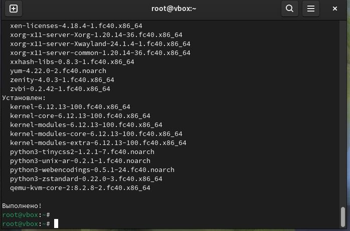
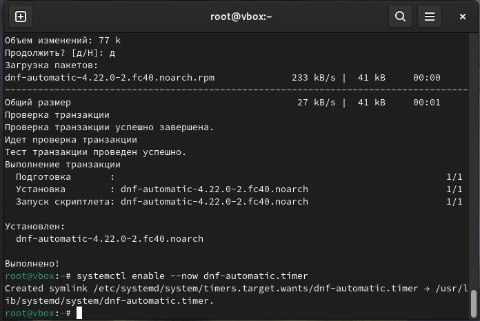
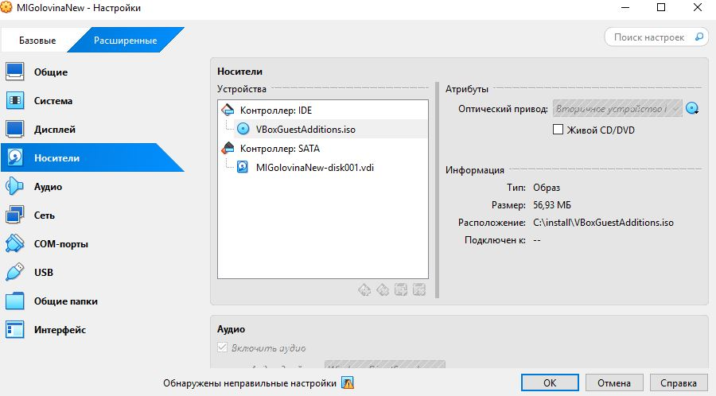
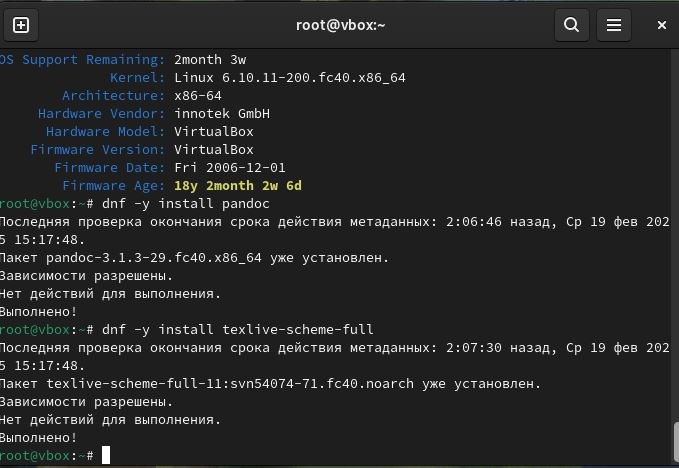
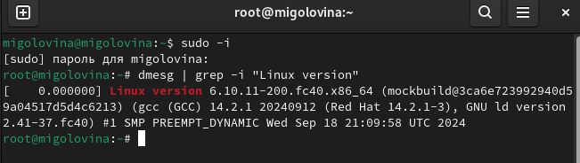
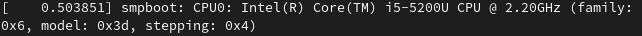

---
## Front matter
lang: ru-RU
title: Лабораторня работа №1
subtitle: Установка OC Linux
author:
  - Головина М.И.
institute:
  - Российский университет дружбы народов, Москва, Россия
  - Факультет Физико-математических и естественных наук
date: 08 марта 2025

## i18n babel
babel-lang: russian
babel-otherlangs: english

## Formatting pdf
toc: false
toc-title: Содержание
slide_level: 2
aspectratio: 169
section-titles: true
theme: metropolis
header-includes:
 - \metroset{progressbar=frametitle,sectionpage=progressbar,numbering=fraction}
 - '\makeatletter'
 - '\beamer@ignorenonframefalse'
 - '\makeatother'
---

# Информация

## Докладчик

:::::::::::::: {.columns align=center}
::: {.column width="70%"}

  * Головина Мария Игоревна
  * Бакалавр направления подготовки Математика и механика
  * студентка группы НММбд - 02- 24
  * Российский университет дружбы народов
  * [1132246810@rudn.ru](mailto:1132246810@rudn.ru)

:::
::: {.column width="30%"}

:::
::::::::::::::

## Цель

- Приобретение практических навыков установки операционной системы на виртуальную машину, настройки минимально необходимых для дальнейшей работы сервисов.
  
## Задание

    1. Запустить обновление пакетов (т.к. в прошлом семестре мы уже выполняли установку виртуальной машины, поэтому начали выполнение лабораторной работы не с начала).
    2. Настроить автоматическое обновление, установить tmux и отключить SELinux.
    3. Установить драйвера для вирутальной машины и подключить гостевую ОС.
    4. Установить и проверить имя пользователя и название хоста.
    5. Проверить наличие pandoc и TexLive (при необходимости установить).
    6. Выполнить домашнее задание.
    7. Ответить на контрольные вопросы.

# Ход работы

## Запуск обновления пакетов
::::::::::::: {.columns align=center}
::: {.column width="40%"}
 В прошлом семестре мы уже выполняли установку виртуальной машины,поэтому начали выполнение лабораторной работы не с начала. Запустили обновление пакетов
 и успешно их обновили
:::
::: {.column width="60%"}

:::
::::::::::::::

## Запуск обновления пакетов
::::::::::::: {.columns align=center}
::: {.column width="40%"}
Настроиваем автоматическое обновление, устанавливаем tmux и отключаем SELinux 
:::
::: {.column width="60%"}

:::
::::::::::::::

## Гостевая ОС

::::::::::::: {.columns align=center}
::: {.column width="40%"}
Устанавливаем драйвера виртуальной машины и подключаем гостевую ОС
:::
::: {.column width="60%"}

:::
::::::::::::::

## pandoc и TexLive 
::::::::::::: {.columns align=center}
::: {.column width="40%"}
Проверяем наличие pandoc и TexLive (были установлены установлены в прошлых лабораторных работах, проверка наличия)
:::
::: {.column width="60%"}

:::
::::::::::::::

# Домашнее задание

## Первое задание

::::::::::::: {.columns align=center}
::: {.column width="40%"}
С помощью команды dmwsg необходимо получить некоторую информации о компьютере
:::
::: {.column width="60%"}

:::
::::::::::::::

## Первое задание

::::::::::::: {.columns align=center}
::: {.column width="40%"}
С помощью команды dmwsg необходимо получить некоторую информации о компьютере
:::
::: {.column width="60%"}

:::
::::::::::::::

## Первое задание

::::::::::::: {.columns align=center}
::: {.column width="40%"}
С помощью команды dmwsg необходимо получить некоторую информации о компьютере
:::
::: {.column width="60%"}

:::
::::::::::::::

## Ответы на контрольные вопросы
    1. Какую информацию содержит учётная запись пользователя? 
Имя пользователя (user name)
Индентификационный номер пользвателя (UID)
Индентификационный номер группы (GID)
Пароль (password)
Полное имя (full name)
Домашний каталог (home directory)
Начальную оболочку (login shell)
    2. Укажите команды терминала и приведите примеры:
для получения справки по команде –help
для перемещения по файловой системе -cd
для просмотра содержимого каталога -ls
для определения объёма каталога du
для создания / удаления каталогов / файлов - mkdir -создание, rm -r - удаление
для задания определённых прав на файл / каталог- touch/rm
для просмотра истории команд –history
    3. Что такое файловая система? Приведите примеры с краткой характеристикой.
Файловая система - порядок, определяющий способ организации, хранения и
наименования данных на носителях информации в пк, а также в другом электронном оборудовании: цифровых фотоаппаратах, мобильных телефона и тд. Файловая система определяет формат содержимого и способ физического хранения информации, которую принято группировать в виде файлов. Конкретная файловая система и раздел, набор атрибутов файла. Некоторые файловые системы представляют сервисные возможности, например, разграничение доступа или шифрование файлов.
    4. Как посмотреть, какие файловые системы подмонтированы в ОС?
Df-утилита, показывающая список всех файловых систем по имени устройства, сообщает их размер, занятое и свободное пространство и точки монтирования.
При выполнении бещ аргумента, команда mount выведет все подключенные
данные.
    5. Как удалить зависший процесс?
С помощью команды killall-killall ().

# Вывод
## Заключение
Приобрели практические навыки установки операционной системы на виртуальную машину, настройки минимально необходимых для дальнейшей работы сервисов.

# Дорогу осилит идущий

