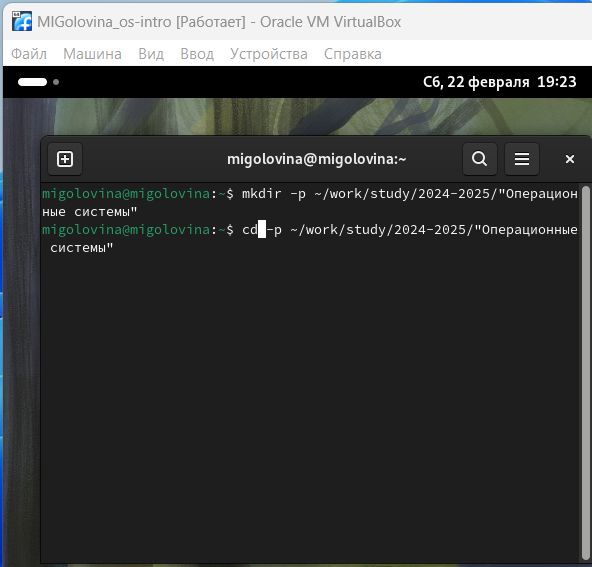
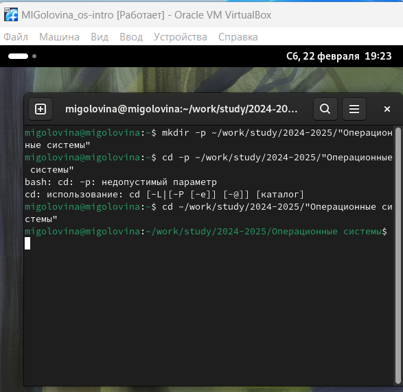
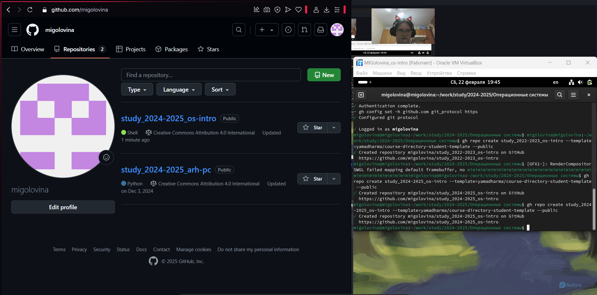
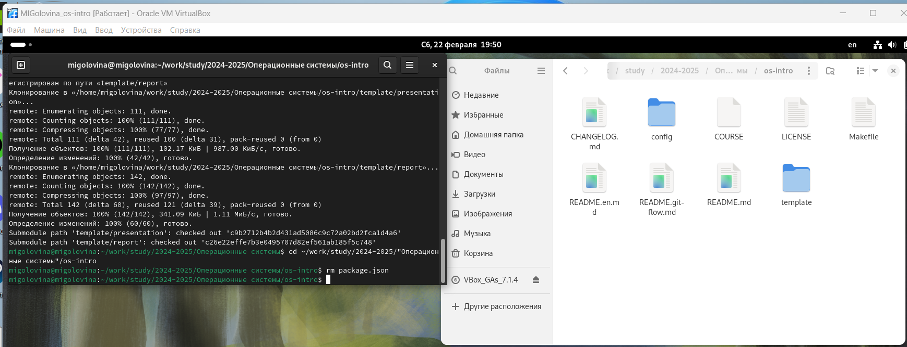
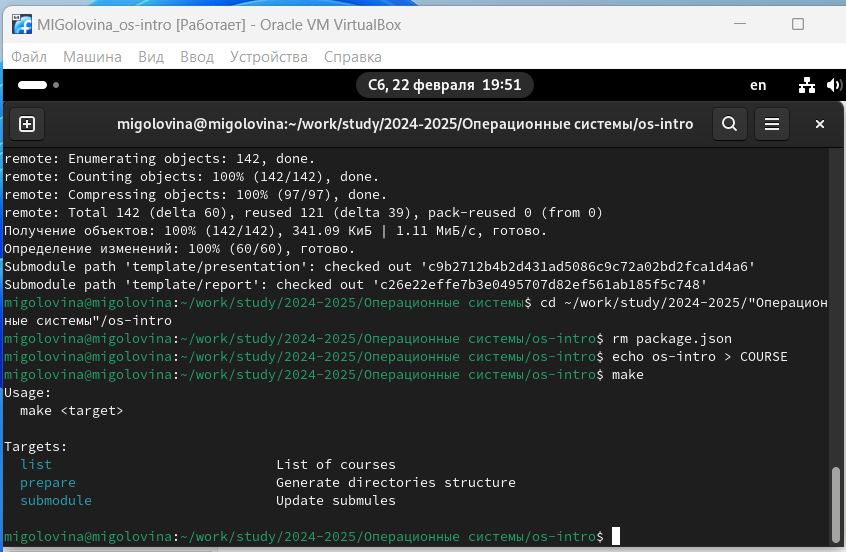
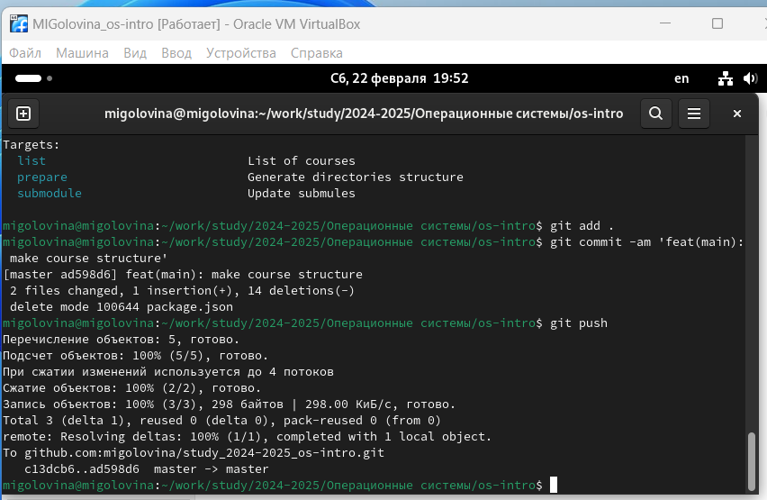

---
## Front matter
lang: ru-RU
title: Лабораторнaя работа №2
subtitle: Первоначальная настройка git
author:
  - Головина М.И.
institute:
  - Российский университет дружбы народов, Москва, Россия
  - Факультет Физико-математических и естественных наук
date: 08 марта 2025

## i18n babel
babel-lang: russian
babel-otherlangs: english

## Formatting pdf
toc: false
toc-title: Содержание
slide_level: 2
aspectratio: 169
section-titles: true
theme: metropolis
header-includes:
 - \metroset{progressbar=frametitle,sectionpage=progressbar,numbering=fraction}
 - '\makeatletter'
 - '\beamer@ignorenonframefalse'
 - '\makeatother'
---

# Информация

## Докладчик

:::::::::::::: {.columns align=center}
::: {.column width="70%"}

  * Головина Мария Игоревна
  * Бакалавр направления подготовки Математика и механика
  * студентка группы НММбд - 02- 24
  * Российский университет дружбы народов
  * [1132246810@rudn.ru](mailto:1132246810@rudn.ru)

:::
::: {.column width="30%"}

:::
::::::::::::::

## Цель

- Изучить идеологию и применение средств контроля версий. Освоить умения по работе с git.
  
## Задание

1. Установка программного обеспечения.
2. Базовая настройка git.
3. Создайте ключи ssh.
4. Создайте ключи pgp.
5. Настройка github.
6. Добавление PGP ключа в GitHub.
7. Настройка автоматических подписей коммитов git.
8. Настройка gh.
9. Шаблон для рабочего пространства.
10. Создание репозитория курса на основе шаблона.
11. Настройка каталога курса.
12. Ответить на контрольные вопросы.

# Ход работы

## Создание репозитория курса на основе шаблона
::::::::::::: {.columns align=center}
::: {.column width="40%"}
 Так как я уже ранее подключала  GitHub и создавала необходимые ключи для работы с виртуальной машиной. Начинаю выполнение заданий не с начала. Создаю папку "Операционные системы".
:::
::: {.column width="60%"}

:::
::::::::::::::

## Создание репозитория курса на основе шаблона
::::::::::::: {.columns align=center}
::: {.column width="40%"}
Переход в папку "Операционные системы".
:::
::: {.column width="60%"}

:::
::::::::::::::

## Создание репозитория курса на основе шаблона
::::::::::::: {.columns align=center}
::: {.column width="40%"}
Создание и клонирование репозитория.
:::
::: {.column width="60%"}

:::
::::::::::::::

## Настройка каталога курса

::::::::::::: {.columns align=center}
::: {.column width="40%"}
Переходим в каталог курса и удаляем лишние файлы.
:::
::: {.column width="60%"}

:::
::::::::::::::

## Настройка каталога курса

::::::::::::: {.columns align=center}
::: {.column width="40%"}
Создание необходимых каталогов.
:::
::: {.column width="60%"}

:::
::::::::::::::

## Настройка каталога курса

::::::::::::: {.columns align=center}
::: {.column width="40%"}
Отправляем файлы на сервер.
:::
::: {.column width="60%"}

:::
::::::::::::::

## Ответы на контрольные вопросы
1. Что такое системы контроля версий (VCS) и для решения каких задач
они предназначаются?
Система контроля версий (VCS) - программное обеспечение для облегчения
работы с изменяющейся информацией. Система управления версиями
позволяет хранить несколько версий одного и того же документа, при
необходимости возвращаться к более ранним версиям, определять, кто и
когда сделал то или иное изменение, и многое другое. Такие системы
наиболее широко используются при разработке программного обеспечения
для хранения исходных кодов разрабатываемой программы. Однако они
могут с успехом применяться и в других областях, в которых ведётся работа
с большим количеством непрерывно изменяющихся электронных
документов.
2. Объясните следующие понятия VCS и их отношения: хранилище,
commit, история, рабочая копия.
Хранилище – репозиторий - место хранения всех версий и служебной
информации.
Commit - это команда для записи индексированных изменений в
репозиторий.
История – место, где сохраняются все коммиты, по которым можно
посмотреть данные о коммитах.
Рабочая копия –текущее состояние файлов проекта, основанное на версии,
загруженной из хранилища.

3. Что представляют собой и чем отличаются централизованные и
децентрализованные VCS? Приведите примеры VCS каждого вида.
Централизованные системы – это системы, в которых одно основное
хранилище всего проекта, и каждый пользователь копирует необходимые
ему файлы, изменяет и вставляет обратно. Пример – Subversion.
Децентрализованные системы – система, в которой каждый пользователь
имеет свой вариант репозитория и есть возможность добавлять и забирать
изменения из репозиториев. Пример – Git.

4. Опишите действия с VCS при единоличной работе с хранилищем.
В рабочей копии, которую исправляет человек, появляются правки, которые
отправляются в хранилище на каждом из этапов. То есть в правки в рабочей
копии появляются, только если человек делает их (отправляет их на сервер) и
никак по-другому.

5. Опишите порядок работы с общим хранилищем VCS.
Если хранилище общее, то в рабочую копию каждого, кто работает над
проектом, приходят изменения, отправленные на сервер одним из команды.
Рабочая правка каждого может изменяться вне зависимости оттого, делает ли
конкретный человек правки или нет.

6. Каковы основные задачи, решаемые инструментальным средством git?
У Git две основных задачи: первая — хранить информацию обо всех
изменениях в вашем коде, начиная с самой первой строчки, а вторая —
обеспечение удобства командной работы над кодом.

7. Назовите и дайте краткую характеристику командам git.
создание основного дерева репозитория: git init
получение обновлений (изменений) текущего дерева из центрального
репозитория: git pull
отправка всех произведённых изменений локального дерева в центральный
репозиторий: git push
просмотр списка изменённых файлов в текущей директории: git status
просмотр текущих изменения: git diff
сохранение текущих изменений: –добавить все изменённые и / или
созданные файлы и/или каталоги: git add .
добавить конкретные изменённые и/или созданные файлы и/или каталоги:
git add
удалить файл и/или каталог из индекса репозитория (при этом файл и/или
каталог остаётся в локальной директории): git rm имена_файлов
сохранить все добавленные изменения и все изменённые файлы: git commit
-am ‘Описание коммита’
сохранить добавленные изменения с внесением комментария через
встроенный редактор: git commit
создание новой ветки, базирующейся на текущей: git checkout -b имя_ветки
переключение на некоторую ветку: git checkout имя_ветки (при
переключении на ветку, которой ещё нет в локальном репозитории, она будет
создана и связана с удалённой)
отправка изменений конкретной ветки в центральный репозиторий: 1 git push
origin имя_ветки
слияние ветки с текущим деревом: 1 git merge —no-ff имя_ветки
удаление локальной уже слитой с основным деревом ветки: git branch –d
имя_ветки
принудительное удаление локальной ветки: git branch -D имя_ветки
удаление ветки с центрального репозитория: git push origin :имя_ветки

8. Приведите примеры использования при работе с локальным и
удалённым репозиториями.
Работа с удаленным репозиторием: git remote–просмотр списка настроенных
удаленных репозиториев.
Работа с локальным репозиторием: git status-выводит информацию обо всех
изменениях, внесенных в дерево директорий проекта по сравнению с
последним коммитом рабочей ветки

9. Что такое и зачем могут быть нужны ветви (branches)?
Ветка(англ.branch)—это последовательность коммитов, в которой ведётся
параллельная разработка какого-либо функционала. Ветки нужны, чтобы
несколько программистов могли вести работу над одним и тем же проектом или даже файлом одновременно, при этом, не мешая друг другу. Кроме того,
ветки используются для тестирования экспериментальных функций: чтобы
не повредить основному проекту, создается новая ветка специально для
экспериментов.

10. Как и зачем можно игнорировать некоторые файлы при commit?
Игнорируемые файлы — это, как правило, артефакты сборки и файлы,
генерируемые машиной из исходных файлов в вашем репозитории, либо
файлы, которые по какой-либо иной причине не должны попадать в
коммиты. В Git нет специальной команды для указания игнорируемых
файлов: вместо этого необходимо вручную отредактировать файл. Временно
игнорировать изменения в файле можно командой git update-index-
assumeunchanged

# Вывод
## Заключение
Я изучила идеологию и применение средств контроля версий, а также освоила умения по работе с git.

# Дорогу осилит идущий

