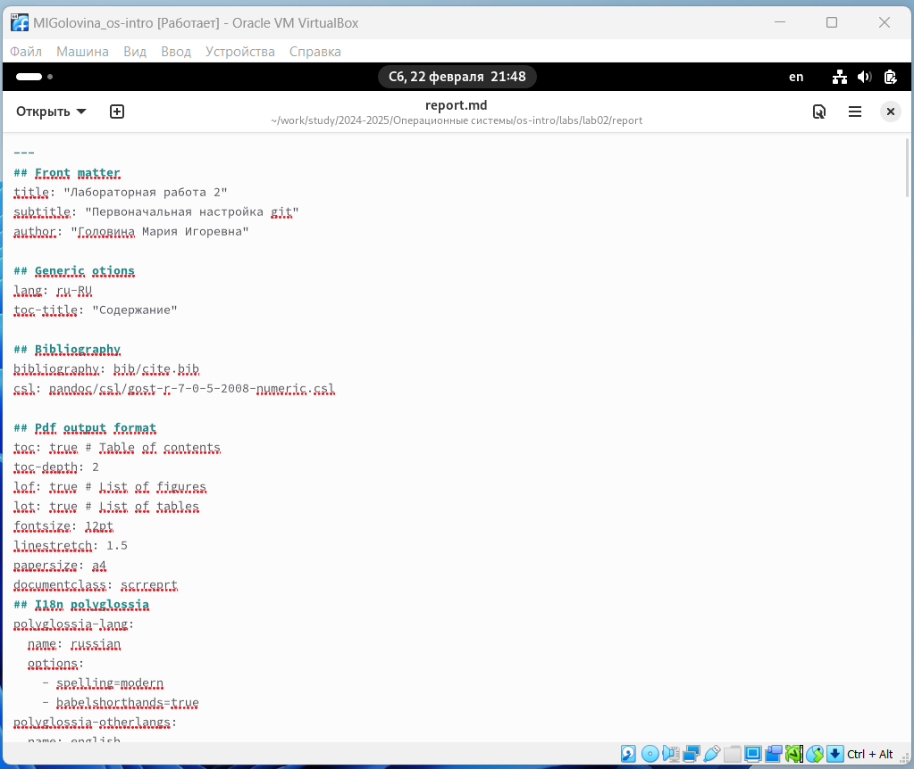
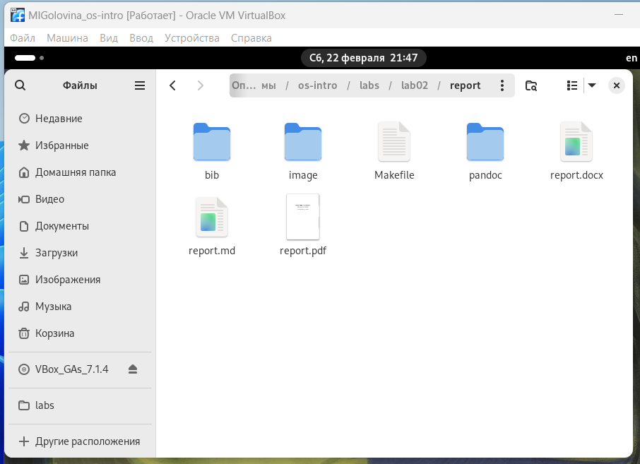
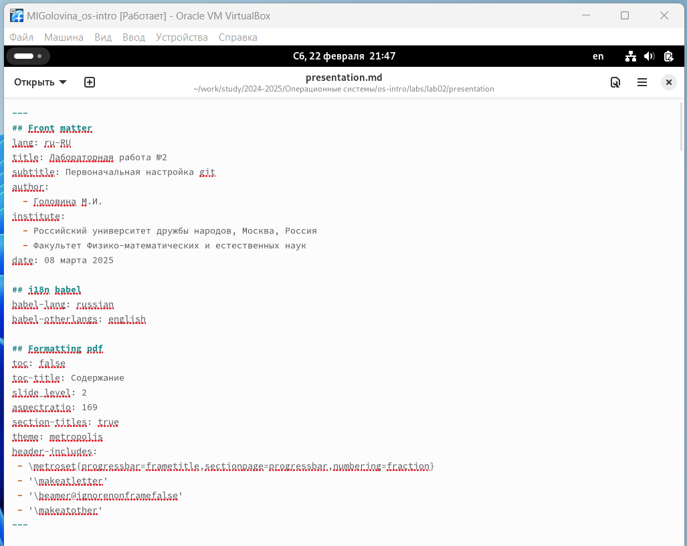
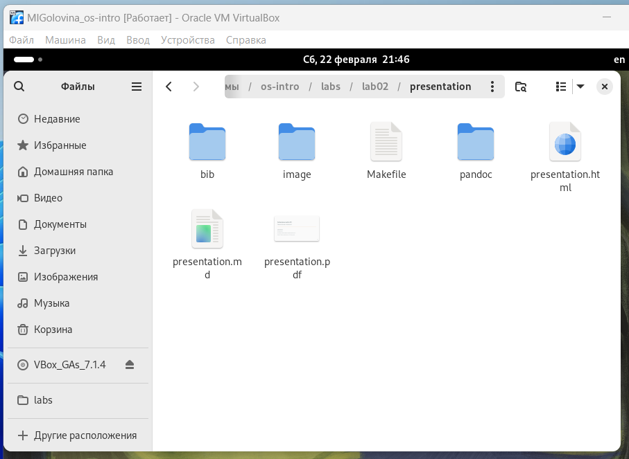

---
## Front matter
lang: ru-RU
title: Лабораторнaя работа №3
subtitle: Markdown
author:
  - Головина М.И.
institute:
  - Российский университет дружбы народов, Москва, Россия
  - Факультет Физико-математических и естественных наук
date: 08 марта 2025

## i18n babel
babel-lang: russian
babel-otherlangs: english

## Formatting pdf
toc: false
toc-title: Содержание
slide_level: 2
aspectratio: 169
section-titles: true
theme: metropolis
header-includes:
 - \metroset{progressbar=frametitle,sectionpage=progressbar,numbering=fraction}
 - '\makeatletter'
 - '\beamer@ignorenonframefalse'
 - '\makeatother'
---

# Информация

## Докладчик

:::::::::::::: {.columns align=center}
::: {.column width="70%"}

  * Головина Мария Игоревна
  * Бакалавр направления подготовки Математика и механика
  * студентка группы НММбд - 02- 24
  * Российский университет дружбы народов
  * [1132246810@pfur.ru](mailto:1132246810@rudn.ru)

:::
::: {.column width="30%"}

:::
::::::::::::::

## Цель

- Научиться оформлять отчёты с помощью легковесного языка разметки Markdown
  
## Задание

1. Сделать отчёт по предыдущей лабораторной работе в формате Markdown.
2. В качестве отчёта предоставить отчёты в трёх форматах:pdf,docx и md.

# Ход работы

## Оформление отчёта с помощью Mardown
::::::::::::: {.columns align=center}
::: {.column width="40%"}
Формирование report.md
:::
::: {.column width="60%"}

:::
::::::::::::::

## Оформление отчёта с помощью Mardown
::::::::::::: {.columns align=center}
::: {.column width="40%"}
Запустили команду make и получили report.docx и report.pdf
:::
::: {.column width="60%"}

:::
::::::::::::::

## Оформление отчёта с помощью Mardown
::::::::::::: {.columns align=center}
::: {.column width="40%"}
Формирование presentation.md
:::
::: {.column width="60%"}

:::
::::::::::::::

## Оформление отчёта с помощью Mardown
::::::::::::: {.columns align=center}
::: {.column width="40%"}
Запустили команду make и получили presentation.html и presentation.pdf
:::
::: {.column width="60%"}

:::
::::::::::::::

# Вывод
## Заключение
Я научилась оформлять отчёты с помощью легковесного языка разметки Markdown.

# Дорогу осилит идущий

