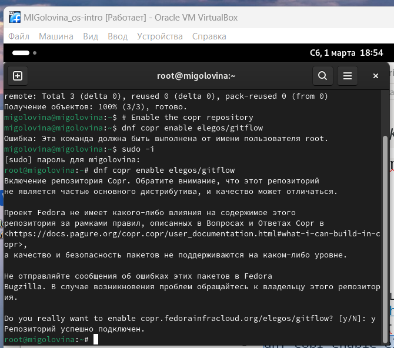

---
## Front matter
lang: ru-RU
title: Лабораторнaя работа №4
subtitle: Продвинутое использование git
author:
  - Головина М.И.
institute:
  - Российский университет дружбы народов, Москва, Россия
  - Факультет Физико-математических и естественных наук
date: 08 марта 2025

## i18n babel
babel-lang: russian
babel-otherlangs: english

## Formatting pdf
toc: false
toc-title: Содержание
slide_level: 2
aspectratio: 169
section-titles: true
theme: metropolis
header-includes:
 - \metroset{progressbar=frametitle,sectionpage=progressbar,numbering=fraction}
 - '\makeatletter'
 - '\beamer@ignorenonframefalse'
 - '\makeatother'
---

# Информация

## Докладчик

:::::::::::::: {.columns align=center}
::: {.column width="70%"}

  * Головина Мария Игоревна
  * Бакалавр направления подготовки Математика и механика
  * студентка группы НММбд - 02- 24
  * Российский университет дружбы народов
  * [1132246810@pfur.ru](mailto:1132246810@pfur.ru)

:::
::: {.column width="30%"}

:::
::::::::::::::

## Цель

- Получение навыков правильной работы с репозиториями git
  
## Задание

1. Выполнить работу для тестового репозитория.
2. Преобразовать рабочий репозиторий в репозиторий с git-flow и conventional commits.

# Ход работы

## Создание и клонирование репозитория git-extended
::::::::::::: {.columns align=center}
::: {.column width="40%"}
Я создала репозиторий git-extended.
:::
::: {.column width="60%"}

:::
::::::::::::::

## Создание и клонирование репозитория git-extended
::::::::::::: {.columns align=center}
::: {.column width="40%"}
Я склонировала репозиторий git-extended.
:::
::: {.column width="60%"}

:::
::::::::::::::

## Установка из коллекции репозиториев Copr
::::::::::::: {.columns align=center}
::: {.column width="40%"}
Я ввела необходимые команды.
:::
::: {.column width="60%"}

:::
::::::::::::::

## Установка из коллекции репозиториев Copr
::::::::::::: {.columns align=center}
::: {.column width="40%"}
Я ввела необходимые команды.
:::
::: {.column width="60%"}

:::
::::::::::::::

## Установка и настройка Node.js
::::::::::::: {.columns align=center}
::: {.column width="40%"}
Я ввела необходимые команды.
:::
::: {.column width="60%"}

:::
::::::::::::::

## Общепринятые коммиты
::::::::::::: {.columns align=center}
::: {.column width="40%"}
Я ввела необходимые команды.
:::
::: {.column width="60%"}

:::
::::::::::::::

## Делаем первый коммит и выкладываем на github
::::::::::::: {.columns align=center}
::: {.column width="40%"}
Я ввела необходимые команды.
:::
::: {.column width="60%"}

:::
::::::::::::::

## Делаем первый коммит и выкладываем на github
::::::::::::: {.columns align=center}
::: {.column width="40%"}
Я ввела необходимые команды.
:::
::: {.column width="60%"}

:::
::::::::::::::

## Конфигурация общепринятых коммитов
::::::::::::: {.columns align=center}
::: {.column width="40%"}
Я заполнила файл package.json.
:::
::: {.column width="60%"}

:::
::::::::::::::

## Конфигурация общепринятых коммитов
::::::::::::: {.columns align=center}
::: {.column width="40%"}
Я добавила новые файлы, выполнила коммит и отправила на github.
:::
::: {.column width="60%"}

:::
::::::::::::::

## Конфигурация git-flow
::::::::::::: {.columns align=center}
::: {.column width="40%"}
Я инициализирую git-flow и делаю проверку.
:::
::: {.column width="60%"}

:::
::::::::::::::

## Конфигурация git-flow
::::::::::::: {.columns align=center}
::: {.column width="40%"}
Я загрузила всесь репозиторий в хранилище и установила внешнюю ветку как вышестоящую для этой ветки.
:::
::: {.column width="60%"}

:::
::::::::::::::

## Конфигурация git-flow
::::::::::::: {.columns align=center}
::: {.column width="40%"}
Я создала релиз с версией 1.0.0.
:::
::: {.column width="60%"}

:::
::::::::::::::

## Конфигурация git-flow
::::::::::::: {.columns align=center}
::: {.column width="40%"}
Я создала журнал изменений, добавила журнал изменений в индекс. 
:::
::: {.column width="60%"}

:::
::::::::::::::

## Конфигурация git-flow
::::::::::::: {.columns align=center}
::: {.column width="40%"}
Я залила релизную ветку в основную ветку.
:::
::: {.column width="60%"}

:::
::::::::::::::

## Конфигурация git-flow
::::::::::::: {.columns align=center}
::: {.column width="40%"}
Я отправила данные на github, создала релиз на github.
:::
::: {.column width="60%"}

:::
::::::::::::::

## Конфигурация git-flow
::::::::::::: {.columns align=center}
::: {.column width="40%"}
Я сделала проверку.
:::
::: {.column width="60%"}

:::
::::::::::::::

## Работа с репозиторием git
::::::::::::: {.columns align=center}
::: {.column width="40%"}
Я создала ветки для новой функциональности, объединила ветки feature_branch c develop.
:::
::: {.column width="60%"}

:::
::::::::::::::

## Работа с репозиторием git
::::::::::::: {.columns align=center}
::: {.column width="40%"}
Я создала релиз с версией 1.2.3.
:::
::: {.column width="60%"}

:::
::::::::::::::

## Работа с репозиторием git
::::::::::::: {.columns align=center}
::: {.column width="40%"}
Я обновила номер версии в файле package.json.
:::
::: {.column width="60%"}

:::
::::::::::::::

## Работа с репозиторием git
::::::::::::: {.columns align=center}
::: {.column width="40%"}
Я создала журнал изменений, добавила журнал изменений в индекс.
:::
::: {.column width="60%"}

:::
::::::::::::::

## Работа с репозиторием git
::::::::::::: {.columns align=center}
::: {.column width="40%"}
Я залила релизную ветку в основную ветку.
:::
::: {.column width="60%"}

:::
::::::::::::::

## Работа с репозиторием git
::::::::::::: {.columns align=center}
::: {.column width="40%"}
Я отправила данные на github и создала релиз на github с комментарием из журнала изменений.
:::
::: {.column width="60%"}

:::
::::::::::::::

## Работа с репозиторием git
::::::::::::: {.columns align=center}
::: {.column width="40%"}
Я проверила релизы.
:::
::: {.column width="60%"}

:::
::::::::::::::

# Вывод
## Заключение
Я получила навыки правильной работы с репозиториями git.

# Дорогу осилит идущий

