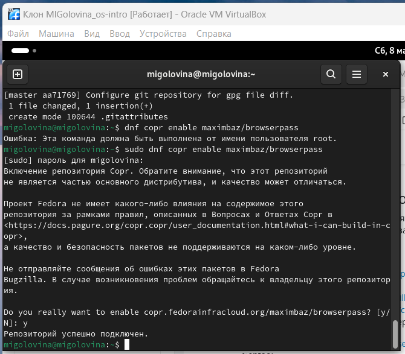

---
## Front matter
lang: ru-RU
title: Лабораторнaя работа №5
subtitle: Настройка рабочей среды
author:
  - Головина М.И.
institute:
  - Российский университет дружбы народов, Москва, Россия
  - Факультет Физико-математических и естественных наук
date: 15 марта 2025

## i18n babel
babel-lang: russian
babel-otherlangs: english

## Formatting pdf
toc: false
toc-title: Содержание
slide_level: 2
aspectratio: 169
section-titles: true
theme: metropolis
header-includes:
 - \metroset{progressbar=frametitle,sectionpage=progressbar,numbering=fraction}
 - '\makeatletter'
 - '\beamer@ignorenonframefalse'
 - '\makeatother'
---

# Информация

## Докладчик

:::::::::::::: {.columns align=center}
::: {.column width="70%"}

  * Головина Мария Игоревна
  * Бакалавр направления подготовки Математика и механика
  * студентка группы НММбд - 02- 24
  * Российский университет дружбы народов
  * [1132246810@pfur.ru](mailto:1132246810@pfur.ru)

:::
::: {.column width="30%"}

:::
::::::::::::::

## Цель

- Приобрести навыки по настройке рабочей среды
  
## Задание

1. Установить необходимые пакеты для работы с менеджером паролей.
2. Настроить ключ gpg.
3. Инициализировать хранилище.
4. Произвести синхронизацию с git.
5. Настроить интерфейс с броузером.
6. Добавить новый пароль.
7. Заменить существующий пароль.
8. Установить дополнительное программное обеспечение.
9. Установить шрифты.
10. Установить бинарный файл.
11. Создать собственный репозиторий с помощью утилит.
12. Подключить репозиторий к своей системе.
13. Использовать chezmoi на нескольких машинах.
14. Произвести настройку новой машины с помощью одной команды.
15. Настроить ежедневные операции с chezmoi.

# Ход работы

## Установка pass
::::::::::::: {.columns align=center}
::: {.column width="40%"}
Я установила pass.
:::
::: {.column width="60%"}

:::
::::::::::::::

## Установка gopass
::::::::::::: {.columns align=center}
::: {.column width="40%"}
Я установила gopass
:::
::: {.column width="60%"}

:::
::::::::::::::

## Создание нового ключа gpg 
::::::::::::: {.columns align=center}
::: {.column width="40%"}
Я создала новый ключ gpg 
:::
::: {.column width="60%"}

:::
::::::::::::::

## Создание нового ключа gpg 
::::::::::::: {.columns align=center}
::: {.column width="40%"}
Я создала новый ключ gpg 
:::
::: {.column width="60%"}

:::
::::::::::::::

## Инициализация хранилища
::::::::::::: {.columns align=center}
::: {.column width="40%"}
Я инициализировала хранилище
:::
::: {.column width="60%"}

:::
::::::::::::::

## Создание структуры git
::::::::::::: {.columns align=center}
::: {.column width="40%"}
Я создала структуру git
:::
::: {.column width="60%"}

:::
::::::::::::::

## Задание адреса репозитория на хостинге
::::::::::::: {.columns align=center}
::: {.column width="40%"}
Я задала адрес репозитория на хостинге
:::
::: {.column width="60%"}

:::
::::::::::::::

## Проверка статус синхронизации модно командой
::::::::::::: {.columns align=center}
::: {.column width="40%"}
Я проверила статус синхронизации модно командой
:::
::: {.column width="60%"}

:::
::::::::::::::

## Устанавка программ
::::::::::::: {.columns align=center}
::: {.column width="40%"}
Я устанавила программы
:::
::: {.column width="60%"}

:::
::::::::::::::

## Устанавка программ
::::::::::::: {.columns align=center}
::: {.column width="40%"}
Я устанавила программы
:::
::: {.column width="60%"}

:::
::::::::::::::

## Добавление нового пароля
::::::::::::: {.columns align=center}
::: {.column width="40%"}
Я добавила новый пароль
:::
::: {.column width="60%"}

:::
::::::::::::::

## Замена существующего пароля
::::::::::::: {.columns align=center}
::: {.column width="40%"}
Я заменила существующий пароль
:::
::: {.column width="60%"}

:::
::::::::::::::

## Установка дополнительного программного обеспечения
::::::::::::: {.columns align=center}
::: {.column width="40%"}
Я установила дополнительное программное обеспечение
:::
::: {.column width="60%"}

:::
::::::::::::::

## Установка шрифтов
::::::::::::: {.columns align=center}
::: {.column width="40%"}
Я установила шрифты
:::
::: {.column width="60%"}

:::
::::::::::::::

## Установка шрифтов
::::::::::::: {.columns align=center}
::: {.column width="40%"}
Я установила шрифты
:::
::: {.column width="60%"}

:::
::::::::::::::

## Установка шрифтов
::::::::::::: {.columns align=center}
::: {.column width="40%"}
Я установила шрифты
:::
::: {.column width="60%"}

:::
::::::::::::::

## Установка бинарного файла
::::::::::::: {.columns align=center}
::: {.column width="40%"}
Я установила бинарный файл
:::
::: {.column width="60%"}

:::
::::::::::::::

## Созданией своего репозитория для конфигурационных файлов на основе шаблона
::::::::::::: {.columns align=center}
::: {.column width="40%"}
Я создала свой репозиторий для конфигурационных файлов на основе шаблона
:::
::: {.column width="60%"}

:::
::::::::::::::

## Подключение репозитория к своей системе
::::::::::::: {.columns align=center}
::: {.column width="40%"}
Я подключила репозиторий к своей системе
:::
::: {.column width="60%"}

:::
::::::::::::::

## Подключение репозитория к своей системе
::::::::::::: {.columns align=center}
::: {.column width="40%"}
Я подключила репозиторий к своей системе
:::
::: {.column width="60%"}

:::
::::::::::::::

## Подключение репозитория к своей системе
::::::::::::: {.columns align=center}
::: {.column width="40%"}
Я подключила репозиторий к своей системе
:::
::: {.column width="60%"}

:::
::::::::::::::

## Переход во вторую машину. Использование chezmoi на нескольких машинах
::::::::::::: {.columns align=center}
::: {.column width="40%"}
Я перешла во вторую машину и использовала chezmoi на нескольких машинах
:::
::: {.column width="60%"}

:::
::::::::::::::

## Переход во вторую машину. Использование chezmoi на нескольких машинах
::::::::::::: {.columns align=center}
::: {.column width="40%"}
Я перешла во вторую машину и использовала chezmoi на нескольких машинах
:::
::: {.column width="60%"}

:::
::::::::::::::

## Настройка новой машины с помощью одной команды
::::::::::::: {.columns align=center}
::: {.column width="40%"}
Я настроила новую машину с помощью одной команды
:::
::: {.column width="60%"}

:::
::::::::::::::

## Ежедневные операции c chezmoi
::::::::::::: {.columns align=center}
::: {.column width="40%"}
Я ввела необходимые команды
:::
::: {.column width="60%"}

:::
::::::::::::::

## Ежедневные операции c chezmoi
::::::::::::: {.columns align=center}
::: {.column width="40%"}
Я посмотрела нужный файл
:::
::: {.column width="60%"}

:::
::::::::::::::

# Вывод
## Заключение
Я приобрела навыки по настройке рабочей среды.

# Дорогу осилит идущий

