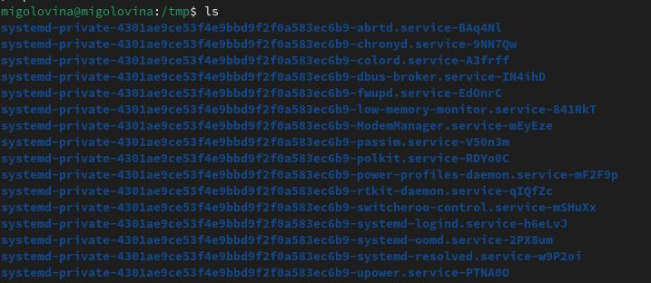

---
## Front matter
lang: ru-RU
title: Лабораторнaя работа №6
subtitle: Основы интерфейса взаимодействия пользователя с системой Unix на уровне командной строки
author:
  - Головина М.И.
institute:
  - Российский университет дружбы народов, Москва, Россия
  - Факультет Физико-математических и естественных наук
date: 22 марта 2025

## i18n babel
babel-lang: russian
babel-otherlangs: english

## Formatting pdf
toc: false
toc-title: Содержание
slide_level: 2
aspectratio: 169
section-titles: true
theme: metropolis
header-includes:
 - \metroset{progressbar=frametitle,sectionpage=progressbar,numbering=fraction}
 - '\makeatletter'
 - '\beamer@ignorenonframefalse'
 - '\makeatother'
---

# Информация

## Докладчик

:::::::::::::: {.columns align=center}
::: {.column width="70%"}

  * Головина Мария Игоревна
  * Бакалавр направления подготовки Математика и механика
  * студентка группы НММбд - 02- 24
  * Российский университет дружбы народов
  * [1132246810@pfur.ru](mailto:1132246810@pfur.ru)

:::
::: {.column width="30%"}

:::
::::::::::::::

## Цель

- Приобретение практических навыков взаимодействия пользователя с системой посредством командной строки.
  
## Задание

1. Определите полное имя вашего домашнего каталога.
2. Выполните следующие действия: 
2.1. Перейдите в каталог /tmp. 
2.2. Выведите на экран содержимое каталога /tmp.Для этого используйте команду ls с различными опциями. Поясните разницу в выводимой на экран информации. 
2.3. Определите, есть ли в каталоге /var/spool подкаталог с именем cron?
2.4. Перейдите в Ваш домашний каталог и выведите на экран его содержимое. Определите, кто является владельцем файлов и подкаталогов? 
3. Выполните следующие действия: 
3.1. В домашнем каталоге создайте новый каталог с именем newdir. 
3.2. В каталоге ~/newdir создайте новый каталог с именем morefun. 
3.3. В домашнем каталоге создайте одной командой три новых каталога с именами letters, memos, misk. Затем удалите эти каталоги одной командой. 
3.4. Попробуйте удалить ранее созданный каталог ~/newdir командой rm. Проверьте, был ли каталог удалён. 
3.5. Удалите каталог ~/newdir/morefun из домашнего каталога. Проверьте, был ли каталог удалён. 
4. С помощью команды man определите, какую опцию команды ls нужно использовать для просмотра содержимое не только указанного каталога, но и подкаталогов, входящих в него. 
5. С помощью команды man определите набор опций команды ls,позволяющий отсортировать по времени последнего изменения выводимый список содержимого каталога с развёрнутым описанием файлов. 
6. Используйте команду man для просмотра описания следующих команд: cd,pwd,mkdir, rmdir, rm. Поясните основные опции этих команд. 
7. Используя информацию, полученную при помощи команды history, выполните модификацию и исполнение нескольких команд из буфера команд.
8. Ответить на контрольные вопросы.

# Ход работы

## Определение полного имени домашнего каталога
::::::::::::: {.columns align=center}
::: {.column width="40%"}
Я определила полное имя домашнего каталога
:::
::: {.column width="60%"}

:::
::::::::::::::

## Переход в каталог /tmp
::::::::::::: {.columns align=center}
::: {.column width="40%"}
Я перешла в каталог /tmp
:::
::: {.column width="60%"}

:::
::::::::::::::

## Вывели содержимое каталога. После ввода ls выводятся просто файлы и каталоги, которые содержатся в /tmp.После ввода команды ls -l выводятся файлы и права доступа к этим файлам. После ввода команды ls -a выводятся скрытые файлы, которые используются для настройки рабочей системы
::::::::::::: {.columns align=center}
::: {.column width="40%"}
Результаты выполнения команды ls в /tmp
:::
::: {.column width="60%"}

:::
::::::::::::::

## Вывели содержимое каталога. После ввода ls выводятся просто файлы и каталоги, которые содержатся в /tmp.После ввода команды ls -l выводятся файлы и права доступа к этим файлам. После ввода команды ls -a выводятся скрытые файлы, которые используются для настройки рабочей системы
::::::::::::: {.columns align=center}
::: {.column width="40%"}
Результаты выполнения команды ls -l в /tmp
:::
::: {.column width="60%"}

:::
::::::::::::::

## Вывели содержимое каталога. После ввода ls выводятся просто файлы и каталоги, которые содержатся в /tmp.После ввода команды ls -l выводятся файлы и права доступа к этим файлам. После ввода команды ls -a выводятся скрытые файлы, которые используются для настройки рабочей системы
::::::::::::: {.columns align=center}
::: {.column width="40%"}
Результаты выполнения команды ls -a в /tmp
:::
::: {.column width="60%"}

:::
::::::::::::::

## Определим двумя способами наличие файла cron в каталоге /var/spool. Первый способ: переход через команду ls находясь в другом каталоге. Второй -  находясь в нужном каталоге и ввели команду ls. Нужного файла в этом каталоге нет
::::::::::::: {.columns align=center}
::: {.column width="40%"}
Я просмотрела список ключей
:::
::: {.column width="60%"}

:::
::::::::::::::

## Перейти в домашний каталог и определить кто является владельцем файлов и каталогов
::::::::::::: {.columns align=center}
::: {.column width="40%"}
Я перешла в домашний каталог и определила кто является владельцем файлов и каталогов. Во всех пунктах стоит аккаунт migolovina,то есть мой, поэтому и владельцем файлов являюсь я.
:::
::: {.column width="60%"}

:::
::::::::::::::

## В домашнем каталоге создали новый каталог с именем newdir
::::::::::::: {.columns align=center}
::: {.column width="40%"}
Я создала каталог newdir.
:::
::: {.column width="60%"}

:::
::::::::::::::

## В каталоге ~/newdir создали новый каталог с именем morefun
::::::::::::: {.columns align=center}
::: {.column width="40%"}
Я создала каталог morefun.
:::
::: {.column width="60%"}

:::
::::::::::::::

## В домашнем каталоге создали одной командой три новых каталога с именами letters, memos, misk. Затем удалили эти каталоги одной командой
::::::::::::: {.columns align=center}
::: {.column width="40%"}
Я создала каталоги одной командой.
:::
::: {.column width="60%"}

:::
::::::::::::::

## В домашнем каталоге создали одной командой три новых каталога с именами letters, memos, misk. Затем удалили эти каталоги одной командой
::::::::::::: {.columns align=center}
::: {.column width="40%"}
Я удалила каталоги одной командой.
:::
::: {.column width="60%"}

:::
::::::::::::::

## Попробовали удалить ранее созданный каталог ~/newdir командой rm
::::::::::::: {.columns align=center}
::: {.column width="40%"}
Я попыталась удалить каталог ~/newdir. Если не использовать дополнительных параметров, таких как -r, то удалить этот каталог нельзя.
:::
::: {.column width="60%"}

:::
::::::::::::::

## Удалили каталог ~/newdir/morefun из домашнего каталога. Проверили, что он удалился
::::::::::::: {.columns align=center}
::: {.column width="40%"}
Я удалила каталог morefun.
:::
::: {.column width="60%"}

:::
::::::::::::::

## C помощью команды man, определили какую функцию надо использовать для показа не только каталогов, но и их подкаталогов. Команда должна выглядеть ls*
::::::::::::: {.columns align=center}
::: {.column width="40%"}
Я определила функции ls.
:::
::: {.column width="60%"}

:::
::::::::::::::

## С помощью команды man  определили, что функция -l показывает развернутое описание файлов, а команда -t сортирует файлы и каталоги по времени, начиная с самого нового
::::::::::::: {.columns align=center}
::: {.column width="40%"}
Сортировка + расширенное описание.
:::
::: {.column width="60%"}

:::
::::::::::::::

## man cd
::::::::::::: {.columns align=center}
::: {.column width="40%"}
Я использовала команду man и описали основные опции команд. man cd. Команда cd используется для перехода между директориями. Мы можем как подниматься на уровень выше, так и опускаться. Можно за раз подняться на несколько уровней выше.
:::
::: {.column width="60%"}

:::
::::::::::::::

## man pwd
::::::::::::: {.columns align=center}
::: {.column width="40%"}
Команда pwd показывает имя каталога или директории где мы находимся.
:::
::: {.column width="60%"}

:::
::::::::::::::

## man mkdir
::::::::::::: {.columns align=center}
::: {.column width="40%"}
Команда mkdir используется для создания каталогов и подкаталогов. Мы можем создать несколько каталогов за раз, или создать новую директорию находясь в другом каталоге.
:::
::: {.column width="60%"}

:::
::::::::::::::

## man rmdir
::::::::::::: {.columns align=center}
::: {.column width="40%"}
Команда, которая используется для удаления директорий или каталогов.
:::
::: {.column width="60%"}

:::
::::::::::::::

## man rm
::::::::::::: {.columns align=center}
::: {.column width="40%"}
Команда rm служит для удаления файлов. Имеет много функций с помощью которых можно удалять и каталоги и любые файлы.
:::
::: {.column width="60%"}

:::
::::::::::::::

## команда history
::::::::::::: {.columns align=center}
::: {.column width="40%"}
Используя информацию, полученную при помощи команды history, выполнила модификацию и исполнение нескольких команд из буфера команд.
:::
::: {.column width="60%"}

:::
::::::::::::::

## Модификация 277
::::::::::::: {.columns align=center}
::: {.column width="40%"}
Модифицировала команду 277, заменив в команде man, cd на ls. Мне открылись функции команды ls.
:::
::: {.column width="60%"}

:::
::::::::::::::

## Модификация 274
::::::::::::: {.columns align=center}
::: {.column width="40%"}
Модифицировала команду 274, заменив в команде man, pwd на ls. Мне открылись функции команды ls.
:::
::: {.column width="60%"}

:::
::::::::::::::

## Ответы на контрольные вопросы

1. Что такое командная строка?
В ОС Linux командная строка является основным элементов во взаимодействии пользователя и системы.

2. При помощи какой команды можно определить абсолютный путь текущего каталога? Приведите пример.
Для определения абсолютного пути к текущему каталогу используется команда pwd (print working directory). Например, при вводе данной команды в домашнем каталоге, он выведет /home/migolovina.

3.  При помощи какой команды и каких опций можно определить только тип файлов и их имена в текущем каталоге? Приведите примеры.
С помощью команды ls и опция F можно получить информацию о типах файлов (каталог, исполняемый файл, ссылка).Например, если ввести команду ls -F в домашнем каталоге, то выведется название каталогов, которые находятся в нем, и “/” после имени(Загрузки/).

4. Каким образом отобразить информацию о скрытых файлах? Приведите примеры.
С помощью команды ls и опция -a можно получить информацию о скрытых файлах. Например, после ввода команды ls -a выводятся скрытые файлы, которые используются для настройки рабочей системы
 
5. При помощи каких команд можно удалить файл и каталог? Можно ли это сделать одной и той же командой? Приведите примеры.
Каталог можно удалить с помощью команды rmdir, а файлы с помощью rm. Если в каталоге есть какие-то файлы, то можно все сразу командой rm с опцией -r.

6. Каким образом можно вывести информацию о последних выполненных пользователем командах? работы?
Команда history выводит все ранее выполненные команды, которые нумеруются. Воспользовавшись !n:s/m/k, где вместо n вводим номер команды из истории, вместо m, что меняем, а вместо k, на что меняем. Например, я в лабораторной работе заменила опцию а команды cd на ls > !277:s/cd/ls

7. Как воспользоваться историей команд для их модифицированного выполнения? Приведите примеры.
Воспользовавшись !n:s/m/k, где вместо n вводим номер команды из истории, вместо m, что меняем, а вместо k, на что меняем. Например, я в лабораторной работе заменила опцию а команды cd на ls > !277:s/cd/ls

8. Приведите примеры запуска нескольких команд в одной строке.
Если требуется выполнить последовательно несколько команд, записанный в одной строке, то для этого используется символ точка с запятой. Пример: cd; ls

9. Дайте определение и приведите примера символов экранирования.
Экранирование - это способ заключения в кавычки одиночного символа.
Например,‘.’

10. Охарактеризуйте вывод информации на экран после выполнения команды
ls с опцией l.
Будет выведена следующая информация: тип файла, право доступа, число ссылок, владелец, размер, дата последней ревизии, имя файла или каталога.

11. Что такое относительный путь к файлу? Приведите примеры использования относительного и абсолютного пути при выполнении какой-либо команды.
Относительный показывает путь к файлу относительно какой-либо “отправной точки”. Например: > cd ~/work/study. Данной командой можно перейти в каталог study из любой отправной точки, т.е. мы используем абслоютный путь к файлу. 
cd 2024-2025 Данной командой из каталога study можно перейти к каталогу 2024-2025. Такой путь можно назвать относительным.

12. Как получить информацию об интересующей вас команде?
Воспользоваться командой man и через пробел ввести название команды, информацию которой мы хотим получить.

13. Какая клавиша или комбинация клавиш служит для автоматического дополнения вводимых команд?
Клавиша Tab служит для автоматического дополнения вводимых команд.

# Вывод
## Заключение
Я приобрела практические навыки взаимодействия пользователя с системой посредством командной строки.

# Дорогу осилит идущий

