---
## Front matter
title: "Лабораторная работа 6"
subtitle: "Основы интерфейса взаимодействия
пользователя с системой Unix на уровне командной строки"
author: "Головина Мария Игоревна"

## Generic otions
lang: ru-RU
toc-title: "Содержание"

## Bibliography
bibliography: bib/cite.bib
csl: pandoc/csl/gost-r-7-0-5-2008-numeric.csl

## Pdf output format
toc: true # Table of contents
toc-depth: 2
lof: true # List of figures
lot: true # List of tables
fontsize: 12pt
linestretch: 1.5
papersize: a4
documentclass: scrreprt
## I18n polyglossia
polyglossia-lang:
  name: russian
  options:
	- spelling=modern
	- babelshorthands=true
polyglossia-otherlangs:
  name: english
## I18n babel
babel-lang: russian
babel-otherlangs: english
## Fonts
mainfont: IBM Plex Serif
romanfont: IBM Plex Serif
sansfont: IBM Plex Sans
monofont: IBM Plex Mono
mathfont: STIX Two Math
mainfontoptions: Ligatures=Common,Ligatures=TeX,Scale=0.94
romanfontoptions: Ligatures=Common,Ligatures=TeX,Scale=0.94
sansfontoptions: Ligatures=Common,Ligatures=TeX,Scale=MatchLowercase,Scale=0.94
monofontoptions: Scale=MatchLowercase,Scale=0.94,FakeStretch=0.9
mathfontoptions:
## Biblatex
biblatex: true
biblio-style: "gost-numeric"
biblatexoptions:
  - parentracker=true
  - backend=biber
  - hyperref=auto
  - language=auto
  - autolang=other*
  - citestyle=gost-numeric
## Pandoc-crossref LaTeX customization
figureTitle: "Рис."
tableTitle: "Таблица"
listingTitle: "Листинг"
lofTitle: "Список иллюстраций"
lotTitle: "Список таблиц"
lolTitle: "Листинги"
## Misc options
indent: true
header-includes:
  - \usepackage{indentfirst}
  - \usepackage{float} # keep figures where there are in the text
  - \floatplacement{figure}{H} # keep figures where there are in the text
---

# Цель работы

Приобретение практических навыков взаимодействия пользователя с системой посредством командной строки.

# Задание

1. Определите полное имя вашего домашнего каталога.
2. Выполните следующие действия: 
2.1. Перейдите в каталог /tmp. 
2.2. Выведите на экран содержимое каталога /tmp.Для этого используйте команду ls с различными опциями. Поясните разницу в выводимой на экран информации. 
2.3. Определите, есть ли в каталоге /var/spool подкаталог с именем cron?
2.4. Перейдите в Ваш домашний каталог и выведите на экран его содержимое. Определите, кто является владельцем файлов и подкаталогов? 
3. Выполните следующие действия: 
3.1. В домашнем каталоге создайте новый каталог с именем newdir. 
3.2. В каталоге ~/newdir создайте новый каталог с именем morefun. 
3.3. В домашнем каталоге создайте одной командой три новых каталога с именами letters, memos, misk. Затем удалите эти каталоги одной командой. 
3.4. Попробуйте удалить ранее созданный каталог ~/newdir командой rm. Проверьте, был ли каталог удалён. 
3.5. Удалите каталог ~/newdir/morefun из домашнего каталога. Проверьте, был ли каталог удалён. 
4. С помощью команды man определите, какую опцию команды ls нужно использовать для просмотра содержимое не только указанного каталога, но и подкаталогов, входящих в него. 
5. С помощью команды man определите набор опций команды ls,позволяющий отсортировать по времени последнего изменения выводимый список содержимого каталога с развёрнутым описанием файлов. 
6. Используйте команду man для просмотра описания следующих команд: cd,pwd,mkdir, rmdir, rm. Поясните основные опции этих команд. 
7. Используя информацию, полученную при помощи команды history, выполните модификацию и исполнение нескольких команд из буфера команд.
8. Ответить на контрольные вопросы.

# Теоретические введения

В операционной системе типа Linux взаимодействие пользователя с системой обычно осуществляется с помощью командной строки посредством построчного ввода команд. При этом обычно используется командные интерпретаторы языка shell: /bin/sh; /bin/csh; /bin/ksh.
Более подробно об Linux см. в [1–7].

# Выполнение лабораторной работы

1. Определили полное имя домашнего каталога (рис. 4.1).

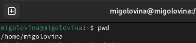{#fig:001 width=70%}

2. Перешли в каталог /tmp (рис. 4.2). 

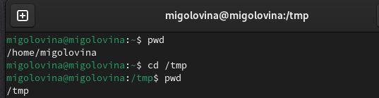{#fig:002 width=70%}

3. Вывели содержимое каталога. После ввода ls выводятся просто файлы и каталоги, которые содержатся в /tmp.После ввода команды ls -l выводятся файлы и права доступа к этим файлам. После ввода команды ls -a выводятся скрытые файлы, которые используются для настройки рабочей системы (рис. 4.3-4.5). 

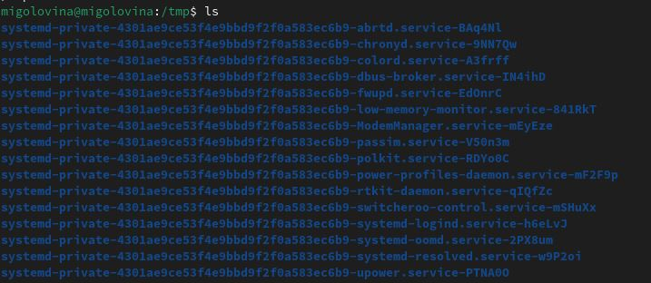{#fig:003 width=70%}

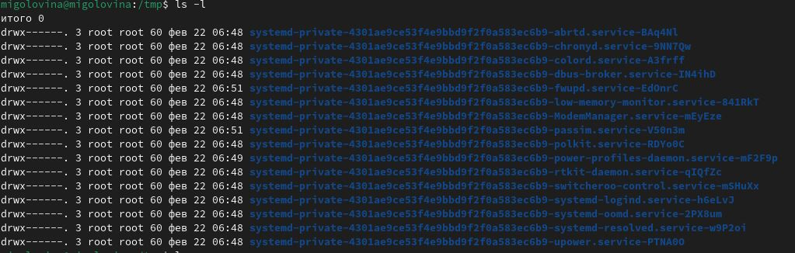{#fig:004 width=70%}

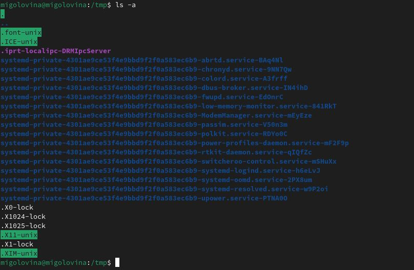{#fig:005 width=70%}

4. Определим двумя способами наличие файла cron в каталоге /var/spool. Первый способ: переход через команду ls находясь в другом каталоге. Второй -  находясь в нужном каталоге и ввели команду ls. Нужного файла в этом каталоге нет (рис. 4.6).

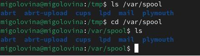{#fig:006 width=70%}

5. Перейти в домашний каталог и определить кто является владельцем файлов и каталогов (рис. 4.7).

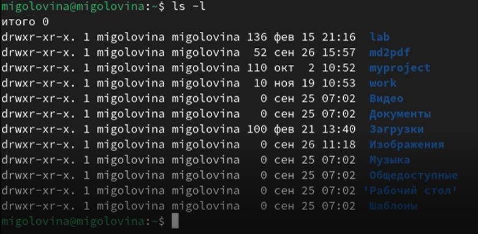{#fig:007 width=70%}

Во всех пунктах стоит аккаунт migolovina,то есть мой, поэтому и владельцем файлов являюсь я.

6. В домашнем каталоге создали новый каталог с именем newdir (рис 4.8). 

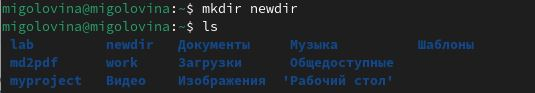{#fig:008 width=70%}

7. В каталоге ~/newdir создали новый каталог с именем morefun (рис. 4.9).

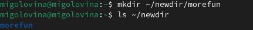{#fig:009 width=70%}

8. В домашнем каталоге создали одной командой три новых каталога с именами letters, memos, misk. Затем удалили эти каталоги одной командой (рис. 4.10-4.11).

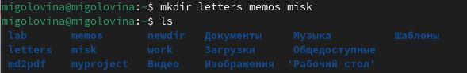{#fig:010 width=70%}

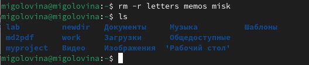{#fig:011 width=70%}

9. Попробовали удалить ранее созданный каталог ~/newdir командой rm (рис. 4.12). 

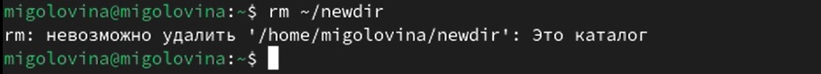{#fig:012 width=70%}

Если не использовать дополнительных параметров, таких как -r, то удалить этот каталог нельзя.

10. Удалили каталог ~/newdir/morefun из домашнего каталога. Проверили, что он удалился (рис. 4.13).

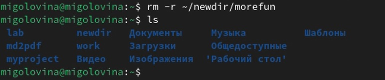{#fig:013 width=70%}

11. C помощью команды man, определили какую функцию надо использовать для показа не только каталогов, но и их подкаталогов. Команда должна выглядеть ls* (рис. 4.14).

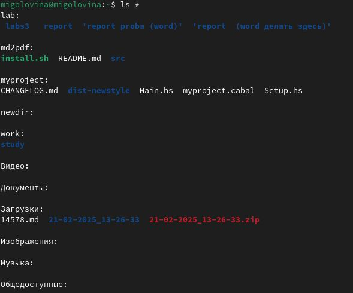{#fig:014 width=70%}

12. С помощью команды man  определили, что функция -l показывает развернутое описание файлов, а команда -t сортирует файлы и каталоги по времени, начиная с самого нового (рис. 4.15).

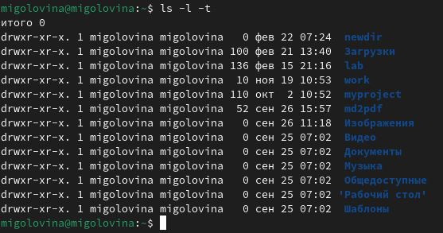{#fig:015 width=70%}

13. Использовали команду man и описали основные опции команд. man cd. Команда cd используется для перехода между директориями. Мы можем как подниматься на уровень выше, так и опускаться. Можно за раз подняться на несколько уровней выше (рис. 4.16).

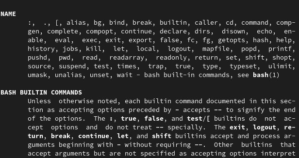{#fig:016 width=70%}

14. man pwd. Команда pwd показывает имя каталога или директории где мы находимся (рис. 4.17).

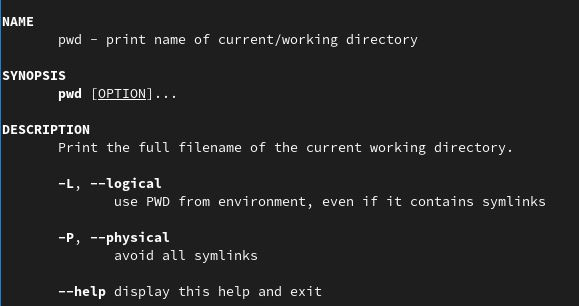{#fig:017 width=70%}

15. man mkdir. Команда mkdir используется для создания каталогов и подкаталогов. Мы можем создать несколько каталогов за раз, или создать новую директорию находясь в другом каталоге (рис. 4.18).

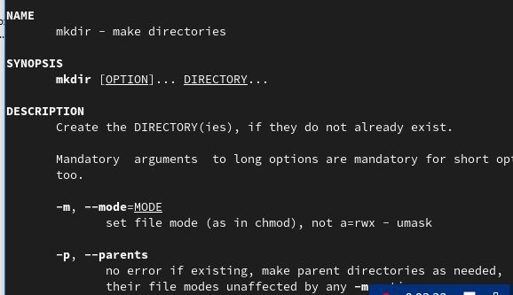{#fig:018 width=70%}

16. man rmdir. Команда, которая используется для удаления директорий или каталогов (рис. 4.19).

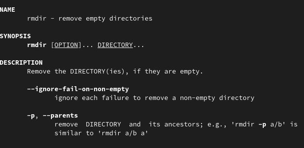{#fig:019 width=70%}

17. man rm. Команда rm служит для удаления файлов. Имеет много функций с помощью которых можно удалять и каталоги и любые файлы (рис. 4.20).

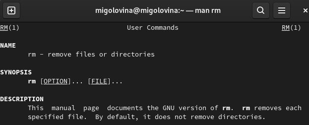{#fig:020 width=70%}

18. Используя информацию, полученную при помощи команды history, выполнили модификацию и исполнение нескольких команд из буфера команд (рис. 4.21-4.23)

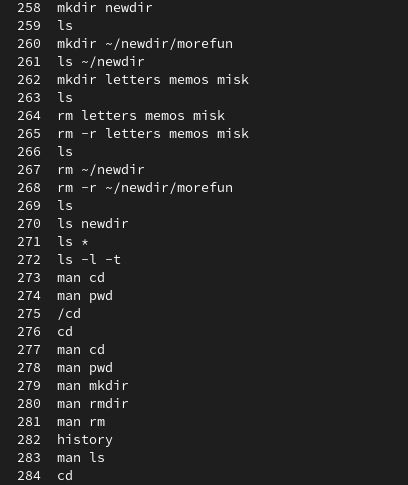{#fig:021 width=70%}

Модифицировали команду 277, заменив в команде man, cd на ls. Мне открылись функции команды ls.

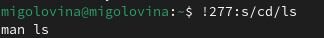{#fig:022 width=70%}

Модифицировали команду 274, заменив в команде man, pwd на ls. Мне открылись функции команды ls.

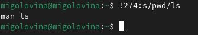{#fig:023 width=70%}

# Контрольные вопросы

1. Что такое командная строка?

В ОС Linux командная строка является основным элементов во взаимодействии пользователя и системы.

2. При помощи какой команды можно определить абсолютный путь текущего каталога? Приведите пример.

Для определения абсолютного пути к текущему каталогу используется команда pwd (print working directory). Например, при вводе данной команды в домашнем каталоге, он выведет /home/migolovina.

3.  При помощи какой команды и каких опций можно определить только тип файлов и их имена в текущем каталоге? Приведите примеры.

С помощью команды ls и опция F можно получить информацию о типах файлов (каталог, исполняемый файл, ссылка).Например, если ввести команду ls -F в домашнем каталоге, то выведется название каталогов, которые находятся в нем, и “/” после имени(Загрузки/).

4. Каким образом отобразить информацию о скрытых файлах? Приведите примеры.

С помощью команды ls и опция -a можно получить информацию о скрытых файлах. Например, после ввода команды ls -a выводятся скрытые файлы, которые используются для настройки рабочей системы
 
5. При помощи каких команд можно удалить файл и каталог? Можно ли это сделать одной и той же командой? Приведите примеры.

Каталог можно удалить с помощью команды rmdir, а файлы с помощью rm. Если в каталоге есть какие-то файлы, то можно все сразу командой rm с опцией -r.

6. Каким образом можно вывести информацию о последних выполненных пользователем командах? работы?

Команда history выводит все ранее выполненные команды, которые нумеруются. Воспользовавшись !n:s/m/k, где вместо n вводим номер команды из истории, вместо m, что меняем, а вместо k, на что меняем. Например, я в лабораторной работе заменила опцию а команды cd на ls > !277:s/cd/ls

7. Как воспользоваться историей команд для их модифицированного выполнения? Приведите примеры.

Воспользовавшись !n:s/m/k, где вместо n вводим номер команды из истории, вместо m, что меняем, а вместо k, на что меняем. Например, я в лабораторной работе заменила опцию а команды cd на ls > !277:s/cd/ls

8. Приведите примеры запуска нескольких команд в одной строке.

Если требуется выполнить последовательно несколько команд, записанный в одной строке, то для этого используется символ точка с запятой. Пример: cd; ls

9. Дайте определение и приведите примера символов экранирования.

Экранирование - это способ заключения в кавычки одиночного символа.
Например,‘.’

10. Охарактеризуйте вывод информации на экран после выполнения команды
ls с опцией l.

Будет выведена следующая информация: тип файла, право доступа, число ссылок, владелец, размер, дата последней ревизии, имя файла или каталога.

11. Что такое относительный путь к файлу? Приведите примеры использования относительного и абсолютного пути при выполнении какой-либо команды.

Относительный показывает путь к файлу относительно какой-либо “отправной точки”. Например: > cd ~/work/study. Данной командой можно перейти в каталог study из любой отправной точки, т.е. мы используем абслоютный путь к файлу. 
cd 2024-2025 Данной командой из каталога study можно перейти к каталогу 2024-2025. Такой путь можно назвать относительным.

12. Как получить информацию об интересующей вас команде?

Воспользоваться командой man и через пробел ввести название команды, информацию которой мы хотим получить.

13. Какая клавиша или комбинация клавиш служит для автоматического дополнения вводимых команд?

Клавиша Tab служит для автоматического дополнения вводимых команд.

# Выводы

Я приобрела практические навыки взаимодействия пользователя с системой посредством командной строки.

# Список литературы{.unnumbered}

1. Dash, P. Getting Started with Oracle VM VirtualBox / P. Dash. – Packt Publishing Ltd, 2013. – 86 сс.
2. Colvin, H. VirtualBox: An Ultimate Guide Book on Virtualization with VirtualBox. VirtualBox / H. Colvin. – CreateSpace Independent Publishing Platform, 2015. – 70 сс.
3.  Vugt, S. van. Red Hat RHCSA/RHCE 7 cert guide : Red Hat Enterprise Linux 7 (EX200 and EX300) : Certification Guide. Red Hat RHCSA/RHCE 7 cert guide / S. van Vugt. – Pearson IT Certification, 2016. – 1008 сс.
4. Робачевский, А. Операционная система UNIX / А. Робачевский, С. Немнюгин, О. Стесик. – 2-е изд. – Санкт-Петербург : БХВ-Петербург, 2010. – 656 сс.
5. Немет, Э. Unix и Linux: руководство системного администратора. Unix и Linux / Э. Немет, Г. Снайдер, Т.Р. Хейн, Б. Уэйли. – 4-е изд. – Вильямс, 2014. – 1312 сс.
6. Колисниченко, Д.Н. Самоучитель системного администратора Linux : Системный администратор / Д.Н. Колисниченко. – Санкт-Петербург : БХВ-Петербург, 2011. – 544 сс.
7. Robbins, A. Bash Pocket Reference / A. Robbins. – O’Reilly Media, 2016. – 156 сс.

::: {#refs}
:::
