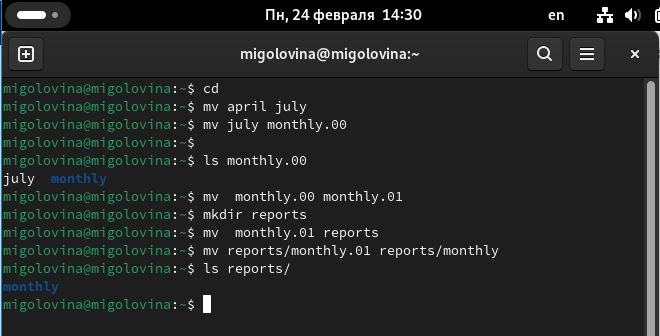

---
## Front matter
lang: ru-RU
title: Лабораторня работа №7
subtitle: Анализ файловой системы Linux. Команды для работы с файлами и каталогами
author:
  - Головина М.И.
institute:
  - Российский университет дружбы народов, Москва, Россия
  - Факультет Физико-математических и естественных наук
date: 29 марта 2025

## i18n babel
babel-lang: russian
babel-otherlangs: english

## Formatting pdf
toc: false
toc-title: Содержание
slide_level: 2
aspectratio: 169
section-titles: true
theme: metropolis
header-includes:
 - \metroset{progressbar=frametitle,sectionpage=progressbar,numbering=fraction}
 - '\makeatletter'
 - '\beamer@ignorenonframefalse'
 - '\makeatother'
---

# Информация

## Докладчик

:::::::::::::: {.columns align=center}
::: {.column width="70%"}

  * Головина Мария Игоревна
  * Бакалавр направления подготовки Математика и механика
  * студентка группы НММбд - 02- 24
  * Российский университет дружбы народов
  * [1132246810@rudn.ru](mailto:1132246810@rudn.ru)

:::
::: {.column width="30%"}

:::
::::::::::::::

## Цель

-Ознакомление с файловой системой Linux, её структурой, именами и содержанием каталогов. Приобретение практических навыков по применению команд для работы с файлами и каталогами, по управлению процессами (и работами), по проверке использования диска и обслуживанию файловой системы.
  
## Задание

1. Выполните все примеры, приведённые в первой части описания лабораторной работы. 
2. Выполните следующие действия, зафиксировав в отчёте по лабораторной работе используемые при этом команды и результаты их выполнения: 
2.1. Скопируйте файл /usr/include/sys/io.h в домашний каталог и назовите его equipment. Если файла io.h нет,то используйте любой другой файл в каталоге /usr/include/sys/ вместо него. 

2.2. В домашнем каталоге создайте директорию ~/ski.plases. 

2.3. Переместите файл equipment в каталог ~/ski.plases. 

2.4. Переименуйте файл ~/ski.plases/equipment в ~/ski.plases/equiplist. 

2.5. Создайте в домашнем каталоге файл abc1 и скопируйте его в каталог ~/ski.plases, назовите его equiplist2. 

2.6. Создайте каталог с именем equipment в каталоге ~/ski.plases. 

2.7. Переместите файлы ~/ski.plases/equiplist и equiplist2 в каталог ~/ski.plases/equipment. 

2.8. Создайте и переместите каталог ~/newdir в каталог ~/ski.plases и назовите его plans.
3. Определите опции команды chmod, необходимые для того, чтобы присвоить перечисленным ниже файлам выделенные права доступа, считая, что в начале таких прав нет: 

3.1. drwxr--r-- ... australia 

3.2. drwx--x--x ... play 

3.3. -r-xr--r-- ... my_os 

3.4. -rw-rw-r-- ... feathers 
При необходимости создайте нужные файлы. 
4. Проделайте приведённые ниже упражнения, записывая в отчёт по лабораторной работе используемые при этом команды: 

4.1. Просмотрите содержимое файла /etc/password. 

4.2. Скопируйте файл ~/feathers в файл ~/file.old. 

4.3. Переместите файл ~/file.old в каталог ~/play. 

4.4. Скопируйте каталог ~/play в каталог ~/fun. 

4.5. Переместите каталог ~/fun в каталог ~/play и назовите его games. 

4.6. Лишите владельца файла ~/feathers права на чтение. 

4.7. Что произойдёт, если вы попытаетесь просмотреть файл ~/feathers командой cat? 

4.8. Что произойдёт, если вы попытаетесь скопировать файл ~/feathers? 

4.9. Дайте владельцу файла ~/feathers право на чтение. 

4.10. Лишите владельца каталога ~/play права на выполнение. 

4.11. Перейдите в каталог ~/play. Что произошло? 

4.12. Дайте владельцу каталога ~/play право на выполнение. 

5. Прочитайте man по командам mount, fsck, mkfs, kill и кратко их охарактеризуйте, приведя примеры.
6. Ответить на контрольные вопросы.

# Ход работы

## Выполнение примеров из первой части лабораторной работы
::::::::::::: {.columns align=center}
::: {.column width="40%"}
Выполнили копирование файлов
:::
::: {.column width="60%"}

:::
::::::::::::::

## Выполнение примеров из первой части лабораторной работы
::::::::::::: {.columns align=center}
::: {.column width="40%"}
Задание по копированию каталогов
:::
::: {.column width="60%"}

:::
::::::::::::::

## Выполнение примеров из первой части лабораторной работы
::::::::::::: {.columns align=center}
::: {.column width="40%"}
Задание с правами доступа
:::
::: {.column width="60%"}

:::
::::::::::::::

## Выполнение второго задания
::::::::::::: {.columns align=center}
::: {.column width="40%"}
Копирование и перемещение файлов и каталогов
:::
::: {.column width="60%"}

:::
::::::::::::::

## Выполнение третьего задания
::::::::::::: {.columns align=center}
::: {.column width="40%"}
Задание с правами доступа
:::
::: {.column width="60%"}

:::
::::::::::::::

## Выполнение третьего задания
::::::::::::: {.columns align=center}
::: {.column width="40%"}
Задание с правами доступа
:::
::: {.column width="60%"}

:::
::::::::::::::

## Выполнение третьего задания
::::::::::::: {.columns align=center}
::: {.column width="40%"}
Задание с правами доступа
:::
::: {.column width="60%"}

:::
::::::::::::::

## Выполнение четвертого задания
::::::::::::: {.columns align=center}
::: {.column width="40%"}
Копирование, перемещение файлов и работа с правами доступа
:::
::: {.column width="60%"}

:::
::::::::::::::

## Выполнение четвертого задания
::::::::::::: {.columns align=center}
::: {.column width="40%"}
Копирование, перемещение файлов и работа с правами доступа
:::
::: {.column width="60%"}

:::
::::::::::::::

## Выполнение четвертого задания
::::::::::::: {.columns align=center}
::: {.column width="40%"}
Копирование, перемещение файлов и работа с правами доступа
:::
::: {.column width="60%"}

:::
::::::::::::::

## Выполнение четвертого задания
::::::::::::: {.columns align=center}
::: {.column width="40%"}
Копирование, перемещение файлов и работа с правами доступа
:::
::: {.column width="60%"}

:::
::::::::::::::

## Выполнение пятого задания
::::::::::::: {.columns align=center}
::: {.column width="40%"}
Чтение man по командам
:::
::: {.column width="60%"}

:::
::::::::::::::

## Ответы на контрольные вопросы
 1. Дайте характеристику каждой файловой системе, существующей на жёстком диске компьютера, на котором вы выполняли лабораторную работу.

У моего корневого каталога btrfs файловая система, поэтому я дам его характеристику. BTRFS (B-Tree Filesystem) — файловая система для Unix-подобных операционных систем, основанная на технике Copy on Write (CoW), призванная обеспечить легкость масштабирования файловой системы, высокую степень надежности и сохранности данных, гибкость настроек и легкость администрирования, сохраняя при этом высокую скорость работы.

2. Приведите общую структуру файловой системы и дайте характеристику
каждой директории первого уровня этой структуры.

Все каталоги можно разделить на две группы: для статической (редко меняющейся) информации – /bin, /usr и динамической (часто меняющейся) информации – /var, /tmp. Исходя из этого администраторы могут разместить каждый из этих каталогов на собственном носителе, обладающем соответствующими характеристиками.
Корневой каталог. Корневой каталог / является основой любой файловой системы UNIX. Все остальные каталоги и файлы располагаются в рамках структуры (дерева), порождённой корневым каталогом, независимо от их физического местонахождения. 
    
    • /bin. В этом каталоге находятся часто употребляемые команды
и утилиты системы общего пользования. Сюда входят все базовые команды, доступные даже если была примонтирована только корневая файловая система.
Примерами таких команд являются: Ls,cp и т.д. 
   
   • /boot. Директория содержит всё необходимое для процесса загрузки операционной системы: программу загрузчик, образ ядра операционной системы и т.п.
    
    • /dev. Каталог содержит специальные файлы устройств, являющиеся интерфейсом доступа к периферийным устройствам. Наличие такого каталога не означает, что специальные файлы устройств нельзя создавать в другом месте, просто достаточно удобно иметь один каталог для всех файлов такого типа. 
    
    • etc. В этом каталоге находятся системные конфигурационные файлы. В качестве примеров можно привести файлы /etc/fstab, содержащий список монтируемых файловых систем, и /etc/ resolv.conf, который задаёт правила составления локальных DNS-запросов. Среди наиболее важных файлов – скрипты инифиализации и деинициализации системы. В системах, наследующих особенности UNIX System V, для них отведены каталоги с /etc/rc0.d по /etc/rc6.d и общий для всех файл описания – /etc/inittab. 
    
    • /home (необязательно). Директория содержит домашние директории пользователей. Её существование в корневом каталоге не обязательно и её содержимое зависит от особенностей конкретной UNIX-подобной операционной системы. 
    
    •  /lib. Каталог для статических и динамических библиотек, необходимых для запуска программ, находящихся в директориях /bin,/sbin.
    
    • /mnt. Стандартный каталог для временного монтирования файловых систем–например, гибких и флэш-дисков, компакт-дисков и т. п. 
    
    • /root (необязательно). Директория содержит домашнюю директорию суперпользователя. Её существование в корневом каталоге не обязательно. 
    
    • /sbin. В этом каталоге находятся команды и утилиты для системного администратора. Примерами таких команд являются: route, halt, init и др. Для
аналогичных целей применяются директории /usr/sbin и /usr/local/sbin.
    
    • /usr. Этадиректория повторяет структуру корневой директории – содержит каталоги /usr/bin, /usr/lib, /usr/sbin, служащие для аналогичных целей. Каталог /usr/include содержит заголовочные файлы языка C для всевозможные библиотек, расположенных в системе. 
    
    • /usr/local является следующим уровнем повторения корневого каталога и служит для хранения программ, установленных администратором в дополнение к стандартной поставке операционной системы. 
    
    • /usr/share хранит неизменяющиеся данные для установленных программ. Особый интерес представляет каталог /usr/share/doc, в который добавляется документация ко всем установленным программам. 
    
    • /var, /tmp. Используются для хранения временных данных процессов.

3. Какая операция должна быть выполнена, чтобы содержимое некоторой файловой системы было доступно операционной системе?

С помощью команды cd мы переходим в каталог, в котором находится файл.
С помощью less мы открываем этот файл.

4. Назовите основные причины нарушения целостности файловой системы.
Как устранить повреждения файловой системы?

Основные причины нарушения целостности файловой системы: 
    
    • Из-за прерывания операций ввода-вывода выполняемых непосредственно с диском; 
    
    • Сбоя питания; 
   
   • Крах ОС; 
   
   • Нарушения работы дискового КЭШа; 
    
    • Устранение поврежденных файлов:
В большинстве случаев, проверка файловой системы способна обнаружить и выполнить ремонт такой ошибки автоматически, и после завершения процесс начальной загрузки продолжится как обычно. Если проблема файловой системы более серьезна, проверка файловой системы не может решить проблему автоматически. В этом случае процесс надо будет запустить вручную.

5. Как создаётся файловая система?
Обычно при установке Linux создание файловых систем - компетенция инсталлятора, который осуществляет его с некоторыми опциями по умолчанию.
Изменить характеристики, определенные для файловой системы при ее создании, невозможно без повторного выполнения этого процесса. Файловая система Ext2fs может быть создана любой из следующих команд-/sbin/mke2fs,/ sbin/mkfs, /sbin/mkfs.ext2 с указанием файла устройства в качестве аргумента. Для создания
XFS -mkfs.xfs (из пакета xfsprogs).Для создания файловой системы ext3fs -mke2fs
с опцией j. Файловая система ReiserFS - /sbin/mkreiserfs из пакета reiserfsprogs.

6. Дайте характеристику командам для просмотра текстовых файлов.

    
    • Для просмотра небольших файлов -cat. (cat имя-файла) · Для просмотра больших файлов-less . (less имя-файла)  
    
    • Для просмотра начала файла-head. По умолчанию она выводит первые 10 строк файла. (head [-n] имя-файла), n — количество выводимых строк. · Команда tail . выводит несколько (по умолчанию 10) последних строк файла. (tail [-n] имя-файла),n — количество выводимых строк.

7. Приведите основные возможности команды cp в Linux.
    
    При помощи команды cp осуществляется копирование файлов и каталогов
(cp[-опции] исходный_файл целевой_файл) Возможности команды ср: – копирование файла в текущем каталоге – копирование нескольких файлов в каталог–копирование файлов в произвольном каталоге – опция i в команде cp поможет избежать уничтожения информации в случае, если на место целевого файла вы поставите имя уже существующего файла (т.е.система попросит подтвердить, что вы хотите перезаписать этот файл) – Команда cp с опцией r (recursive) позволяет копировать каталоги вместе с входящими в них файлами и каталогами.

8. Приведите основные возможности команды mv в Linux.
    
   Команды mv и mvdir предназначены для перемещения и переименования
файлов и каталогов. (mv [-опции] старый_файл новый_файл) Для получения
предупреждения перед переписыванием файла стоит использовать опцию i.

 9. Что такое права доступа? Как они могут быть изменены?
    
    Права доступа - совокупность правил, регламентирующих порядок и условия
доступа субъекта к объектам информационной системы (информации, её носителям, процессам и другим ресурсам) установленных правовыми документами или собственником, владельцем информации. Для изменения прав доступа к файлу
или каталогу используется команда-chmod.( chmod режим имя_файла) Права доступа к файлу может поменять только владелец и администратор. Режим (в формате команды) имеет следующую структуру и способ записи:  установить право –“-” лишить права –“+”дать право – r чтение – w запись– x выполнение – u (user) владелец файла – g (group) группа, к которой принадлежит владелец файла – о (others) все остальные.

# Вывод
## Заключение
Ознакомились с файловой системой Linux, её структурой, именами и содержанием каталогов. Приобрели практические навыки по применению команд для работы с файлами и каталогами, по управлению процессами (и работами), по проверке использования диска и обслуживанию файловой системы.

# Дорогу осилит идущий

