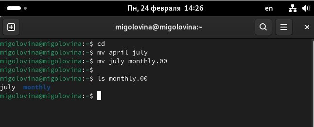

---
## Front matter
title: "Лабораторная работа 7"
subtitle: "Анализ файловой системы Linux. Команды для работы с файлами и каталогами"
author: "Головина Мария Игоревна"

## Generic otions
lang: ru-RU
toc-title: "Содержание"

## Bibliography
bibliography: bib/cite.bib
csl: pandoc/csl/gost-r-7-0-5-2008-numeric.csl

## Pdf output format
toc: true # Table of contents
toc-depth: 2
lof: true # List of figures
lot: true # List of tables
fontsize: 12pt
linestretch: 1.5
papersize: a4
documentclass: scrreprt
## I18n polyglossia
polyglossia-lang:
  name: russian
  options:
	- spelling=modern
	- babelshorthands=true
polyglossia-otherlangs:
  name: english
## I18n babel
babel-lang: russian
babel-otherlangs: english
## Fonts
mainfont: IBM Plex Serif
romanfont: IBM Plex Serif
sansfont: IBM Plex Sans
monofont: IBM Plex Mono
mathfont: STIX Two Math
mainfontoptions: Ligatures=Common,Ligatures=TeX,Scale=0.94
romanfontoptions: Ligatures=Common,Ligatures=TeX,Scale=0.94
sansfontoptions: Ligatures=Common,Ligatures=TeX,Scale=MatchLowercase,Scale=0.94
monofontoptions: Scale=MatchLowercase,Scale=0.94,FakeStretch=0.9
mathfontoptions:
## Biblatex
biblatex: true
biblio-style: "gost-numeric"
biblatexoptions:
  - parentracker=true
  - backend=biber
  - hyperref=auto
  - language=auto
  - autolang=other*
  - citestyle=gost-numeric
## Pandoc-crossref LaTeX customization
figureTitle: "Рис."
tableTitle: "Таблица"
listingTitle: "Листинг"
lofTitle: "Список иллюстраций"
lotTitle: "Список таблиц"
lolTitle: "Листинги"
## Misc options
indent: true
header-includes:
  - \usepackage{indentfirst}
  - \usepackage{float} # keep figures where there are in the text
  - \floatplacement{figure}{H} # keep figures where there are in the text
---

# Цель работы

Ознакомление с файловой системой Linux, её структурой, именами и содержанием каталогов. Приобретение практических навыков по применению команд для работы с файлами и каталогами, по управлению процессами (и работами), по проверке использования диска и обслуживанию файловой системы.

# Задание

1. Выполните все примеры, приведённые в первой части описания лабораторной работы. 
2. Выполните следующие действия, зафиксировав в отчёте по лабораторной работе используемые при этом команды и результаты их выполнения: 
2.1. Скопируйте файл /usr/include/sys/io.h в домашний каталог и назовите его equipment. Если файла io.h нет,то используйте любой другой файл в каталоге /usr/include/sys/ вместо него. 

2.2. В домашнем каталоге создайте директорию ~/ski.plases. 

2.3. Переместите файл equipment в каталог ~/ski.plases. 

2.4. Переименуйте файл ~/ski.plases/equipment в ~/ski.plases/equiplist. 

2.5. Создайте в домашнем каталоге файл abc1 и скопируйте его в каталог ~/ski.plases, назовите его equiplist2. 

2.6. Создайте каталог с именем equipment в каталоге ~/ski.plases. 

2.7. Переместите файлы ~/ski.plases/equiplist и equiplist2 в каталог ~/ski.plases/equipment. 

2.8. Создайте и переместите каталог ~/newdir в каталог ~/ski.plases и назовите его plans.
3. Определите опции команды chmod, необходимые для того, чтобы присвоить перечисленным ниже файлам выделенные права доступа, считая, что в начале таких прав нет: 

3.1. drwxr--r-- ... australia 

3.2. drwx--x--x ... play 

3.3. -r-xr--r-- ... my_os 

3.4. -rw-rw-r-- ... feathers 
При необходимости создайте нужные файлы. 
4. Проделайте приведённые ниже упражнения, записывая в отчёт по лабораторной работе используемые при этом команды: 

4.1. Просмотрите содержимое файла /etc/password. 

4.2. Скопируйте файл ~/feathers в файл ~/file.old. 

4.3. Переместите файл ~/file.old в каталог ~/play. 

4.4. Скопируйте каталог ~/play в каталог ~/fun. 

4.5. Переместите каталог ~/fun в каталог ~/play и назовите его games. 

4.6. Лишите владельца файла ~/feathers права на чтение. 

4.7. Что произойдёт, если вы попытаетесь просмотреть файл ~/feathers командой cat? 

4.8. Что произойдёт, если вы попытаетесь скопировать файл ~/feathers? 

4.9. Дайте владельцу файла ~/feathers право на чтение. 

4.10. Лишите владельца каталога ~/play права на выполнение. 

4.11. Перейдите в каталог ~/play. Что произошло? 

4.12. Дайте владельцу каталога ~/play право на выполнение. 

5. Прочитайте man по командам mount, fsck, mkfs, kill и кратко их охарактеризуйте, приведя примеры.
6. Ответить на контрольные вопросы.

# Теоретическое введение

Для создания текстового файла можно использовать команду touch.
Для просмотра файлов небольшого размера можно использовать команду cat.
Для просмотра файлов постранично удобнее использовать команду less. 
Следующие клавиши используются для управления процессом просмотра: 
    
    • Space — переход к следующей странице, 
    
    • ENTER — сдвиг вперёд на одну строку, 
    
    • b — возврат на предыдущую страницу,
    
    • h — обращение за подсказкой, 
    
    • q — выход из режима просмотра файла. 
Команда head выводит по умолчанию первые 10 строк файла. Команда cp используется для копирования файлов и каталогов.
Более подробно об Linux см. в [1–7].

# Выполнение лабораторной работы

1. Выполнить все примеры, приведённые в первой части описания лабораторной работы (рис. 4.1 – 4.13).

{#fig:001 width=70%}

{#fig:002 width=70%}

{#fig:003 width=70%}

{#fig:004 width=70%}

{#fig:005 width=70%}

{#fig:006 width=70%}

{#fig:007 width=70%}

{#fig:008 width=70%}

{#fig:006 width=70%}

{#fig:010 width=70%}

{#fig:011 width=70%}

{#fig:012 width=70%}

{#fig:013 width=70%}

2. Скопировали файл /usr/include/sys/io.h в домашний каталог и назовали его equipment (рис.4.14).

{#fig:014 width=70%}

В домашнем каталоге создали директорию ~/ski.plases (рис.4.15).

{#fig:015 width=70%}

Переместили файл equipment в каталог ~/ski.plases (рис.4.16).

{#fig:016 width=70%}

Переименовали файл ~/ski.plases/equipment в ~/ski.plases/equiplist (рис.4.17).

{#fig:017 width=70%}

Создали в домашнем каталоге файл abc1 и скопировали его в каталог ~/ski.plases, назовите его equiplist2 (рис.4.18). 

{#fig:018 width=70%}

Создали каталог с именем equipment в каталоге ~/ski.plases. 
Переместили файлы ~/ski.plases/equiplist и equiplist2 в каталог ~/ski.plases/equipment (рис.4.19). 

{#fig:019 width=70%}

Создали и переместили каталог ~/newdir в каталог ~/ski.plases и назвали его plans (рис.4.20).

{#fig:020 width=70%}

Для удобства создали каталог demo и создали там 4 файла (рис.4.21).

{#fig:021 width=70%}

Выдали файлам и каталогам права указанные в задании лабораторной работы (рис. 4.22).

{#fig:022 width=70%}

Хотела посмотреть содержимое файла /etc/password, но такого файла у меня нет(рис. 4.23).

{#fig:023 width=70%}

 Скопировали файл ~/feathers в файл ~/file.old (рис. 2.24). 

{#fig:024 width=70%}

Переместили файл ~/file.old в каталог ~/play (рис. 4.25). 

{#fig:025 width=70%}

Скопировали каталог ~/play в каталог ~/fun( рис. 4.26). 

{#fig:026 width=70%}

Переместили каталог ~/fun в каталог ~/play и назовите его games (рис.4.27).

{#fig:027 width=70%}

Лишили владельца файла ~/feathers права на чтение (рис.4.28). 

{#fig:028 width=70%}

Я попыталась посмотреть файл командой cat, но из-за того, что я забрала
права, этого сделать не удалось (рис. 4.29).

{#fig:029 width=70%}

Копирование файла так же запрещено,т.к. отсутствуют права(рис. 4.30).

{#fig:030 width=70%}

Дали владельцу файла ~/feathers право на чтение (рис. 4.31). 

{#fig:031 width=70%}

Лишили владельца каталога ~/play права на выполнение и попытались  перейти в каталог play, но выдало ошибку,так как нет прав (рис. 4.32). 

{#fig:032 width=70%}

Дали владельцу каталога ~/play право на выполнение (рис. 4.33). 

{#fig:033 width=70%}

Прочитали man по командам mount, fsck, mkfs, kill и кратко их охарактеризовали.
Команда mount нужна для открытия системы файлов (рис 4.34).

{#fig:034 width=70%}

Man fsck. Команда нужна для проверки наличия и работы системы файлов (рис 4.35).

{#fig:035 width=70%}

man kill. Команда нужна для остановки кого-либо процесса (рис. 4.36).

{#fig:036 width=70%}

Контрольные вопросы
1. Дайте характеристику каждой файловой системе, существующей на жёстком диске компьютера, на котором вы выполняли лабораторную работу.

У моего корневого каталога btrfs файловая система, поэтому я дам его характеристику. BTRFS (B-Tree Filesystem) — файловая система для Unix-подобных операционных систем, основанная на технике Copy on Write (CoW), призванная обеспечить легкость масштабирования файловой системы, высокую степень надежности и сохранности данных, гибкость настроек и легкость администрирования, сохраняя при этом высокую скорость работы.

2. Приведите общую структуру файловой системы и дайте характеристику
каждой директории первого уровня этой структуры.

Все каталоги можно разделить на две группы: для статической (редко меняющейся) информации – /bin, /usr и динамической (часто меняющейся) информации – /var, /tmp. Исходя из этого администраторы могут разместить каждый из этих каталогов на собственном носителе, обладающем соответствующими характеристиками.
Корневой каталог. Корневой каталог / является основой любой файловой системы UNIX. Все остальные каталоги и файлы располагаются в рамках структуры (дерева), порождённой корневым каталогом, независимо от их физического местонахождения. 
    
    • /bin. В этом каталоге находятся часто употребляемые команды
и утилиты системы общего пользования. Сюда входят все базовые команды, доступные даже если была примонтирована только корневая файловая система.
Примерами таких команд являются: Ls,cp и т.д. 
   
   • /boot. Директория содержит всё необходимое для процесса загрузки операционной системы: программу загрузчик, образ ядра операционной системы и т.п.
    
    • /dev. Каталог содержит специальные файлы устройств, являющиеся интерфейсом доступа к периферийным устройствам. Наличие такого каталога не означает, что специальные файлы устройств нельзя создавать в другом месте, просто достаточно удобно иметь один каталог для всех файлов такого типа. 
    
    • etc. В этом каталоге находятся системные конфигурационные файлы. В качестве примеров можно привести файлы /etc/fstab, содержащий список монтируемых файловых систем, и /etc/ resolv.conf, который задаёт правила составления локальных DNS-запросов. Среди наиболее важных файлов – скрипты инифиализации и деинициализации системы. В системах, наследующих особенности UNIX System V, для них отведены каталоги с /etc/rc0.d по /etc/rc6.d и общий для всех файл описания – /etc/inittab. 
    
    • /home (необязательно). Директория содержит домашние директории пользователей. Её существование в корневом каталоге не обязательно и её содержимое зависит от особенностей конкретной UNIX-подобной операционной системы. 
    
    •  /lib. Каталог для статических и динамических библиотек, необходимых для запуска программ, находящихся в директориях /bin,/sbin.
    
    • /mnt. Стандартный каталог для временного монтирования файловых систем–например, гибких и флэш-дисков, компакт-дисков и т. п. 
    
    • /root (необязательно). Директория содержит домашнюю директорию суперпользователя. Её существование в корневом каталоге не обязательно. 
    
    • /sbin. В этом каталоге находятся команды и утилиты для системного администратора. Примерами таких команд являются: route, halt, init и др. Для
аналогичных целей применяются директории /usr/sbin и /usr/local/sbin.
    
    • /usr. Этадиректория повторяет структуру корневой директории – содержит каталоги /usr/bin, /usr/lib, /usr/sbin, служащие для аналогичных целей. Каталог /usr/include содержит заголовочные файлы языка C для всевозможные библиотек, расположенных в системе. 
    
    • /usr/local является следующим уровнем повторения корневого каталога и служит для хранения программ, установленных администратором в дополнение к стандартной поставке операционной системы. 
    
    • /usr/share хранит неизменяющиеся данные для установленных программ. Особый интерес представляет каталог /usr/share/doc, в который добавляется документация ко всем установленным программам. 
    
    • /var, /tmp. Используются для хранения временных данных процессов.

3. Какая операция должна быть выполнена, чтобы содержимое некоторой файловой системы было доступно операционной системе?

С помощью команды cd мы переходим в каталог, в котором находится файл.
С помощью less мы открываем этот файл.

4. Назовите основные причины нарушения целостности файловой системы.
Как устранить повреждения файловой системы?

Основные причины нарушения целостности файловой системы: 
    
    • Из-за прерывания операций ввода-вывода выполняемых непосредственно с диском; 
    
    • Сбоя питания; 
   
   • Крах ОС; 
   
   • Нарушения работы дискового КЭШа; 
    
    • Устранение поврежденных файлов:
В большинстве случаев, проверка файловой системы способна обнаружить и выполнить ремонт такой ошибки автоматически, и после завершения процесс начальной загрузки продолжится как обычно. Если проблема файловой системы более серьезна, проверка файловой системы не может решить проблему автоматически. В этом случае процесс надо будет запустить вручную.

5. Как создаётся файловая система?
Обычно при установке Linux создание файловых систем - компетенция инсталлятора, который осуществляет его с некоторыми опциями по умолчанию.
Изменить характеристики, определенные для файловой системы при ее создании, невозможно без повторного выполнения этого процесса. Файловая система Ext2fs может быть создана любой из следующих команд-/sbin/mke2fs,/ sbin/mkfs, /sbin/mkfs.ext2 с указанием файла устройства в качестве аргумента. Для создания
XFS -mkfs.xfs (из пакета xfsprogs).Для создания файловой системы ext3fs -mke2fs
с опцией j. Файловая система ReiserFS - /sbin/mkreiserfs из пакета reiserfsprogs.

6. Дайте характеристику командам для просмотра текстовых файлов.

    
    • Для просмотра небольших файлов -cat. (cat имя-файла) · Для просмотра больших файлов-less . (less имя-файла)
    
    • Для просмотра начала файла-head. По умолчанию она выводит первые 10 строк файла. (head [-n] имя-файла), n — количество выводимых строк. · Команда tail . выводит несколько (по умолчанию 10) последних строк файла. (tail [-n] имя-файла),n — количество выводимых строк.

7. Приведите основные возможности команды cp в Linux.
    
    При помощи команды cp осуществляется копирование файлов и каталогов
(cp[-опции] исходный_файл целевой_файл) Возможности команды ср: – копирование файла в текущем каталоге – копирование нескольких файлов в каталог–копирование файлов в произвольном каталоге – опция i в команде cp поможет избежать уничтожения информации в случае, если на место целевого файла вы поставите имя уже существующего файла (т.е.система попросит подтвердить, что вы хотите перезаписать этот файл) – Команда cp с опцией r (recursive) позволяет копировать каталоги вместе с входящими в них файлами и каталогами.

8. Приведите основные возможности команды mv в Linux.
    
   Команды mv и mvdir предназначены для перемещения и переименования
файлов и каталогов. (mv [-опции] старый_файл новый_файл) Для получения
предупреждения перед переписыванием файла стоит использовать опцию i.

 9. Что такое права доступа? Как они могут быть изменены?
    
    Права доступа - совокупность правил, регламентирующих порядок и условия
доступа субъекта к объектам информационной системы (информации, её носителям, процессам и другим ресурсам) установленных правовыми документами или собственником, владельцем информации. Для изменения прав доступа к файлу
или каталогу используется команда-chmod.( chmod режим имя_файла) Права доступа к файлу может поменять только владелец и администратор. Режим (в формате команды) имеет следующую структуру и способ записи:  установить право –“-” лишить права –“+”дать право – r чтение – w запись– x выполнение – u (user) владелец файла – g (group) группа, к которой принадлежит владелец файла – о (others) все остальные.

# Выводы
Ознакомились с файловой системой Linux, её структурой, именами и содержанием каталогов. Приобрели практические навыки по применению команд для работы с файлами и каталогами, по управлению процессами (и работами), по проверке использования диска и обслуживанию файловой системы.

# Список литературы{.unnumbered}

1. Dash, P. Getting Started with Oracle VM VirtualBox / P. Dash. – Packt Publishing Ltd, 2013. – 86 сс.
2. Colvin, H. VirtualBox: An Ultimate Guide Book on Virtualization with VirtualBox. VirtualBox / H. Colvin. – CreateSpace Independent Publishing Platform, 2015. – 70 сс.
3.  Vugt, S. van. Red Hat RHCSA/RHCE 7 cert guide : Red Hat Enterprise Linux 7 (EX200 and EX300) : Certification Guide. Red Hat RHCSA/RHCE 7 cert guide / S. van Vugt. – Pearson IT Certification, 2016. – 1008 сс.
4. Робачевский, А. Операционная система UNIX / А. Робачевский, С. Немнюгин, О. Стесик. – 2-е изд. – Санкт-Петербург : БХВ-Петербург, 2010. – 656 сс.
5. Немет, Э. Unix и Linux: руководство системного администратора. Unix и Linux / Э. Немет, Г. Снайдер, Т.Р. Хейн, Б. Уэйли. – 4-е изд. – Вильямс, 2014. – 1312 сс.
6. Колисниченко, Д.Н. Самоучитель системного администратора Linux : Системный администратор / Д.Н. Колисниченко. – Санкт-Петербург : БХВ-Петербург, 2011. – 544 сс.
7. Robbins, A. Bash Pocket Reference / A. Robbins. – O’Reilly Media, 2016. – 156 сс.

::: {#refs}
:::
