---
## Front matter
lang: ru-RU
title: Лабораторня работа №8
subtitle: Поиск файлов. Перенаправление ввода-вывода. Просмотр запущенных процессов
author:
  - Головина М.И.
institute:
  - Российский университет дружбы народов, Москва, Россия
  - Факультет Физико-математических и естественных наук
date: 5 апреля 2025

## i18n babel
babel-lang: russian
babel-otherlangs: english

## Formatting pdf
toc: false
toc-title: Содержание
slide_level: 2
aspectratio: 169
section-titles: true
theme: metropolis
header-includes:
 - \metroset{progressbar=frametitle,sectionpage=progressbar,numbering=fraction}
 - '\makeatletter'
 - '\beamer@ignorenonframefalse'
 - '\makeatother'
---

# Информация

## Докладчик

:::::::::::::: {.columns align=center}
::: {.column width="70%"}

  * Головина Мария Игоревна
  * Бакалавр направления подготовки Математика и механика
  * студентка группы НММбд - 02- 24
  * Российский университет дружбы народов
  * [1132246810@rudn.ru](mailto:1132246810@rudn.ru)

:::
::: {.column width="30%"}

:::
::::::::::::::

## Цель

-Ознакомление с инструментами поиска файлов и фильтрации текстовых данных. Приобретение практических навыков: по управлению процессами (и заданиями), по проверке использования диска и обслуживанию файловых систем.
  
## Задание

1. Осуществите вход в систему, используя соответствующее имя пользователя.
2. Запишите в файл file.txt названия файлов, содержащихся в каталоге /etc. Допишите в этот же файл названия файлов, содержащихся в вашем домашнем каталоге. 
3. Выведите имена всех файлов из file.txt, имеющих расширение .conf, после чего запишите их в новый текстовой файл conf.txt.
4. Определите, какие файлы в вашем домашнем каталоге имеют имена, начинавшиеся с символа c? Предложите несколько вариантов, как это сделать. 
5. Выведите на экран (по странично) имена файлов из каталога /etc, начинающиеся с символа h. 
6. Запустите в фоновом режиме процесс, который будет записывать в файл ~/logfile файлы, имена которых начинаются с log. 
7. Удалите файл ~/logfile. 
8. Запустите из консоли в фоновом режиме редактор gedit. 
9. Определите идентификатор процесса gedit, используя команду ps, конвейер и фильтр grep. Как ещё можно определить идентификатор процесса? 
10. Прочтите справку (man) команды kill, после чего используйте её для завершения процесса gedit. 
11. Выполните команды df и du, предварительно получив более подробную информацию об этих командах, с помощью команды man. 
12. Воспользовавшись справкой команды find, выведите имена всех директорий, имеющихся в вашем домашнем каталоге.
13. Ответить на контрольные вопросы.

# Ход работы

## Выполнение заданий лабораторной работы
::::::::::::: {.columns align=center}
::: {.column width="40%"}
Запись в файл file.txt
:::
::: {.column width="60%"}

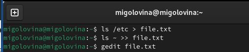

:::
::::::::::::::

## Выполнение заданий лабораторной работы
::::::::::::: {.columns align=center}
::: {.column width="40%"}
Поиск файла с расширением conf и запись в него
:::
::: {.column width="60%"}

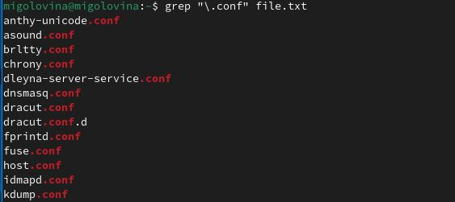

:::
::::::::::::::

## Выполнение заданий лабораторной работы
::::::::::::: {.columns align=center}
::: {.column width="40%"}
Поиск файлов на с
:::
::: {.column width="60%"}

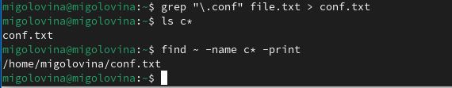

:::
::::::::::::::

## Выполнение заданий лабораторной работы
::::::::::::: {.columns align=center}
::: {.column width="40%"}
Вывод файлов на h
:::
::: {.column width="60%"}

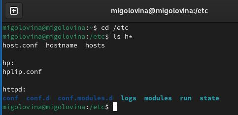

:::
::::::::::::::

## Выполнение заданий лабораторной работы
::::::::::::: {.columns align=center}
::: {.column width="40%"}
Запуск фонового процесса
:::
::: {.column width="60%"}

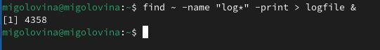

:::
::::::::::::::

## Выполнение заданий лабораторной работы
::::::::::::: {.columns align=center}
::: {.column width="40%"}
Удаление каталога logfile
:::
::: {.column width="60%"}

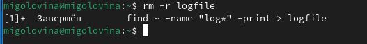

:::
::::::::::::::

## Выполнение заданий лабораторной работы
::::::::::::: {.columns align=center}
::: {.column width="40%"}
Запуск фонового редактора gedit
:::
::: {.column width="60%"}

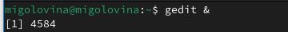

:::
::::::::::::::

## Выполнение заданий лабораторной работы
::::::::::::: {.columns align=center}
::: {.column width="40%"}
Команда kill
:::
::: {.column width="60%"}

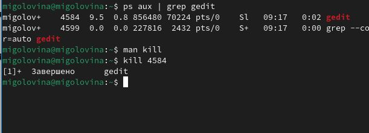

:::
::::::::::::::

## Выполнение заданий лабораторной работы
::::::::::::: {.columns align=center}
::: {.column width="40%"}
Через команду man я получила информацию о командах df 
:::
::: {.column width="60%"}

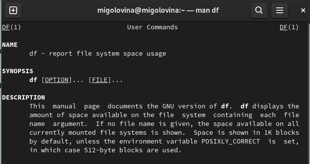

:::
::::::::::::::

## Выполнение заданий лабораторной работы
::::::::::::: {.columns align=center}
::: {.column width="40%"}
Осуществила запуск команды df
:::
::: {.column width="60%"}

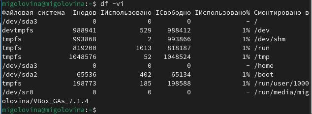

:::
::::::::::::::

## Выполнение заданий лабораторной работы
::::::::::::: {.columns align=center}
::: {.column width="40%"}
Все директории домашнего каталога
:::
::: {.column width="60%"}

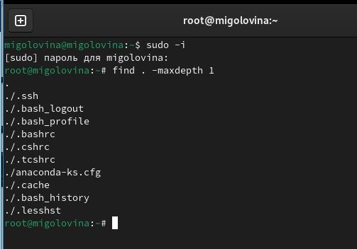

:::
::::::::::::::

## Ответы на контрольные вопросы
 1. Какие потоки ввода вывода вы знаете?
В системе по умолчанию открыто три специальных потока:

stdin — стандартный поток ввода (по умолчанию: клавиатура), файловый дескриптор 0; 

stdout — стандартный поток вывода (по умолчанию: консоль), файловый дескриптор 1;

stderr — стандартный поток вывод сообщений об ошибках (по умолчанию: консоль), файловый дескриптор 2.

2. Объясните разницу между операцией > и >>.
   
   • “>”- перенаправление вывода (stdout) в файл.
  
  • “>>”- Перенаправление вывода (stdout) в файл, но при этом он открывается в режиме добавления.

 3. Что такое конвейер?

Конвейер (pipe) служит для объединения простых команд или утилит в цепочки, в которых результат работы предыдущей команды передаётся последующей.

4. Что такое процесс? Чем это понятие отличается от программы?

Главное отличие между программой и процессом заключается в том, что программа- это набор инструкций, который позволяет ЦПУ выполнять определенную задачу, в то время как процесс - это исполняемая программа.

 5. Что такое PID и GID?

Каждому процессу Linux или Unix или выполняемой программе, автоматически присваивается идентификационный номер уникального процесса (PID). PID автоматически присваивает номер для каждого процесса в системе. Кроме идентификационного номера пользователя с учётной записью связан идентификатор группы. Группы пользователей применяются для организации доступа нескольких пользователей к некоторым ресурсам. У группы, так же, как и у пользователя, есть имя и идентификационный номер — GID.

6. Что такое задачи и какая команда позволяет ими управлять?

Запущенные фоном программы называются задачами (jobs). Ими можно управлять с помощью команды jobs, которая выводит список запущенных в данный момент задач. Для завершения задачи необходимо выполнить команду kill.

7. Найдите информацию об утилитах top и htop. Каковы их функции?

top - интерактивный просмотрщик процессов. htop аналог top.

8. Назовите и дайте характеристику команде поиска файлов. Приведите примеры использования этой команды.

Команда find используется для поиска и отображения на экран имён файлов, соответствующих заданной строке символов.

9. Можно ли по контексту (содержанию) найти файл? Если да, то как?

grep -r -n «text» /path , где -n показывает строку, где был найден фрагмент, а -r осуществляет розыск рекурсивно, в файлах в самом каталоге /path и в его подкаталогах

 10.  Как определить объем свободной памяти на жёстком диске?

С помощью команды df -h можно посмотреть объем занятой и свободной памяти на жестком диске.

  11. Как определить объем вашего домашнего каталога?
Воспользоваться командой, указанной выше, и найти домашний каталог среди всех остальных.

   12. Как удалить зависший процесс?

Узнать его идентификационный номер и воспользоваться командой kill.

# Вывод
## Заключение
Ознакомились с инструментами поиска файлов и фильтрации текстовых данных. Приобрели практические навыки: по управлению процессами (и заданиями), по проверке использования диска и обслуживанию файловых систем.

# Дорогу осилит идущий

