---
## Front matter
title: "Лабораторная работа 8"
subtitle: "Поиск файлов. Перенаправление ввода-вывода. Просмотр запущенных процессов "
author: "Головина Мария Игоревна"

## Generic otions
lang: ru-RU
toc-title: "Содержание"

## Bibliography
bibliography: bib/cite.bib
csl: pandoc/csl/gost-r-7-0-5-2008-numeric.csl

## Pdf output format
toc: true # Table of contents
toc-depth: 2
lof: true # List of figures
lot: true # List of tables
fontsize: 12pt
linestretch: 1.5
papersize: a4
documentclass: scrreprt
## I18n polyglossia
polyglossia-lang:
  name: russian
  options:
	- spelling=modern
	- babelshorthands=true
polyglossia-otherlangs:
  name: english
## I18n babel
babel-lang: russian
babel-otherlangs: english
## Fonts
mainfont: IBM Plex Serif
romanfont: IBM Plex Serif
sansfont: IBM Plex Sans
monofont: IBM Plex Mono
mathfont: STIX Two Math
mainfontoptions: Ligatures=Common,Ligatures=TeX,Scale=0.94
romanfontoptions: Ligatures=Common,Ligatures=TeX,Scale=0.94
sansfontoptions: Ligatures=Common,Ligatures=TeX,Scale=MatchLowercase,Scale=0.94
monofontoptions: Scale=MatchLowercase,Scale=0.94,FakeStretch=0.9
mathfontoptions:
## Biblatex
biblatex: true
biblio-style: "gost-numeric"
biblatexoptions:
  - parentracker=true
  - backend=biber
  - hyperref=auto
  - language=auto
  - autolang=other*
  - citestyle=gost-numeric
## Pandoc-crossref LaTeX customization
figureTitle: "Рис."
tableTitle: "Таблица"
listingTitle: "Листинг"
lofTitle: "Список иллюстраций"
lotTitle: "Список таблиц"
lolTitle: "Листинги"
## Misc options
indent: true
header-includes:
  - \usepackage{indentfirst}
  - \usepackage{float} # keep figures where there are in the text
  - \floatplacement{figure}{H} # keep figures where there are in the text
---

# Цель работы

Ознакомление с инструментами поиска файлов и фильтрации текстовых данных. Приобретение практических навыков: по управлению процессами (и заданиями), по проверке использования диска и обслуживанию файловых систем.

# Задание

1. Осуществите вход в систему, используя соответствующее имя пользователя.
2. Запишите в файл file.txt названия файлов, содержащихся в каталоге /etc. Допишите в этот же файл названия файлов, содержащихся в вашем домашнем каталоге. 
3. Выведите имена всех файлов из file.txt, имеющих расширение .conf, после чего запишите их в новый текстовой файл conf.txt.
4. Определите, какие файлы в вашем домашнем каталоге имеют имена, начинавшиеся с символа c? Предложите несколько вариантов, как это сделать. 
5. Выведите на экран (по странично) имена файлов из каталога /etc, начинающиеся с символа h. 
6. Запустите в фоновом режиме процесс, который будет записывать в файл ~/logfile файлы, имена которых начинаются с log. 
7. Удалите файл ~/logfile. 
8. Запустите из консоли в фоновом режиме редактор gedit. 
9. Определите идентификатор процесса gedit, используя команду ps, конвейер и фильтр grep. Как ещё можно определить идентификатор процесса? 
10. Прочтите справку (man) команды kill, после чего используйте её для завершения процесса gedit. 
11. Выполните команды df и du, предварительно получив более подробную информацию об этих командах, с помощью команды man. 
12. Воспользовавшись справкой команды find, выведите имена всех директорий, имеющихся в вашем домашнем каталоге.
13. Ответить на контрольные вопросы.

# Теоретическое введение

В системе по умолчанию открыто три специальных потока: 

– stdin—стандартный поток ввода (по умолчанию: клавиатура), файловый дескриптор 0;

– stdout — стандартный поток вывода (по умолчанию: консоль), файловый дескриптор 1; 

– stderr — стандартный поток вывод сообщений об ошибках (по умолчанию: консоль), файловый дескриптор 2. 

Большинство используемых в консоли команд и программ записывают результаты своей работы в стандартный поток вывода stdout. Например, команда ls выводит в стандартный поток вывода (консоль) список файлов в текущей директории. Потоки вывода и ввода можно перенаправлять на другие файлы или устройства.

Конвейер (pipe) служит для объединения простых команд или утилит в цепочки, в которых результат работы предыдущей команды передаётся последующей.

Команда find используется для поиска и отображения на экран имён файлов, соответствующих заданной строке символов.

Найти в текстовом файле указанную строку символов позволяет команда grep.

Команда df показывает размер каждого смонтированного раздела диска.

Любую выполняющуюся в консоли команду или внешнюю программу можно запустить в фоновом режиме. Для этого следует в конце имени команды указать знак амперсанда.
Любой команде, выполняемой в системе, присваивается идентификатор процесса (process ID). Получить информацию о процессе и управлять им, пользуясь идентификатором процесса, можно из любого окна командного интерпретатора.
Команда ps используется для получения информации о процессах.

Более подробно об Linux см. в [1–7].

# Выполнение лабораторной работы

1.   Я зашла в аккаунт под именем пользователя - migolovina, это мой аккаунт (первая буква имени, первая буква отчества, фамилия).
2.  Я записала в файл file.txt названия всех файлов из каталога /etc, которые
нашла с помощью команды ls. Далее я дополнила файл file.txt названием всех файлов, которые были в домашнем каталоге (рис. 4.1).

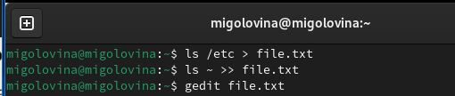{#fig:001 width=70%}

3. С помощью команду grep я вывела все файлы с расширением conf из файла file.txt. Далее все файлы, которые я нашла, я записала в файл conf.txt (рис. 4.2-4.3).

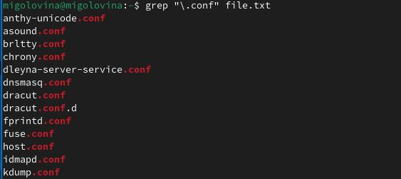{#fig:002 width=70%}

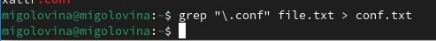{#fig:003 width=70%}

4. Я нашла все файлы в домашнем каталоге, которые начинаются на с. Я использовала для вариант: 1) команда ls, 2) команда find. Обе команды нашли всего 1 файл с таким названием (рис 4.4).

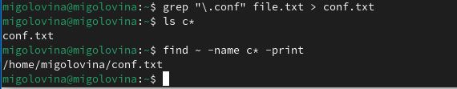{#fig:004 width=70%}

5. Я вывела все файлы из каталога /etc, которые начинались на символ h (рис. 4.5).

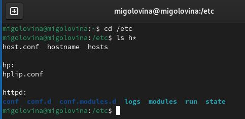{#fig:005 width=70%}

6. Запустила в фоновом режиме процесс, который записывает файлы, начинающиеся на log (рис. 4.6).

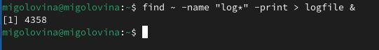{#fig:006 width=70%}

7. Используя команду rm -r, я удалила каталог, куда записывались файлы начинающиеся на log. Из-за того, что я удалила каталог, фоновый процесс так же остановился (рис.4.7).

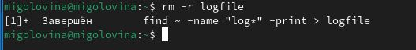{#fig:007 width=70%}

8. Запустила в фоновом режиме редактор gedit (рис. 4.8).

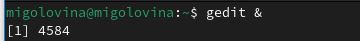{#fig:008 width=70%}

9. Определила идентификатор процесса gedit с помощью команды “ps aux” (рис 4.9).

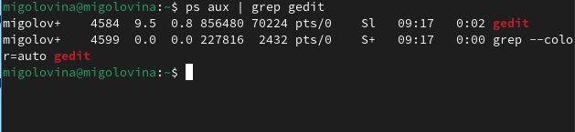{#fig:009 width=70%}

10. Я прочитала справку о команде kill. После чего использовала ее, чтобы остановить фоновый процесс редактора gedit (рис. 4.10-4.11).

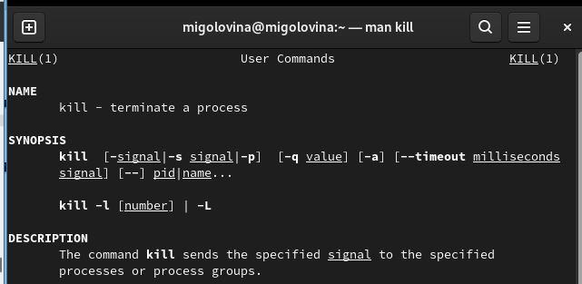{#fig:010 width=70%}

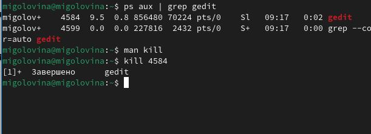{#fig:011 width=70%}

11. Через команду man я получила информацию о командах df u du. Команда df нужна для анализа каждого смонтированного раздела диска. А команда du выводит число килобайтов, которое использует каждый файл или каталог. После того, как я узнала информацию о этих двух командах, я их запустила (рис. 4.12-4.15).

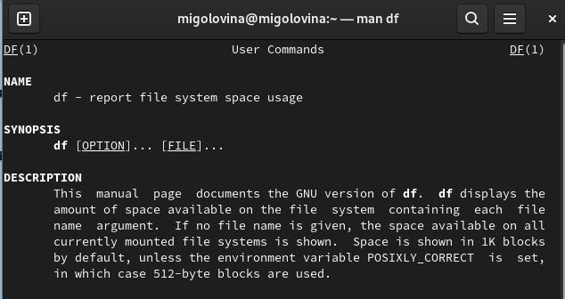{#fig:012 width=70%}

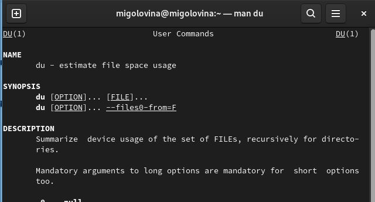{#fig:013 width=70%}

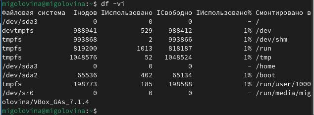{#fig:014 width=70%}

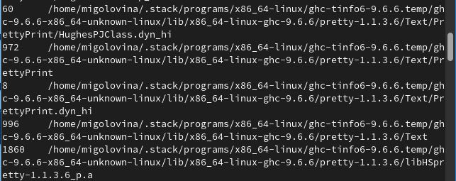{#fig:015 width=70%}

12. Я воспользовалась справкой find и затем, проанализировав ее, вывела все директории, которые находятся в домашнем каталоге(рис 4.16).

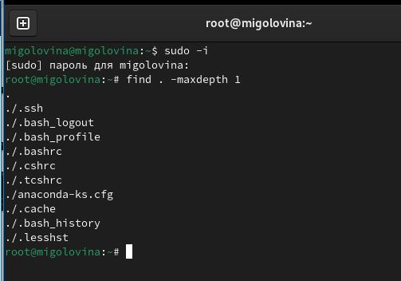{#fig:016 width=70%}

Ответы на контрольные вопросы

1. Какие потоки ввода вывода вы знаете?
В системе по умолчанию открыто три специальных потока:

stdin — стандартный поток ввода (по умолчанию: клавиатура), файловый дескриптор 0; 

stdout — стандартный поток вывода (по умолчанию: консоль), файловый дескриптор 1;

stderr — стандартный поток вывод сообщений об ошибках (по умолчанию: консоль), файловый дескриптор 2.

2. Объясните разницу между операцией > и >>.
   
   • “>”- перенаправление вывода (stdout) в файл.
  
  • “>>”- Перенаправление вывода (stdout) в файл, но при этом он открывается в режиме добавления.

 3. Что такое конвейер?

Конвейер (pipe) служит для объединения простых команд или утилит в цепочки, в которых результат работы предыдущей команды передаётся последующей.

4. Что такое процесс? Чем это понятие отличается от программы?

Главное отличие между программой и процессом заключается в том, что программа- это набор инструкций, который позволяет ЦПУ выполнять определенную задачу, в то время как процесс - это исполняемая программа.

 5. Что такое PID и GID?

Каждому процессу Linux или Unix или выполняемой программе, автоматически присваивается идентификационный номер уникального процесса (PID). PID автоматически присваивает номер для каждого процесса в системе. Кроме идентификационного номера пользователя с учётной записью связан идентификатор группы. Группы пользователей применяются для организации доступа нескольких пользователей к некоторым ресурсам. У группы, так же, как и у пользователя, есть имя и идентификационный номер — GID.

6. Что такое задачи и какая команда позволяет ими управлять?

Запущенные фоном программы называются задачами (jobs). Ими можно управлять с помощью команды jobs, которая выводит список запущенных в данный момент задач. Для завершения задачи необходимо выполнить команду kill.

7. Найдите информацию об утилитах top и htop. Каковы их функции?

top - интерактивный просмотрщик процессов. htop аналог top.

8. Назовите и дайте характеристику команде поиска файлов. Приведите примеры использования этой команды.

Команда find используется для поиска и отображения на экран имён файлов, соответствующих заданной строке символов.

9. Можно ли по контексту (содержанию) найти файл? Если да, то как?

grep -r -n «text» /path , где -n показывает строку, где был найден фрагмент, а -r осуществляет розыск рекурсивно, в файлах в самом каталоге /path и в его подкаталогах

 10.  Как определить объем свободной памяти на жёстком диске?

С помощью команды df -h можно посмотреть объем занятой и свободной памяти на жестком диске.

  11. Как определить объем вашего домашнего каталога?
Воспользоваться командой, указанной выше, и найти домашний каталог среди всех остальных.

   12. Как удалить зависший процесс?

Узнать его идентификационный номер и воспользоваться командой kill.

# Выводы
Ознакомились с инструментами поиска файлов и фильтрации текстовых данных. Приобрели практические навыки: по управлению процессами (и заданиями), по проверке использования диска и обслуживанию файловых систем.

# Список литературы{.unnumbered}

1. Dash, P. Getting Started with Oracle VM VirtualBox / P. Dash. – Packt Publishing Ltd, 2013. – 86 сс.
2. Colvin, H. VirtualBox: An Ultimate Guide Book on Virtualization with VirtualBox. VirtualBox / H. Colvin. – CreateSpace Independent Publishing Platform, 2015. – 70 сс.
3.  Vugt, S. van. Red Hat RHCSA/RHCE 7 cert guide : Red Hat Enterprise Linux 7 (EX200 and EX300) : Certification Guide. Red Hat RHCSA/RHCE 7 cert guide / S. van Vugt. – Pearson IT Certification, 2016. – 1008 сс.
4. Робачевский, А. Операционная система UNIX / А. Робачевский, С. Немнюгин, О. Стесик. – 2-е изд. – Санкт-Петербург : БХВ-Петербург, 2010. – 656 сс.
5. Немет, Э. Unix и Linux: руководство системного администратора. Unix и Linux / Э. Немет, Г. Снайдер, Т.Р. Хейн, Б. Уэйли. – 4-е изд. – Вильямс, 2014. – 1312 сс.
6. Колисниченко, Д.Н. Самоучитель системного администратора Linux : Системный администратор / Д.Н. Колисниченко. – Санкт-Петербург : БХВ-Петербург, 2011. – 544 сс.
7. Robbins, A. Bash Pocket Reference / A. Robbins. – O’Reilly Media, 2016. – 156 сс.

::: {#refs}
:::
