---
## Front matter
lang: ru-RU
title: Лабораторня работа №9
subtitle: Командная оболочка Midnight Commander
author:
  - Головина М.И.
institute:
  - Российский университет дружбы народов, Москва, Россия
  - Факультет Физико-математических и естественных наук
date: 12 апреля 2025

## i18n babel
babel-lang: russian
babel-otherlangs: english

## Formatting pdf
toc: false
toc-title: Содержание
slide_level: 2
aspectratio: 169
section-titles: true
theme: metropolis
header-includes:
 - \metroset{progressbar=frametitle,sectionpage=progressbar,numbering=fraction}
 - '\makeatletter'
 - '\beamer@ignorenonframefalse'
 - '\makeatother'
---

# Информация

## Докладчик

:::::::::::::: {.columns align=center}
::: {.column width="70%"}

  * Головина Мария Игоревна
  * Бакалавр направления подготовки Математика и механика
  * студентка группы НММбд - 02- 24
  * Российский университет дружбы народов
  * [1132246810@pfur.ru](mailto:1132246810@pfur.ru)

:::
::: {.column width="30%"}

:::
::::::::::::::

## Цель

- Освоение основных возможностей командной оболочки Midnight Commander. Приобретение навыков практической работы по просмотру каталогов и файлов; манипуляций с ними.
  
## Задание

1. Изучите информацию о mc, вызвав в командной строке man mc. 
2. Запустите из командной строки mc, изучите его структуру и меню.
3. Выполните несколько операций в mc, используя управляющие клавиши (операции с панелями; выделение/отмена выделения файлов, копирование/перемещение файлов, получение информации о размере и правах доступа на файлы и/или каталоги и т.п.) 
4. Выполните основные команды меню левой (или правой) панели. Оцените степень подробности вывода информации о файлах. 
5. Используя возможности подменю Файл, выполните: 
– просмотр содержимого текстового файла; 
– редактирование содержимого текстового файла (без сохранения результатов редактирования); – создание каталога; 
– копирование в файлов в созданный каталог. 
6. С помощью соответствующих средств подменю Команда осуществите: 
– поиск в файловой системе файла с заданными условиями (например, файла с расширением .c или .cpp, содержащего строку main); 
– выбор и повторение одной из предыдущих команд; 
– переход в домашний каталог; 
– анализ файла меню и файла расширений. 
7. Вызовите подменю Настройки. Освойте операции, определяющие структуру экрана mc (Full screen, Double Width, Show Hidden Files и т.д.).

Задание по встроенному редактору mc
1. Создайте текстовой файл text.txt. 
2. Откройте этот файл с помощью встроенного в mc редактора. 
3. Вставьте в открытый файл небольшой фрагмент текста, скопированный из любого другого файла или Интернета. 
4. Проделайте с текстом следующие манипуляции, используя горячие клавиши: 
4.1. Удалите строку текста. 
4.2. Выделите фрагменттекста и скопируйте его на новую строку.
4.3. Выделите фрагменттекста и перенесите его на новую строку. 
4.4. Сохраните файл. 
4.5. Отмените последнее действие. 
4.6. Перейдите в конец файла (нажав комбинацию клавиш) и напишите некоторый текст. 
4.7. Перейдите в начало файла (нажав комбинацию клавиш) и напишите некоторый текст. 
4.8. Сохраните и закройте файл. 
5. Откройте файл с исходным текстом на некотором языке программирования (например C или Java) 
6. Используя меню редактора, включите подсветку синтаксиса, если она не включена, или выключите, если она включена.
7. Ответить на контрольные вопросы.

# Ход работы

## man mc
::::::::::::: {.columns align=center}
::: {.column width="40%"}
Изучили информацию о mc, вызвав в командной строке man mc
:::
::: {.column width="60%"}

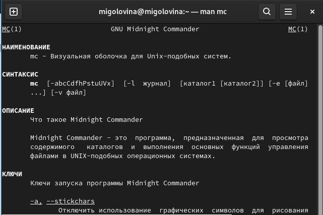

:::
::::::::::::::

## Структура mc
::::::::::::: {.columns align=center}
::: {.column width="40%"}
Запустили из командной строки mc и изучили структуру
:::
::: {.column width="60%"}

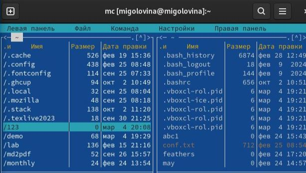

:::
::::::::::::::

## Копирование и перемещение файла

Переместили и скопировали файлы с помощью управляющих клавиш.

:::::::::::::: {.columns align=center}
::: {.column width="50%"}

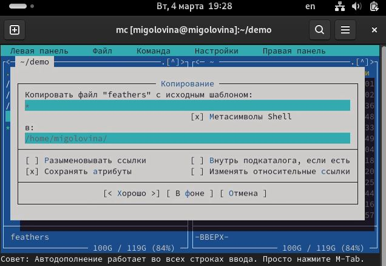

:::
::: {.column width="50%"}

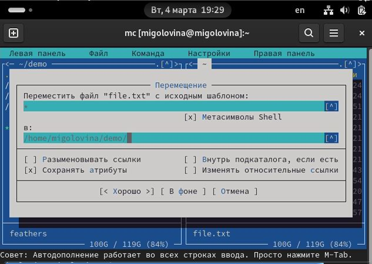

:::
::::::::::::::

## Информация о файлах. Дерево каталогов. Содержимое файлов.

Попробовали команды из левой панели

:::::::::::::: {.columns align=center}
::: {.column width="50%"}

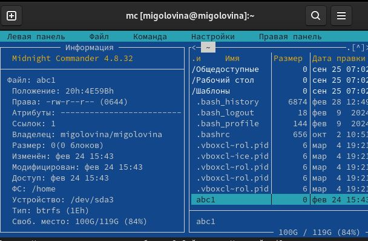

:::
::: {.column width="50%"}

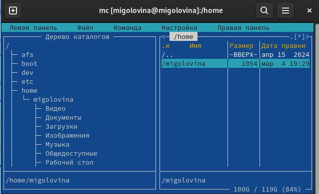

:::
::::::::::::::

## Содержимое файлов
::::::::::::: {.columns align=center}
::: {.column width="40%"}
Попробовали команды из левой панели
:::
::: {.column width="60%"}

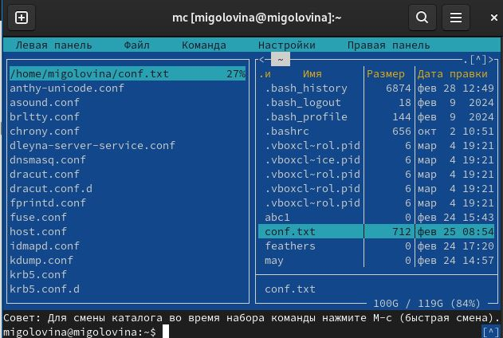

:::
::::::::::::::

## Просмотр содержимого файла. Редактирование файла.

Использовали возможности меню “Файл” и выполнили следующие команды

:::::::::::::: {.columns align=center}
::: {.column width="50%"}

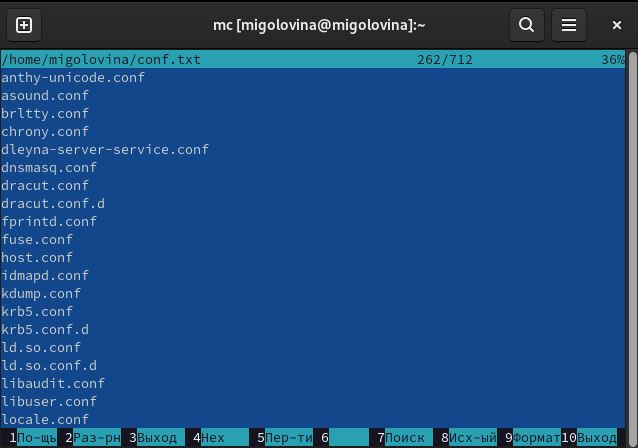

:::
::: {.column width="50%"}

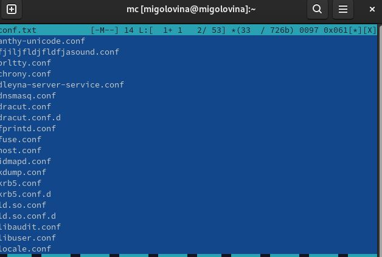

:::
::::::::::::::

## Создание каталога 123. Копирование файлов в созданный каталог.

Использовали возможности меню “Файл” и выполнили следующие команды

:::::::::::::: {.columns align=center}
::: {.column width="50%"}

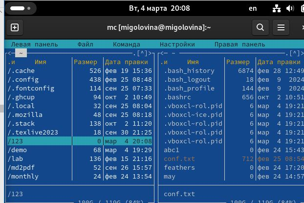

:::
::: {.column width="50%"}

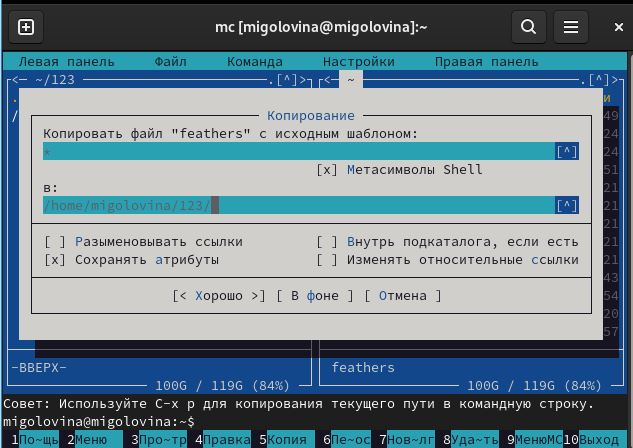

:::
::::::::::::::

## Поиск файлов с расширением .с. Поиск с расширением .ccp.

С помощью соответствующих средств подменю Команда осуществили необходимые действия 

:::::::::::::: {.columns align=center}
::: {.column width="50%"}

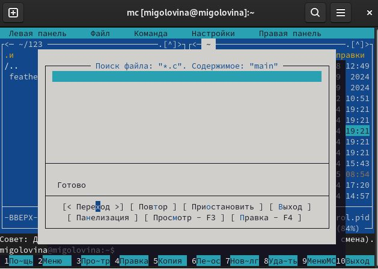

:::
::: {.column width="50%"}

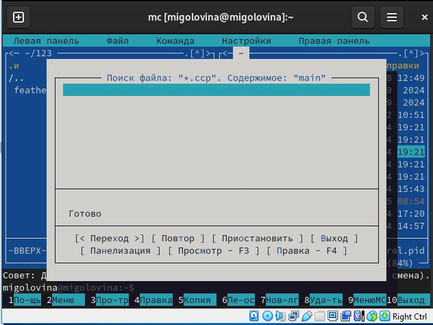

:::
::::::::::::::

## Поиск файлов с расширением .с. Поиск с расширением .ccp.

С помощью соответствующих средств подменю Команда осуществили необходимые действия 

:::::::::::::: {.columns align=center}
::: {.column width="50%"}

:::
::: {.column width="50%"}

:::
::::::::::::::

## Выбор одного из предыдущих действий. Анализ меню

С помощью соответствующих средств подменю Команда осуществили необходимые действия 

:::::::::::::: {.columns align=center}
::: {.column width="50%"}

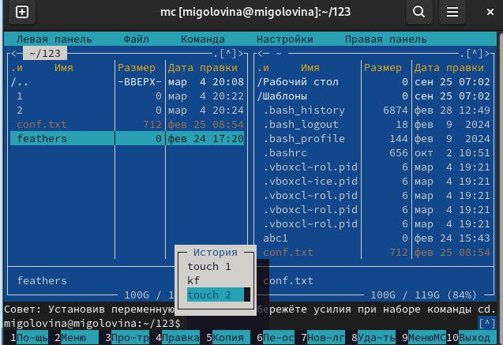

:::
::: {.column width="50%"}

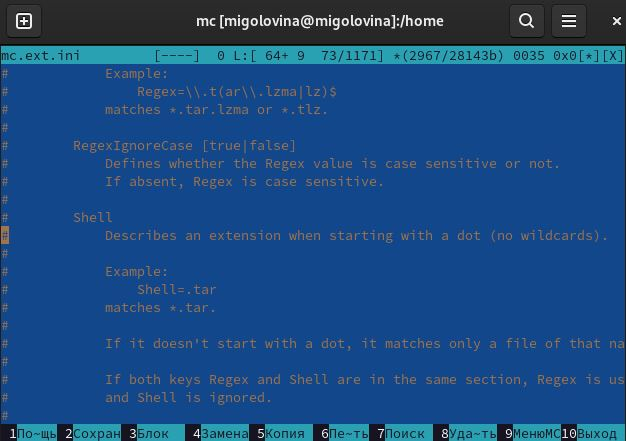

:::
::::::::::::::

## Анализ расширения
::::::::::::: {.columns align=center}
::: {.column width="40%"}
С помощью соответствующих средств подменю Команда осуществили необходимые действия 
:::
::: {.column width="60%"}

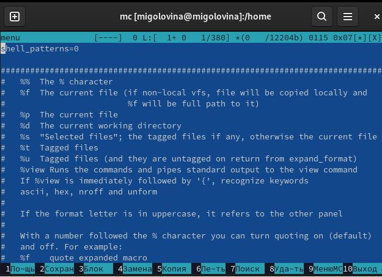

:::
::::::::::::::

## Подменю “Настройки”
::::::::::::: {.columns align=center}
::: {.column width="40%"}
Вызвали подменю Настройки. Освоили операции, определяющие структуру экрана mc
:::
::: {.column width="60%"}

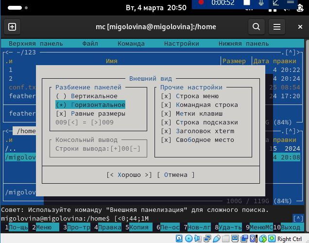

:::
::::::::::::::

## Файл text.txt
::::::::::::: {.columns align=center}
::: {.column width="40%"}
Создали текстовой файл text.txt
:::
::: {.column width="60%"}

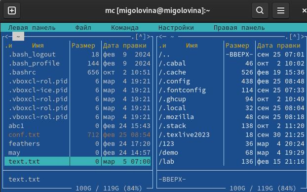

:::
::::::::::::::

## Открытие файла
::::::::::::: {.columns align=center}
::: {.column width="40%"}
Открыли этот файл с помощью встроенного в mc редактора
:::
::: {.column width="60%"}

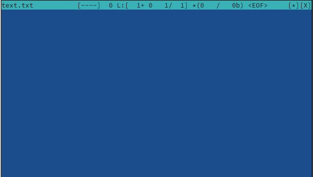

:::
::::::::::::::

## Текст файла
::::::::::::: {.columns align=center}
::: {.column width="40%"}
Вставили в открытый файл небольшой фрагмент текста. Я в качестве текста вставила список литературы из лабораторной работы
:::
::: {.column width="60%"}

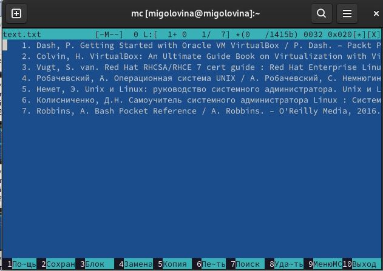

:::
::::::::::::::

## Удаление строки
::::::::::::: {.columns align=center}
::: {.column width="40%"}
Удалили строку текста с помощью клавиши F8
:::
::: {.column width="60%"}

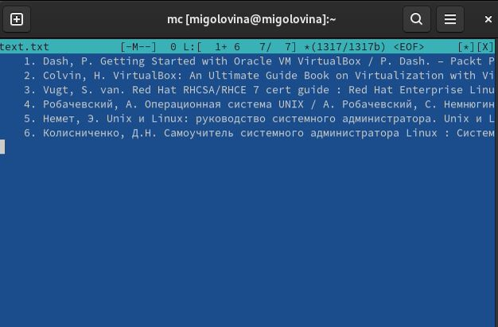

:::
::::::::::::::

## Копирование строки
::::::::::::: {.columns align=center}
::: {.column width="40%"}
Выделили фрагмент и скопировали с помощью клавиши F5
:::
::: {.column width="60%"}

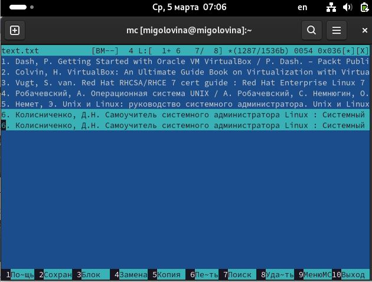

:::
::::::::::::::

## Выделили фрагмент и перенесли на новую строку с помощью клавиши enter
::::::::::::: {.columns align=center}
::: {.column width="40%"}
Перенос строки
:::
::: {.column width="60%"}

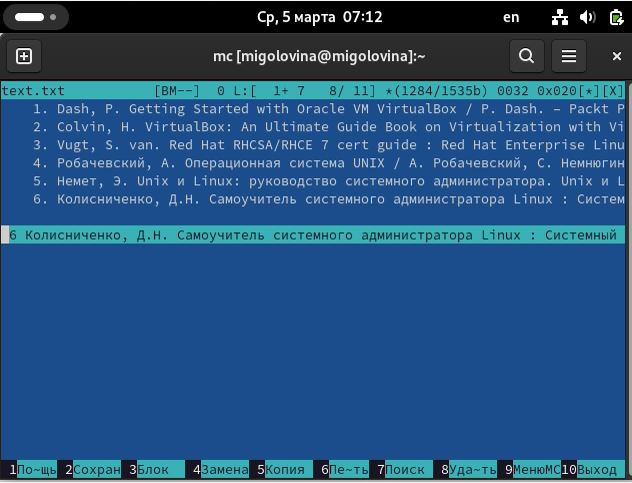

:::
::::::::::::::

## Сохранение файла
::::::::::::: {.columns align=center}
::: {.column width="40%"}
Сохранили файл
:::
::: {.column width="60%"}

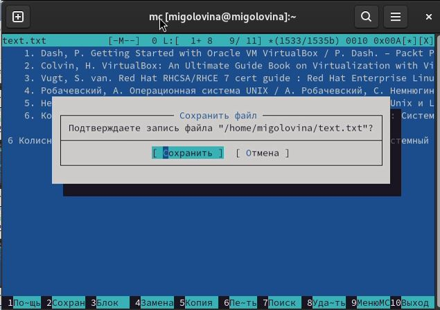

:::
::::::::::::::

## Добавление текста в конец файла
::::::::::::: {.columns align=center}
::: {.column width="40%"}
Отменили последнее действие с помощью комбинации ctrl+u. Перешли в конец текста с помощью комбинации ctrl+end и написали свое имя
:::
::: {.column width="60%"}

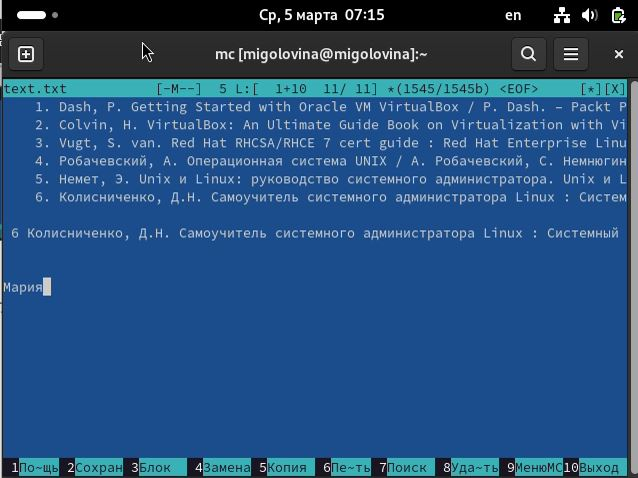

:::
::::::::::::::

## Добавление текста в начало файла
::::::::::::: {.columns align=center}
::: {.column width="40%"}
Перешли в начало файла с помощью комбинации ctrl+home и написали свою фамилию
:::
::: {.column width="60%"}

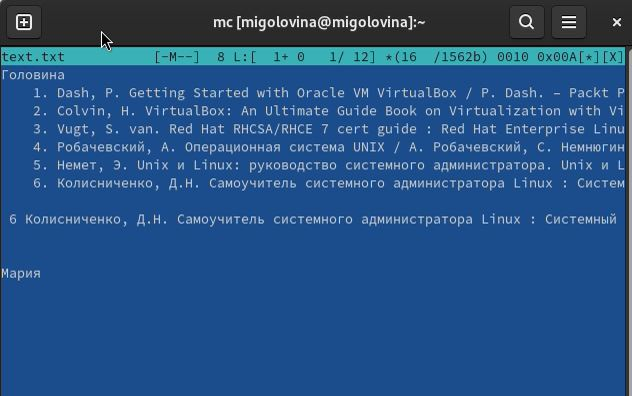

:::
::::::::::::::

## Сохранение файла
::::::::::::: {.columns align=center}
::: {.column width="40%"}
Сохранили и закрыли файл
:::
::: {.column width="60%"}

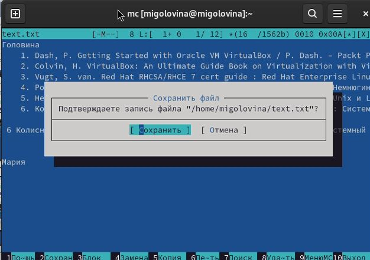

:::
::::::::::::::

## Подстветка синтаксиса
::::::::::::: {.columns align=center}
::: {.column width="40%"}
Использую меню редактора, отключили подстветку синтаксиса
:::
::: {.column width="60%"}

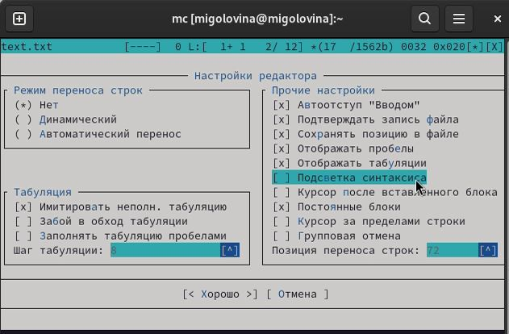

:::
::::::::::::::

## Ответы на контрольные вопросы
1. Какие режимы работы есть в mc. Охарактеризуйте их.
mc - визуальная файловая оболочка для UNIX/Linux систем, аналог Far, Norton Commander, но оболочки в Linux несравненно богаче. На языке командной оболочки можно писать небольшие программы для выполнения ряда последовательных операций с файлами и содержащимися в них данными. Команда Переставить панели(Ctrl+U) меняет местами содержимое правой и левой панелей. Команде Отключить панели (Ctrl+O). По команде Сравнить каталоги (Ctrl-X,D) сравнивается содержимое каталогов, отображаемых на левой и правой панелях. Помимо того, что может задаваться формат вывода на панель списка файлов,любую панель можно перевести в один из следующих режимов:
Режим “Информация”. В этом режиме на панель выводится информация о подсвеченном в другой панели файле и о текущей файловой системе.
Режим“Дерево”.В режиме отображения дерева каталогов в одной из панелей выводится графическое изображение структуры дерева каталогов. Этот режим подобен тому, который вы увидите, выбрав команду Дерево каталогов из меню Команды, только в последнем случае изображение структуры каталогов выводится в отдельное окно. Левая Панель и Правая Панель меню (левой/правой панели) позволяют оперировать режимами отображения панелей. Меню Левая Панель и Правая Панель позволяют оперировать панелями. Формат списка бывает:
Стандартный – вывод списка файлов и каталогов по умолчанию;
Ускоренный – имена файла или каталогов;
Расширенный – атрибуты, владелец, группа и размер;
Определённый пользователем – имя, размер и атрибуты; 
Быстрый просмотр – выполняет быстрый просмотр содержимого панели. Информация – выдает всю имеющуюся информацию о файле или каталоге. Порядок сортировки – бывает: без сортировки, по имени, расширенный, время правки, время правки, время доступа, время изменение атрибута, размер, узел.

2. Какие операции с файлами можно выполнить как с помощью команд shell, так и с помощью меню (комбинаций клавиш) mc? Приведите несколько примеров.
Системная информация
Поиск
Копирование

3. Опишите структура меню левой (или правой) панели mc,дайте характеристику командам.
Список файлов показывает файлы в домашнем каталоге.
Быстрый просмотр позволяет выполнить быстрый просмотр содержимого панели.
Информация позволяет посмотреть информацию о файле или каталоге.
Командная оболочка Midnight Commander В меню каждой (левой или правой) панели можно выбрать Формат списка: стандартный,ускоренный,расширенный и определённый пользователем.
Порядок сортировки позволяет задать критерии сортировки при выводе списка файлов и каталогов: без сортировки, по имени, расширенный, время правки, время доступа, время изменения атрибута, размер, узел.

4. Опишите структура меню Файл mc, дайте характеристику командам.
Просмотр ( F3 ) позволяет посмотреть содержимое текущего файла без возможности редактирования.
Просмотр вывода команды ( М + ! ) функция запроса команды с параметрами.
Правка (F4) открывает текущий (или выделенный) файл для его редактирования.
Копирование (F5) осуществляеткопирование одного или нескольких файлов  или каталогов в указанное пользователем во всплывающем окне место.
Права доступа (Ctrl-x c) позволяет изменить права доступа к одному или нескольким файлам или каталогам.
Права доступа на файлы и каталоги
Жёсткая ссылка ( Ctrl-x l) позволяет создать жёсткую ссылку к текущему (или выделенному) файлу. 
Символическая ссылка ( Ctrl-x s) — позволяет создать символическую ссылку к текущему файлу .
Владелец группы ( Ctrl-x o ) позволяет задать владельца и имя группы для одного или нескольких файлов или каталогов.
Права (расширенные) позволяет изменить права доступа и владения для одного или нескольких файлов или каталогов.
Переименование ( F6) позволяет переименовать один или несколько файлов или каталогов.
Создание каталога ( F7) позволяет создать каталог.
Удалить ( F8 ) позволяет удалить один или несколько файлов или каталогов.
Выход ( F10 ) завершает работу mc.

5. Опишите структура меню Команда mc, дайте характеристику командам.
Дерево каталогов отображает структуру каталогов системы.
Поиск файла выполняет поиск файлов по заданным параметрам.
Переставить панели меняет местами левую и правую панели.
Сравнить каталоги ( Ctrl-x d ) сравнивает содержимое двух каталогов.
Размеры каталогов отображает размер и время изменения каталога (по умолчанию в mc размер каталога корректно не отображается).
История командной строки выводит на экран список ранее выполненных в оболочке команд.
Каталоги быстрого доступа ( Ctrl- ) при вызове выполняется быстрая смена текущего каталога на один из заданного списка.
Восстановление файлов позволяет восстановить файлы на файловых системах ext2 и ext3.
Редактировать файл расширений позволяет задать с помощью определённого синтаксиса действия при запуске файлов с определённым расширением (например, какое программного обеспечение запускать для открытия или редактирования файлов с расширением .c или .cpp).
Редактировать файл меню позволяет отредактировать контекстное меню пользователя, вызываемое по клавише F2 .
Редактировать файл расцветки имён позволяет подобрать оптимальную для пользователя расцветку имён файлов в зависимости от их типа.

6. Опишите структура меню Настройки mc,дайте характеристику командам.
Конфигурация позволяет скорректировать настройки работы с панелями.
Внешний вид и Настройки панелей определяет элементы,отображаемые при вызове mc, а также цветовое выделение.
Биты символов задаёт формат обработки информации локальным терминалом.
Подтверждение позволяет установить или убрать вывод окна с запросом подтверждения действий при операциях удаления и перезаписи файлов, а также при выходе из программы.
Распознание клавиш диалоговое окно используется для тестирования функциональных клавиш, клавиш управления курсором и прочее.
Виртуальные ФС настройки виртуальной файловой системы: тайм-аут, пароль и прочее.

7. Назовите и дайте характеристику встроенным командам mc.
F1 Вызов контекстно-зависимой подсказки.
F2 Вызов пользовательского меню с возможностью создания and/or.
F3 Просмотр содержимого файла, на который указывает подсветка в активной панели.
F4 Вызов встроенного в mc редактора для изменения содержания файла, на который указывает подсветка в активной панели.
F5 Копирование одного или нескольких файлов, отмеченных в первой (активной) панели, в каталог, отображаемый на второй панели.
F6 Перенос одного или нескольких файлов, отмеченных в первой панели, в каталог, отображаемый на второй панели. 
F7 Создание подкаталога в каталоге, отображаемом в активной панели.
F8 Удаление одного или нескольких файлов, отмеченных в первой панели файлов. 
F9 Вызов меню mc.
F10 Выход из mc.

8. Назовите и дайте характеристику командам встроенного редактора mc.
Ctrl+y удалить строку.
Ctrl+u отмена последней операции.
Ins вставка/замена.
F7 поиск.
Shift+F7 повтор последней операции поиска.
F4 замена файла.
F3 первое нажатие начало выделения, второе это окончание выделения.
F5 копировать выделенный фрагмент F6 переместить выделенный фрагмент.
F8 удалить выделенный фрагмент.
F2 записать изменения в файл.
F10 выйти из редактора.

9. Дайте характеристику средствам mc, которые позволяют создавать меню, определяемые пользователем.
Один из четырех форматов списка в Midnight Commander –пользовательский, определённый самим пользователем позволяет ему редактировать меню любого из двух списков. А меню пользователя – это меню, состоящее из команд, определенных пользователем. При вызове меню используется файл ~/.mc.menu. Если такого файла нет, то по умолчанию используется системный файл меню /usr/lib/mc/mc.menu. Все строки в этих файлах , начинающиеся с пробела или табуляции, являются командами, которые выполняются при выборе записи.

10. Дайте характеристику средствам mc, которые позволяют выполнять действия, определяемые пользователем, над текущим файлом.
Когда мы выделяем файл не являющегося исполняемым, Midnight Commander сравнивает расширение выбранного файла с расширениями, прописанными в«файле расширений» ~/ mc.ext. Если в файле расширений найдется подраздел, задающий процедуры обработки файлов с данным расширением,то обработка файла производится в соответствии с заданными в этом подразделе командами и файлами:
    • файл помощи для MC. /usr/lib/mc.hlp
    • файл расширений, используемый по умолчанию. /usr/lib/mc/mc.ext
    • файл расширений, конфигурации редактора. $HOME/.mc.ext
    • системный инициализационный файл. /usr/lib/mc/mc.ini
    • фаил который содержит основные установки. /usr/lib/mc/mc.lib
    • инициализационный файл пользователя. Если он существует,то системный файл mc.ini игнорируется. $HOME/.mc.ini
    • этот файл содержит подсказки, отображаемые в нижней части экрана.
    • /usr/lib/mc/mc.hint
    • системный файл меню MC,используемый по умолчанию./usr/lib/mc/mc.menu
    • файл меню пользователя. Если он существует, то системный файл меню
    • игнорируется. $HOME/.mc.menu
    • инициализационный файл пользователя. Если он существует,то системный
    • файл mc.ini игнорируется. $HOME/.mc.tree.

# Вывод
## Заключение

Я освоила основные возможности командной оболочки Midnight Commander. Приобрела навыкы практической работы по просмотру каталогов и файлов; манипуляций с ними.

# Дорогу осилит идущий

