---
## Front matter
lang: ru-RU
title: Лабораторня работа №10
subtitle: Текстовый редактор vi
author:
  - Головина М.И.
institute:
  - Российский университет дружбы народов, Москва, Россия
  - Факультет Физико-математических и естественных наук
date: 19 апреля 2025

## i18n babel
babel-lang: russian
babel-otherlangs: english

## Formatting pdf
toc: false
toc-title: Содержание
slide_level: 2
aspectratio: 169
section-titles: true
theme: metropolis
header-includes:
 - \metroset{progressbar=frametitle,sectionpage=progressbar,numbering=fraction}
 - '\makeatletter'
 - '\beamer@ignorenonframefalse'
 - '\makeatother'
---

# Информация

## Докладчик

:::::::::::::: {.columns align=center}
::: {.column width="70%"}

  * Головина Мария Игоревна
  * Бакалавр направления подготовки Математика и механика
  * студентка группы НММбд - 02- 24
  * Российский университет дружбы народов
  * [1132246810@pfur.ru](mailto:1132246810@pfur.ru)

:::
::: {.column width="30%"}

:::
::::::::::::::

## Цель

- Познакомиться с операционной системой Linux. Получить практические навыки работы с редактором vi, установленным по умолчанию практически во всех дистрибутивах.
  
## Задание

1. Создайте каталог с именем ~/work/os/lab06.
2. Перейдите во вновь созданный каталог. 
3. Вызовите vi и создайте файл hello.sh
4. Нажмите клавишу i и вводите текст.
5. Нажмите клавишу Esc для перехода в командный режим после завершения ввода текста. 
6. Нажмите : для перехода в режим последней строки и внизу вашего экрана появится приглашение в виде двоеточия. 
7. Нажмите w (записать) и q (выйти),а затем нажмите клавишу Enter для сохранения вашего текста и завершения работы. 
8. Сделайте файл исполняемым
9. Вызовите vi на редактирование файла
10. Установите курсор в конец слова HELL второй строки.
11. Перейдите в режим вставки и замените на HELLO. Нажмите Esc для возврата в командный режим. 
12.  Установите курсор на четвертую строку и сотрите слово LOCAL.
13. Перейдите в режим вставки и наберите следующий текст: local, нажмите Esc для возврата в командный режим. 
14. Установите курсор на последней строке файла. Вставьте после неё строку, содержащую следующий текст: echo $HELLO. 
15. Нажмите Esc для перехода в командный режим. 
16. Удалите последнюю строку. 
17. Введите команду отмены изменений u для отмены последней команды. 
18. Введите символ : для перехода в режим последней строки. Запишите произведённые изменения и выйдите из vi.
19. Ответить на контрольные вопросы.

# Ход работы

## man vi
::::::::::::: {.columns align=center}
::: {.column width="40%"}
Познакомились с редактором vi через команду man vi
:::
::: {.column width="60%"}

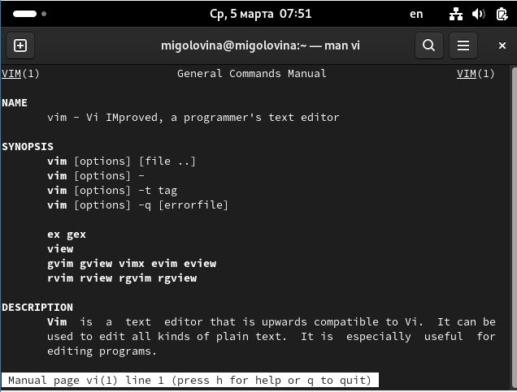

:::
::::::::::::::

## Создание каталога
::::::::::::: {.columns align=center}
::: {.column width="40%"}
Создали каталог с именем ~/work/os/lab06. Перешли во вновь созданный каталог
:::
::: {.column width="60%"}

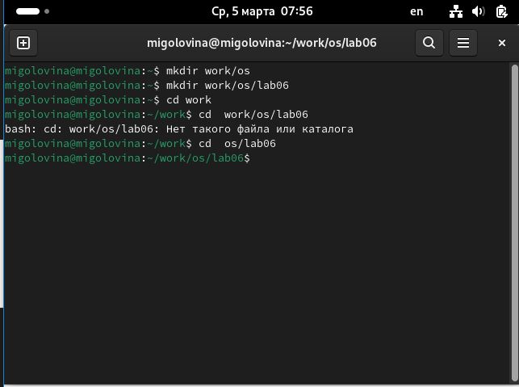

:::
::::::::::::::

## Создание файла
::::::::::::: {.columns align=center}
::: {.column width="40%"}
Вызвали vi и создали файл hello.sh 
:::
::: {.column width="60%"}

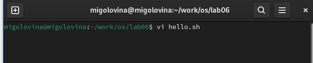
:::
::::::::::::::

## Текст в файле
::::::::::::: {.columns align=center}
::: {.column width="40%"}
Ввели в файл нужный текст
:::
::: {.column width="60%"}

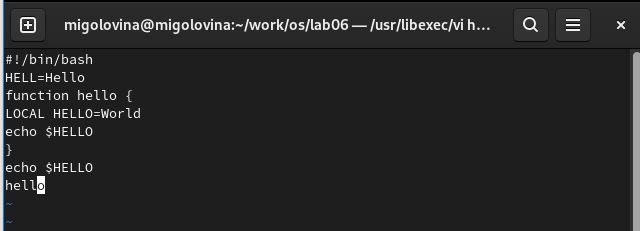

:::
::::::::::::::

## Сохранение файла
::::::::::::: {.columns align=center}
::: {.column width="40%"}
Нажали клавишу esc для перехода в командный режим, затем нажали на клавишу : и написал wq для сохранения файл
:::
::: {.column width="60%"}

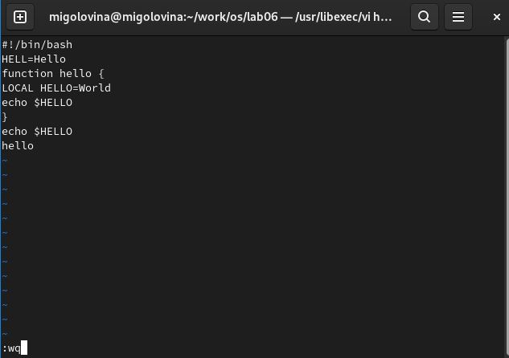

:::
::::::::::::::

## Разрешение на исполнение
::::::::::::: {.columns align=center}
::: {.column width="40%"}
Сделали файл исполняемым
:::
::: {.column width="60%"}

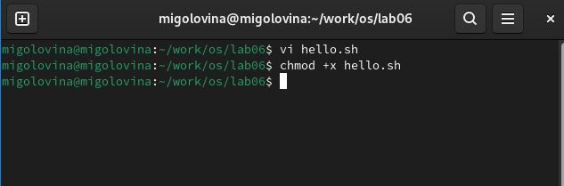

:::
::::::::::::::

## Вызов vi
::::::::::::: {.columns align=center}
::: {.column width="40%"}
Вызвали vi на редактирование файла
:::
::: {.column width="60%"}

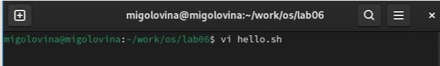

:::
::::::::::::::

## Замена слова
::::::::::::: {.columns align=center}
::: {.column width="40%"}
Установили курсор в конец слова HELL второй строки. Перешел в режим редактирования, заменил слово HELL на HELLО
:::
::: {.column width="60%"}

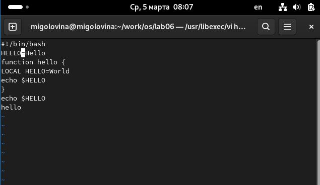

:::
::::::::::::::

## Удаления слова LOCAL
::::::::::::: {.columns align=center}
::: {.column width="40%"}
Установили курсор на четвертую строку и стерли слово LOCAL
:::
::: {.column width="60%"}

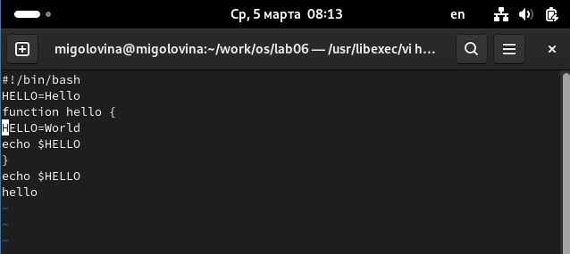

:::
::::::::::::::

## Добавление текста local
::::::::::::: {.columns align=center}
::: {.column width="40%"}
Перешли в режим вставки и набрали следующий текст: local, нажали Esc для возврата в командный режим
:::
::: {.column width="60%"}

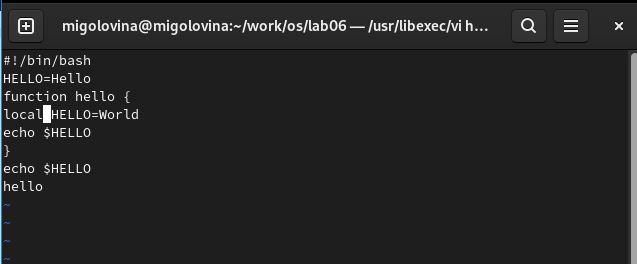

:::
::::::::::::::

## Ввод текста
::::::::::::: {.columns align=center}
::: {.column width="40%"}
Установили курсор на последней строке файла. Вставили после неё строку, содержащую следующий текст: echo $HELLO
:::
::: {.column width="60%"}

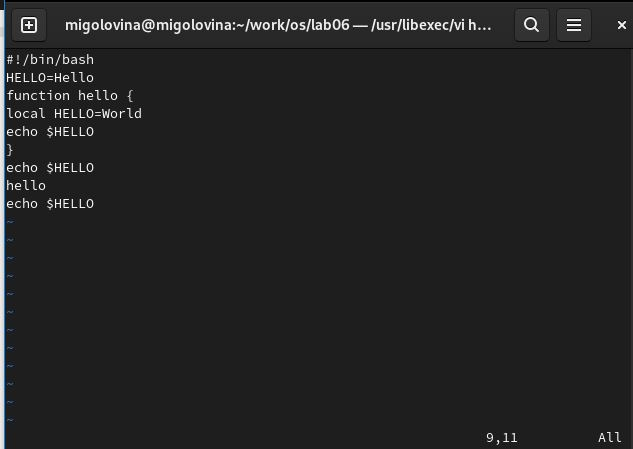

:::
::::::::::::::

## Удаление строки
::::::::::::: {.columns align=center}
::: {.column width="40%"}
Перешли в командный режим и с помощью клавиши D удалили последнюю строку
:::
::: {.column width="60%"}

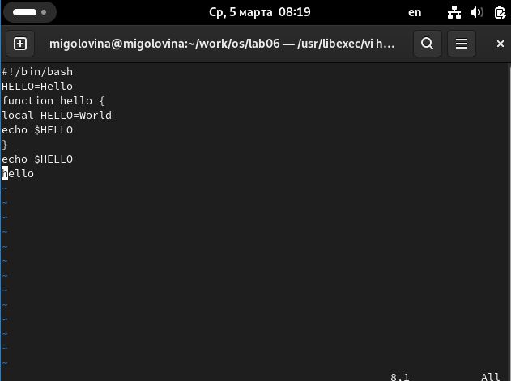

:::
::::::::::::::

## Отмена действия
::::::::::::: {.columns align=center}
::: {.column width="40%"}
Отменили последнее действие с помощью клавиши u и последняя строчка вернулась
:::
::: {.column width="60%"}

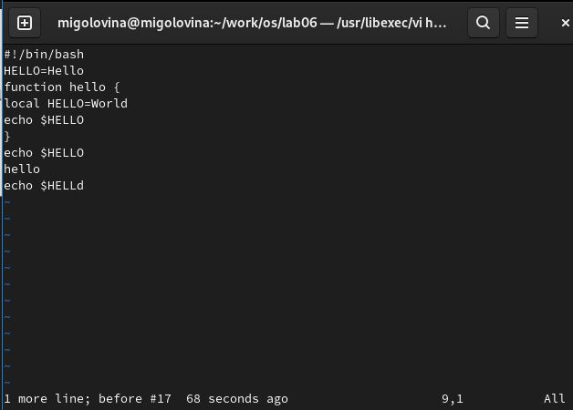

:::
::::::::::::::

## Сохранение файла
::::::::::::: {.columns align=center}
::: {.column width="40%"}
Сохранили изменения в файле и закрыл его
:::
::: {.column width="60%"}

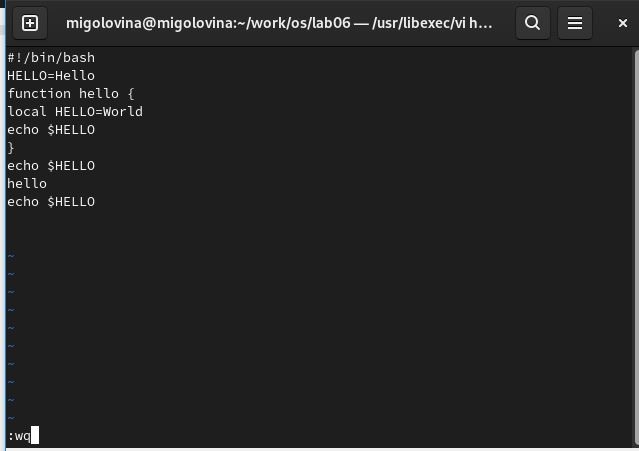

:::
::::::::::::::

## Ответы на контрольные вопросы

1. Дайте краткую характеристику режимам работы редактора vi.
Редактор vi имеет три режима работы:
– командный режим — предназначен для ввода команд редактирования и навигации по редактируемому файлу;
– режим вставки — предназначен для ввода содержания редактируемого файла;  
– режим последней (или командной) строки—используется для записи изменений
в файл и выхода из редактора.

2. Как выйти из редактора, не сохраняя произведённые изменения?
Набрать символ q (или q!), если требуется выйти из редактора без сохранения.

3. Назовите и дайте краткую характеристику командам позиционирования.
0 (ноль) — переход в начало строки;
$ — переход в конец строки;
G — переход в конец файла;
nG — переход на строку с номером n.

4. Что для редактора vi является словом?
При использовании прописных W и B под разделителями понимаются только пробел, табуляция и возврат каретки. При использовании строчных w и b под разделителями понимаются также любые знаки пунктуации.

5. Каким образом из любого места редактируемого файла перейти в начало (конец) файла?
Для того, чтобы переместить курсор в начало файла, можно использовать команду 1G. Для перехода в конец файла необходимо нажать G.

6. Назовите и дайте краткую характеристику основным группам команд редактирования.
Команды редактирования: вставка текста, вставка строки, удаление текста, отмена и повтор произведённых изменений, копирование текста в буфер, вставка текста из буфера, замена текста, поиск текста.

7. Необходимо заполнить строку символами $. Каковы ваши действия?
Перейду в режим вставки и введу необходимое количество $.

8. Как отменить некорректное действие, связанное с процессом редактирования?
Отменить последнее действие с помощью команды u.

9. Назовите и дайте характеристику основным группам команд режима последней строки.
Команды редактирования в режиме командной строки: копирование и перемещение текста, запись в файл и выход из редактора.

10.  Как определить, не перемещая курсора, позицию, в которой заканчивается
строка?
Необходимо перейти в конец строки с помощью $.

11. Выполните анализ опций редактора vi (сколько их, как узнать их назначение
и т.д.).
Опции редактора vi позволяют настроить рабочую среду. Для задания опций используется команда set (в режиме последней строки):
• : set all — вывести полный список опций;
• : set nu — вывести номера строк;
• : set list — вывести невидимые символы;
• : set ic—не учитывать при поиске, является ли символ прописным или строчным. Если вы хотите отказаться от использования опции, то в команде set перед именем опции надо поставить no.

12. Как определить режим работы редактора vi?
Eсли в нижнем углу выводиться Insert - мы находимся в режиме вставки. Если курсор находится в конце файла и можно увидеть там двоеточие - режим последней (или командной) строки В ином случаи - мы находимся в командном режиме.

13. Постройте граф взаимосвязи режимов работы редактора vi.
- командный режим.
– режим вставки.
– режим последней строки.

# Вывод
## Заключение

Познакомились с операционной системой Linux. Получили практические навыки работы с редактором vi, установленным по умолчанию практически во всех дистрибутивах.

# Дорогу осилит идущий

