---
## Front matter
title: "Лабораторная работа 10"
subtitle: "Текстовый редактор vi"
author: "Головина Мария Игоревна"

## Generic otions
lang: ru-RU
toc-title: "Содержание"

## Bibliography
bibliography: bib/cite.bib
csl: pandoc/csl/gost-r-7-0-5-2008-numeric.csl

## Pdf output format
toc: true # Table of contents
toc-depth: 2
lof: true # List of figures
lot: true # List of tables
fontsize: 12pt
linestretch: 1.5
papersize: a4
documentclass: scrreprt
## I18n polyglossia
polyglossia-lang:
  name: russian
  options:
	- spelling=modern
	- babelshorthands=true
polyglossia-otherlangs:
  name: english
## I18n babel
babel-lang: russian
babel-otherlangs: english
## Fonts
mainfont: IBM Plex Serif
romanfont: IBM Plex Serif
sansfont: IBM Plex Sans
monofont: IBM Plex Mono
mathfont: STIX Two Math
mainfontoptions: Ligatures=Common,Ligatures=TeX,Scale=0.94
romanfontoptions: Ligatures=Common,Ligatures=TeX,Scale=0.94
sansfontoptions: Ligatures=Common,Ligatures=TeX,Scale=MatchLowercase,Scale=0.94
monofontoptions: Scale=MatchLowercase,Scale=0.94,FakeStretch=0.9
mathfontoptions:
## Biblatex
biblatex: true
biblio-style: "gost-numeric"
biblatexoptions:
  - parentracker=true
  - backend=biber
  - hyperref=auto
  - language=auto
  - autolang=other*
  - citestyle=gost-numeric
## Pandoc-crossref LaTeX customization
figureTitle: "Рис."
tableTitle: "Таблица"
listingTitle: "Листинг"
lofTitle: "Список иллюстраций"
lotTitle: "Список таблиц"
lolTitle: "Листинги"
## Misc options
indent: true
header-includes:
  - \usepackage{indentfirst}
  - \usepackage{float} # keep figures where there are in the text
  - \floatplacement{figure}{H} # keep figures where there are in the text
---

# Цель работы

Познакомиться с операционной системой Linux. Получить практические навыки работы с редактором vi, установленным по умолчанию практически во всех дистрибутивах.

# Задание

1. Создайте каталог с именем ~/work/os/lab06.
2. Перейдите во вновь созданный каталог. 
3. Вызовите vi и создайте файл hello.sh
4. Нажмите клавишу i и вводите текст.
5. Нажмите клавишу Esc для перехода в командный режим после завершения ввода текста. 
6. Нажмите : для перехода в режим последней строки и внизу вашего экрана появится приглашение в виде двоеточия. 
7. Нажмите w (записать) и q (выйти),а затем нажмите клавишу Enter для сохранения вашего текста и завершения работы. 
8. Сделайте файл исполняемым
9. Вызовите vi на редактирование файла
10. Установите курсор в конец слова HELL второй строки.
11. Перейдите в режим вставки и замените на HELLO. Нажмите Esc для возврата в командный режим. 
12.  Установите курсор на четвертую строку и сотрите слово LOCAL.
13. Перейдите в режим вставки и наберите следующий текст: local, нажмите Esc для возврата в командный режим. 
14. Установите курсор на последней строке файла. Вставьте после неё строку, содержащую следующий текст: echo $HELLO. 
15. Нажмите Esc для перехода в командный режим. 
16. Удалите последнюю строку. 
17. Введите команду отмены изменений u для отмены последней команды. 
18. Введите символ : для перехода в режим последней строки. Запишите произведённые изменения и выйдите из vi.
19. Ответить на контрольные вопросы.

# Теоретическое введение

В большинстве дистрибутивов Linux в качестве текстового редактора по умолчанию устанавливается интерактивный экранный редактор vi (Visual display editor). 
Редактор vi имеет три режима работы:
– командный режим — предназначен для ввода команд редактирования и навигации по редактируемому файлу;
– режим вставки — предназначен для ввода содержания редактируемого файла; 
– режим последней (или командной) строки —используется для записи изменений в файл и выхода из редактора. 
Для вызова редактора vi необходимо указать команду vi и имя редактируемого файла: vi <имя_файла>.
При этом в случае отсутствия файла с указанным именем будет создан такой файл. 
Переход в командный режим осуществляется нажатием клавиши Esc . Для выхода из редактора vi необходимо перейти в режим последней строки: находясь в командном режиме, нажать Shift-; (по сути символ : —двоеточие), затем: 
– набрать символы wq, если перед выходом из редактора требуется записать изменения в файл;
– набрать символ q (или q!), если требуется выйти из редактора без сохранения.

Более подробно об Linux см. в [1–7].

# Выполнение лабораторной работы

1. Познакомились с редактором vi через команду man vi (рис.4.1).

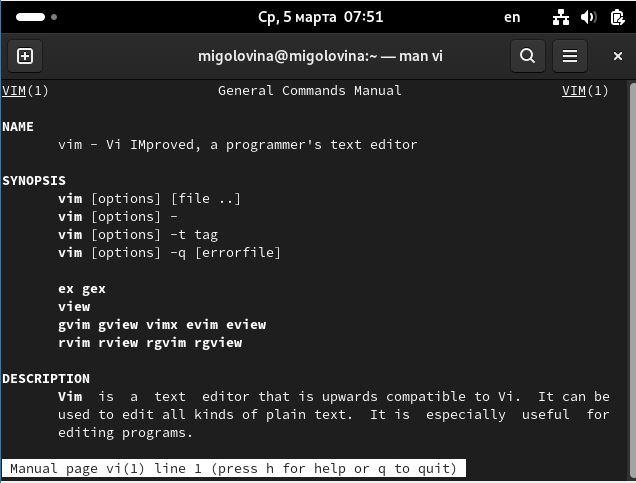{#fig:001 width=70%}

2. Создали каталог с именем ~/work/os/lab06. Перешли во вновь созданный каталог (рис.4.2).

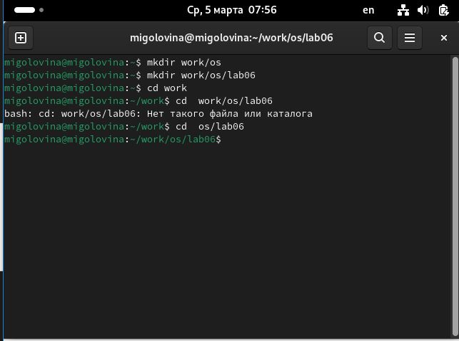{#fig:002 width=70%}

3. Вызвали vi и создали файл hello.sh (рис. 4.3).

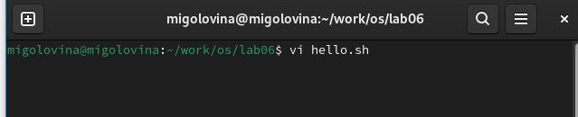{#fig:003 width=70%}

4. Ввели в файл нужный текст (рис. 4.4).

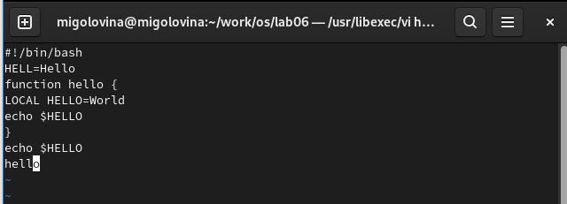{#fig:004 width=70%}

5. Нажали клавишу esc для перехода в командный режим, затем нажали на клавишу : и написал wq для сохранения файл (рис. 4.5).

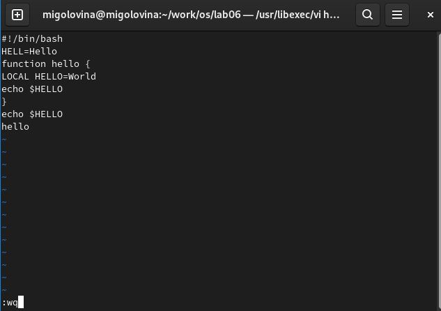{#fig:005 width=70%}

6. Сделали файл исполняемым (рис. 4.6).

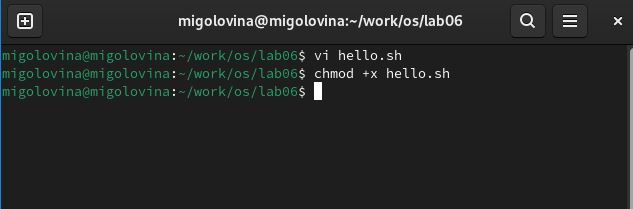{#fig:006 width=70%}

7. Вызвали vi на редактирование файла (рис. 4.7)

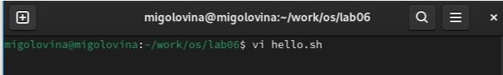{#fig:007 width=70%}

8. Установили курсор в конец слова HELL второй строки. Перешел в режим редактирования, заменил слово HELL на HELLО (рис. 4.8).

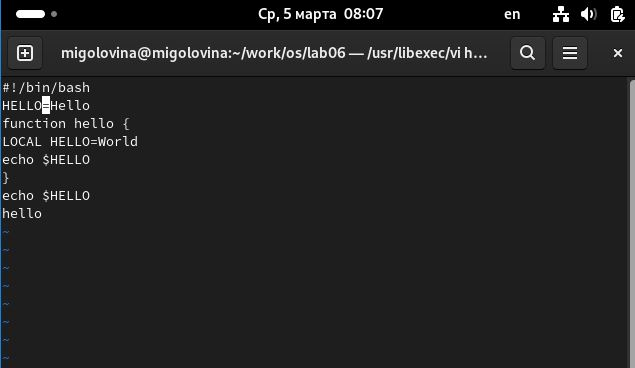{#fig:008 width=70%}

9. Установили курсор на четвертую строку и стерли слово LOCAL (рис 4.9).

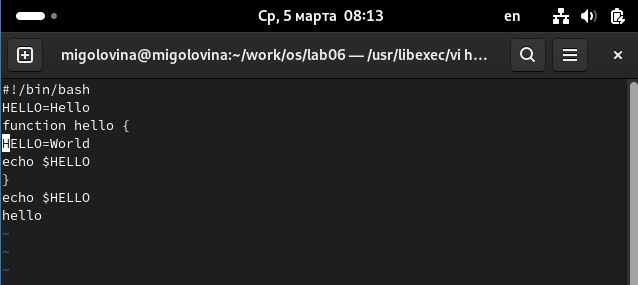{#fig:009 width=70%}

10. Перешли в режим вставки и набрали следующий текст: local, нажали Esc для возврата в командный режим (рис.4.10).

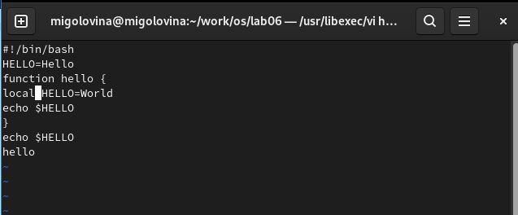{#fig:010 width=70%}

11. Установили курсор на последней строке файла. Вставили после неё строку, содержащую следующий текст: echo $HELLO (рис. 4.11).

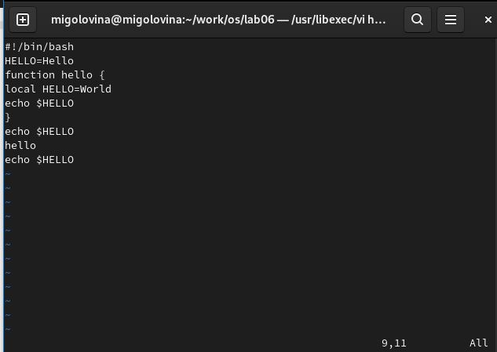{#fig:011 width=70%}

12. Перешли в командный режим и с помощью клавиши D удалили последнюю строку (рис. 4.12)

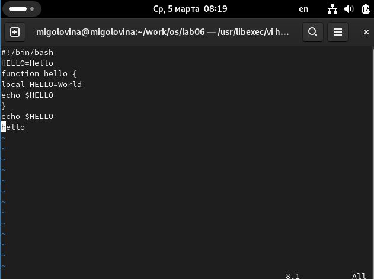{#fig:012 width=70%}

13. Отменили последнее действие с помощью клавиши u и последняя строчка вернулась (рис. 4.13).

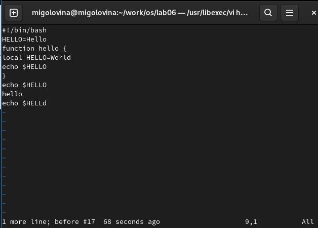{#fig:013 width=70%}

14. Сохранили изменения в файле и закрыл его (рис. 4.14).

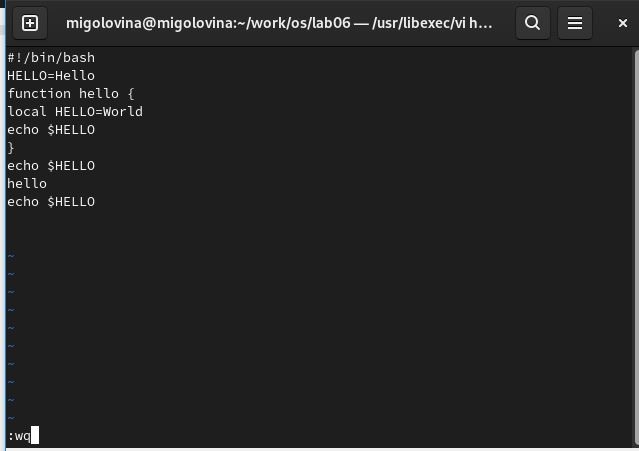{#fig:014 width=70%}

# Ответы на контрольные вопросы

1. Дайте краткую характеристику режимам работы редактора vi.
Редактор vi имеет три режима работы:
– командный режим — предназначен для ввода команд редактирования и навигации по редактируемому файлу;
– режим вставки — предназначен для ввода содержания редактируемого файла;  
– режим последней (или командной) строки—используется для записи изменений
в файл и выхода из редактора.

2. Как выйти из редактора, не сохраняя произведённые изменения?
Набрать символ q (или q!), если требуется выйти из редактора без сохранения.

3. Назовите и дайте краткую характеристику командам позиционирования.
0 (ноль) — переход в начало строки;
$ — переход в конец строки;
G — переход в конец файла;
nG — переход на строку с номером n.

4. Что для редактора vi является словом?
При использовании прописных W и B под разделителями понимаются только пробел, табуляция и возврат каретки. При использовании строчных w и b под разделителями понимаются также любые знаки пунктуации.

5. Каким образом из любого места редактируемого файла перейти в начало (конец) файла?
Для того, чтобы переместить курсор в начало файла, можно использовать команду 1G. Для перехода в конец файла необходимо нажать G.

6. Назовите и дайте краткую характеристику основным группам команд редактирования.
Команды редактирования: вставка текста, вставка строки, удаление текста, отмена и повтор произведённых изменений, копирование текста в буфер, вставка текста из буфера, замена текста, поиск текста.

7. Необходимо заполнить строку символами $. Каковы ваши действия?
Перейду в режим вставки и введу необходимое количество $.

8. Как отменить некорректное действие, связанное с процессом редактирования?
Отменить последнее действие с помощью команды u.

9. Назовите и дайте характеристику основным группам команд режима последней строки.
Команды редактирования в режиме командной строки: копирование и перемещение текста, запись в файл и выход из редактора.

10.  Как определить, не перемещая курсора, позицию, в которой заканчивается
строка?
Необходимо перейти в конец строки с помощью $.

11. Выполните анализ опций редактора vi (сколько их, как узнать их назначение
и т.д.).
Опции редактора vi позволяют настроить рабочую среду. Для задания опций используется команда set (в режиме последней строки):
• : set all — вывести полный список опций;
• : set nu — вывести номера строк;
• : set list — вывести невидимые символы;
• : set ic—не учитывать при поиске, является ли символ прописным или строчным. Если вы хотите отказаться от использования опции, то в команде set перед именем опции надо поставить no.

12. Как определить режим работы редактора vi?
Eсли в нижнем углу выводиться Insert - мы находимся в режиме вставки. Если курсор находится в конце файла и можно увидеть там двоеточие - режим последней (или командной) строки В ином случаи - мы находимся в командном режиме.

13. Постройте граф взаимосвязи режимов работы редактора vi.
- командный режим.
– режим вставки.
– режим последней строки.

# Выводы

Познакомились с операционной системой Linux. Получили практические навыки работы с редактором vi, установленным по умолчанию практически во всех дистрибутивах.

# Список литературы{.unnumbered}

1. Dash, P. Getting Started with Oracle VM VirtualBox / P. Dash. – Packt Publishing Ltd, 2013. – 86 сс.
2. Colvin, H. VirtualBox: An Ultimate Guide Book on Virtualization with VirtualBox. VirtualBox / H. Colvin. – CreateSpace Independent Publishing Platform, 2015. – 70 сс.
3.  Vugt, S. van. Red Hat RHCSA/RHCE 7 cert guide : Red Hat Enterprise Linux 7 (EX200 and EX300) : Certification Guide. Red Hat RHCSA/RHCE 7 cert guide / S. van Vugt. – Pearson IT Certification, 2016. – 1008 сс.
4. Робачевский, А. Операционная система UNIX / А. Робачевский, С. Немнюгин, О. Стесик. – 2-е изд. – Санкт-Петербург : БХВ-Петербург, 2010. – 656 сс.
5. Немет, Э. Unix и Linux: руководство системного администратора. Unix и Linux / Э. Немет, Г. Снайдер, Т.Р. Хейн, Б. Уэйли. – 4-е изд. – Вильямс, 2014. – 1312 сс.
6. Колисниченко, Д.Н. Самоучитель системного администратора Linux : Системный администратор / Д.Н. Колисниченко. – Санкт-Петербург : БХВ-Петербург, 2011. – 544 сс.
7. Robbins, A. Bash Pocket Reference / A. Robbins. – O’Reilly Media, 2016. – 156 сс.

::: {#refs}
:::
