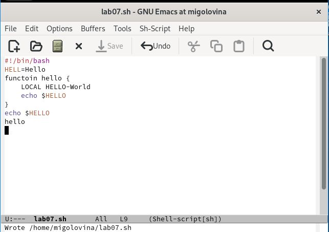

---
## Front matter
lang: ru-RU
title: Лабораторня работа №11
subtitle: Текстовый редактор emacs
author:
  - Головина М.И.
institute:
  - Российский университет дружбы народов, Москва, Россия
  - Факультет Физико-математических и естественных наук
date: 26 апреля 2025

## i18n babel
babel-lang: russian
babel-otherlangs: english

## Formatting pdf
toc: false
toc-title: Содержание
slide_level: 2
aspectratio: 169
section-titles: true
theme: metropolis
header-includes:
 - \metroset{progressbar=frametitle,sectionpage=progressbar,numbering=fraction}
 - '\makeatletter'
 - '\beamer@ignorenonframefalse'
 - '\makeatother'
---

# Информация

## Докладчик

:::::::::::::: {.columns align=center}
::: {.column width="70%"}

  * Головина Мария Игоревна
  * Бакалавр направления подготовки Математика и механика
  * студентка группы НММбд - 02- 24
  * Российский университет дружбы народов
  * [1132246810@pfur.ru](mailto:1132246810@pfur.ru)

:::
::: {.column width="30%"}

:::
::::::::::::::

## Цель

- Познакомиться с операционной системой Linux. Получить практические навыки работы с редактором Emacs.
  
## Задание

1. Открыть emacs. 
2. Создать файл lab07.sh с помощью комбинации Ctrl-x Ctrl-f (C-x C-f). 
3. Наберите текст.
4. Сохранить файл с помощью комбинации Ctrl-x Ctrl-s (C-x C-s). 
5. Проделать с текстом стандартные процедуры редактирования, каждое действие должно осуществляться комбинацией клавиш. 

5.1. Вырезать одной командой целую строку (С-k). 

5.2. Вставить эту строку в конец файла (C-y). 

5.3. Выделить область текста (C-space). 

5.4. Скопировать область в буфер обмена (M-w). 

5.5. Вставить область в конец файла. 

5.6. Вновь выделить эту область и на этот раз вырезать её (C-w). 

5.7. Отмените последнее действие (C-/). 

6. Научитесь использовать команды по перемещению курсора. 

6.1. Переместите курсор в начало строки (C-a). 

6.2. Переместите курсор в конец строки (C-e). 

6.3. Переместите курсор в начало буфера (M-<). 

6.4. Переместите курсор в конец буфера (M->). 

7. Управление буферами. 
7.1. Вывести список активных буферов на экран (C-x C-b).

7.2. Переместитесь во вновь открытое окно (C-x) o со списком открытых буферов и переключитесь на другой буфер. 

7.3. Закройте это окно (C-x 0). 

7.4. Теперь вновь переключайтесь между буферами, но уже без вывода их списка на экран (C-x b). 

8. Управление окнами. 

8.1. Поделите фрейм на 4 части: разделите фрейм на два окна по вертикали (C-x 3), а затем каждое из этих окон на две части по горизонтали (C-x 2).

8.2. В каждом из четырёх созданных окон откройте новый буфер (файл) и введите несколько строк текста. 

9. Режим поиска.

9.1. Переключитесь в режим поиска (C-s) и найдите несколько слов,присутствующих в тексте. 

9.2. Переключайтесь между результатами поиска, нажимая C-s.

9.3. Выйдите из режима поиска, нажав C-g. 

9.4. Перейдите в режим поиска и замены (M-%), введите текст, который следует найти и заменить, нажмите Enter , затем введите текстдля замены. После того как будут подсвечены результаты поиска, нажмите ! для подтверждения замены. 

9.5. Испробуйте другой режим поиска, нажав M-s o. Объясните, чем он отличается от обычного режима?

10. Ответить на контрольные вопросы.

# Ход работы

## Создание файла lab07.sh
::::::::::::: {.columns align=center}
::: {.column width="40%"}
Открыли emacs. Создали файл lab07.sh с помощью комбинации Ctrl-x Ctrl-f
:::
::: {.column width="60%"}

:::
::::::::::::::

## Текст в файле
::::::::::::: {.columns align=center}
::: {.column width="40%"}
Набрали нужный текст в файле
:::
::: {.column width="60%"}

:::
::::::::::::::

## Сохранение файла
::::::::::::: {.columns align=center}
::: {.column width="40%"}
Сохранили файл с помощью комбинации Ctrl-x Ctrl-s (C-x C-s)
:::
::: {.column width="60%"}

:::
::::::::::::::

## Вырезание целой строки одной командой
::::::::::::: {.columns align=center}
::: {.column width="40%"}
Проделали с текстом стандартные процедуры редактирования, каждое действие должно осуществляться комбинацией клавиш. Вырезали одной командой целую строку (С-k)
:::
::: {.column width="60%"}

:::
::::::::::::::

## Вставка вырезанной строки
::::::::::::: {.columns align=center}
::: {.column width="40%"}
Вставили вырезанную эту строку в конец файла (C-y)
:::
::: {.column width="60%"}

:::
::::::::::::::

## Выделение области и копирование
::::::::::::: {.columns align=center}
::: {.column width="40%"}
Выделили область текста (C-space). Скопировали область в буфер обмена (M-w). Вставили область в конец файла
:::
::: {.column width="60%"}

:::
::::::::::::::

## Вырезание выделенной области
::::::::::::: {.columns align=center}
::: {.column width="40%"}
Вновь выделили эту область и на этот раз вырезали её с помощью комбинации С-w
:::
::: {.column width="60%"}

:::
::::::::::::::

## Отмена последнего действия
::::::::::::: {.columns align=center}
::: {.column width="40%"}
Отменили последнее действие с помощью комбинации C-/
:::
::: {.column width="60%"}

:::
::::::::::::::

## Курсор в начале строки
::::::::::::: {.columns align=center}
::: {.column width="40%"}
Переместили курсор в начало строки
:::
::: {.column width="60%"}

:::
::::::::::::::

## Курсор в конце строки
::::::::::::: {.columns align=center}
::: {.column width="40%"}
Переместили курсор в конец строки
:::
::: {.column width="60%"}

:::
::::::::::::::

## Курсор в начале буфера
::::::::::::: {.columns align=center}
::: {.column width="40%"}
Переместили курсор в начало буфера
:::
::: {.column width="60%"}

:::
::::::::::::::

## Курсор в конце буфера
::::::::::::: {.columns align=center}
::: {.column width="40%"}
Переместили курсор в конец буфера
:::
::: {.column width="60%"}

:::
::::::::::::::

## Список активных буферов
::::::::::::: {.columns align=center}
::: {.column width="40%"}
Вывели список активных буферов на экран
:::
::: {.column width="60%"}

:::
::::::::::::::

## Переключение на второй буфер
::::::::::::: {.columns align=center}
::: {.column width="40%"}
Переместились во вновь открытое окно со списком открытых буферов и переключитесь на другой буфер
:::
::: {.column width="60%"}

:::
::::::::::::::

## Закрытие буфера
::::::::::::: {.columns align=center}
::: {.column width="40%"}
Закрыли окно второго буфера с помощью комбинаций C-x 0
:::
::: {.column width="60%"}

:::
::::::::::::::

## Переключение без вывода
::::::::::::: {.columns align=center}
::: {.column width="40%"}
Вновь переключились между буферами, но уже без вывода их списка на экран ( комбинация C-x b)
:::
::: {.column width="60%"}

:::
::::::::::::::

## Фрейм emacs, разделённый на 4 окна
::::::::::::: {.columns align=center}
::: {.column width="40%"}
Поделили фрейм на 4 части: разделили фрейм на два окна по вертикали (C-x 3), а затем каждое из этих окон на две части по горизонтали (C-x 2) и везде открыли файл lab07.sh.
:::
::: {.column width="60%"}

:::
::::::::::::::

## Текст в 4 буферах
::::::::::::: {.columns align=center}
::: {.column width="40%"}
В каждом из четырёх созданных окон открыли новый буфер (файл) и ввели несколько строк текста
:::
::: {.column width="60%"}

:::
::::::::::::::

## Режим поиска
::::::::::::: {.columns align=center}
::: {.column width="40%"}
Переключились в режим поиска и нашли слово HELLO в тексте
:::
::: {.column width="60%"}

:::
::::::::::::::

## Переключение между результатами
::::::::::::: {.columns align=center}
::: {.column width="40%"}
Переключились между результатами поиска, нажимая C-s, нам по очереди подсвечивало каждое слово
:::
::: {.column width="60%"}

:::
::::::::::::::

## Завершение поиска
::::::::::::: {.columns align=center}
::: {.column width="40%"}
Вышли из режима поиска, нажав C-g
:::
::: {.column width="60%"}

:::
::::::::::::::

## Замена слова
::::::::::::: {.columns align=center}
::: {.column width="40%"}
Перешли в режим поиска и замены, ввели Hello и заменили его на hi 
:::
::: {.column width="60%"}

:::
::::::::::::::

## Второй режим поиска
::::::::::::: {.columns align=center}
::: {.column width="40%"}
Попробовали другой режим поиска. Отличие этого режима оттого, что мы проверяли до этого, это разный вывод результата. Если в первом случаи, поиск показывал результаты прям в тексте, то здесь он выводит их в отдельном окне
:::
::: {.column width="60%"}

:::
::::::::::::::

## Ответы на контрольные вопросы

1. Кратко охарактеризуйте редактор emacs.
Emacs представляет собой мощный экранный редактор текста, написанный на
языке высокого уровня Elisp.

2. Какие особенности данного редактора могут сделать его сложным для освоения новичком?
Многие рутинные операции в Emacs удобнее производить с помощью клавиатуры, а не графического меню. Наиболее часто в командах Emacs используются сочетания c клавишами Ctrl и Meta (в обозначениях Emacs: C-и M-; клавиша Shift в Emasc обозначается как S-). Так как на клавиатуре для IBM PC совместимых ПК клавиши Meta нет, то вместо неё можно использовать Alt или Esc.

3. Своими словами опишите, что такое буфер и окно в терминологии emacs’а.
Если своими словами, то буфер-это файл, содержащий какой-либо текст. Окно же можно сказать область, где вы водится текст определенного буфера.

4. Можно ли открыть больше 10 буферов в одном окне?
Можно открыть больше 10 буферов в одном окне.

5. Какие буферы создаются по умолчанию при запуске emacs?
Только что запущенный Emacs несет один буфер с именем ‘scratch’, который может быть использован для вычисления выражений Лиспа в Emacs.

6. Какие клавиши вы нажмёте, чтобы ввести следующую комбинацию C-c | и
C-c C-|?

Ctrl-c |(первые две нажму вместе, а третью отдельно),  Ctrl-c Ctrl-|(каждую пару нажму раздельно).

7. Как поделить текущее окно на две части?
Разделить фрейм на два окна по вертикали (C-x 3),а по горизонтали (C-x 2)

8. В каком файле хранятся настройки редактора emacs?
В файле Emacs хранятся настройки редактора.

9. Какую функцию выполняет клавиша и можно ли её переназначить?
Кнопка BACKSPACE = функции C-k и ее можно переназначить.

10. Какой редактор вам показался удобнее в работе vi или emacs? Поясните
Почему.
Редактор Emacs мне показался удобнее, так как в нем больше возможностей по сравнению с vi.

# Вывод
## Заключение

Познакомились с операционной системой Linux. Получили практические навыки работы с редактором Emacs.

# Дорогу осилит идущий

