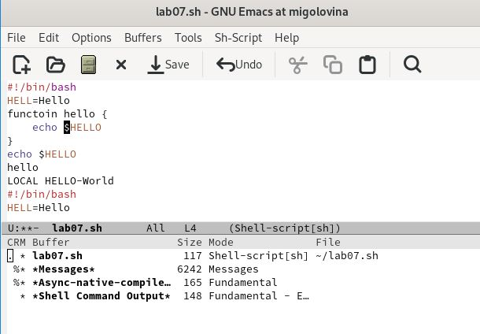

---
## Front matter
title: "Лабораторная работа 11"
subtitle: "Текстовый редактор emacs"
author: "Головина Мария Игоревна"

## Generic otions
lang: ru-RU
toc-title: "Содержание"

## Bibliography
bibliography: bib/cite.bib
csl: pandoc/csl/gost-r-7-0-5-2008-numeric.csl

## Pdf output format
toc: true # Table of contents
toc-depth: 2
lof: true # List of figures
lot: true # List of tables
fontsize: 12pt
linestretch: 1.5
papersize: a4
documentclass: scrreprt
## I18n polyglossia
polyglossia-lang:
  name: russian
  options:
	- spelling=modern
	- babelshorthands=true
polyglossia-otherlangs:
  name: english
## I18n babel
babel-lang: russian
babel-otherlangs: english
## Fonts
mainfont: IBM Plex Serif
romanfont: IBM Plex Serif
sansfont: IBM Plex Sans
monofont: IBM Plex Mono
mathfont: STIX Two Math
mainfontoptions: Ligatures=Common,Ligatures=TeX,Scale=0.94
romanfontoptions: Ligatures=Common,Ligatures=TeX,Scale=0.94
sansfontoptions: Ligatures=Common,Ligatures=TeX,Scale=MatchLowercase,Scale=0.94
monofontoptions: Scale=MatchLowercase,Scale=0.94,FakeStretch=0.9
mathfontoptions:
## Biblatex
biblatex: true
biblio-style: "gost-numeric"
biblatexoptions:
  - parentracker=true
  - backend=biber
  - hyperref=auto
  - language=auto
  - autolang=other*
  - citestyle=gost-numeric
## Pandoc-crossref LaTeX customization
figureTitle: "Рис."
tableTitle: "Таблица"
listingTitle: "Листинг"
lofTitle: "Список иллюстраций"
lotTitle: "Список таблиц"
lolTitle: "Листинги"
## Misc options
indent: true
header-includes:
  - \usepackage{indentfirst}
  - \usepackage{float} # keep figures where there are in the text
  - \floatplacement{figure}{H} # keep figures where there are in the text
---

# Цель работы

Познакомиться с операционной системой Linux. Получить практические навыки работы с редактором Emacs.

# Задание

1. Открыть emacs. 
2. Создать файл lab07.sh с помощью комбинации Ctrl-x Ctrl-f (C-x C-f). 
3. Наберите текст.
4. Сохранить файл с помощью комбинации Ctrl-x Ctrl-s (C-x C-s). 
5. Проделать с текстом стандартные процедуры редактирования, каждое действие должно осуществляться комбинацией клавиш. 

5.1. Вырезать одной командой целую строку (С-k). 

5.2. Вставить эту строку в конец файла (C-y). 

5.3. Выделить область текста (C-space). 

5.4. Скопировать область в буфер обмена (M-w). 

5.5. Вставить область в конец файла. 

5.6. Вновь выделить эту область и на этот раз вырезать её (C-w). 

5.7. Отмените последнее действие (C-/). 

6. Научитесь использовать команды по перемещению курсора. 

6.1. Переместите курсор в начало строки (C-a). 

6.2. Переместите курсор в конец строки (C-e). 

6.3. Переместите курсор в начало буфера (M-<). 

6.4. Переместите курсор в конец буфера (M->). 

7. Управление буферами. 
7.1. Вывести список активных буферов на экран (C-x C-b).

7.2. Переместитесь во вновь открытое окно (C-x) o со списком открытых буферов и переключитесь на другой буфер. 

7.3. Закройте это окно (C-x 0). 

7.4. Теперь вновь переключайтесь между буферами, но уже без вывода их списка на экран (C-x b). 

8. Управление окнами. 

8.1. Поделите фрейм на 4 части: разделите фрейм на два окна по вертикали (C-x 3), а затем каждое из этих окон на две части по горизонтали (C-x 2).

8.2. В каждом из четырёх созданных окон откройте новый буфер (файл) и введите несколько строк текста. 

9. Режим поиска.

9.1. Переключитесь в режим поиска (C-s) и найдите несколько слов,присутствующих в тексте. 

9.2. Переключайтесь между результатами поиска, нажимая C-s.

9.3. Выйдите из режима поиска, нажав C-g. 

9.4. Перейдите в режим поиска и замены (M-%), введите текст, который следует найти и заменить, нажмите Enter , затем введите текстдля замены. После того как будут подсвечены результаты поиска, нажмите ! для подтверждения замены. 

9.5. Испробуйте другой режим поиска, нажав M-s o. Объясните, чем он отличается от обычного режима?

10. Ответить на контрольные вопросы.

# Теоретическое введение

Определение 1. Буфер — объект, представляющий какой-либо текст.
Буфер может содержать что угодно, например, результаты компиляции программы или встроенные подсказки. Практически всё взаимодействие с пользователем, в том числе интерактивное, происходит посредством буферов.
Определение 2. Фрейм соответствует окну в обычном понимании этого слова. Каждый фрейм содержит область вывода и одно или несколько окон Emacs.
Определение 3. Окно — прямоугольная область фрейма, отображающая один из буферов.
Каждое окно имеет свою строку состояния, в которой выводится следующая информация: название буфера,его основной режим,изменялся ли текст буфера и как далеко вниз по буферу расположен курсор. Каждый буфер находится только в одном из возможных основных режимов. Существующие основные режимы включают режим Fundamental (наименее специализированный), режим Text, режим Lisp, режим С, режим Texinfo и другие. Под второстепенными режимами понимается список режимов, которые включены в данный момент в буфере выбранного окна.
Определение 4. Область вывода — одна или несколько строк внизу фрейма, в которой Emacs выводит различные сообщения, а также запрашивает подтверждения и дополнительную информацию от пользователя.
Определение 5. Минибуфер используется для ввода дополнительной информации и всегда отображается в области вывода.
Определение 6. Точка вставки — место вставки (удаления) данных в буфере.

Более подробно об Linux см. в [1–7].

# Выполнение лабораторной работы

1. Открыли emacs. Создали файл lab07.sh с помощью комбинации Ctrl-x Ctrl-f (рис 4.1).

{#fig:001 width=70%}

2. Набрали нужный текст в файле (рис. 4.2).

{#fig:002 width=70%}

3. Сохранили файл с помощью комбинации Ctrl-x Ctrl-s (C-x C-s) (рис. 4.3).

{#fig:003 width=70%}

4. Проделали с текстом стандартные процедуры редактирования, каждое действие должно осуществляться комбинацией клавиш. Вырезали одной командой целую строку (С-k) (рис.4.4)

{#fig:004 width=70%}

5. Вставили вырезанную эту строку в конец файла (C-y) (рис.4.5).

{#fig:005 width=70%}

6. Выделили область текста (C-space). Скопировали область в буфер обмена (M-w). Вставили область в конец файла (рис. 4.6).

{#fig:006 width=70%}

7. Вновь выделили эту область и на этот раз вырезали её с помощью комбинации С-w (рис. 4.7).

{#fig:007 width=70%}

8. Отменили последнее действие с помощью комбинации C-/ (рис. 4.8).

{#fig:008 width=70%}

9. Переместили курсор в начало строки (рис. 4.9).

{#fig:009 width=70%}

10. Переместили курсор в конец строки (рис. 4.10).

{#fig:010 width=70%}

11. Переместили курсор в начало буфера (рис. 4.11).

{#fig:011 width=70%}

12. Переместили курсор в конец буфера (рис.4.12).

{#fig:012 width=70%}

13. Вывели список активных буферов на экран (рис. 4.13)

{#fig:013 width=70%}

14. Переместились во вновь открытое окно со списком открытых буферов и переключитесь на другой буфер (рис.4.14).

{#fig:014 width=70%}

15. Закрыли окно второго буфера с помощью комбинаций C-x 0 (рис. 4.15).

{#fig:015 width=70%}

16. Вновь переключились между буферами, но уже без вывода их списка на экран ( комбинация C-x b) (рис. 4.16).

{#fig:016 width=70%}

17. Поделили фрейм на 4 части: разделили фрейм на два окна по вертикали (C-x 3), а затем каждое из этих окон на две части по горизонтали (C-x 2) и везде открыли файл lab07.sh. ( рис. 4.17).

{#fig:017 width=70%}

18. В каждом из четырёх созданных окон открыли новый буфер (файл) и ввели несколько строк текста (рис. 4.18).

{#fig:018 width=70%}

19. Переключились в режим поиска и нашли слово HELLO в тексте (рис. 4.19).

{#fig:019 width=70%}

20. Переключились между результатами поиска, нажимая C-s, нам по очереди подсвечивало каждое слово (рис. 4.20).

{#fig:020 width=70%}

21. Вышли из режима поиска, нажав C-g (рис. 4.21).

{#fig:021 width=70%}

22. Перешли в режим поиска и замены, ввели Hello и заменили его на hi (рис. 4.22).

{#fig:022 width=70%}

23. Попробовали другой режим поиска. Отличие этого режима оттого, что мы проверяли до этого, это разный вывод результата. Если в первом случаи, поиск показывал результаты прям в тексте, то здесь он выводит их в отдельном окне(рис.4.23).

{#fig:023 width=70%}

# Ответы на контрольные вопросы

1. Кратко охарактеризуйте редактор emacs.
Emacs представляет собой мощный экранный редактор текста, написанный на
языке высокого уровня Elisp.

2. Какие особенности данного редактора могут сделать его сложным для освоения новичком?
Многие рутинные операции в Emacs удобнее производить с помощью клавиатуры, а не графического меню. Наиболее часто в командах Emacs используются сочетания c клавишами Ctrl и Meta (в обозначениях Emacs: C-и M-; клавиша Shift в Emasc обозначается как S-). Так как на клавиатуре для IBM PC совместимых ПК клавиши Meta нет, то вместо неё можно использовать Alt или Esc.

3. Своими словами опишите, что такое буфер и окно в терминологии emacs’а.
Если своими словами, то буфер-это файл, содержащий какой-либо текст. Окно же можно сказать область, где вы водится текст определенного буфера.

4. Можно ли открыть больше 10 буферов в одном окне?
Можно открыть больше 10 буферов в одном окне.

5. Какие буферы создаются по умолчанию при запуске emacs?
Только что запущенный Emacs несет один буфер с именем ‘scratch’, который может быть использован для вычисления выражений Лиспа в Emacs.

6. Какие клавиши вы нажмёте, чтобы ввести следующую комбинацию C-c | и
C-c C-|?

Ctrl-c |(первые две нажму вместе, а третью отдельно),  Ctrl-c Ctrl-|(каждую пару нажму раздельно).

7. Как поделить текущее окно на две части?
Разделить фрейм на два окна по вертикали (C-x 3),а по горизонтали (C-x 2)

8. В каком файле хранятся настройки редактора emacs?
В файле Emacs хранятся настройки редактора.

9. Какую функцию выполняет клавиша и можно ли её переназначить?
Кнопка BACKSPACE = функции C-k и ее можно переназначить.

10. Какой редактор вам показался удобнее в работе vi или emacs? Поясните
Почему.
Редактор Emacs мне показался удобнее, так как в нем больше возможностей по сравнению с vi.

# Выводы

Познакомились с операционной системой Linux. Получили практические навыки работы с редактором Emacs.

# Список литературы{.unnumbered}

1. Dash, P. Getting Started with Oracle VM VirtualBox / P. Dash. – Packt Publishing Ltd, 2013. – 86 сс.
2. Colvin, H. VirtualBox: An Ultimate Guide Book on Virtualization with VirtualBox. VirtualBox / H. Colvin. – CreateSpace Independent Publishing Platform, 2015. – 70 сс.
3.  Vugt, S. van. Red Hat RHCSA/RHCE 7 cert guide : Red Hat Enterprise Linux 7 (EX200 and EX300) : Certification Guide. Red Hat RHCSA/RHCE 7 cert guide / S. van Vugt. – Pearson IT Certification, 2016. – 1008 сс.
4. Робачевский, А. Операционная система UNIX / А. Робачевский, С. Немнюгин, О. Стесик. – 2-е изд. – Санкт-Петербург : БХВ-Петербург, 2010. – 656 сс.
5. Немет, Э. Unix и Linux: руководство системного администратора. Unix и Linux / Э. Немет, Г. Снайдер, Т.Р. Хейн, Б. Уэйли. – 4-е изд. – Вильямс, 2014. – 1312 сс.
6. Колисниченко, Д.Н. Самоучитель системного администратора Linux : Системный администратор / Д.Н. Колисниченко. – Санкт-Петербург : БХВ-Петербург, 2011. – 544 сс.
7. Robbins, A. Bash Pocket Reference / A. Robbins. – O’Reilly Media, 2016. – 156 сс.

::: {#refs}
:::
