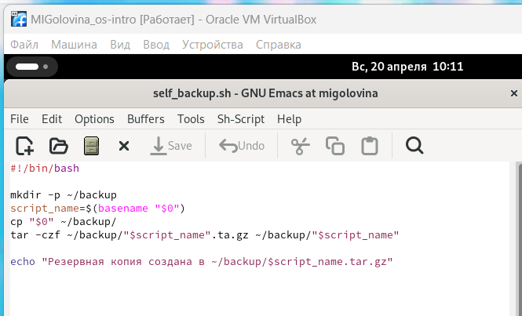
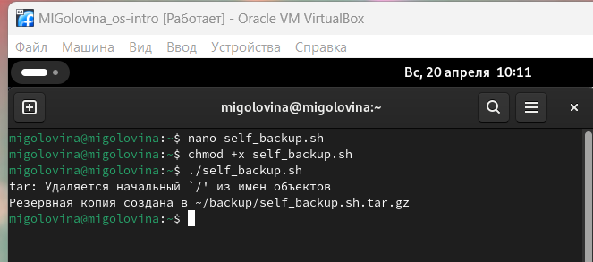
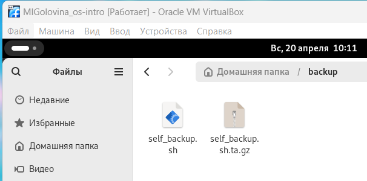
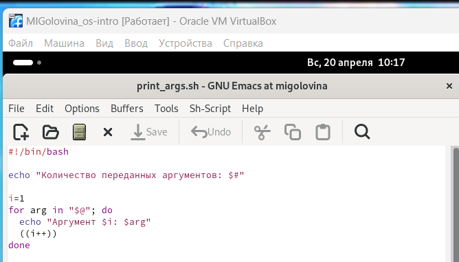
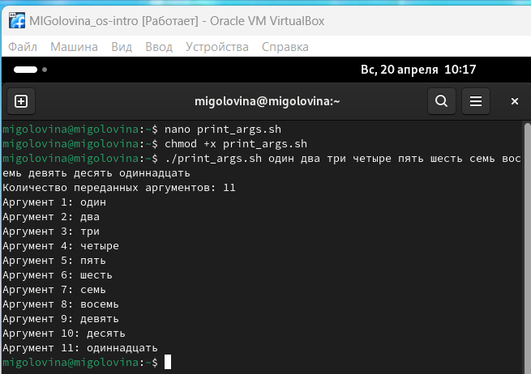
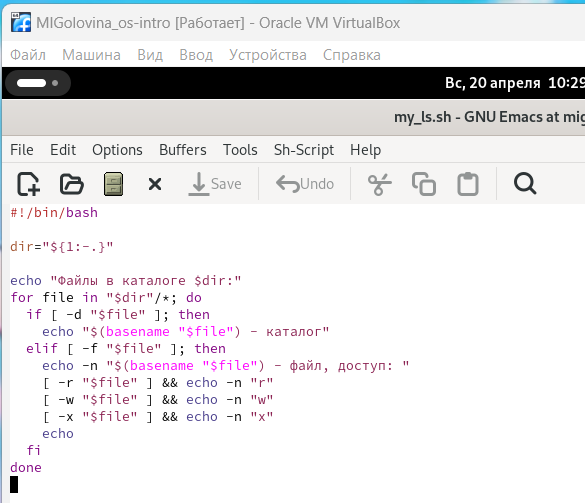
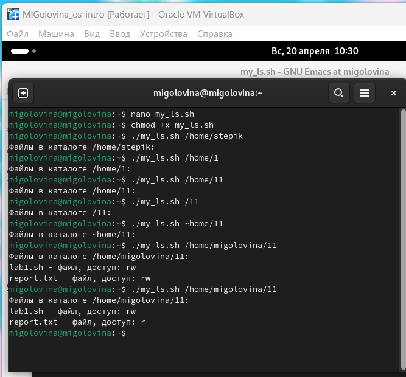
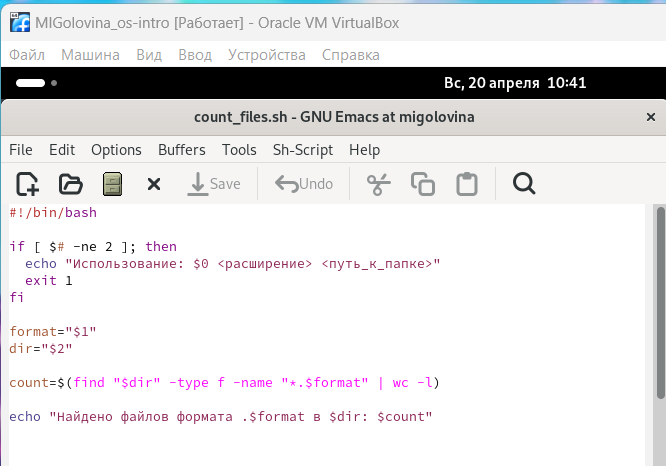
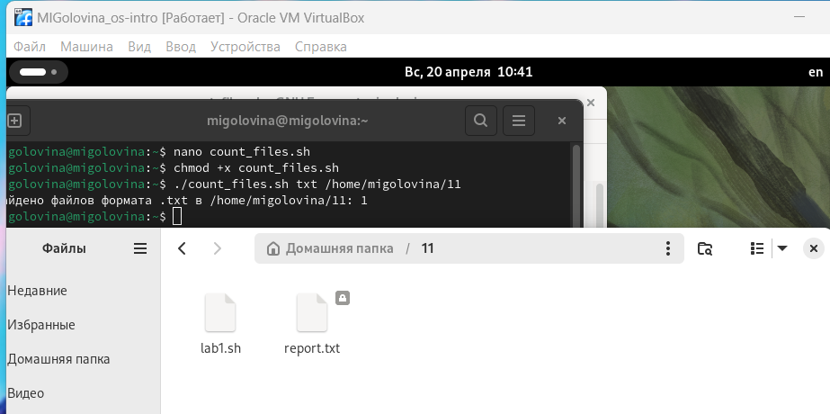

---
## Front matter
lang: ru-RU
title: Лабораторнaя работа №12
subtitle: Программирование в командном процессоре OC UNIX. Командные файлы.
author:
  - Головина М.И.
institute:
  - Российский университет дружбы народов, Москва, Россия
  - Факультет Физико-математических и естественных наук
date: 3 мая 2025

## i18n babel
babel-lang: russian
babel-otherlangs: english

## Formatting pdf
toc: false
toc-title: Содержание
slide_level: 2
aspectratio: 169
section-titles: true
theme: metropolis
header-includes:
 - \metroset{progressbar=frametitle,sectionpage=progressbar,numbering=fraction}
 - '\makeatletter'
 - '\beamer@ignorenonframefalse'
 - '\makeatother'
---

# Информация

## Докладчик

:::::::::::::: {.columns align=center}
::: {.column width="70%"}

  * Головина Мария Игоревна
  * Бакалавр направления подготовки Математика и механика
  * студентка группы НММбд - 02- 24
  * Российский университет дружбы народов
  * [1132246810@pfur.ru](mailto:1132246810@pfur.ru)

:::
::: {.column width="30%"}

:::
::::::::::::::

## Цель

- Изучить основы программирования в оболочке ОС UNIX/Linux. Научиться писать небольшие командные файлы.
  
## Задание

1. Написать скрипт, который при запуске будет делать резервную копию самого себя (то
есть файла, в котором содержится его исходный код) в другую директорию backup
в вашем домашнем каталоге. При этом файл должен архивироваться одним из ар-
хиваторов на выбор zip, bzip2 или tar. Способ использования команд архивации
необходимо узнать, изучив справку.
2. Написать пример командного файла, обрабатывающего любое произвольное число
аргументов командной строки, в том числе превышающее десять. Например, скрипт
может последовательно распечатывать значения всех переданных аргументов.
3. Написать командный файл — аналог команды ls (без использования самой этой ко-
манды и команды dir). Требуется, чтобы он выдавал информацию о нужном каталоге
и выводил информацию о возможностях доступа к файлам этого каталога.
4. Написать командный файл, который получает в качестве аргумента командной строки
формат файла (.txt, .doc, .jpg, .pdf и т.д.) и вычисляет количество таких файлов
в указанной директории. Путь к директории также передаётся в виде аргумента ко-
мандной строки.
5. Ответить на контрольные вопросы.

# Ход работы

## Скрипт №1
::::::::::::: {.columns align=center}
::: {.column width="40%"}
Написала скрипт, который при запуске будет делать резервную копию самого себя (то есть файла, в котором содержится его исходный код) в другую директорию backup в вашем домашнем каталоге
:::
::: {.column width="60%"}

:::
::::::::::::::

## Запуск
::::::::::::: {.columns align=center}
::: {.column width="40%"}
Запустила скрипт №1 
:::
::: {.column width="60%"}

:::
::::::::::::::

## Директория backup
::::::::::::: {.columns align=center}
::: {.column width="40%"}
Резервная копия самого себя в директории backup в моём домашнем каталоге
:::
::: {.column width="60%"}

:::
::::::::::::::

## Скрипт №2
::::::::::::: {.columns align=center}
::: {.column width="40%"}
Написала скрипт, обрабатывающий любое произвольное число аргументов командной строки, в том числе превышающее десять
:::
::: {.column width="60%"}

:::
::::::::::::::

## Запуск
::::::::::::: {.columns align=center}
::: {.column width="40%"}
Запустила скрипт №2
:::
::: {.column width="60%"}

:::
::::::::::::::

## Скрипт №3
::::::::::::: {.columns align=center}
::: {.column width="40%"}
Написала командный файл — аналог команды ls
:::
::: {.column width="60%"}

:::
::::::::::::::

## Запуск
::::::::::::: {.columns align=center}
::: {.column width="40%"}
Запустила скрипт №3
:::
::: {.column width="60%"}

:::
::::::::::::::

## Скрипт №4
::::::::::::: {.columns align=center}
::: {.column width="40%"}
Написала командный файл, который получает в качестве аргумента командной строки формат файла (.txt, .doc, .jpg, .pdf и т.д.) и вычисляет количество таких файлов в указанной директории
:::
::: {.column width="60%"}

:::
::::::::::::::

## Запуск
::::::::::::: {.columns align=center}
::: {.column width="40%"}
Запустила скрипт №4
:::
::: {.column width="60%"}

:::
::::::::::::::

# Ответы на контрольные вопросы

1. Объясните понятие командной оболочки. Приведите примеры командных оболочек. Чем они отличаются?

Командный процессор (командная оболочка, интерпретатор команд shell) — это программа, позволяющая пользователю взаимодействовать с операционной системой компьютера. В операционных системах типа UNIX/Linux наиболее часто используются следующие реализации командных оболочек:

• оболочка Борна (Bourne shell или sh) — стандартная командная оболочка UNIX/Linux, содержащая базовый, но при этом полный набор функций;

• С-оболочка (или csh) — надстройка на оболочкой Борна, использующая С-подобный синтаксис команд с возможностью сохранения истории выполнения команд;

• оболочка Корна (или ksh) — напоминает оболочку С, но операторы управления программой совместимы с операторами оболочки Борна;

• BASH — сокращение от Bourne Again Shell (опять оболочка Борна), в основе своей совмещает свойства оболочек С и Корна (разработка компании Free Software Foundation).

2. Что такое POSIX?

POSIX (Portable Operating System Interface for Computer Environments) — набор стандартов описания интерфейсов взаимодействия операционной системы и прикладных программ

3. Как определяются переменные и массивы в языке программирования bash?

mark=/usr/andy/bin

Данная команда присваивает значение строки символов /usr/andy/bin переменной mark типа строкасимволов. Для создания массива используется команда set с флагом -A. За флагом следует имя переменной, а затем список значений, разделённых пробелами. Например, set -A states Delaware Michigan "New Jersey"

4. Каково назначение операторов let и read?

Команда let является показателем того, что последующие аргументы представляют собой выражение, подлежащее вычислению. Команда read позволяет читать значения переменных со стандартного ввода

5. Какие арифметические операции можно применять в языке программирования bash?

Простейшими математическими выражениями являются сложение (+), вычитание (-), умножение (*), целочисленное деление (/) и целочисленный остаток от деления (%).

6. Что означает операция (( ))?

Для облегчения программирования можно записывать условия оболочки bash в двойные скобки — (( )).

7. Какие стандартные имена переменных Вам известны?

Переменные PS1 и PS2 предназначены для отображения промптера командного процессора. PS1 — это промптер командного процессора, по умолчанию его значение равно символу $ или #. Если какая-то интерактивная программа, запущенная командным процессором, требует ввода, то используется промптер PS2. Он по умолчанию имеет значение символа >. Другие стандартные переменные:

• HOME — имя домашнего каталога пользователя. Если команда cd вводится без аргументов, то происходит переход в каталог, указанный в этой переменной.

• IFS — последовательность символов, являющихся разделителями в командной строке,например, пробел, табуляция и перевод строки (new line).

• MAIL — командный процессор каждый раз перед выводом на экран промптера проверяет содержимое файла, имя которого указано в этой переменной, и если содержимое этого файла изменилось с момента последнего ввода из него, то перед тем как вывести на терминал промптер, командный процессор выводит на терминал сообщение You have mail (у Вас есть почта).

• TERM — тип используемого терминала.

• LOGNAME — содержит регистрационное имя пользователя, которое устанавливается автоматически при входе в систему.

8. Что такое метасимволы?

Такие символы, как ’ < > * ? | ” &, являются метасимволами и имеют для командного процессора специальный смысл

9. Как экранировать метасимволы?

Снятие специального смысла с метасимвола называется экранированием метасимвола. Экранирование может быть осуществлено с помощью предшествующего метасимволу символа , который, в свою очередь, является метасимволом.

10. Как создавать и запускать командные файлы?

Командный файл можно создать с помощьб какого-либо редактора, затем сделать его исполняемым и запустить его из терминала, введя “./название файла”.

11. Как определяются функции в языке программирования bash?

С помощью ключевого слова function.

12. Каким образом можно выяснить, является файл каталогом или обычным файлом?

Вводим команду ls -lrt и если первым в правах доступа стоит d то это каталог. Иначе это файл

13. Каково назначение команд set, typeset и unset?

Для создания массива используется команда set с флагом -A. Если использовать typeset -i для объявления и присвоения переменной, то при последующем её применении она станет целой. Изъять переменную из программы можно с помощью команды unset.

14. Как передаются параметры в командные файлы?

При вызове командного файла на выполнение параметры ему могут быть переданы точно таким же образом, как и выполняемой программе. С точки зрения командного файла эти параметры являются позиционными. Символ $ является метасимволом командного процессора. Он используется, в частности, для ссылки на параметры, точнее, для получения их значений в командном файле. В командный файл можно передать до девяти параметров.

15. Назовите специальные переменные языка bash и их назначение.

• $* — отображается вся командная строка или параметры оболочки;

• $? — код завершения последней выполненной команды;

• $$ — уникальный идентификатор процесса, в рамках которого выполняется командный процессор;

• $! — номер процесса, в рамках которого выполняется последняя вызванная на выполнение в командном режиме команда;

• $- — значение флагов командного процессора;

• ${#} — возвращает целое число — количество слов, которые были результатом $;

• ${#name} — возвращает целое значение длины строки в переменной name;

• ${name[n]} — обращение к n-му элементу массива;

• ${name[*]} — перечисляет все элементы массива, разделённые пробелом;

• ${name[@]} — то же самое, но позволяет учитывать символы пробелы в самих переменных;

• ${name:-value} — если значение переменной name не определено, то оно будет заменено на указанное value;

• ${name:value} — проверяется факт существования переменной;

• ${name=value} — если name не определено, то ему присваивается значение value;

• ${name?value} — останавливает выполнение, если имя переменной не определено, и выводит value как сообщение об ошибке;

• ${name+value} — это выражение работает противоположно ${name-value}. Если переменная определена, то подставляется value;

• ${name#pattern} — представляет значение переменной name с удалённым самым коротким левым образцом (pattern);

• ${#name[*]} и ${#name[@]} — эти выражения возвращают количество элементов в массиве name.

# Вывод
## Заключение

Я изучила основы программирования в оболочке ОС UNIX/Linux. Научилась писать небольшие командные файлы.

# Дорогу осилит идущий

