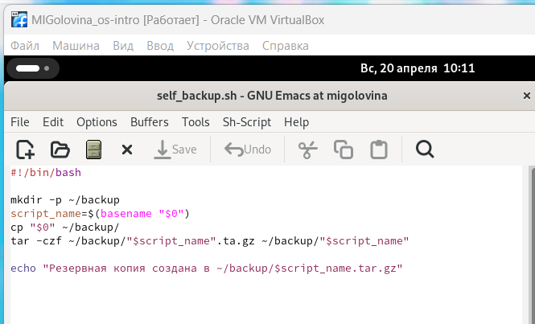
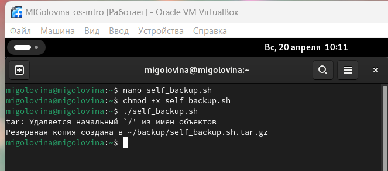
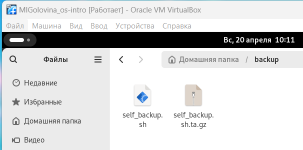
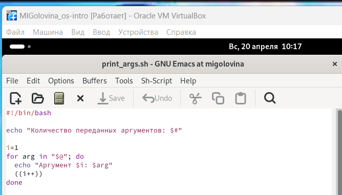
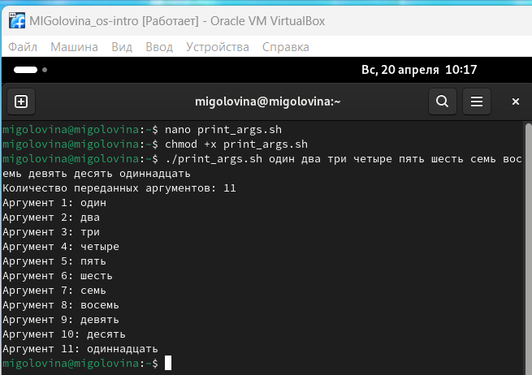
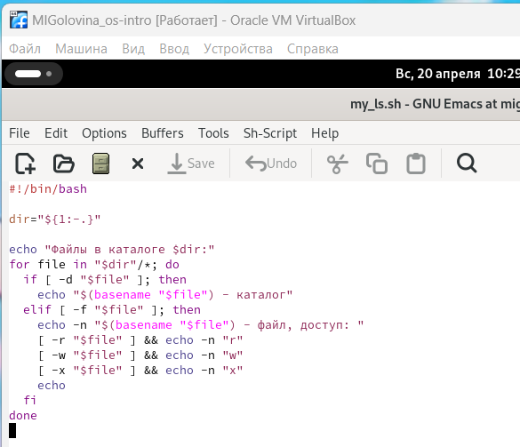
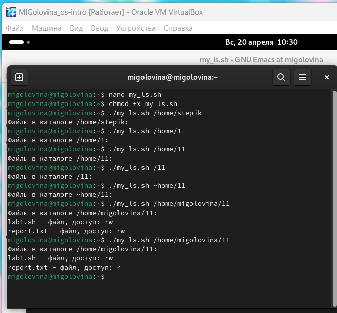
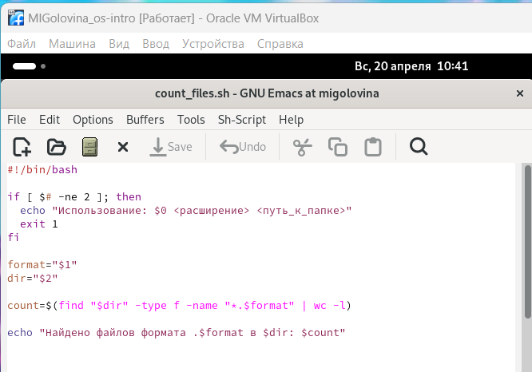
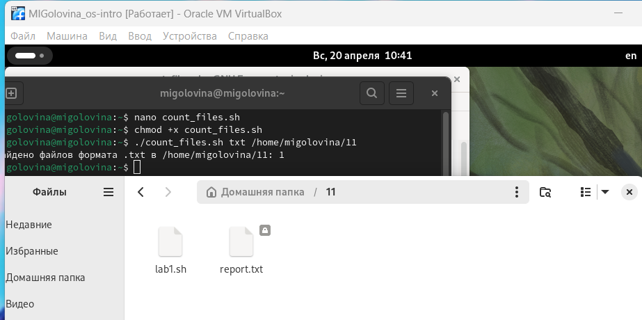

---
## Front matter
title: "Лабораторная работа 12"
subtitle: "Программирование в командном процессоре OC UNIX. Командные файлы."
author: "Головина Мария Игоревна"

## Generic otions
lang: ru-RU
toc-title: "Содержание"

## Bibliography
bibliography: bib/cite.bib
csl: pandoc/csl/gost-r-7-0-5-2008-numeric.csl

## Pdf output format
toc: true # Table of contents
toc-depth: 2
lof: true # List of figures
lot: true # List of tables
fontsize: 12pt
linestretch: 1.5
papersize: a4
documentclass: scrreprt
## I18n polyglossia
polyglossia-lang:
  name: russian
  options:
	- spelling=modern
	- babelshorthands=true
polyglossia-otherlangs:
  name: english
## I18n babel
babel-lang: russian
babel-otherlangs: english
## Fonts
mainfont: IBM Plex Serif
romanfont: IBM Plex Serif
sansfont: IBM Plex Sans
monofont: IBM Plex Mono
mathfont: STIX Two Math
mainfontoptions: Ligatures=Common,Ligatures=TeX,Scale=0.94
romanfontoptions: Ligatures=Common,Ligatures=TeX,Scale=0.94
sansfontoptions: Ligatures=Common,Ligatures=TeX,Scale=MatchLowercase,Scale=0.94
monofontoptions: Scale=MatchLowercase,Scale=0.94,FakeStretch=0.9
mathfontoptions:
## Biblatex
biblatex: true
biblio-style: "gost-numeric"
biblatexoptions:
  - parentracker=true
  - backend=biber
  - hyperref=auto
  - language=auto
  - autolang=other*
  - citestyle=gost-numeric
## Pandoc-crossref LaTeX customization
figureTitle: "Рис."
tableTitle: "Таблица"
listingTitle: "Листинг"
lofTitle: "Список иллюстраций"
lotTitle: "Список таблиц"
lolTitle: "Листинги"
## Misc options
indent: true
header-includes:
  - \usepackage{indentfirst}
  - \usepackage{float} # keep figures where there are in the text
  - \floatplacement{figure}{H} # keep figures where there are in the text
---

# Цель работы

Изучить основы программирования в оболочке ОС UNIX/Linux. Научиться писать небольшие командные файлы.

# Задание

1. Написать скрипт, который при запуске будет делать резервную копию самого себя (то есть файла, в котором содержится его исходный код) в другую директорию backup в вашем домашнем каталоге. При этом файл должен архивироваться одним из архиваторов на выбор zip, bzip2 или tar. Способ использования команд архивации необходимо узнать, изучив справку.
2. Написать пример командного файла, обрабатывающего любое произвольное число аргументов командной строки, в том числе превышающее десять. Например, скрипт может последовательно распечатывать значения всех переданных аргументов.
3. Написать командный файл — аналог команды ls (без использования самой этой команды и команды dir). Требуется, чтобы он выдавал информацию о нужном каталоге и выводил информацию о возможностях доступа к файлам этого каталога.
4. Написать командный файл, который получает в качестве аргумента командной строки формат файла (.txt, .doc, .jpg, .pdf и т.д.) и вычисляет количество таких файлов в указанной директории. Путь к директории также передаётся в виде аргумента командной строки.
5. Ответить на контрольные вопросы.

# Теоретическое введение

Командный процессор (командная оболочка, интерпретатор команд shell) — это программа, позволяющая пользователю взаимодействовать с операционной системой компьютера. В операционных системах типа UNIX/Linux наиболее часто используются следующие реализации командных оболочек:
    • оболочка Борна (Bourne shell или sh) — стандартная командная оболочка UNIX/Linux, содержащая базовый, но при этом полный набор функций;
    • С-оболочка (или csh) — надстройка на оболочкой Борна, использующая С-подобный синтаксис команд с возможностью сохранения истории выполнения команд;
    • оболочка Корна (или ksh) — напоминает оболочку С, но операторы управления программой совместимы с операторами оболочки Борна;
    • BASH — сокращение от Bourne Again Shell (опять оболочка Борна), в основе своей совмещает свойства оболочек С и Корна (разработка компании Free Software Foundation). 
POSIX (Portable Operating System Interface for Computer Environments) — набор стандартов описания интерфейсов взаимодействия операционной системы и прикладных программ. Стандарты POSIX разработаны комитетом IEEE (Institute of Electrical and Electronics Engineers) для обеспечения совместимости различных UNIX/Linux-подобных операционных систем и переносимости прикладных программ на уровне исходного кода.
POSIX-совместимые оболочки разработаны на базе оболочки Корна.

Командный процессор bash обеспечивает возможность использования переменных типа строка символов. Имена переменных могут быть выбраны пользователем. Пользователь имеет возможность присвоить переменной значение некоторой строки символов. 

Оболочка bash поддерживает встроенные арифметические функции. Команда let является показателем того, что последующие аргументы представляют собой выражение, подлежащее вычислению. Простейшее выражение — это единичный терм (term), обычно целочисленный.

Целые числа можно записывать как последовательность цифр или в любом базовом формате типа radix\#number, где radix (основание системы счисления) — любое число не более 26. Для большинства команд используются следующие основания систем исчисления: 2 (двоичная), 8 (восьмеричная) и 16 (шестнадцатеричная). Простейшими математическими выражениями являются сложение (+), вычитание (-), умножение (*), целочисленное деление (/) и целочисленный остаток от деления (%).

Команда let берет два операнда и присваивает их переменной. Положительным моментом команды let можно считать то, что для идентификации переменной ей не нужен знак доллара. 

Последовательность команд может быть помещена в текстовый файл. Такой файл называется командным. 

При вызове командного файла на выполнение параметры ему могут быть переданы точно таким же образом, как и выполняемой программе. С точки зрения командного файла эти параметры являются позиционными. Символ $ является метасимволом командного процессора. Он используется, в частности, для ссылки на параметры, точнее, для получения их значений в командном файле. 

Весьма необходимой при программировании является команда getopts, которая осуществляет синтаксический анализ командной строки, выделяя флаги, и используется для объявления переменных. 

Флаги — это опции командной строки, обычно помеченные знаком минус.

Строка опций option-string — это список возможных букв и чисел соответствующего флага. Если ожидается, что некоторый флаг будет сопровождаться некоторым аргументом, то за символом, обозначающим этот флаг, должно следовать двоеточие. 

Часто бывает необходимо обеспечить проведение каких-либо действий циклически и управление дальнейшими действиями в зависимости от результатов проверки некоторого условия. Для решения подобных задач язык программирования bash предоставляет возможность использовать такие управляющие конструкции, как for, case, if и while.

Более подробно о Linux см. в [1-7]

# Выполнение лабораторной работы

1. Написала скрипт, который при запуске будет делать резервную копию самого себя (то есть файла, в котором содержится его исходный код) в другую директорию backup в вашем домашнем каталоге (рис. 4.1).

{#fig:001 width=70%}

2. Запустила скрипт №1 (рис. 4.2). 

{#fig:002 width=70%}

3. Резервная копия самого себя в директории backup в моём домашнем каталоге (рис. 4.3). 

{#fig:003 width=70%}

4. Написала скрипт, обрабатывающий любое произвольное число аргументов командной строки, в том числе превышающее десять (рис. 4.4). 

{#fig:004 width=70%}

5. Запустила скрипт №2 (рис. 4.5). 

{#fig:005 width=70%}

6. Написала командный файл — аналог команды ls (рис. 4.6). 

{#fig:006 width=70%}

7. Запустила скрипт №3 (рис. 4.7). 

{#fig:007 width=70%}

8. Написала командный файл, который получает в качестве аргумента командной строки формат файла (.txt, .doc, .jpg, .pdf и т.д.) и вычисляет количество таких файлов в указанной директории.  (рис. 4.8). 

{#fig:08 width=70%}

9. Запустила скрипт №4 (рис. 4.9). 

{#fig:009 width=70%}

# Ответы на контрольные вопросы

1. Объясните понятие командной оболочки. Приведите примеры командных оболочек. Чем они отличаются?

Командный процессор (командная оболочка, интерпретатор команд shell) — это программа, позволяющая пользователю взаимодействовать с операционной системой компьютера. В операционных системах типа UNIX/Linux наиболее часто используются следующие реализации командных оболочек:

• оболочка Борна (Bourne shell или sh) — стандартная командная оболочка UNIX/Linux, содержащая базовый, но при этом полный набор функций;

• С-оболочка (или csh) — надстройка на оболочкой Борна, использующая С-подобный синтаксис команд с возможностью сохранения истории выполнения команд;

• оболочка Корна (или ksh) — напоминает оболочку С, но операторы управления программой совместимы с операторами оболочки Борна;

• BASH — сокращение от Bourne Again Shell (опять оболочка Борна), в основе своей совмещает свойства оболочек С и Корна (разработка компании Free Software Foundation).

2. Что такое POSIX?

POSIX (Portable Operating System Interface for Computer Environments) — набор стандартов описания интерфейсов взаимодействия операционной системы и прикладных программ

3. Как определяются переменные и массивы в языке программирования bash?

mark=/usr/andy/bin

Данная команда присваивает значение строки символов /usr/andy/bin переменной mark типа строкасимволов. Для создания массива используется команда set с флагом -A. За флагом следует имя переменной, а затем список значений, разделённых пробелами. Например, set -A states Delaware Michigan "New Jersey"

4. Каково назначение операторов let и read?

Команда let является показателем того, что последующие аргументы представляют собой выражение, подлежащее вычислению. Команда read позволяет читать значения переменных со стандартного ввода

5. Какие арифметические операции можно применять в языке программирования bash?

Простейшими математическими выражениями являются сложение (+), вычитание (-), умножение (*), целочисленное деление (/) и целочисленный остаток от деления (%).

6. Что означает операция (( ))?

Для облегчения программирования можно записывать условия оболочки bash в двойные скобки — (( )).

7. Какие стандартные имена переменных Вам известны?

Переменные PS1 и PS2 предназначены для отображения промптера командного процессора. PS1 — это промптер командного процессора, по умолчанию его значение равно символу $ или #. Если какая-то интерактивная программа, запущенная командным процессором, требует ввода, то используется промптер PS2. Он по умолчанию имеет значение символа >. Другие стандартные переменные:

• HOME — имя домашнего каталога пользователя. Если команда cd вводится без аргументов, то происходит переход в каталог, указанный в этой переменной.

• IFS — последовательность символов, являющихся разделителями в командной строке,например, пробел, табуляция и перевод строки (new line).

• MAIL — командный процессор каждый раз перед выводом на экран промптера проверяет содержимое файла, имя которого указано в этой переменной, и если содержимое этого файла изменилось с момента последнего ввода из него, то перед тем как вывести на терминал промптер, командный процессор выводит на терминал сообщение You have mail (у Вас есть почта).

• TERM — тип используемого терминала.

• LOGNAME — содержит регистрационное имя пользователя, которое устанавливается автоматически при входе в систему.

8. Что такое метасимволы?

Такие символы, как ’ < > * ? | ” &, являются метасимволами и имеют для командного процессора специальный смысл

9. Как экранировать метасимволы?

Снятие специального смысла с метасимвола называется экранированием метасимвола. Экранирование может быть осуществлено с помощью предшествующего метасимволу символа , который, в свою очередь, является метасимволом.

10. Как создавать и запускать командные файлы?

Командный файл можно создать с помощьб какого-либо редактора, затем сделать его исполняемым и запустить его из терминала, введя “./название файла”.

11. Как определяются функции в языке программирования bash?

С помощью ключевого слова function.

12. Каким образом можно выяснить, является файл каталогом или обычным файлом?

Вводим команду ls -lrt и если первым в правах доступа стоит d то это каталог. Иначе это файл

13. Каково назначение команд set, typeset и unset?

Для создания массива используется команда set с флагом -A. Если использовать typeset -i для объявления и присвоения переменной, то при последующем её применении она станет целой. Изъять переменную из программы можно с помощью команды unset.

14. Как передаются параметры в командные файлы?

При вызове командного файла на выполнение параметры ему могут быть переданы точно таким же образом, как и выполняемой программе. С точки зрения командного файла эти параметры являются позиционными. Символ $ является метасимволом командного процессора. Он используется, в частности, для ссылки на параметры, точнее, для получения их значений в командном файле. В командный файл можно передать до девяти параметров.

15. Назовите специальные переменные языка bash и их назначение.

• $* — отображается вся командная строка или параметры оболочки;

• $? — код завершения последней выполненной команды;

• $$ — уникальный идентификатор процесса, в рамках которого выполняется командный процессор;

• $! — номер процесса, в рамках которого выполняется последняя вызванная на выполнение в командном режиме команда;

• $- — значение флагов командного процессора;

• ${#} — возвращает целое число — количество слов, которые были результатом $;

• ${#name} — возвращает целое значение длины строки в переменной name;

• ${name[n]} — обращение к n-му элементу массива;

• ${name[*]} — перечисляет все элементы массива, разделённые пробелом;

• ${name[@]} — то же самое, но позволяет учитывать символы пробелы в самих переменных;

• ${name:-value} — если значение переменной name не определено, то оно будет заменено на указанное value;

• ${name:value} — проверяется факт существования переменной;

• ${name=value} — если name не определено, то ему присваивается значение value;

• ${name?value} — останавливает выполнение, если имя переменной не определено, и выводит value как сообщение об ошибке;

• ${name+value} — это выражение работает противоположно ${name-value}. Если переменная определена, то подставляется value;

• ${name#pattern} — представляет значение переменной name с удалённым самым коротким левым образцом (pattern);

• ${#name[*]} и ${#name[@]} — эти выражения возвращают количество элементов в массиве name.

# Выводы

Я изучила основы программирования в оболочке ОС UNIX/Linux. Научилась писать небольшие командные файлы.

# Список литературы{.unnumbered}

1. Dash, P. Getting Started with Oracle VM VirtualBox / P. Dash. – Packt Publishing Ltd, 2013. – 86 сс.
2. Colvin, H. VirtualBox: An Ultimate Guide Book on Virtualization with VirtualBox. VirtualBox / H. Colvin. – CreateSpace Independent Publishing Platform, 2015. – 70 сс.
3.  Vugt, S. van. Red Hat RHCSA/RHCE 7 cert guide : Red Hat Enterprise Linux 7 (EX200 and EX300) : Certification Guide. Red Hat RHCSA/RHCE 7 cert guide / S. van Vugt. – Pearson IT Certification, 2016. – 1008 сс.
4. Робачевский, А. Операционная система UNIX / А. Робачевский, С. Немнюгин, О. Стесик. – 2-е изд. – Санкт-Петербург : БХВ-Петербург, 2010. – 656 сс.
5. Немет, Э. Unix и Linux: руководство системного администратора. Unix и Linux / Э. Немет, Г. Снайдер, Т.Р. Хейн, Б. Уэйли. – 4-е изд. – Вильямс, 2014. – 1312 сс.
6. Колисниченко, Д.Н. Самоучитель системного администратора Linux : Системный администратор / Д.Н. Колисниченко. – Санкт-Петербург : БХВ-Петербург, 2011. – 544 сс.
7. Robbins, A. Bash Pocket Reference / A. Robbins. – O’Reilly Media, 2016. – 156 сс.

::: {#refs}
:::
