---
## Front matter
lang: ru-RU
title: Лабораторнaя работа №13
subtitle: Программирование в командном процессоре ОС UNIX. Ветвления и циклы.
author:
  - Головина М.И.
institute:
  - Российский университет дружбы народов, Москва, Россия
  - Факультет Физико-математических и естественных наук
date: 10 мая 2025

## i18n babel
babel-lang: russian
babel-otherlangs: english

## Formatting pdf
toc: false
toc-title: Содержание
slide_level: 2
aspectratio: 169
section-titles: true
theme: metropolis
header-includes:
 - \metroset{progressbar=frametitle,sectionpage=progressbar,numbering=fraction}
 - '\makeatletter'
 - '\beamer@ignorenonframefalse'
 - '\makeatother'
---

# Информация

## Докладчик

:::::::::::::: {.columns align=center}
::: {.column width="70%"}

  * Головина Мария Игоревна
  * Бакалавр направления подготовки Математика и механика
  * студентка группы НММбд - 02- 24
  * Российский университет дружбы народов
  * [1132246810@pfur.ru](mailto:1132246810@pfur.ru)

:::
::: {.column width="30%"}

:::
::::::::::::::

## Цель

- Изучить основы программирования в оболочке ОС UNIX. Научится писать более сложные командные файлы с использованием логических управляющих конструкций и циклов.
  
## Задание

1. Используя команды getopts grep, написать командный файл, который анализирует командную строку, а затем ищет в указанном файле нужные строки.
2. Написать на языке Си программу, которая вводит число и определяет, является ли оно больше нуля, меньше нуля или равно нулю. Затем программа завершается с помощью функции exit(n), передавая информацию в о коде завершения в оболочку. 
3. Написать командный файл, создающий указанное число файлов, пронумерованных последовательно от 1 до N.
4. Написать командный файл, который с помощью команды tar запаковывает в архив все файлы в указанной директории. Модифицировать его так, чтобы запаковывались только те файлы, которые были изменены менее недели тому назадю.
5. Ответить на контрольные вопросы.

# Ход работы

## Скрипт №1
::::::::::::: {.columns align=center}
::: {.column width="40%"}
Используя команды getopts grep, написала командный файл, который анализирует командную строку, а затем ищет в указанном файле нужные строки
:::
::: {.column width="60%"}

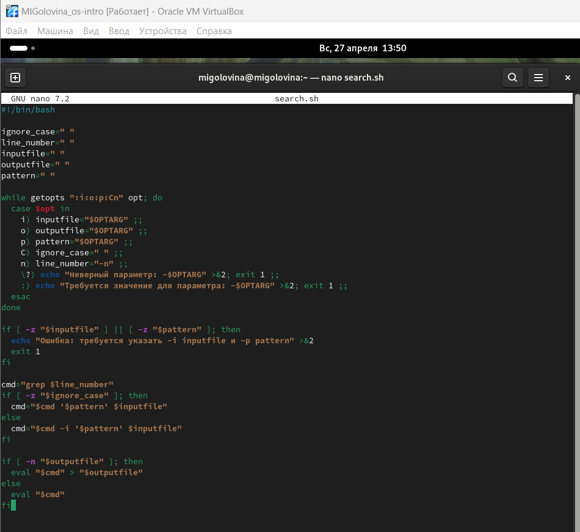

:::
::::::::::::::

## Запуск
::::::::::::: {.columns align=center}
::: {.column width="40%"}
Запустила скрипт №1 
:::
::: {.column width="60%"}

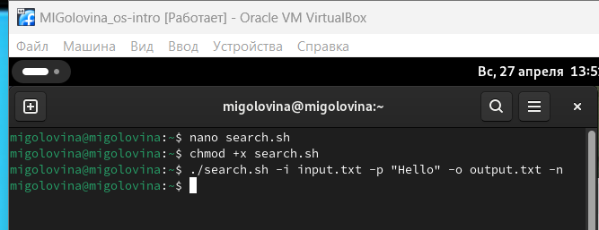

:::
::::::::::::::

## Проверка
::::::::::::: {.columns align=center}
::: {.column width="40%"}
Проверила правильность работы скрипта №1
:::
::: {.column width="60%"}

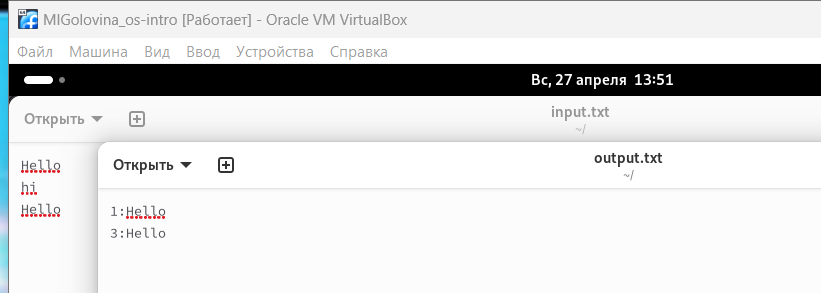

:::
::::::::::::::

## Скрипт №2
::::::::::::: {.columns align=center}
::: {.column width="40%"}
Написала на языке Си программу, которая вводит число и определяет, является ли оно больше нуля, меньше нуля или равно нулю
:::
::: {.column width="60%"}

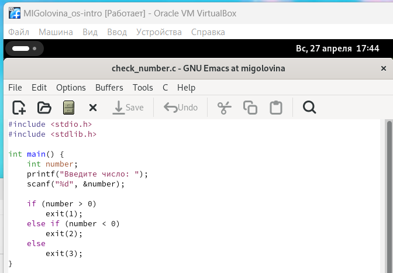

:::
::::::::::::::

## Скрипт №2
::::::::::::: {.columns align=center}
::: {.column width="40%"}
Затем написала программу, которая завершается с помощью функции exit(n), передавая информацию в о коде завершения в оболочку
:::
::: {.column width="60%"}

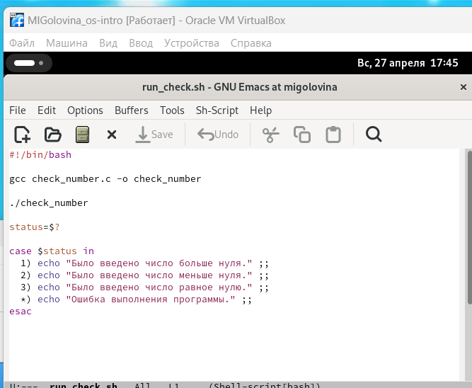

:::
::::::::::::::

## Запуск
::::::::::::: {.columns align=center}
::: {.column width="40%"}
Запустила скрипт №2
:::
::: {.column width="60%"}

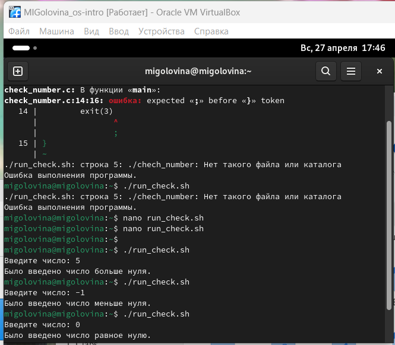

:::
::::::::::::::

## Скрипт №3
::::::::::::: {.columns align=center}
::: {.column width="40%"}
Написала командный файл, создающий указанное число файлов, пронумерованных последовательно от 1 до N
:::
::: {.column width="60%"}

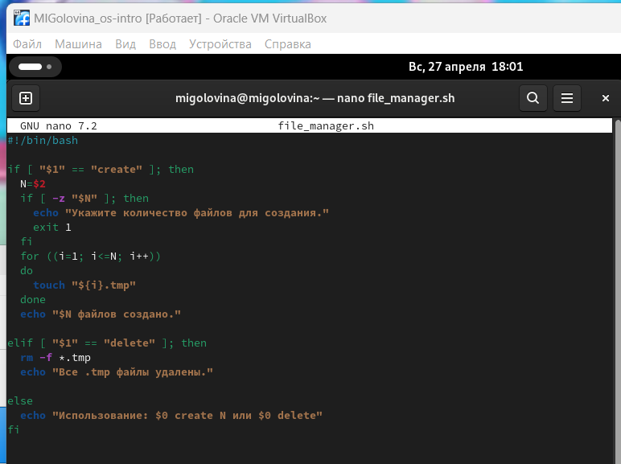

:::
::::::::::::::

## Запуск
::::::::::::: {.columns align=center}
::: {.column width="40%"}
Запустила скрипт №3 с созданием файлов
:::
::: {.column width="60%"}

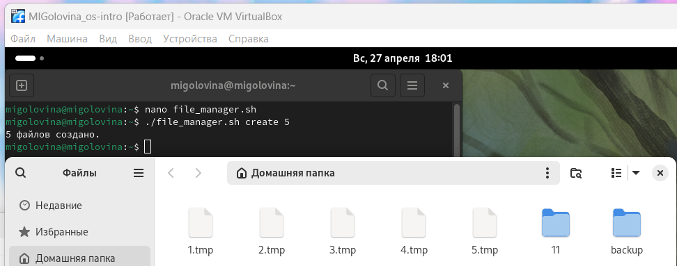

:::
::::::::::::::

## Запуск
::::::::::::: {.columns align=center}
::: {.column width="40%"}
Запустила скрипт №3 с удалением файлов
:::
::: {.column width="60%"}

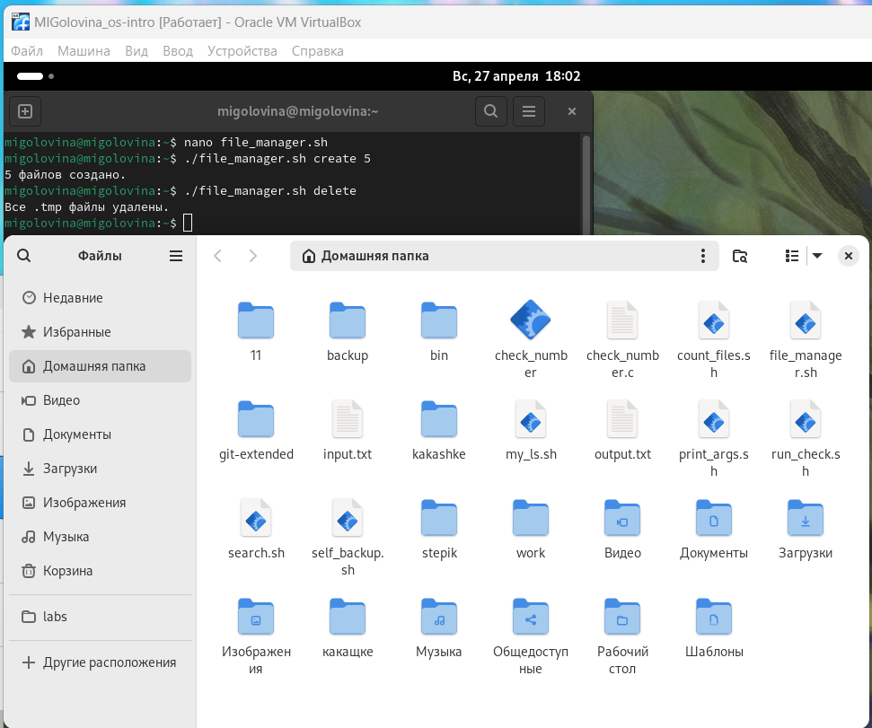

:::
::::::::::::::

## Скрипт №4
::::::::::::: {.columns align=center}
::: {.column width="40%"}
Написала командный файл, который с помощью команды tar запаковывает в архив все файлы в указанной директории
:::
::: {.column width="60%"}

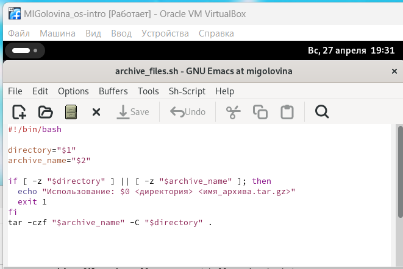

:::
::::::::::::::

## Запуск
::::::::::::: {.columns align=center}
::: {.column width="40%"}
Проверила правильность работы скрипта №4
:::
::: {.column width="60%"}

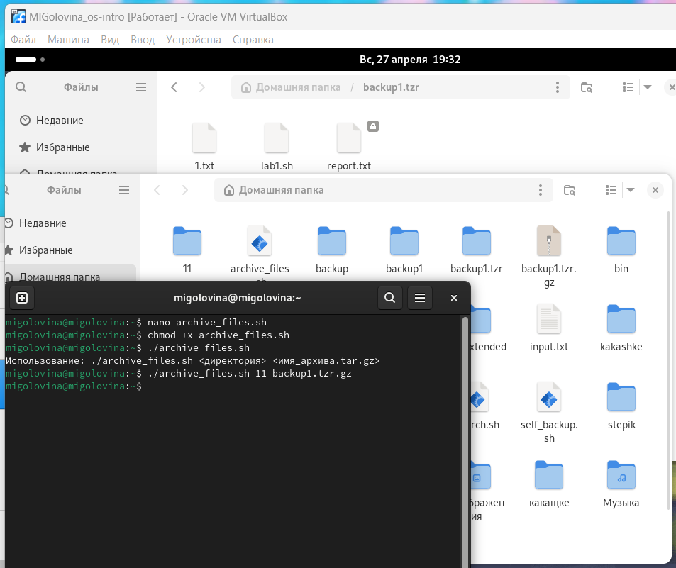

:::
::::::::::::::

## Модифицированный скрипт №4
::::::::::::: {.columns align=center}
::: {.column width="40%"}
Модифицировала его так, чтобы запаковывались только те файлы, которые были изменены менее недели тому назад
:::
::: {.column width="60%"}

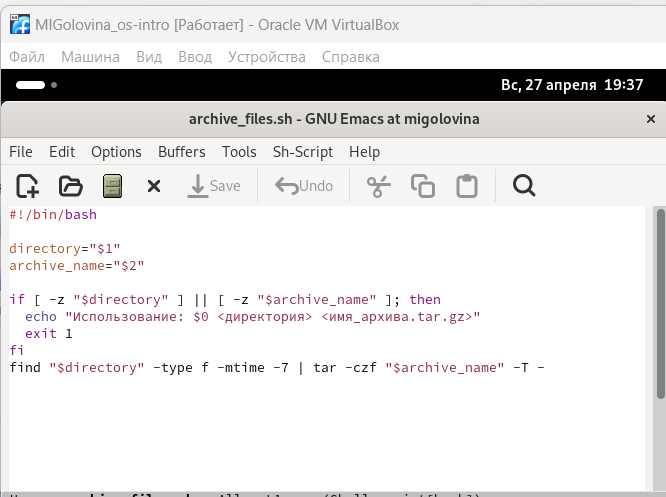

:::
::::::::::::::

## Запуск
::::::::::::: {.columns align=center}
::: {.column width="40%"}
Проверила правильность работы модифицированного скрипта №4
:::
::: {.column width="60%"}

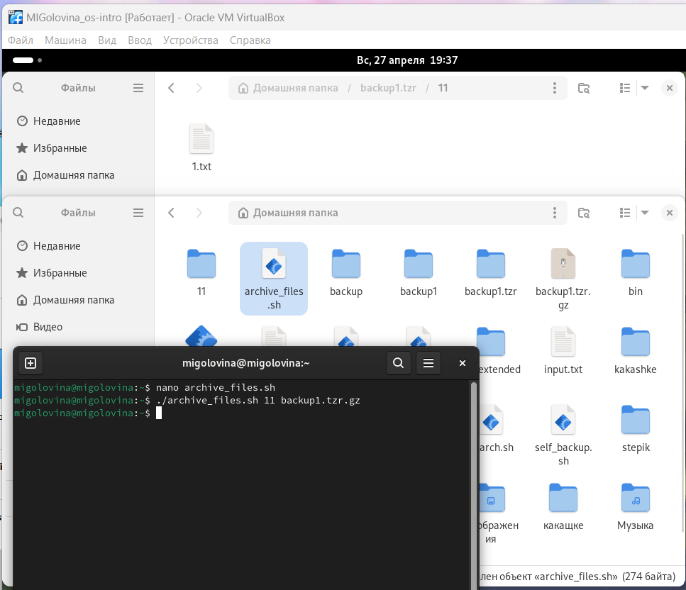

:::
::::::::::::::

# Ответы на контрольные вопросы

1. Каково предназначение команды getopts?

Команда getopts в Bash используется для разбора и обработки опций (аргументов) командной строки, переданных скрипту или функции. Она позволяет удобно управлять флагами и параметрами, которые пользователь может указать при запуске скрипта.

Вот основные аспекты предназначения и использования getopts:

1. Обработка опций getopts позволяет обрабатывать короткие (один символ) и длинные (более одного символа) опции, что делает интерфейс вашего скрипта более удобным и понятным.

2. Синтаксис

Основной синтаксис команды выглядит следующим образом:

getopts "options" variable

options: строка, содержащая допустимые опции. Если опция принимает аргумент, после нее указывается двоеточие (:).

variable: переменная, в которую будет записываться текущая опция.

3. Переменные

$OPTARG: содержит значение аргумента для опции, если опция требует аргумента.

$OPTIND: индекс следующего аргумента, который будет обработан. Полезно, если вы хотите продолжить обработку аргументов после завершения getopts.

4. Преимущества использования getopts

Упрощение кода: Позволяет легко обрабатывать множество опций без необходимости писать сложные конструкции.

Универсальность: Поддерживает как обязательные, так и необязательные аргументы для опций.

Стандартизация: Использование getopts делает скрипт более стандартным и понятным для пользователей.

2. Какое отношение метасимволы имеют к генерации имён файлов?

Метасимволы играют ключевую роль в генерации имен файлов в оболочке Unix/Linux, включая Bash. Они позволяют использовать шаблоны и упрощают работу с файлами и каталогами. Вот основные метасимволы и их влияние на генерацию имен файлов:

1. Звездочка (*)

Звездочка представляет собой любой набор символов, включая пустую строку. Она позволяет выбирать файлы и каталоги с любыми именами.

2. Вопросительный знак (?)

Вопросительный знак соответствует любому одному символу. Это полезно, когда нужно указать точное количество символов.

3. Квадратные скобки ([])

Квадратные скобки позволяют указать диапазон символов или конкретные символы, которые могут находиться на данном месте.

4. Фигурные скобки ({})

Фигурные скобки позволяют создавать наборы имен файлов, что удобно для генерации нескольких файлов с похожими именами.

5. Обратная косая черта (\)

Обратная косая черта используется для экранирования метасимволов, позволяя использовать их как обычные символы.

3. Какие операторы управления действиями вы знаете?

В Bash и других языках программирования операторы управления действиями (или операторы управления потоком) позволяют изменять порядок выполнения инструкций в программе. 

Основные операторы, которые вы можете использовать в Bash:

1. Условные операторы

if: Позволяет выполнять блок кода, если условие истинно.

case: Используется для проверки переменной на соответствие нескольким значениям.

2. Циклы

for: Позволяет выполнять блок кода для каждого элемента в списке.

while: Выполняет блок кода, пока условие истинно.

until: Выполняет блок кода, пока условие ложно.

3. Операторы перехода

break: Прерывает выполнение цикла.

continue: Пропускает текущую итерацию цикла и переходит к следующей.

4. Команды управления

exit: Завершает выполнение скрипта.

exit 0  # 0 - код завершения (успех)

return: Завершает выполнение функции и возвращает значение.

return 1  # возвращает 1 как код ошибки

4. Какие операторы используются для прерывания цикла?

В Bash для прерывания выполнения циклов используются два основных оператора: break и continue. 

1. Оператор break

Оператор break используется для немедленного выхода из цикла. Это означает, что когда break выполняется, выполнение цикла прекращается, и управление передается на следующую инструкцию после цикла.

2. Оператор continue

Оператор continue используется для пропуска текущей итерации цикла и перехода к следующей. Это означает, что если условие для continue истинно, оставшиеся команды в текущей итерации будут пропущены, и выполнение перейдет к следующей итерации цикла.

5. Для чего нужны команды false и true?

Команды true и false в Unix/Linux — это простые утилиты, которые всегда возвращают определённый код завершения, что делает их полезными в различных сценариях. 

1. Команда true

Команда true всегда завершает выполнение с кодом 0, что в Unix/Linux означает успешное выполнение. Это может быть полезно в ситуациях, когда требуется команда, которая всегда "успешна".

2. Команда false

Команда false, напротив, всегда завершает выполнение с кодом 1, что означает неуспех. Это может быть полезно для тестирования условий и обработки ошибок.

6. Что означает строка if test -f mani.$s, встреченная в командном файле?

Введенная строка означает условие существования файла man𝑠/i.$s

7. Объясните различия между конструкциями while и until.
Конструкции while и until в Bash (и других оболочках Unix/Linux) используются для создания циклов, но они работают немного по-разному.

1. Цикл while

Цикл while выполняет блок команд, пока заданное условие истинно (возвращает код 0). Если условие ложно (возвращает код 1), выполнение цикла прекращается.

2. Цикл until

Цикл until, наоборот, выполняет блок команд, пока заданное условие ложно (возвращает код 1). Как только условие становится истинным (возвращает код 0), выполнение цикла прекращается.

while используется, когда нужно продолжать выполнение, пока условие выполняется.

until используется, когда нужно продолжать выполнение, пока условие не выполняется.

# Вывод
## Заключение

Я изучила основы программирования в оболочке ОС UNIX. Научилась писать более сложные командные файлы с использованием логических управляющих конструкций и циклов.

# Дорогу осилит идущий

