---
## Front matter
title: "Лабораторная работа 13"
subtitle: "Программирование в командном процессоре ОС UNIX. Ветвления и циклы"
author: "Головина Мария Игоревна"

## Generic otions
lang: ru-RU
toc-title: "Содержание"

## Bibliography
bibliography: bib/cite.bib
csl: pandoc/csl/gost-r-7-0-5-2008-numeric.csl

## Pdf output format
toc: true # Table of contents
toc-depth: 2
lof: true # List of figures
lot: true # List of tables
fontsize: 12pt
linestretch: 1.5
papersize: a4
documentclass: scrreprt
## I18n polyglossia
polyglossia-lang:
  name: russian
  options:
	- spelling=modern
	- babelshorthands=true
polyglossia-otherlangs:
  name: english
## I18n babel
babel-lang: russian
babel-otherlangs: english
## Fonts
mainfont: IBM Plex Serif
romanfont: IBM Plex Serif
sansfont: IBM Plex Sans
monofont: IBM Plex Mono
mathfont: STIX Two Math
mainfontoptions: Ligatures=Common,Ligatures=TeX,Scale=0.94
romanfontoptions: Ligatures=Common,Ligatures=TeX,Scale=0.94
sansfontoptions: Ligatures=Common,Ligatures=TeX,Scale=MatchLowercase,Scale=0.94
monofontoptions: Scale=MatchLowercase,Scale=0.94,FakeStretch=0.9
mathfontoptions:
## Biblatex
biblatex: true
biblio-style: "gost-numeric"
biblatexoptions:
  - parentracker=true
  - backend=biber
  - hyperref=auto
  - language=auto
  - autolang=other*
  - citestyle=gost-numeric
## Pandoc-crossref LaTeX customization
figureTitle: "Рис."
tableTitle: "Таблица"
listingTitle: "Листинг"
lofTitle: "Список иллюстраций"
lotTitle: "Список таблиц"
lolTitle: "Листинги"
## Misc options
indent: true
header-includes:
  - \usepackage{indentfirst}
  - \usepackage{float} # keep figures where there are in the text
  - \floatplacement{figure}{H} # keep figures where there are in the text
---

# Цель работы

Изучить основы программирования в оболочке ОС UNIX. Научится писать более сложные командные файлы с использованием логических управляющих конструкций и циклов.

# Задание

1. Используя команды getopts grep, написать командный файл, который анализирует командную строку, а затем ищет в указанном файле нужные строки.
2. Написать на языке Си программу, которая вводит число и определяет, является ли оно больше нуля, меньше нуля или равно нулю. Затем программа завершается с помощью функции exit(n), передавая информацию в о коде завершения в оболочку. 
3. Написать командный файл, создающий указанное число файлов, пронумерованных последовательно от 1 до N.
4. Написать командный файл, который с помощью команды tar запаковывает в архив все файлы в указанной директории. Модифицировать его так, чтобы запаковывались только те файлы, которые были изменены менее недели тому назадю.
5. Ответить на контрольные вопросы.

# Теоретическое введение

Командный процессор (командная оболочка, интерпретатор команд shell) — это программа, позволяющая пользователю взаимодействовать с операционной системой компьютера. В операционных системах типа UNIX/Linux наиболее часто используются следующие реализации командных оболочек:
    • оболочка Борна (Bourne shell или sh) — стандартная командная оболочка UNIX/Linux, содержащая базовый, но при этом полный набор функций;
    • С-оболочка (или csh) — надстройка на оболочкой Борна, использующая С-подобный синтаксис команд с возможностью сохранения истории выполнения команд;
    • оболочка Корна (или ksh) — напоминает оболочку С, но операторы управления программой совместимы с операторами оболочки Борна;
    • BASH — сокращение от Bourne Again Shell (опять оболочка Борна), в основе своей совмещает свойства оболочек С и Корна (разработка компании Free Software Foundation). 
POSIX (Portable Operating System Interface for Computer Environments) — набор стандартов описания интерфейсов взаимодействия операционной системы и прикладных программ. Стандарты POSIX разработаны комитетом IEEE (Institute of Electrical and Electronics Engineers) для обеспечения совместимости различных UNIX/Linux-подобных операционных систем и переносимости прикладных программ на уровне исходного кода.
POSIX-совместимые оболочки разработаны на базе оболочки Корна.

Командный процессор bash обеспечивает возможность использования переменных типа строка символов. Имена переменных могут быть выбраны пользователем. Пользователь имеет возможность присвоить переменной значение некоторой строки символов. 

Оболочка bash поддерживает встроенные арифметические функции. Команда let является показателем того, что последующие аргументы представляют собой выражение, подлежащее вычислению. Простейшее выражение — это единичный терм (term), обычно целочисленный.

Целые числа можно записывать как последовательность цифр или в любом базовом формате типа radix\#number, где radix (основание системы счисления) — любое число не более 26. Для большинства команд используются следующие основания систем исчисления: 2 (двоичная), 8 (восьмеричная) и 16 (шестнадцатеричная). Простейшими математическими выражениями являются сложение (+), вычитание (-), умножение (*), целочисленное деление (/) и целочисленный остаток от деления (%).

Команда let берет два операнда и присваивает их переменной. Положительным моментом команды let можно считать то, что для идентификации переменной ей не нужен знак доллара. 

Последовательность команд может быть помещена в текстовый файл. Такой файл называется командным. 

При вызове командного файла на выполнение параметры ему могут быть переданы точно таким же образом, как и выполняемой программе. С точки зрения командного файла эти параметры являются позиционными. Символ $ является метасимволом командного процессора. Он используется, в частности, для ссылки на параметры, точнее, для получения их значений в командном файле. 

Весьма необходимой при программировании является команда getopts, которая осуществляет синтаксический анализ командной строки, выделяя флаги, и используется для объявления переменных. 

Флаги — это опции командной строки, обычно помеченные знаком минус.

Строка опций option-string — это список возможных букв и чисел соответствующего флага. Если ожидается, что некоторый флаг будет сопровождаться некоторым аргументом, то за символом, обозначающим этот флаг, должно следовать двоеточие. 

Часто бывает необходимо обеспечить проведение каких-либо действий циклически и управление дальнейшими действиями в зависимости от результатов проверки некоторого условия. Для решения подобных задач язык программирования bash предоставляет возможность использовать такие управляющие конструкции, как for, case, if и while.

Более подробно о Linux см. в [1-7]

# Выполнение лабораторной работы

1. Используя команды getopts grep, написала командный файл, который анализирует командную строку, а затем ищет в указанном файле нужные строки (рис. 4.1).

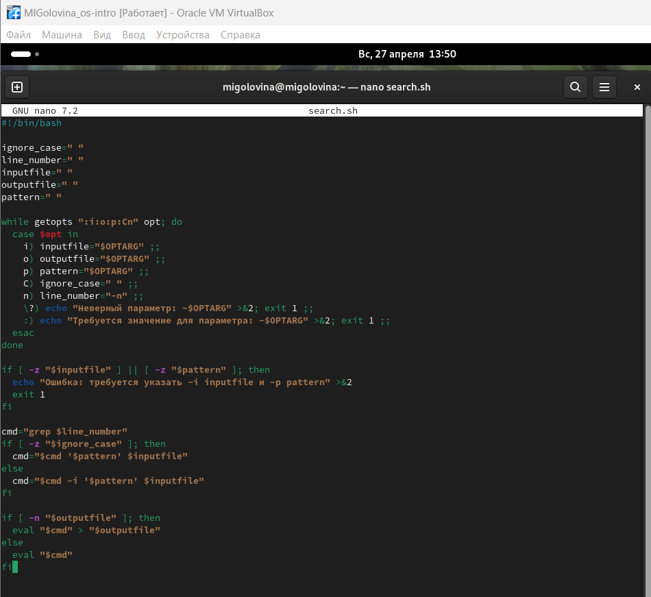{#fig:001 width=70%}

2. Запустила скрипт №1 (рис. 4.2). 

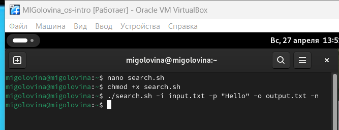{#fig:002 width=70%}

3. Проверила правильность работы скрипта №1 (рис. 4.3).

{#fig:003 width=70%}

4. Написала на языке Си программу, которая вводит число и определяет, является ли оно больше нуля, меньше нуля или равно нулю (рис. 4.4). 

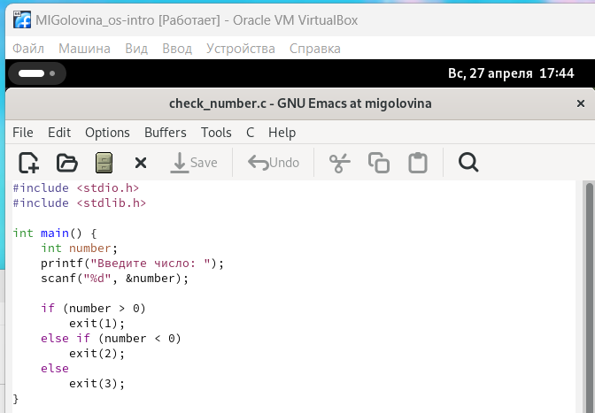{#fig:004 width=70%}

5. Затем написала программу, которая завершается с помощью функции exit(n), передавая информацию в о коде завершения в оболочку (рис. 4.5). 

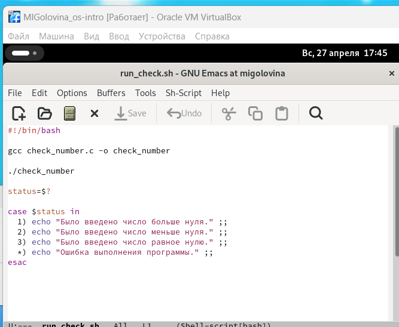{#fig:005 width=70%}

6. Запустила скрипт №2 (рис. 4.6).

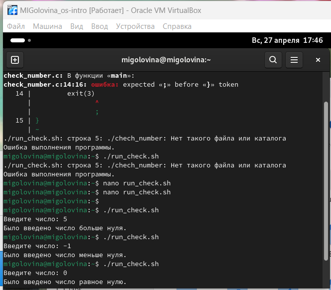{#fig:006 width=70%}

7. Написала командный файл, создающий указанное число файлов, пронумерованных последовательно от 1 до N (рис. 4.7). 

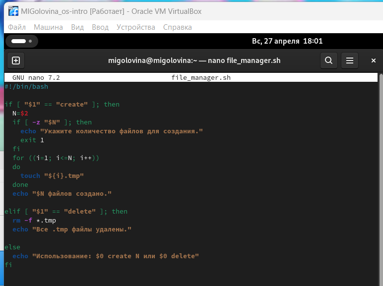{#fig:007 width=70%}

8. Запустила скрипт №3 с созданием файлов (рис. 4.8). 

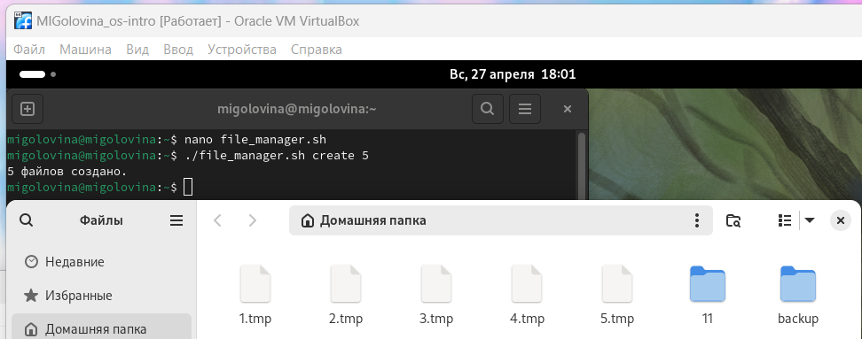{#fig:008 width=70%}

9. Запустила скрипт №3 с удалением файлов (рис. 4.9). 

{#fig:08 width=70%}

10. Написала командный файл, который с помощью команды tar запаковывает в архив все файлы в указанной директории (рис. 4.10). 

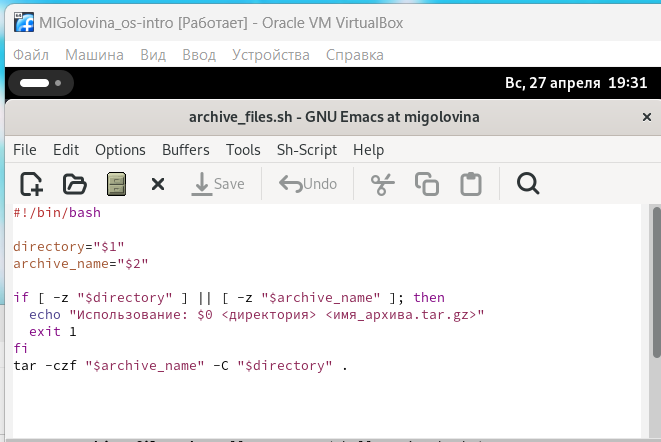{#fig:010 width=70%}

11. Проверила правильность работы скрипта №4 (рис. 4.11). 

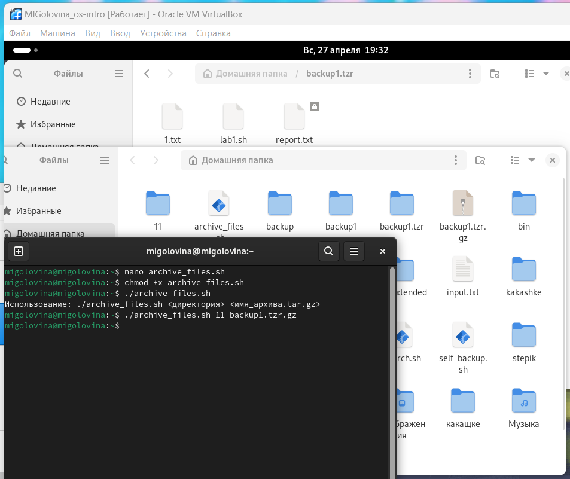{#fig:011 width=70%}

12. Модифицировала его так, чтобы запаковывались только те файлы, которые были изменены менее недели тому назад (рис. 4.12). 

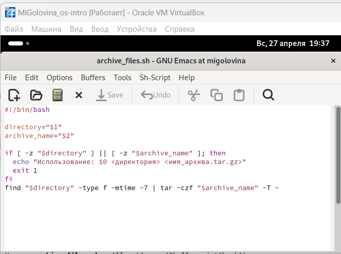{#fig:012 width=70%}

13. Проверила правильность работы модифицированного скрипта №4 (рис. 4.13). 

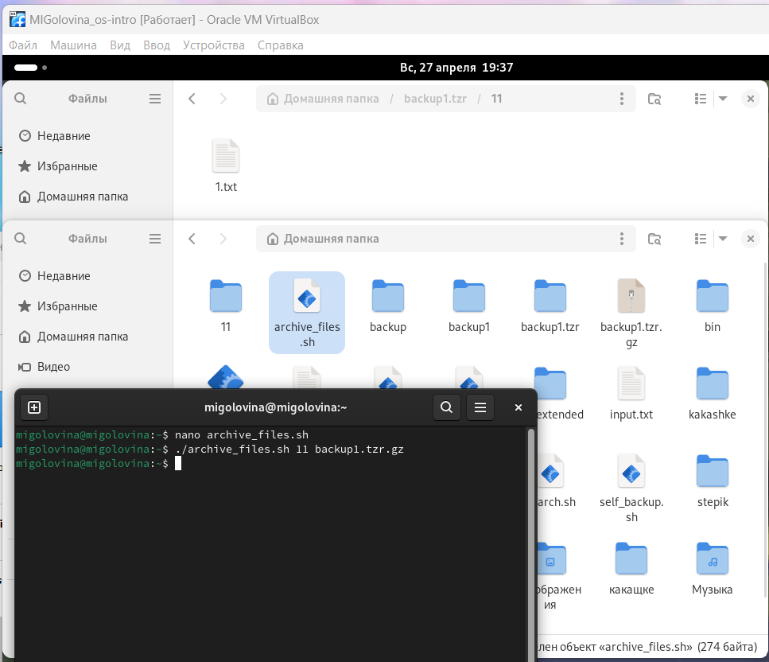{#fig:013 width=70%}

# Ответы на контрольные вопросы

1. Каково предназначение команды getopts?

Команда getopts в Bash используется для разбора и обработки опций (аргументов) командной строки, переданных скрипту или функции. Она позволяет удобно управлять флагами и параметрами, которые пользователь может указать при запуске скрипта.

Вот основные аспекты предназначения и использования getopts:

1. Обработка опций getopts позволяет обрабатывать короткие (один символ) и длинные (более одного символа) опции, что делает интерфейс вашего скрипта более удобным и понятным.

2. Синтаксис

Основной синтаксис команды выглядит следующим образом:

getopts "options" variable

options: строка, содержащая допустимые опции. Если опция принимает аргумент, после нее указывается двоеточие (:).

variable: переменная, в которую будет записываться текущая опция.

3. Переменные

$OPTARG: содержит значение аргумента для опции, если опция требует аргумента.

$OPTIND: индекс следующего аргумента, который будет обработан. Полезно, если вы хотите продолжить обработку аргументов после завершения getopts.

4. Преимущества использования getopts

Упрощение кода: Позволяет легко обрабатывать множество опций без необходимости писать сложные конструкции.

Универсальность: Поддерживает как обязательные, так и необязательные аргументы для опций.

Стандартизация: Использование getopts делает скрипт более стандартным и понятным для пользователей.

2. Какое отношение метасимволы имеют к генерации имён файлов?

Метасимволы играют ключевую роль в генерации имен файлов в оболочке Unix/Linux, включая Bash. Они позволяют использовать шаблоны и упрощают работу с файлами и каталогами. Вот основные метасимволы и их влияние на генерацию имен файлов:

1. Звездочка (*)

Звездочка представляет собой любой набор символов, включая пустую строку. Она позволяет выбирать файлы и каталоги с любыми именами.

2. Вопросительный знак (?)

Вопросительный знак соответствует любому одному символу. Это полезно, когда нужно указать точное количество символов.

3. Квадратные скобки ([])

Квадратные скобки позволяют указать диапазон символов или конкретные символы, которые могут находиться на данном месте.

4. Фигурные скобки ({})

Фигурные скобки позволяют создавать наборы имен файлов, что удобно для генерации нескольких файлов с похожими именами.

5. Обратная косая черта (\)

Обратная косая черта используется для экранирования метасимволов, позволяя использовать их как обычные символы.

3. Какие операторы управления действиями вы знаете?

В Bash и других языках программирования операторы управления действиями (или операторы управления потоком) позволяют изменять порядок выполнения инструкций в программе. 

Основные операторы, которые вы можете использовать в Bash:

1. Условные операторы

if: Позволяет выполнять блок кода, если условие истинно.

case: Используется для проверки переменной на соответствие нескольким значениям.

2. Циклы

for: Позволяет выполнять блок кода для каждого элемента в списке.

while: Выполняет блок кода, пока условие истинно.

until: Выполняет блок кода, пока условие ложно.

3. Операторы перехода

break: Прерывает выполнение цикла.

continue: Пропускает текущую итерацию цикла и переходит к следующей.

4. Команды управления

exit: Завершает выполнение скрипта.

exit 0  # 0 - код завершения (успех)

return: Завершает выполнение функции и возвращает значение.

return 1  # возвращает 1 как код ошибки

4. Какие операторы используются для прерывания цикла?

В Bash для прерывания выполнения циклов используются два основных оператора: break и continue. 

1. Оператор break

Оператор break используется для немедленного выхода из цикла. Это означает, что когда break выполняется, выполнение цикла прекращается, и управление передается на следующую инструкцию после цикла.

2. Оператор continue

Оператор continue используется для пропуска текущей итерации цикла и перехода к следующей. Это означает, что если условие для continue истинно, оставшиеся команды в текущей итерации будут пропущены, и выполнение перейдет к следующей итерации цикла.

5. Для чего нужны команды false и true?

Команды true и false в Unix/Linux — это простые утилиты, которые всегда возвращают определённый код завершения, что делает их полезными в различных сценариях. 

1. Команда true

Команда true всегда завершает выполнение с кодом 0, что в Unix/Linux означает успешное выполнение. Это может быть полезно в ситуациях, когда требуется команда, которая всегда "успешна".

2. Команда false

Команда false, напротив, всегда завершает выполнение с кодом 1, что означает неуспех. Это может быть полезно для тестирования условий и обработки ошибок.

6. Что означает строка if test -f mani.$s, встреченная в командном файле?

Введенная строка означает условие существования файла man𝑠/i.$s

7. Объясните различия между конструкциями while и until.
Конструкции while и until в Bash (и других оболочках Unix/Linux) используются для создания циклов, но они работают немного по-разному.

1. Цикл while

Цикл while выполняет блок команд, пока заданное условие истинно (возвращает код 0). Если условие ложно (возвращает код 1), выполнение цикла прекращается.

2. Цикл until

Цикл until, наоборот, выполняет блок команд, пока заданное условие ложно (возвращает код 1). Как только условие становится истинным (возвращает код 0), выполнение цикла прекращается.

while используется, когда нужно продолжать выполнение, пока условие выполняется.

until используется, когда нужно продолжать выполнение, пока условие не выполняется.

# Выводы

Я изучила основы программирования в оболочке ОС UNIX. Научилась писать более сложные командные файлы с использованием логических управляющих конструкций и циклов.

# Список литературы{.unnumbered}

1. Dash, P. Getting Started with Oracle VM VirtualBox / P. Dash. – Packt Publishing Ltd, 2013. – 86 сс.
2. Colvin, H. VirtualBox: An Ultimate Guide Book on Virtualization with VirtualBox. VirtualBox / H. Colvin. – CreateSpace Independent Publishing Platform, 2015. – 70 сс.
3.  Vugt, S. van. Red Hat RHCSA/RHCE 7 cert guide : Red Hat Enterprise Linux 7 (EX200 and EX300) : Certification Guide. Red Hat RHCSA/RHCE 7 cert guide / S. van Vugt. – Pearson IT Certification, 2016. – 1008 сс.
4. Робачевский, А. Операционная система UNIX / А. Робачевский, С. Немнюгин, О. Стесик. – 2-е изд. – Санкт-Петербург : БХВ-Петербург, 2010. – 656 сс.
5. Немет, Э. Unix и Linux: руководство системного администратора. Unix и Linux / Э. Немет, Г. Снайдер, Т.Р. Хейн, Б. Уэйли. – 4-е изд. – Вильямс, 2014. – 1312 сс.
6. Колисниченко, Д.Н. Самоучитель системного администратора Linux : Системный администратор / Д.Н. Колисниченко. – Санкт-Петербург : БХВ-Петербург, 2011. – 544 сс.
7. Robbins, A. Bash Pocket Reference / A. Robbins. – O’Reilly Media, 2016. – 156 сс.

::: {#refs}
:::
