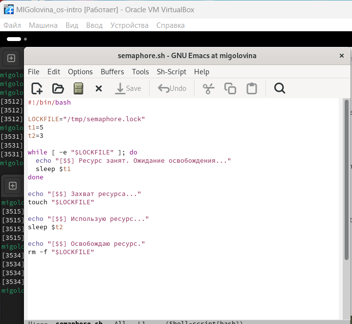
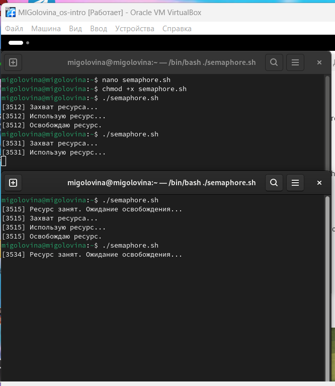
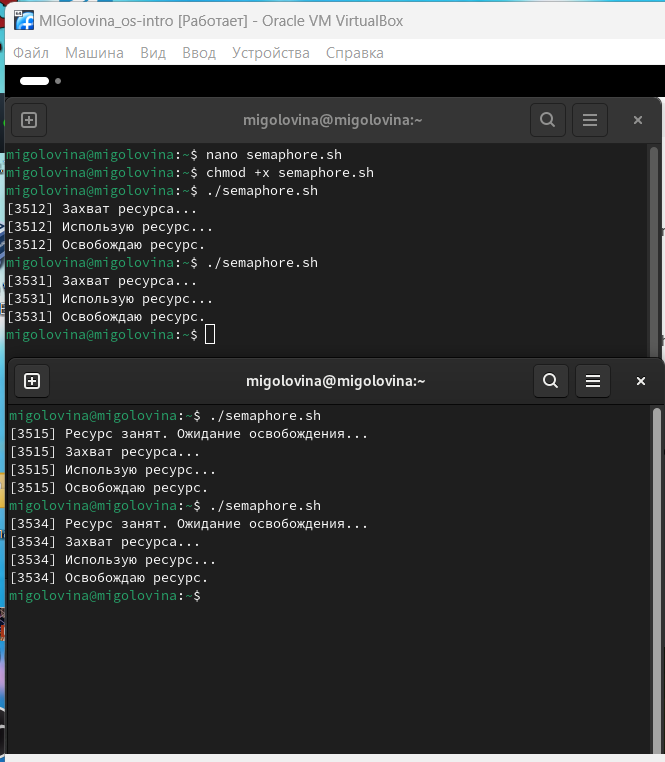
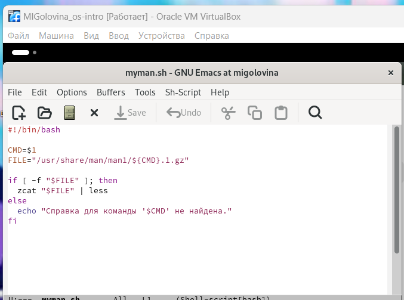
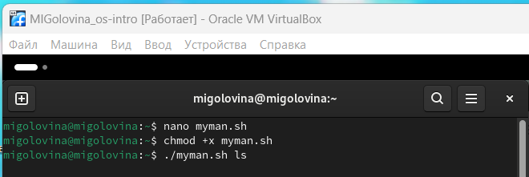
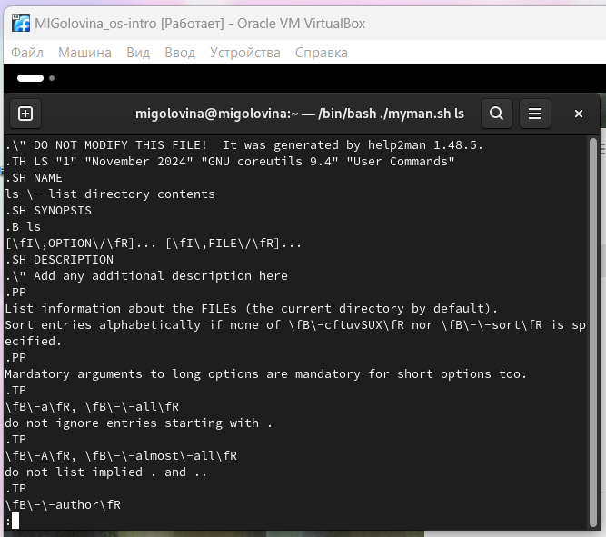
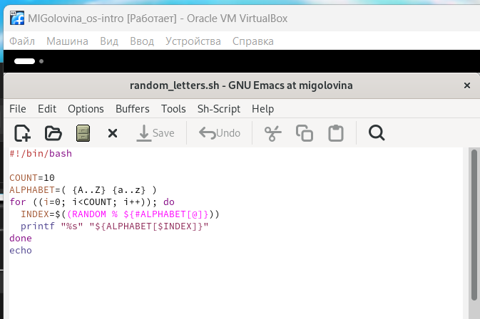
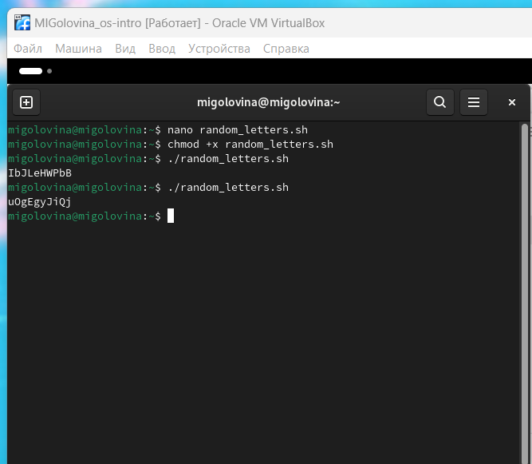

---
## Front matter
lang: ru-RU
title: Лабораторнaя работа №14
subtitle: Программирование в командном процессоре ОС UNIX. Расширенное программирование.
author:
  - Головина М.И.
institute:
  - Российский университет дружбы народов, Москва, Россия
  - Факультет Физико-математических и естественных наук
date: 17 мая 2025

## i18n babel
babel-lang: russian
babel-otherlangs: english

## Formatting pdf
toc: false
toc-title: Содержание
slide_level: 2
aspectratio: 169
section-titles: true
theme: metropolis
header-includes:
 - \metroset{progressbar=frametitle,sectionpage=progressbar,numbering=fraction}
 - '\makeatletter'
 - '\beamer@ignorenonframefalse'
 - '\makeatother'
---

# Информация

## Докладчик

:::::::::::::: {.columns align=center}
::: {.column width="70%"}

  * Головина Мария Игоревна
  * Бакалавр направления подготовки Математика и механика
  * студентка группы НММбд - 02- 24
  * Российский университет дружбы народов
  * [1132246810@pfur.ru](mailto:1132246810@pfur.ru)

:::
::: {.column width="30%"}

:::
::::::::::::::

## Цель

- Изучить основы программирования в оболочке ОС UNIX. Научиться писать более сложные командные файлы с использованием логических управляющих конструкций и циклов.
  
## Задание

1. Написать командный файл, реализующий упрощённый механизм семафоров. Запустить командный файл в одном виртуальном терминале в фоновом режиме, перенаправив его вывод в другой (> /dev/tty#, где # — номер терминала куда перенаправляется вывод), в котором также запущен этот файл, но не фоновом, а в привилегированном режиме.
2. Реализовать команду man с помощью командного файла.
3. Используя встроенную переменную $RANDOM, напишите командный файл, генерирующий случайную последовательность букв латинского алфавита.
4. Ответить на контрольные вопросы.

# Ход работы

## Скрипт №1
::::::::::::: {.columns align=center}
::: {.column width="40%"}
Написала командный файл, реализующий упрощённый механизм семафоров
:::
::: {.column width="60%"}

:::
::::::::::::::

## Запуск
::::::::::::: {.columns align=center}
::: {.column width="40%"}
Запустила скрипт №1 
:::
::: {.column width="60%"}

:::
::::::::::::::

## Запуск
::::::::::::: {.columns align=center}
::: {.column width="40%"}
Запустила скрипт №1 
:::
::: {.column width="60%"}

:::
::::::::::::::

## Скрипт №2
::::::::::::: {.columns align=center}
::: {.column width="40%"}
Реализовала команду man с помощью командного файла
:::
::: {.column width="60%"}

:::
::::::::::::::

## Запуск
::::::::::::: {.columns align=center}
::: {.column width="40%"}
Запустила скрипт №2
:::
::: {.column width="60%"}

:::
::::::::::::::

## Результат
::::::::::::: {.columns align=center}
::: {.column width="40%"}
Результат выполнения скрипта №2
:::
::: {.column width="60%"}

:::
::::::::::::::

## Скрипт №3
::::::::::::: {.columns align=center}
::: {.column width="40%"}
Используя встроенную переменную $RANDOM, написала командный файл, генерирующий случайную последовательность букв латинского алфавита
:::
::: {.column width="60%"}

:::
::::::::::::::

## Запуск
::::::::::::: {.columns align=center}
::: {.column width="40%"}
Запустила скрипт №3
:::
::: {.column width="60%"}

:::
::::::::::::::

# Ответы на контрольные вопросы

1. Найдите синтаксическую ошибку в следующей строке: while [$1 !=“exit”]. 

$1. Так же между скобками должны быть пробелы. В противном случае скобки и рядом стоящие символы будут восприниматься как одно целое 

2. Как объединить (конкатенация) несколько строк в одну?

{#fig:009 width=70%}

3. Найдите информацию об утилите seq. Какими иными способами можно реализовать её функционал при программировании на bash? 

Seq - выдает последовательность чисел. Реализовать ее функционал можно командой \ for n in {1..5} do done 

4. Какой результатдаствычисление выражения $((10/3))?

3 

5. Укажите кратко основные отличия командной оболочки zsh от bash.

Zsh очень сильно упрощает работу. Но существуют различия. Например,в zsh после for обязательно вставлять пробел, нумерация массивов в zsh начинается с 1 ( что не особо удобно на самом деле). Если вы собираетесь писать скрипт, который легко будет запускать множество разработчиков, то я рекомендуется Bash. Если скрипты вам не нужны-Zsh (более простая работа с файлами, например).

6. Проверьте, верен ли синтаксис данной конструкции for ((a=1; a <= LIMIT; a++)) 

верен

7. Сравните язык bash с какими-либо языками программирования. Какие преимущества у bash по сравнению с ними? Какие недостатки

Bash позволяет очень легко работать с файловой системой без лишних кон струкций (в отличи от обычного языка программирования). Но относительно обычных языков программирования bash очень сжат .Тот же Си имеет гораздо более широкие возможности для разработчика.

# Вывод
## Заключение

Я изучила основы программирования в оболочке ОС UNIX. Научилась писать более сложные командные файлы с использованием логических управляющих конструкций и циклов.

# Дорогу осилит идущий

