---
## Front matter
lang: ru-RU
title: Индивидуальный проект. Этап 1.
subtitle: Размещение на Github pages заготовки для персонального сайта
author:
  - Головина М.И.
institute:
  - Российский университет дружбы народов, Москва, Россия
  - Факультет Физико-математических и естественных наук
date: 08 марта 2025

## i18n babel
babel-lang: russian
babel-otherlangs: english

## Formatting pdf
toc: false
toc-title: Содержание
slide_level: 2
aspectratio: 169
section-titles: true
theme: metropolis
header-includes:
 - \metroset{progressbar=frametitle,sectionpage=progressbar,numbering=fraction}
 - '\makeatletter'
 - '\beamer@ignorenonframefalse'
 - '\makeatother'
---

# Информация

## Докладчик

:::::::::::::: {.columns align=center}
::: {.column width="70%"}

  * Головина Мария Игоревна
  * Бакалавр направления подготовки Математика и механика
  * студентка группы НММбд - 02- 24
  * Российский университет дружбы народов
  * [1132246810@pfur.ru](mailto:1132246810@pfur.ru)

:::
::: {.column width="30%"}

:::
::::::::::::::

## Цель

- Создать свой сайт (разместить на Github pages заготовки для персонального сайта).
  
## Задание

1. Установить необходимое программное обеспечение.
2. Скачать шаблон темы сайта.
3. Разместить его на хостинге git.
4. Установить параметр для URLs сайта.
5. Разместить заготовку сайта на Github pages.

# Ход работы

## Загрузка hugo
::::::::::::: {.columns align=center}
::: {.column width="40%"}
Загружаю последнюю версию hugo.
:::
::: {.column width="60%"}

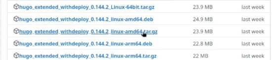

:::
::::::::::::::

## Загрузка hugo
::::::::::::: {.columns align=center}
::: {.column width="40%"}
И извлекаю в папку /usr/local/bin.
:::
::: {.column width="60%"}

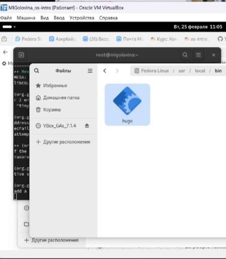

:::
::::::::::::::

## Cоздание и клонирование нового репозитория
::::::::::::: {.columns align=center}
::: {.column width="40%"}
Захожу по ссылке, которая была на ТУИС и создаю свой репозиторий и называю его blog.
:::
::: {.column width="60%"}

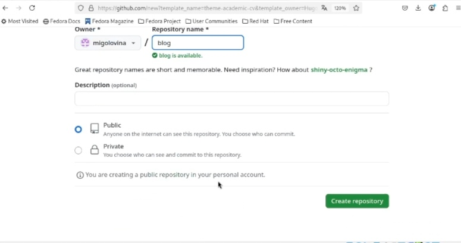

:::
::::::::::::::

## Cоздание и клонирование нового репозитория
::::::::::::: {.columns align=center}
::: {.column width="40%"}
Клонирую этот репозиторий в папку /work/.
:::
::: {.column width="60%"}

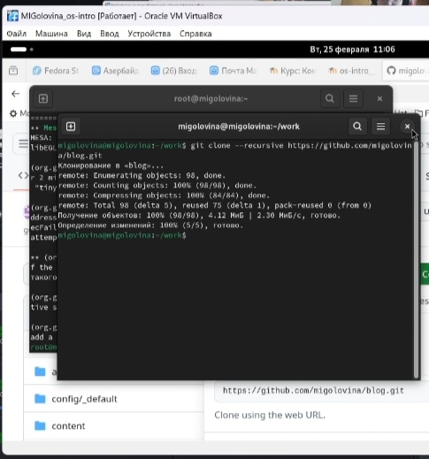

:::
::::::::::::::

## Запуск HUGO
::::::::::::: {.columns align=center}
::: {.column width="40%"}
Открываю терминал и вписываю комнаду hugo.
:::
::: {.column width="60%"}

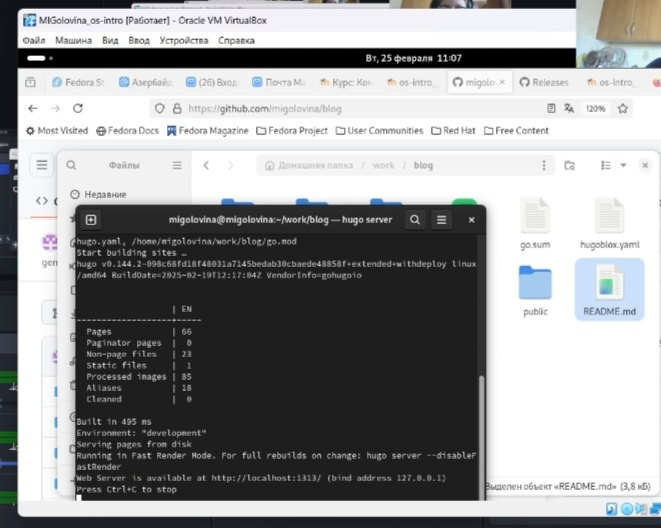

:::
::::::::::::::

## Cоздание нового репозитория
::::::::::::: {.columns align=center}
::: {.column width="40%"}
Название репозитория должно полностью совпадать с именем владельца + github.io.
:::
::: {.column width="60%"}

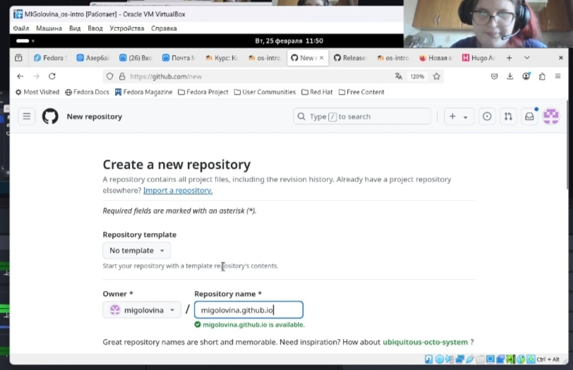

:::
::::::::::::::

## Kzлонирование нового репозитория
::::::::::::: {.columns align=center}
::: {.column width="40%"}
Клонирую репозиторий.
:::
::: {.column width="60%"}

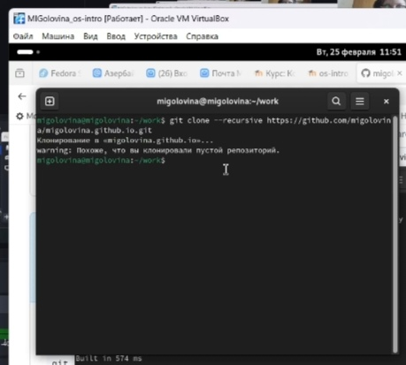

:::
::::::::::::::

## Создание пустого файла и отправка изменений
::::::::::::: {.columns align=center}
::: {.column width="40%"}
Переключила на ветку main.
:::
::: {.column width="60%"}

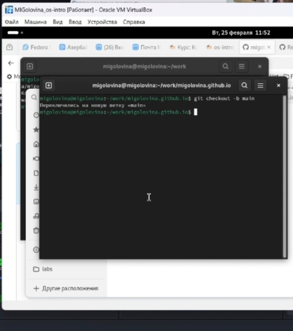

:::
::::::::::::::

## Создание пустого файла и отправка изменений
::::::::::::: {.columns align=center}
::: {.column width="40%"}
Создала файл README.md. Отправила изменения на github.
:::
::: {.column width="60%"}

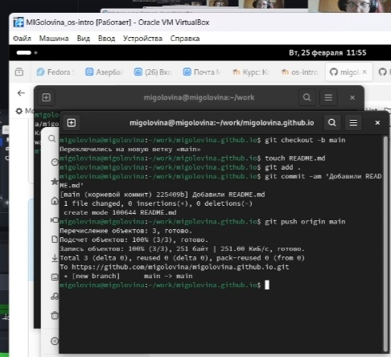

:::
::::::::::::::

## Создание submodule, выполнение команды hugo
::::::::::::: {.columns align=center}
::: {.column width="40%"}
Создаем ветку подмодуля.
:::
::: {.column width="60%"}

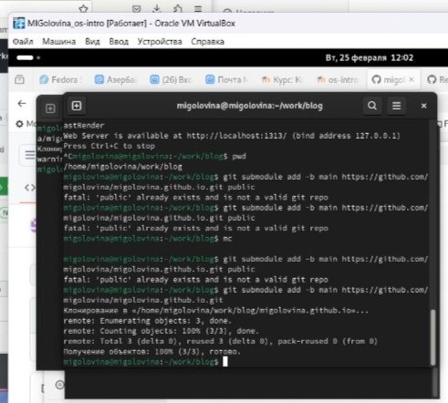

:::
::::::::::::::

## Создание submodule, выполнение команды hugo
::::::::::::: {.columns align=center}
::: {.column width="40%"}
Выполняю команду hugo.
:::
::: {.column width="60%"}

:::
::::::::::::::

## Подгрузка изменений на  Github
::::::::::::: {.columns align=center}
::: {.column width="40%"}
Подгрузила изменения на Github.
:::
::: {.column width="60%"}

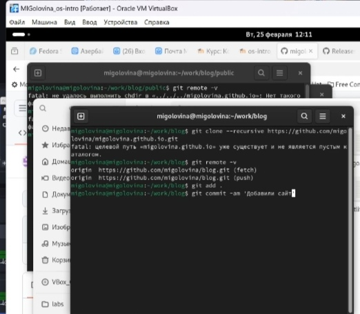

:::
::::::::::::::

## Подгрузка изменений на  Github
::::::::::::: {.columns align=center}
::: {.column width="40%"}
Подгрузила изменения на Github.
:::
::: {.column width="60%"}

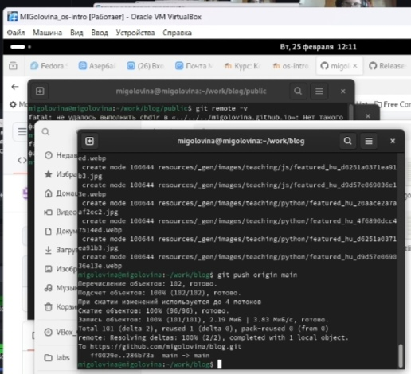

:::
::::::::::::::

## Открываем наш сайт
::::::::::::: {.columns align=center}
::: {.column width="40%"}
Открываю сайт.
:::
::: {.column width="60%"}

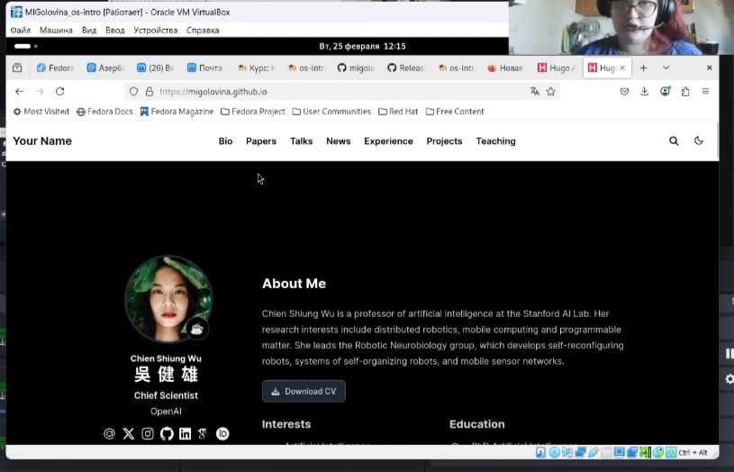

:::
::::::::::::::

# Вывод
## Заключение
В ходе данной работы я создала шаблон своего сайта, который в будущем буду дорабатывать, а также закрепила навыки работы с системой контроля версий Git.

# Дорогу осилит идущий

