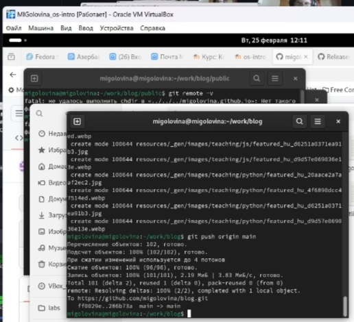

---
## Front matter
title: "Отчёт по индивидуальному проекту. Этап 1"
subtitle: "Размещение на Github pages заготовки для персонального сайта"
author: "Головина Мария Игоревна"

## Generic otions
lang: ru-RU
toc-title: "Содержание"

## Bibliography
bibliography: bib/cite.bib
csl: pandoc/csl/gost-r-7-0-5-2008-numeric.csl

## Pdf output format
toc: true # Table of contents
toc-depth: 2
lof: true # List of figures
lot: true # List of tables
fontsize: 12pt
linestretch: 1.5
papersize: a4
documentclass: scrreprt
## I18n polyglossia
polyglossia-lang:
  name: russian
  options:
	- spelling=modern
	- babelshorthands=true
polyglossia-otherlangs:
  name: english
## I18n babel
babel-lang: russian
babel-otherlangs: english
## Fonts
mainfont: IBM Plex Serif
romanfont: IBM Plex Serif
sansfont: IBM Plex Sans
monofont: IBM Plex Mono
mathfont: STIX Two Math
mainfontoptions: Ligatures=Common,Ligatures=TeX,Scale=0.94
romanfontoptions: Ligatures=Common,Ligatures=TeX,Scale=0.94
sansfontoptions: Ligatures=Common,Ligatures=TeX,Scale=MatchLowercase,Scale=0.94
monofontoptions: Scale=MatchLowercase,Scale=0.94,FakeStretch=0.9
mathfontoptions:
## Biblatex
biblatex: true
biblio-style: "gost-numeric"
biblatexoptions:
  - parentracker=true
  - backend=biber
  - hyperref=auto
  - language=auto
  - autolang=other*
  - citestyle=gost-numeric
## Pandoc-crossref LaTeX customization
figureTitle: "Рис."
tableTitle: "Таблица"
listingTitle: "Листинг"
lofTitle: "Список иллюстраций"
lotTitle: "Список таблиц"
lolTitle: "Листинги"
## Misc options
indent: true
header-includes:
  - \usepackage{indentfirst}
  - \usepackage{float} # keep figures where there are in the text
  - \floatplacement{figure}{H} # keep figures where there are in the text
---

# Цель работы

Создать свой сайт (разместить на Github pages заготовки для персонального сайта).

# Задание

1. Установить необходимое программное обеспечение.
2. Скачать шаблон темы сайта.
3. Разместить его на хостинге git.
4. Установить параметр для URLs сайта.
5. Разместить заготовку сайта на Github pages.

# Теоретическое введение

Примеры использования git:

1. Система контроля версий Git представляет собой набор программ командной строки. 
Доступ к ним можно получить из терминала посредством ввода команды git с различными опциями.

2. Благодаря тому, что Git является распределённой системой контроля версий, резервную копию локального хранилища можно сделать простым копированием или архивацией.
Основные команды git:

Например, в табл. @tbl:std-dir приведено краткое описание основных команд Git.

: Описание некоторых команд системы контроля версий Git {#tbl:std-dir}

| Команда | Описание команды                                                                  |
|--------------|-----------------------------------------------------------------------------------|
| git init     | Создание основного дерева репозитория  |
| git pull     | Получение обновлений(изменений текущего дерева из центрального репозитория |
| git push     | Отправка всех произведённых изменений локального дерева в центральный репозиторий |
| git status   | Просмотр списка изменённых файлов в текущей директории |
| git diff     | Просмотр текущих изменений  |
| git add .    | Добавление все изменённые и/или созданные файлы и/или каталоги |
| git rm имена_файлов | Удаление файлов и/или каталогов из индекса репозитория |
| git commit -am 'Описание коммита'| Сохранение всех добавленных изменений и всех изменённых файлов |
| git commit   | Сохранение добавленный изменений с внесением комментария через встроенный редактор |
| git checkout -b имя_ветки | Создание новой ветки, базирующейся на текущей | 
| git branch -d имя_ветки | Удаление локальной уже слитой с основным деревом ветки |
| git branch -D имя_ветки | Принудительное удаление локальной ветки |

Полный список команд можно посмотреть на официальном сайте: [Github.com](https://docs.github.com/en/get-started/using-github/github-command-palette)

# Выполнение индивидуального проекта

1. Загружаем последнюю версию hugo (рис. 4.1).

{#fig:001 width=70%}

2. Файл скачивается в папку "Загрузки" (рис. 4.2).

{#fig:002 width=70%}

3. По завершении скачивания извлекаем архив в ту же папку, в которой мы находимся (рис. 4.3-4.5).

{#fig:003 width=70%}

{#fig:004 width=70%}

{#fig:005 width=70%}

4. После извлечения файла, нам его необходимо вырезать и вставить в папку /usr/local/bin (рис. 4.6-4.7).

{#fig:006 width=70%}

{#fig:007 width=70%}

5. Далее открываем наш github и создаем репозиторий на основе данного нам (рис. 4.8).

[Репозиторий](https://github.com/wowchemy/starter-hugo-academic)

{#fig:008 width=70%}

6. При создании даём ему имя blog (рис. 4.9).

{#fig:009 width=70%}

7. Проверка (рис. 4.10).

{#fig:010 width=70%}

8. После клонируем данный репозиторий в путь /home/migolovina/work (рис. 4.11-4.12).

{#fig:011 width=70%}

{#fig:012 width=70%}

9. Переходим в папку blog и запускаем hugo (рис. 4.13).

{#fig:013 width=70%}

10. После установки необходимых модулей проверяем создание папок и файлов и удаляем каталог public (рис. 4.14).

{#fig:014 width=70%}

11. Запускаем hugo server (рис. 4.15).

{#fig:015 width=70%}

12. Открываем ссылку в браузере и видим сайт (рис. 4.16).

{#fig:016 width=70%}

13. Создание нового репозитория. Название репозитория должно полностью совпадать с именем владельца + github.io (рис. 4.17).

{#fig:017 width=70%}

14. Возвращаемся в терминал, в папку work и клонируем туда наш репозиторий (свежесозданный) и проверяю. (рис. 4.18-4.19).

{#fig:018 width=70%}

{#fig:019 width=70%}

15. Переключаемся на ветку "main" (рис. 4.20).

{#fig:020 width=70%}

16. Создаем пустой файл README.md, а затем коммитим все изменения и отправляет на github. (рис. 4.21-4.22).

{#fig:021 width=70%}

{#fig:022 width=70%}

17. Создаем ветку подмодуля, клонируя репозиторий с нашего Github (рис. 4.23).

{#fig:023 width=70%}

18. После выполнения запускаем hugo (рис. 4.24).

{#fig:024 width=70%}

19. Проверим подключение каталога к репозиторию командой git remote -v (рис. 4.25).

{#fig:025 width=70%}

20. Добавим изменения на github (рис. 4.26-4.27).

{#fig:026 width=70%}

{#fig:027 width=70%}

21. Проверка обновлений (рис. 4.28).

{#fig:028 width=70%}

22. Открываем наш сайт (рис. 4.29).

{#fig:029 width=70%}

# Выводы

В ходе данной работы я создала шаблон своего сайта, который в будущем буду дорабатывать, а также закрепила навыки работы с системой контроля версий Git.

# Список литературы{.unnumbered}

1. [Этапы реализации проекта](https://esystem.rudn.ru/mod/page/view.php?id=970806&forceview=1)

2. [Техническая реализация проекта](https://esystem.rudn.ru/mod/page/view.php?id=970807&forceview=1)

3. [Руководство по выполнению первого этапа индивидуального проекта](https://esystem.rudn.ru/mod/url/view.php?id=980904&forceview=1)

4. [Инструменты Git - Подмодули](https://git-scm.com/book/ru/v2/%D0%98%D0%BD%D1%81%D1%82%D1%80%D1%83%D0%BC%D0%B5%D0%BD%D1%82%D1%8B-Git-%D0%9F%D0%BE%D0%B4%D0%BC%D0%BE%D0%B4%D1%83%D0%BB%D0%B8)

::: {#refs}
:::
