---
## Front matter
lang: ru-RU
title: Индивидуальный проект. Этап 2.
subtitle: Добавить к сайту данные о себе
author:
  - Головина М.И.
institute:
  - Российский университет дружбы народов, Москва, Россия
  - Факультет Физико-математических и естественных наук
date: 22 марта 2025

## i18n babel
babel-lang: russian
babel-otherlangs: english

## Formatting pdf
toc: false
toc-title: Содержание
slide_level: 2
aspectratio: 169
section-titles: true
theme: metropolis
header-includes:
 - \metroset{progressbar=frametitle,sectionpage=progressbar,numbering=fraction}
 - '\makeatletter'
 - '\beamer@ignorenonframefalse'
 - '\makeatother'
---

# Информация

## Докладчик

:::::::::::::: {.columns align=center}
::: {.column width="70%"}

  * Головина Мария Игоревна
  * Бакалавр направления подготовки Математика и механика
  * студентка группы НММбд - 02- 24
  * Российский университет дружбы народов
  * [1132246810@pfur.ru](mailto:1132246810@pfur.ru)

:::
::: {.column width="30%"}

:::
::::::::::::::

## Цель

- Создать свой сайт (Добавить к сайту данные о себе.).
  
## Задание

1. Разместить фотографию владельца сайта.
2. Разместить краткое описание владельца сайта.
3. Добавить информацию об интересах (Interests).
4. Добавить информацию от образовании (Education).
5. Сделать пост по прошедшей неделе.
6. Сделать пост управление версиями Git.

# Ход работы

## Размещение фотографии владельца сайта
::::::::::::: {.columns align=center}
::: {.column width="40%"}
Перехожу в /work/blog/content/authors/admin и загружаю туда свою фотографию, чтобы она разместилась на сайте, а также буду изменять файл _index.md.
:::
::: {.column width="60%"}

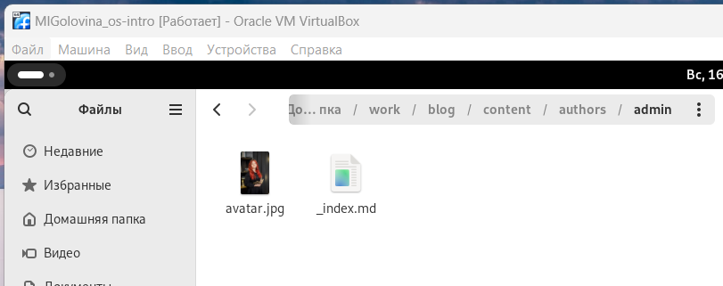

:::
::::::::::::::

## Изменение _index.md
::::::::::::: {.columns align=center}
::: {.column width="40%"}
Добавила в файл _index.md своё ФИО, роль, место учёбы и сайт РУДН.
:::
::: {.column width="60%"}

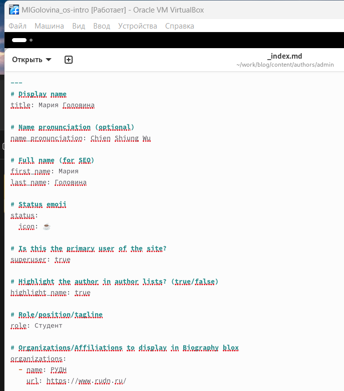

:::
::::::::::::::

## Изменение _index.md
::::::::::::: {.columns align=center}
::: {.column width="40%"}
Добавила в файл _index.md краткую информацию обо мне.
:::
::: {.column width="60%"}

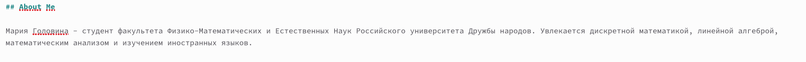

:::
::::::::::::::

## Изменение _index.md
::::::::::::: {.columns align=center}
::: {.column width="40%"}
Добавила в файл _index.md интересы.
:::
::: {.column width="60%"}

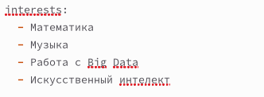

:::
::::::::::::::

## Изменение _index.md
::::::::::::: {.columns align=center}
::: {.column width="40%"}
Добавила в файл _index.md образование
:::
::: {.column width="60%"}

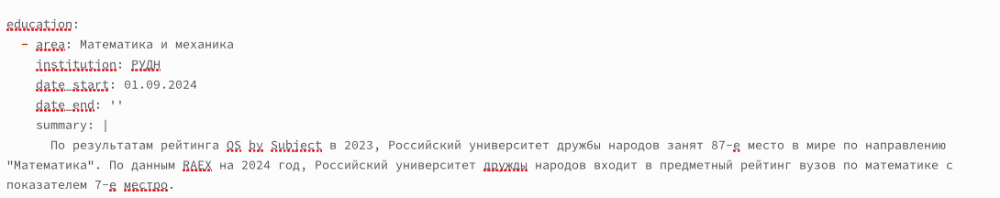

:::
::::::::::::::

## Размещение фотографии с прошедшей недели
::::::::::::: {.columns align=center}
::: {.column width="40%"}
Теперь я перехожу в /work/blog/content/post/last-week и загружаю туда свою фотографию с прошедшей недели, а также буду изменять информацию в index.md
:::
::: {.column width="60%"}

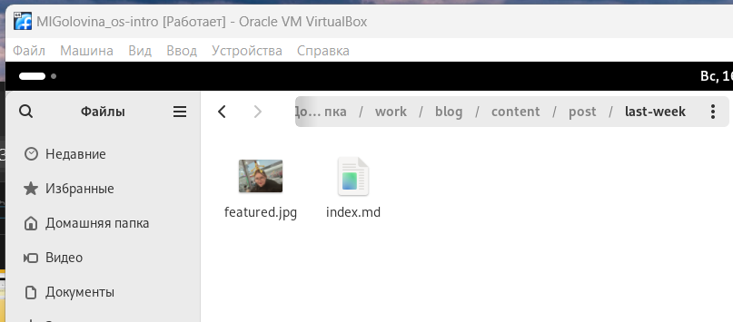

:::
::::::::::::::

## Изменение index.md
::::::::::::: {.columns align=center}
::: {.column width="40%"}
Добавила в файл index.md название поста, дату, краткое описание, автора, тэги, информацию откуда я взяла фотографию и основное содержание поста
:::
::: {.column width="60%"}

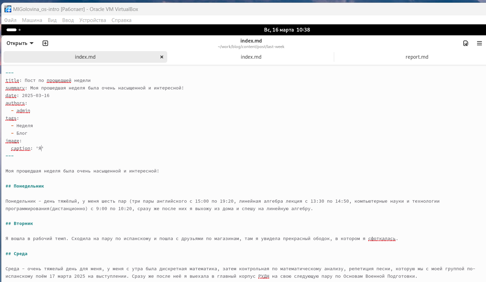

:::
::::::::::::::

## Изменение index.md
::::::::::::: {.columns align=center}
::: {.column width="40%"}
Добавила в файл index.md название поста, дату, краткое описание, автора, тэги, информацию откуда я взяла фотографию и основное содержание поста
:::
::: {.column width="60%"}

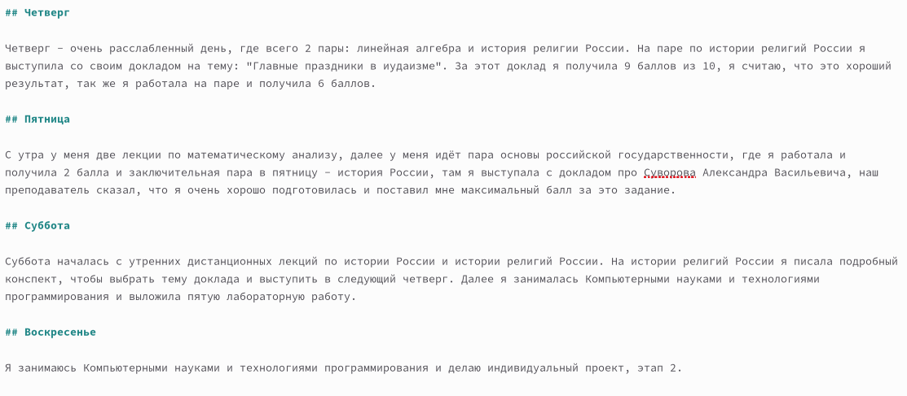

:::
::::::::::::::

## Размещение фотографии, подходящей к этому посту
::::::::::::: {.columns align=center}
::: {.column width="40%"}
Теперь я перехожу в /work/blog/content/post/git и загружаю туда фотографию, подходящую к этому посту, а также буду изменять информацию в index.md
:::
::: {.column width="60%"}

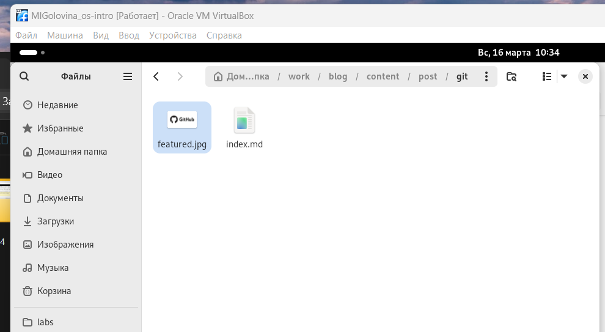

:::
::::::::::::::

## Изменение index.md
::::::::::::: {.columns align=center}
::: {.column width="40%"}
Добавила в файл index.md название поста, дату, краткое описание, автора, тэги, информацию откуда я взяла фотографию и основное содержание поста
:::
::: {.column width="60%"}

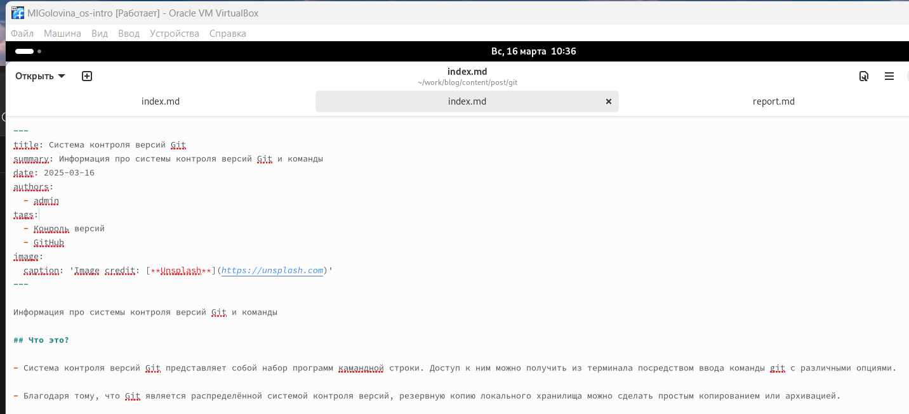

:::
::::::::::::::

## Изменение index.md
::::::::::::: {.columns align=center}
::: {.column width="40%"}
Добавила в файл index.md название поста, дату, краткое описание, автора, тэги, информацию откуда я взяла фотографию и основное содержание поста
:::
::: {.column width="60%"}

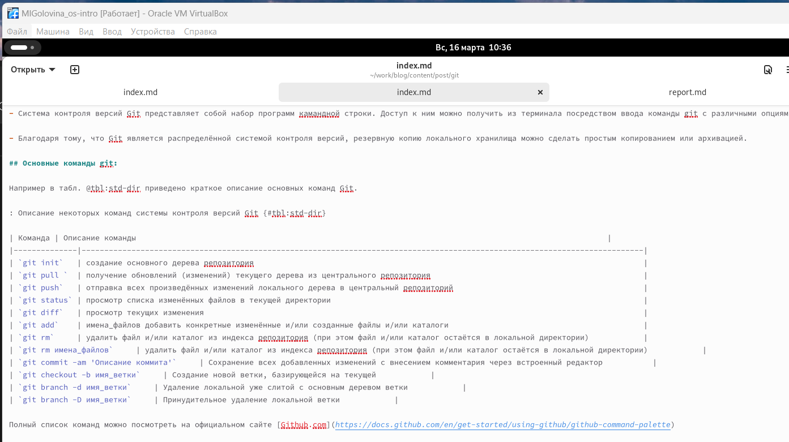

:::
::::::::::::::

# Вывод
## Заключение
В ходе данной работы я создала шаблон своего сайта, который в будущем буду дорабатывать, а также закрепила навыки работы с системой контроля версий Git.

# Дорогу осилит идущий

