---
## Front matter
lang: ru-RU
title: Индивидуальный проект. Этап 3.
subtitle: Добавить к сайту достижения
author:
  - Головина М.И.
institute:
  - Российский университет дружбы народов, Москва, Россия
  - Факультет Физико-математических и естественных наук
date: 12 апреля 2025

## i18n babel
babel-lang: russian
babel-otherlangs: english

## Formatting pdf
toc: false
toc-title: Содержание
slide_level: 2
aspectratio: 169
section-titles: true
theme: metropolis
header-includes:
 - \metroset{progressbar=frametitle,sectionpage=progressbar,numbering=fraction}
 - '\makeatletter'
 - '\beamer@ignorenonframefalse'
 - '\makeatother'
---

# Информация

## Докладчик

:::::::::::::: {.columns align=center}
::: {.column width="70%"}

  * Головина Мария Игоревна
  * Бакалавр направления подготовки Математика и механика
  * студентка группы НММбд - 02- 24
  * Российский университет дружбы народов
  * [1132246810@pfur.ru](mailto:1132246810@pfur.ru)

:::
::: {.column width="30%"}

:::
::::::::::::::

## Цель

- Создать свой сайт (Добавить к сайту достижения.).
  
## Задание

1. Добавить информацию о навыках (Skills).
2. Добавить информацию об опыте (Experience).
3. Добавить информацию о достижениях (Accomplishments).
4. Сделать пост по прошедшей неделе.
5. Сделать пост по языку разметки Markdown.

# Ход работы

## Заполнила графу Experience
::::::::::::: {.columns align=center}
::: {.column width="40%"}
Перехожу в /work/blog/content/authors/admin и заполняю графу Experience
:::
::: {.column width="60%"}

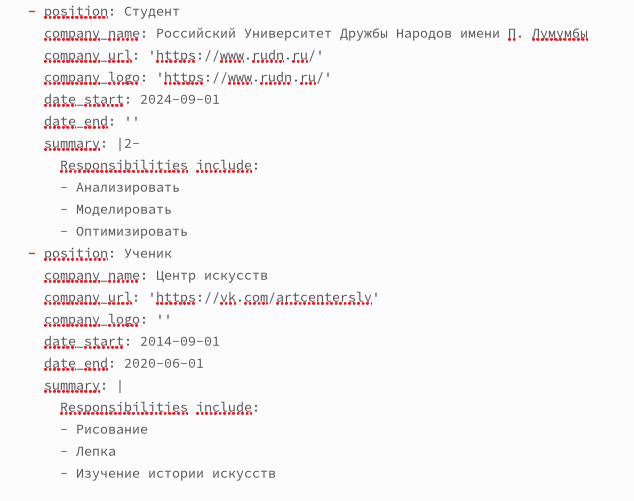

:::
::::::::::::::

## Вид графы Experience на сайте
::::::::::::: {.columns align=center}
::: {.column width="40%"}
Перехожу на свой сайт и проверяю графу Experience
:::
::: {.column width="60%"}

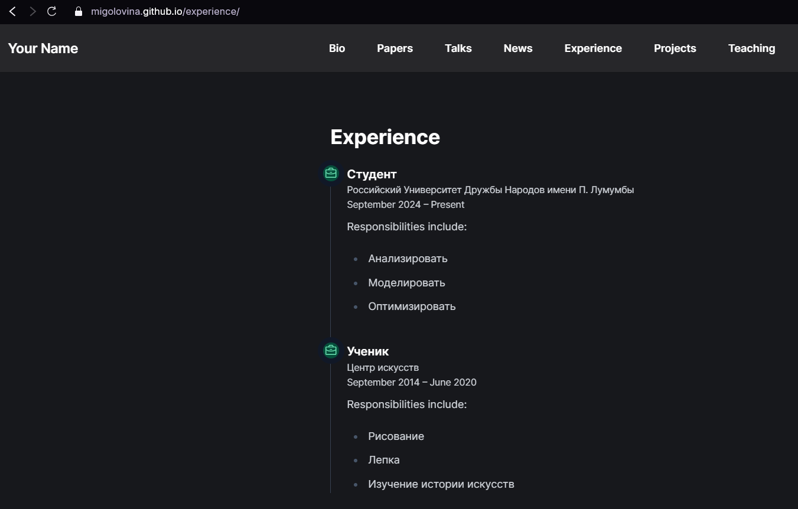

:::
::::::::::::::

## Заполнила графу Skills, Hobbies
::::::::::::: {.columns align=center}
::: {.column width="40%"}
Перехожу в /work/blog/content/authors/admin и заполняю графу Skills, Hobbies
:::
::: {.column width="60%"}

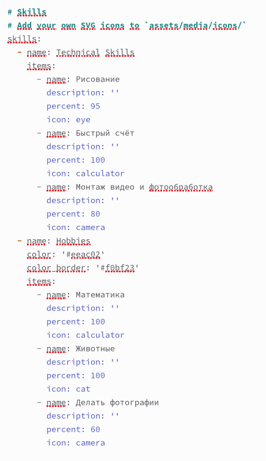

:::
::::::::::::::

## Вид графы Skills, Hobbies на сайте
::::::::::::: {.columns align=center}
::: {.column width="40%"}
Перехожу на свой сайт и проверяю графу Skills, Hobbies
:::
::: {.column width="60%"}

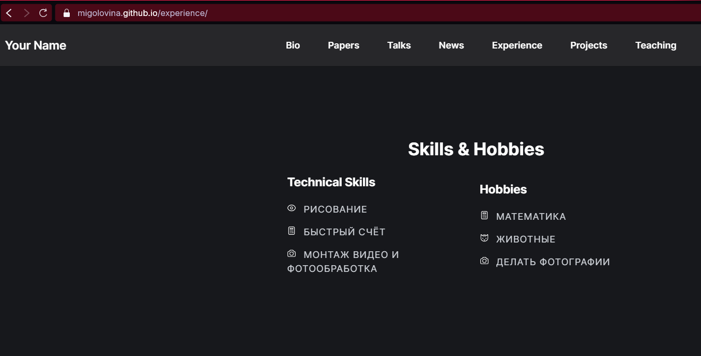

:::
::::::::::::::

## Заполнила графу Accomplishments
::::::::::::: {.columns align=center}
::: {.column width="40%"}
Перехожу в /work/blog/content/authors/admin и заполняю графу Accomplishments
:::
::: {.column width="60%"}

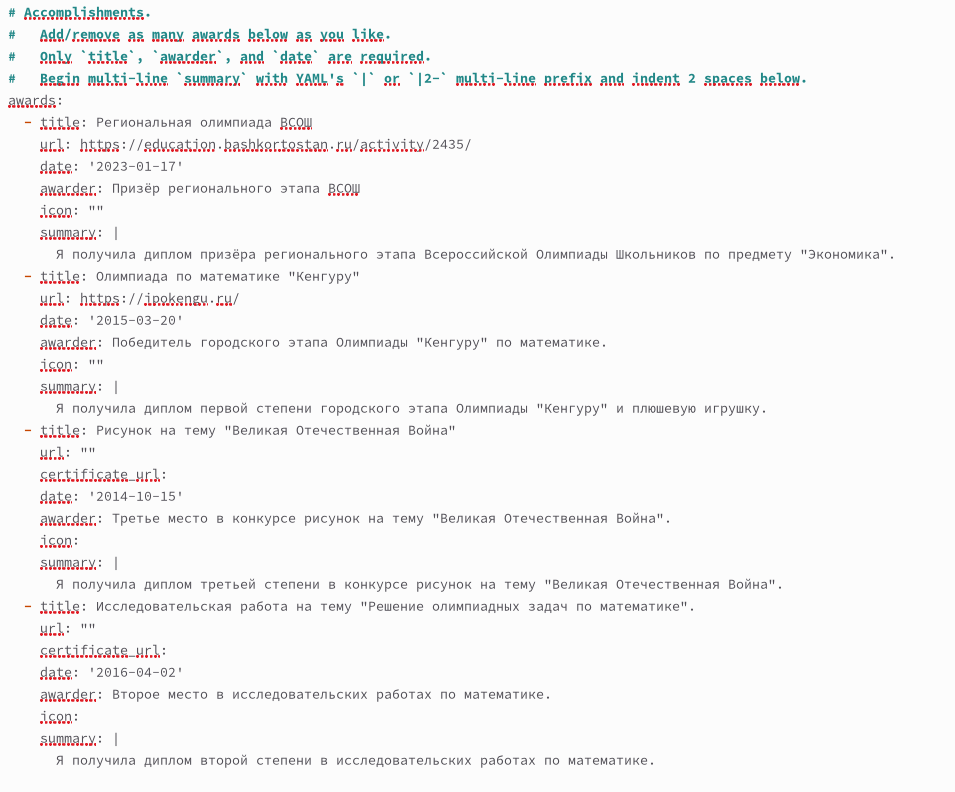

:::
::::::::::::::

## Вид графы Accomplishments на сайте
::::::::::::: {.columns align=center}
::: {.column width="40%"}
Перехожу на свой сайт и проверяю графу Accomplishments
:::
::: {.column width="60%"}

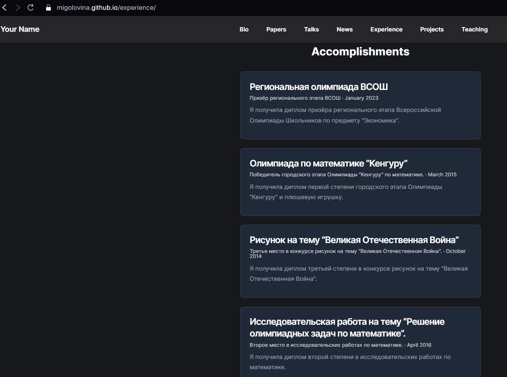

:::
::::::::::::::

## Размещение фотографии с прошедшей недели
::::::::::::: {.columns align=center}
::: {.column width="40%"}
Теперь я перехожу в /work/blog/content/post/last-week-8 и загружаю туда свою фотографию с прошедшей недели, а также буду изменять информацию в index.md
:::
::: {.column width="60%"}

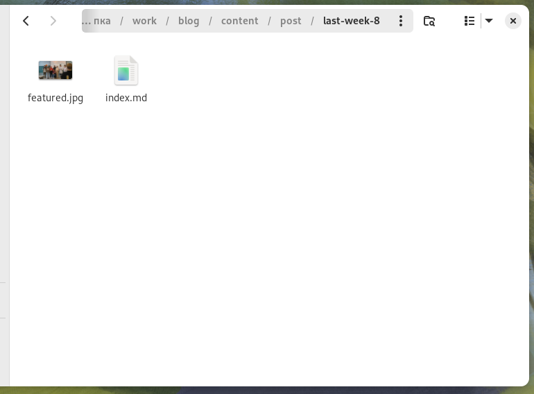

:::
::::::::::::::

## Изменение index.md
::::::::::::: {.columns align=center}
::: {.column width="40%"}
Добавила в файл index.md название поста, дату, краткое описание, автора, тэги, информацию откуда я взяла фотографию и основное содержание поста
:::
::: {.column width="60%"}

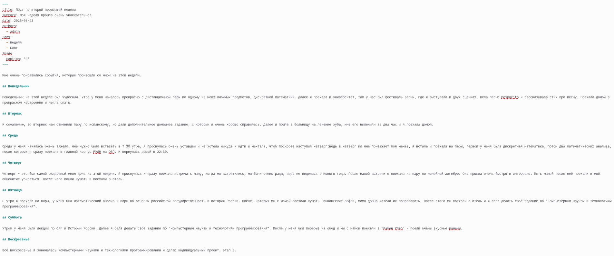

:::
::::::::::::::

## Пост по прошедшей недели
::::::::::::: {.columns align=center}
::: {.column width="40%"}
Перехожу на свой сайт и проверяю свой пост
:::
::: {.column width="60%"}

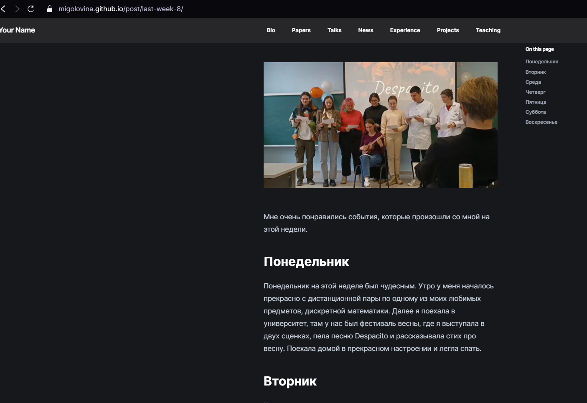

:::
::::::::::::::

## Размещение фотографии, подходящей к этому посту
::::::::::::: {.columns align=center}
::: {.column width="40%"}
Теперь я перехожу в /work/blog/content/post/markdown и загружаю туда фотографию, подходящую к этому посту, а также буду изменять информацию в index.md
:::
::: {.column width="60%"}

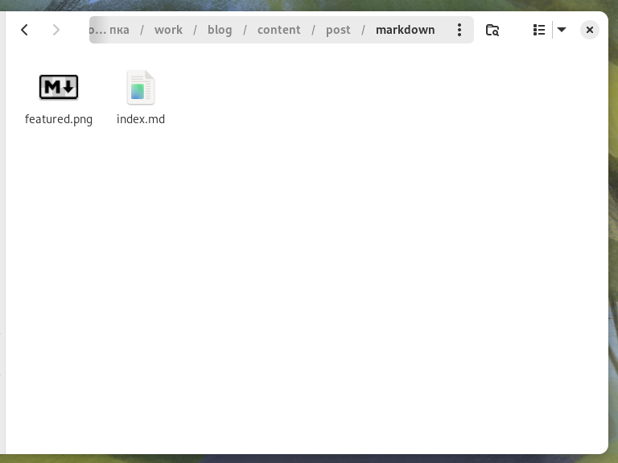

:::
::::::::::::::

## Изменение index.md
::::::::::::: {.columns align=center}
::: {.column width="40%"}
Добавила в файл index.md название поста, дату, краткое описание, автора, тэги, информацию откуда я взяла фотографию и основное содержание поста
:::
::: {.column width="60%"}

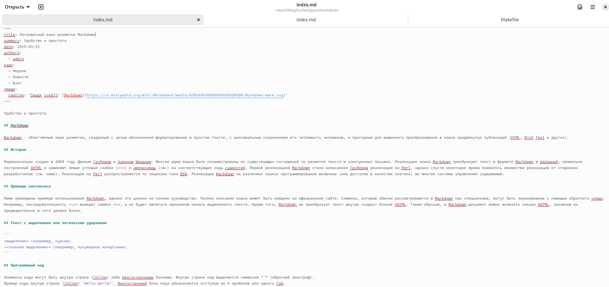

:::
::::::::::::::

## Изменение index.md
::::::::::::: {.columns align=center}
::: {.column width="40%"}
Добавила в файл index.md название поста, дату, краткое описание, автора, тэги, информацию откуда я взяла фотографию и основное содержание поста
:::
::: {.column width="60%"}

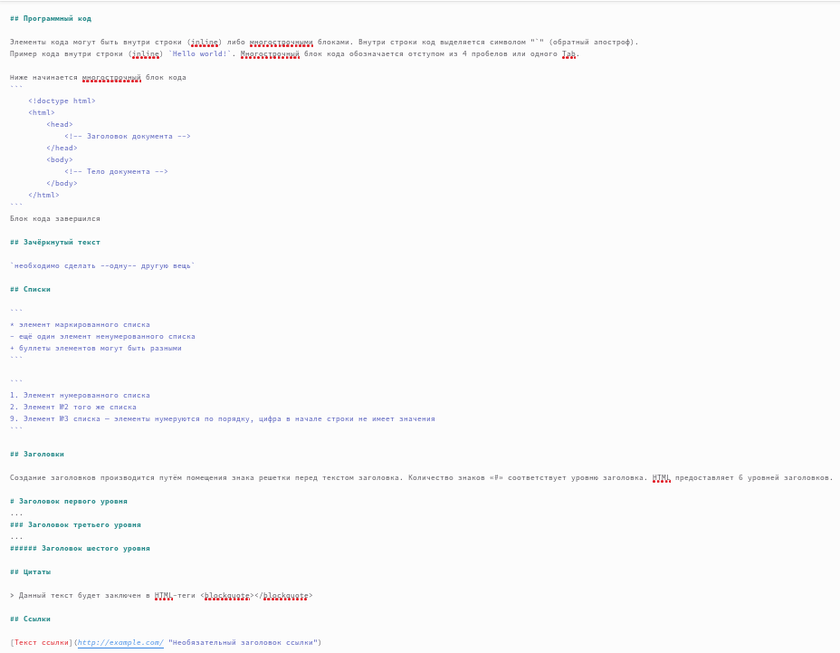

:::
::::::::::::::

## Пост по язык разметки Markdown
::::::::::::: {.columns align=center}
::: {.column width="40%"}
Перехожу на свой сайт и проверяю свой пост
:::
::: {.column width="60%"}

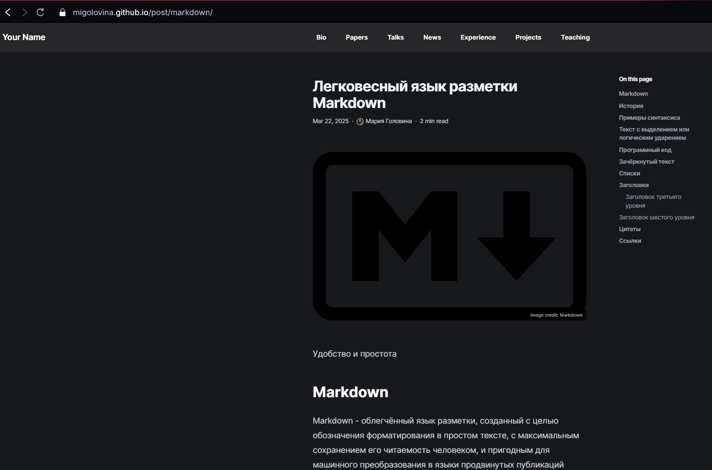

:::
::::::::::::::

# Вывод
## Заключение
В ходе данной работы я создала шаблон своего сайта, который в будущем буду дорабатывать, а также закрепила навыки работы с системой контроля версий Git.

# Дорогу осилит идущий

