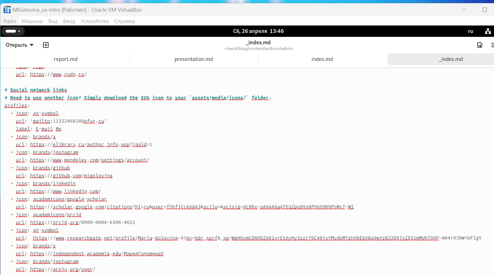

---
## Front matter
lang: ru-RU
title: Индивидуальный проект. Этап 4.
subtitle: Добавить к сайту ссылки на научные и библиометрические ресурсы
author:
  - Головина М.И.
institute:
  - Российский университет дружбы народов, Москва, Россия
  - Факультет Физико-математических и естественных наук
date: 3 мая 2025

## i18n babel
babel-lang: russian
babel-otherlangs: english

## Formatting pdf
toc: false
toc-title: Содержание
slide_level: 2
aspectratio: 169
section-titles: true
theme: metropolis
header-includes:
 - \metroset{progressbar=frametitle,sectionpage=progressbar,numbering=fraction}
 - '\makeatletter'
 - '\beamer@ignorenonframefalse'
 - '\makeatother'
---

# Информация

## Докладчик

:::::::::::::: {.columns align=center}
::: {.column width="70%"}

  * Головина Мария Игоревна
  * Бакалавр направления подготовки Математика и механика
  * студентка группы НММбд - 02- 24
  * Российский университет дружбы народов
  * [1132246810@pfur.ru](mailto:1132246810@pfur.ru)

:::
::: {.column width="30%"}

:::
::::::::::::::

## Цель

- Создать свой сайт (Добавить к сайту ссылки на научные и библиометрические ресурсы)
  
## Задание

1. Зарегестрироваться на ресурсах и разместить на них ссылки на сайте.
2. Сделать пост по прошедшей неделе.
3. Сделать пост по оформление отчёта.

# Ход работы

## Ссылки
::::::::::::: {.columns align=center}
::: {.column width="40%"}
Перехожу в /work/blog/content/authors/admin и размещаю ссылки на свои аккауты
:::
::: {.column width="60%"}

:::
::::::::::::::

## Проверка
::::::::::::: {.columns align=center}
::: {.column width="40%"}
Перехожу на свой сайт и проверяю
:::
::: {.column width="60%"}

:::
::::::::::::::

## /work/blog/content/post/otchet
::::::::::::: {.columns align=center}
::: {.column width="40%"}
Перехожу в /work/blog/content/post/otchet и размещаю там картинку подходящую к посту
:::
::: {.column width="60%"}

:::
::::::::::::::

## Изменение index.md
::::::::::::: {.columns align=center}
::: {.column width="40%"}
Добавила в файл index.md название поста, дату, краткое описание, автора, тэги, информацию откуда я взяла фотографию и основное содержание поста
:::
::: {.column width="60%"}

:::
::::::::::::::

## Пост
::::::::::::: {.columns align=center}
::: {.column width="40%"}
Перехожу на свой сайт и проверяю пост
:::
::: {.column width="60%"}

:::
::::::::::::::

## /work/blog/content/post/last-week4
::::::::::::: {.columns align=center}
::: {.column width="40%"}
Перехожу в /work/blog/content/post/last-week4 и размещаю там картинку с прошедшей недели
:::
::: {.column width="60%"}

:::
::::::::::::::

## Изменение index.md
::::::::::::: {.columns align=center}
::: {.column width="40%"}
Добавила в файл index.md название поста, дату, краткое описание, автора, тэги, информацию откуда я взяла фотографию и основное содержание поста
:::
::: {.column width="60%"}

:::
::::::::::::::

## Пост
::::::::::::: {.columns align=center}
::: {.column width="40%"}
Перехожу на свой сайт и проверяю пост
:::
::: {.column width="60%"}

:::
::::::::::::::

# Вывод
## Заключение
В ходе данной работы я создала шаблон своего сайта, который в будущем буду дорабатывать, а также закрепила навыки работы с системой контроля версий Git.

# Дорогу осилит идущий

