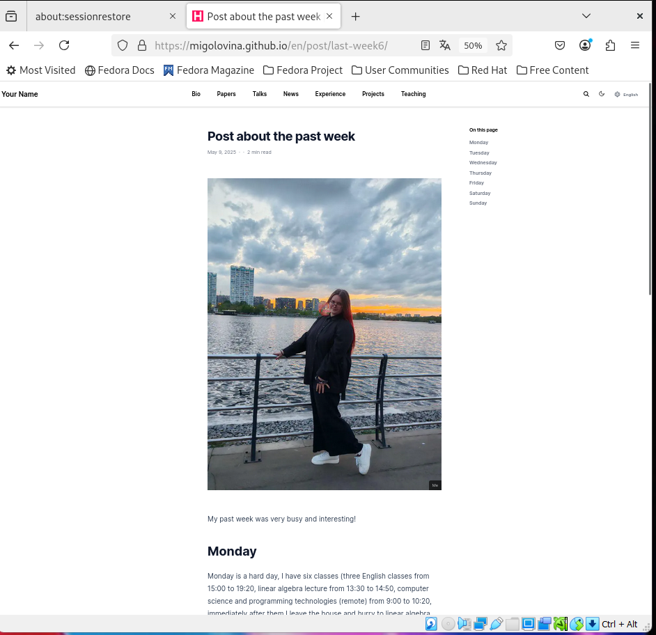

---
## Front matter
lang: ru-RU
title: Индивидуальный проект. Этап 6.
subtitle: Размещение двуязычного сайта на Github
author:
  - Головина М.И.
institute:
  - Российский университет дружбы народов, Москва, Россия
  - Факультет Физико-математических и естественных наук
date: 31 мая 2025

## i18n babel
babel-lang: russian
babel-otherlangs: english

## Formatting pdf
toc: false
toc-title: Содержание
slide_level: 2
aspectratio: 169
section-titles: true
theme: metropolis
header-includes:
 - \metroset{progressbar=frametitle,sectionpage=progressbar,numbering=fraction}
 - '\makeatletter'
 - '\beamer@ignorenonframefalse'
 - '\makeatother'
---

# Информация

## Докладчик

:::::::::::::: {.columns align=center}
::: {.column width="70%"}

  * Головина Мария Игоревна
  * Бакалавр направления подготовки Математика и механика
  * студентка группы НММбд - 02- 24
  * Российский университет дружбы народов
  * [1132246810@pfur.ru](mailto:1132246810@pfur.ru)

:::
::: {.column width="30%"}

:::
::::::::::::::

## Цель

- Разместить двуязычный сайт на Github
  
## Задание

1. Сделать поддержку английского и русского языков.
2. Разместить элементы сайта на обоих языках.
3. Разместить контент на обоих языках.
4. Сделать пост по прошедшей неделе.
5. Добавить пост на тему по выбору (на двух языках).

# Ход работы

## Изменение languages.yaml
::::::::::::: {.columns align=center}
::: {.column width="40%"}
Перехожу в /work/blog/config/_default и внесла изменения в файл languages.yaml, чтобы сделать сайт на двух языках (английский и русский)
:::
::: {.column width="60%"}

:::
::::::::::::::

## Изменение hugo.yaml
::::::::::::: {.columns align=center}
::: {.column width="40%"}
Перехожу в /work/blog/config/_default и внесла изменения в файл hugo.yaml, чтобы сделать сайт на двух языках (английский и русский)
:::
::: {.column width="60%"}

:::
::::::::::::::

## Проверка
::::::::::::: {.columns align=center}
::: {.column width="40%"}
Проверила сайт на русском языке
:::
::: {.column width="60%"}

:::
::::::::::::::

## Проверка
::::::::::::: {.columns align=center}
::: {.column width="40%"}
Проверила сайт на английском языке
:::
::: {.column width="60%"}

:::
::::::::::::::

## Посты
::::::::::::: {.columns align=center}
::: {.column width="40%"}
Разместила контент на английском языке
:::
::: {.column width="60%"}

:::
::::::::::::::

## Посты
::::::::::::: {.columns align=center}
::: {.column width="40%"}
Разместила контент на русском языке
:::
::: {.column width="60%"}

:::
::::::::::::::

## Изменение index.md
::::::::::::: {.columns align=center}
::: {.column width="40%"}
Написала пост на тему Искусственный интеллект в повседневной жизни: возможности и риски (тема по моему выбору) на русском языке 
:::
::: {.column width="60%"}

:::
::::::::::::::

## Изменение index.md
::::::::::::: {.columns align=center}
::: {.column width="40%"}
Написала пост на тему Искусственный интеллект в повседневной жизни: возможности и риски (тема по моему выбору) на английском языке
:::
::: {.column width="60%"}

:::
::::::::::::::

## Проверка
::::::::::::: {.columns align=center}
::: {.column width="40%"}
Проверила сайт на русском языке
:::
::: {.column width="60%"}

:::
::::::::::::::

## Проверка
::::::::::::: {.columns align=center}
::: {.column width="40%"}
Проверила сайт на английском языке
:::
::: {.column width="60%"}

:::
::::::::::::::

## Изменение index.md
::::::::::::: {.columns align=center}
::: {.column width="40%"}
Написала пост на тему Моя прошедшая неделя на русском языке 
:::
::: {.column width="60%"}

:::
::::::::::::::

## Изменение index.md
::::::::::::: {.columns align=center}
::: {.column width="40%"}
Написала пост на тему Моя прошедшая неделя на английском языке
:::
::: {.column width="60%"}

:::
::::::::::::::

## Проверка
::::::::::::: {.columns align=center}
::: {.column width="40%"}
Проверила сайт на русском языке
:::
::: {.column width="60%"}

:::
::::::::::::::

## Проверка
::::::::::::: {.columns align=center}
::: {.column width="40%"}
Проверила сайт на английском языке
:::
::: {.column width="60%"}

:::
::::::::::::::

# Вывод
## Заключение

В ходе данной работы я создала шаблон своего сайта, а также закрепила навыки работы с системой контроля версий Git.

# Дорогу осилит идущий

