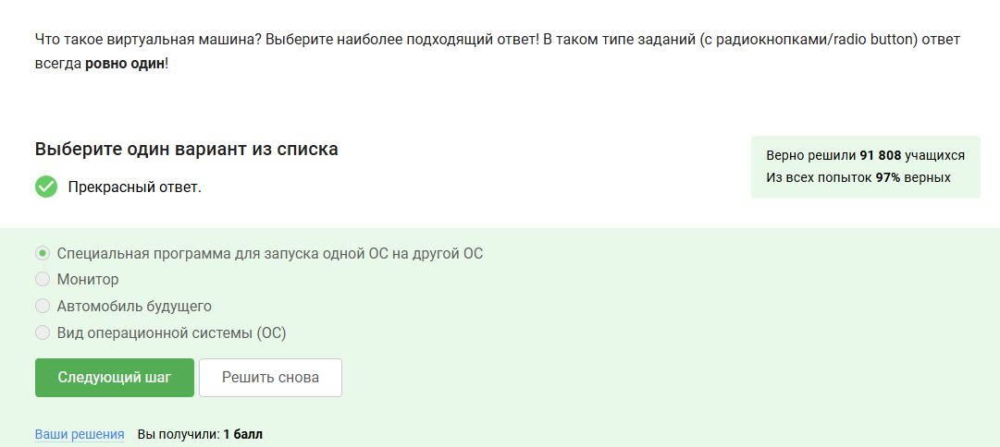
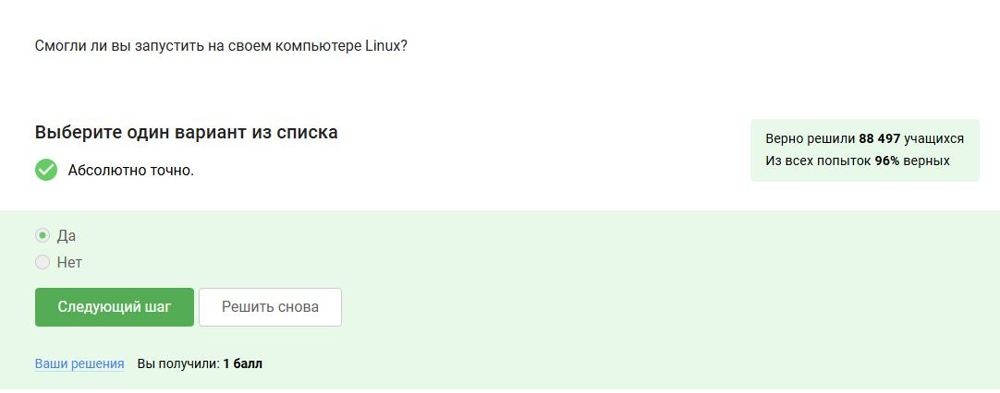
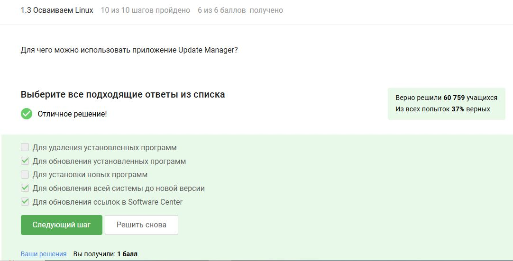
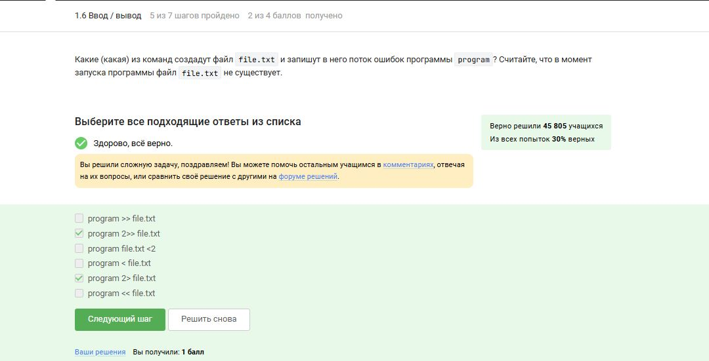
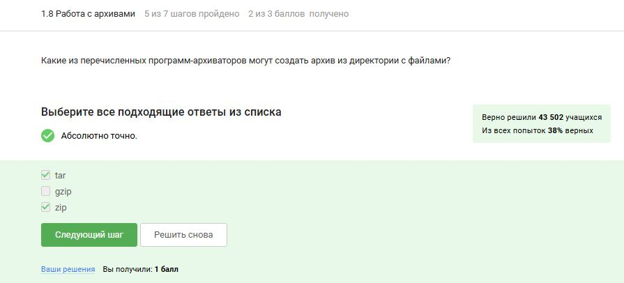

---
## Front matter
lang: ru-RU
title: По внешнему курсу «Введение в Linux»
subtitle: Операционные системы
author:
  - Головина М.И.
institute:
  - Российский университет дружбы народов, Москва, Россия
  - Факультет Физико-математических и естественных наук
date: 17 мая 2025

## i18n babel
babel-lang: russian
babel-otherlangs: english

## Formatting pdf
toc: false
toc-title: Содержание
slide_level: 2
aspectratio: 169
section-titles: true
theme: metropolis
header-includes:
 - \metroset{progressbar=frametitle,sectionpage=progressbar,numbering=fraction}
 - '\makeatletter'
 - '\beamer@ignorenonframefalse'
 - '\makeatother'
---

# Информация

## Докладчик

:::::::::::::: {.columns align=center}
::: {.column width="70%"}

  * Головина Мария Игоревна
  * Бакалавр направления подготовки Математика и механика
  * студентка группы НММбд - 02- 24
  * Российский университет дружбы народов
  * [1132246810@pfur.ru](mailto:1132246810@pfur.ru)

:::
::: {.column width="30%"}

:::
::::::::::::::

## Цель

- Познакомятся с операционной системой Linux и её базовыми возможностями. 
  
## Задание

1. Введение
2. Общая информация о курсе
3. Как установить Linux
4. Осваиваем Linux
5. Terminal: основы
6. Запуск исполняемых файлов
7. Ввод / вывод
8. Скачивание файлов из интернета
9. Работа с архивами
10. Поиск файлов и слов в файлах

# Ход работы

## Задание 1.1.3 и 1.1.5
::::::::::::: {.columns align=center}
::: {.column width="40%"}
Рассматриваем общую информацию о курсе и отвечаем на несколько тестовых вопросов
:::
::: {.column width="60%"}

:::
::::::::::::::

## Задание 1.1.3 и 1.1.5
::::::::::::: {.columns align=center}
::: {.column width="40%"}
Рассматриваем общую информацию о курсе и отвечаем на несколько тестовых вопросов
:::
::: {.column width="60%"}

:::
::::::::::::::

## Задание 1.2.6, 1.2.8 и 1.2.10
::::::::::::: {.columns align=center}
::: {.column width="40%"}
Рассматриваем способы установки Linux и отвечаем на несколько тестовых вопросов
:::
::: {.column width="60%"}

:::
::::::::::::::

## Задание 1.2.6, 1.2.8 и 1.2.10
::::::::::::: {.columns align=center}
::: {.column width="40%"}
Рассматриваем способы установки Linux и отвечаем на несколько тестовых вопросов
:::
::: {.column width="60%"}

:::
::::::::::::::

## Задание 1.2.6, 1.2.8 и 1.2.10
::::::::::::: {.columns align=center}
::: {.column width="40%"}
Рассматриваем способы установки Linux и отвечаем на несколько тестовых вопросов
:::
::: {.column width="60%"}

:::
::::::::::::::

## Задание 1.3.4, 1.3.6, 1.3.8 и 1.3.10
::::::::::::: {.columns align=center}
::: {.column width="40%"}
Осваиваем Linux и отвечаем на несколько тестовых вопросов
:::
::: {.column width="60%"}

:::
::::::::::::::

## Задание 1.3.4, 1.3.6, 1.3.8 и 1.3.10
::::::::::::: {.columns align=center}
::: {.column width="40%"}
Осваиваем Linux и отвечаем на несколько тестовых вопросов
:::
::: {.column width="60%"}

:::
::::::::::::::

## Задание 1.3.4, 1.3.6, 1.3.8 и 1.3.10
::::::::::::: {.columns align=center}
::: {.column width="40%"}
Осваиваем Linux и отвечаем на несколько тестовых вопросов
:::
::: {.column width="60%"}

:::
::::::::::::::

## Задание 1.3.4, 1.3.6, 1.3.8 и 1.3.10
::::::::::::: {.columns align=center}
::: {.column width="40%"}
Осваиваем Linux и отвечаем на несколько тестовых вопросов
:::
::: {.column width="60%"}

:::
::::::::::::::

## Задание 1.4.3, 1.4.5, 1.4.7, 1.4.10 и 1.4.12
::::::::::::: {.columns align=center}
::: {.column width="40%"}
Запускаем Terminal, а также изучаем несколько базовых команд для работы в нём и отвечаем на несколько тестовых вопросов
:::
::: {.column width="60%"}

:::
::::::::::::::

## Задание 1.4.3, 1.4.5, 1.4.7, 1.4.10 и 1.4.12
::::::::::::: {.columns align=center}
::: {.column width="40%"}
Запускаем Terminal, а также изучаем несколько базовых команд для работы в нём и отвечаем на несколько тестовых вопросов
:::
::: {.column width="60%"}

:::
::::::::::::::

## Задание 1.4.3, 1.4.5, 1.4.7, 1.4.10 и 1.4.12
::::::::::::: {.columns align=center}
::: {.column width="40%"}
Запускаем Terminal, а также изучаем несколько базовых команд для работы в нём и отвечаем на несколько тестовых вопросов
:::
::: {.column width="60%"}

:::
::::::::::::::

## Задание 1.4.3, 1.4.5, 1.4.7, 1.4.10 и 1.4.12
::::::::::::: {.columns align=center}
::: {.column width="40%"}
Запускаем Terminal, а также изучаем несколько базовых команд для работы в нём и отвечаем на несколько тестовых вопросов
:::
::: {.column width="60%"}

:::
::::::::::::::

## Задание 1.4.3, 1.4.5, 1.4.7, 1.4.10 и 1.4.12
::::::::::::: {.columns align=center}
::: {.column width="40%"}
Запускаем Terminal, а также изучаем несколько базовых команд для работы в нём и отвечаем на несколько тестовых вопросов
:::
::: {.column width="60%"}

:::
::::::::::::::

## Задание 1.5.3, 1.5.6 и 1.5.7
::::::::::::: {.columns align=center}
::: {.column width="40%"}
Рассмотрели запуск исполняемых файлов и отвечаем на несколько тестовых вопросов
:::
::: {.column width="60%"}

:::
::::::::::::::

## Задание 1.5.3, 1.5.6 и 1.5.7
::::::::::::: {.columns align=center}
::: {.column width="40%"}
Рассмотрели запуск исполняемых файлов и отвечаем на несколько тестовых вопросов
:::
::: {.column width="60%"}

:::
::::::::::::::

## Задание 1.5.3, 1.5.6 и 1.5.7
::::::::::::: {.columns align=center}
::: {.column width="40%"}
Рассмотрели запуск исполняемых файлов и отвечаем на несколько тестовых вопросов
:::
::: {.column width="60%"}

:::
::::::::::::::

## Задание 1.6.4, 1.6.5 и 1.6.8
::::::::::::: {.columns align=center}
::: {.column width="40%"}
Рассмотрели ввод/вывод и отвечаем на несколько тестовых вопросов
:::
::: {.column width="60%"}

:::
::::::::::::::

## Задание 1.6.4, 1.6.5 и 1.6.8
::::::::::::: {.columns align=center}
::: {.column width="40%"}
Рассмотрели ввод/вывод и отвечаем на несколько тестовых вопросов
:::
::: {.column width="60%"}

:::
::::::::::::::

## Задание 1.6.4, 1.6.5 и 1.6.8
::::::::::::: {.columns align=center}
::: {.column width="40%"}
Рассмотрели ввод/вывод и отвечаем на несколько тестовых вопросов
:::
::: {.column width="60%"}

:::
::::::::::::::

## Задание 1.7.3, 1.7.5 и 1.7.7
::::::::::::: {.columns align=center}
::: {.column width="40%"}
Рассмотрели скачивание файлов из интернета и отвечаем на несколько тестовых вопросов
:::
::: {.column width="60%"}

:::
::::::::::::::

## Задание 1.7.3, 1.7.5 и 1.7.7
::::::::::::: {.columns align=center}
::: {.column width="40%"}
Рассмотрели скачивание файлов из интернета и отвечаем на несколько тестовых вопросов
:::
::: {.column width="60%"}

:::
::::::::::::::

## Задание 1.7.3, 1.7.5 и 1.7.7
::::::::::::: {.columns align=center}
::: {.column width="40%"}
Рассмотрели скачивание файлов из интернета и отвечаем на несколько тестовых вопросов
:::
::: {.column width="60%"}

:::
::::::::::::::

## Задание 1.8.3, 1.8.5 и 1.8.7
::::::::::::: {.columns align=center}
::: {.column width="40%"}
Рассмотрели работу с архивами и отвечаем на несколько тестовых вопросов
:::
::: {.column width="60%"}

:::
::::::::::::::

## Задание 1.8.3, 1.8.5 и 1.8.7
::::::::::::: {.columns align=center}
::: {.column width="40%"}
Рассмотрели работу с архивами и отвечаем на несколько тестовых вопросов
:::
::: {.column width="60%"}

:::
::::::::::::::

## Задание 1.8.3, 1.8.5 и 1.8.7
::::::::::::: {.columns align=center}
::: {.column width="40%"}
Рассмотрели работу с архивами и отвечаем на несколько тестовых вопросов
:::
::: {.column width="60%"}

:::
::::::::::::::

## Задание 1.9.3, 1.9.5 и 1.9.6
::::::::::::: {.columns align=center}
::: {.column width="40%"}
Рассмотрели способы поиска файлов и слов и отвечаем на несколько тестовых вопросов
:::
::: {.column width="60%"}

:::
::::::::::::::

## Задание 1.9.3, 1.9.5 и 1.9.6
::::::::::::: {.columns align=center}
::: {.column width="40%"}
Рассмотрели способы поиска файлов и слов и отвечаем на несколько тестовых вопросов
:::
::: {.column width="60%"}

:::
::::::::::::::

## Задание 1.9.3, 1.9.5 и 1.9.6
::::::::::::: {.columns align=center}
::: {.column width="40%"}
Рассмотрели способы поиска файлов и слов и отвечаем на несколько тестовых вопросов
:::
::: {.column width="60%"}

:::
::::::::::::::

# Вывод
## Заключение
Познакомились с операционной системой Linux и её базовыми возможностями.

# Дорогу осилит идущий

