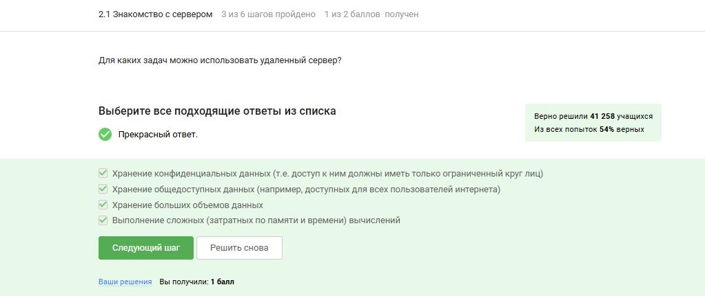
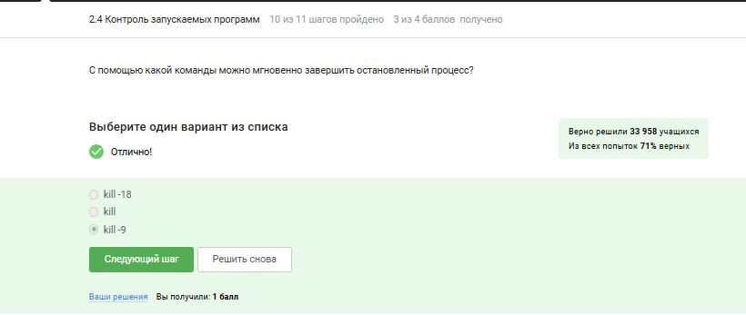
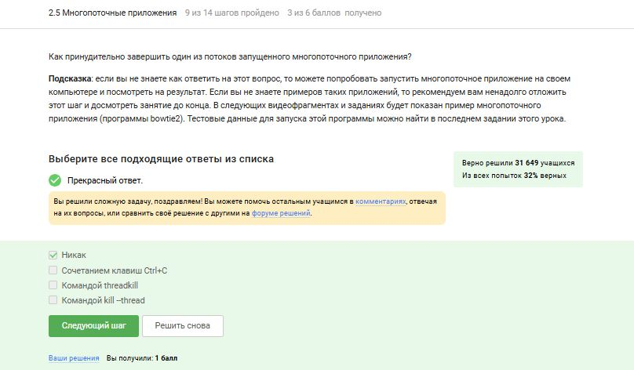

---
## Front matter
lang: ru-RU
title: По внешнему курсу «Введение в Linux»
subtitle: Операционные системы
author:
  - Головина М.И.
institute:
  - Российский университет дружбы народов, Москва, Россия
  - Факультет Физико-математических и естественных наук
date: 17 мая 2025

## i18n babel
babel-lang: russian
babel-otherlangs: english

## Formatting pdf
toc: false
toc-title: Содержание
slide_level: 2
aspectratio: 169
section-titles: true
theme: metropolis
header-includes:
 - \metroset{progressbar=frametitle,sectionpage=progressbar,numbering=fraction}
 - '\makeatletter'
 - '\beamer@ignorenonframefalse'
 - '\makeatother'
---

# Информация

## Докладчик

:::::::::::::: {.columns align=center}
::: {.column width="70%"}

  * Головина Мария Игоревна
  * Бакалавр направления подготовки Математика и механика
  * студентка группы НММбд - 02- 24
  * Российский университет дружбы народов
  * [1132246810@pfur.ru](mailto:1132246810@pfur.ru)

:::
::: {.column width="30%"}

:::
::::::::::::::

## Цель

- Познакомятся с операционной системой Linux и её базовыми возможностями. 
  
## Задание

1. Работа на сервере
2. Знакомство с сервером
3. Обмен файлами
4. Запуск приложений
5. Контроль запускаемых программ
6. Многопоточные приложения
7. Менеджер терминалов tmux
8. Как установить Linux: расширенное руководство

# Ход работы

## Задание 2.1.3 и 2.1.6
::::::::::::: {.columns align=center}
::: {.column width="40%"}
Познакомились с сервером и отвечаем на несколько тестовых вопросов
:::
::: {.column width="60%"}

:::
::::::::::::::

## Задание 2.1.3 и 2.1.6
::::::::::::: {.columns align=center}
::: {.column width="40%"}
Познакомились с сервером и отвечаем на несколько тестовых вопросов
:::
::: {.column width="60%"}

:::
::::::::::::::

## Задание 2.2.4, 2.2.6 и 2.2.8
::::::::::::: {.columns align=center}
::: {.column width="40%"}
Рассмотрели обмен файлами и отвечаем на несколько тестовых вопросов
:::
::: {.column width="60%"}

:::
::::::::::::::

## Задание 2.2.4, 2.2.6 и 2.2.8
::::::::::::: {.columns align=center}
::: {.column width="40%"}
Рассмотрели обмен файлами и отвечаем на несколько тестовых вопросов
:::
::: {.column width="60%"}

:::
::::::::::::::

## Задание 2.2.4, 2.2.6 и 2.2.8
::::::::::::: {.columns align=center}
::: {.column width="40%"}
Рассмотрели обмен файлами и отвечаем на несколько тестовых вопросов
:::
::: {.column width="60%"}

:::
::::::::::::::

## Задание 2.3.4, 2.3.6, 2.3.7 и 2.3.8
::::::::::::: {.columns align=center}
::: {.column width="40%"}
Рассмотрели запуск приложений и отвечаем на несколько тестовых вопросов
:::
::: {.column width="60%"}

:::
::::::::::::::

## Задание 2.3.4, 2.3.6, 2.3.7 и 2.3.8
::::::::::::: {.columns align=center}
::: {.column width="40%"}
Рассмотрели запуск приложений и отвечаем на несколько тестовых вопросов
:::
::: {.column width="60%"}

:::
::::::::::::::

## Задание 2.3.4, 2.3.6, 2.3.7 и 2.3.8
::::::::::::: {.columns align=center}
::: {.column width="40%"}
Рассмотрели запуск приложений и отвечаем на несколько тестовых вопросов
:::
::: {.column width="60%"}

:::
::::::::::::::

## Задание 2.3.4, 2.3.6, 2.3.7 и 2.3.8
::::::::::::: {.columns align=center}
::: {.column width="40%"}
Рассмотрели запуск приложений и отвечаем на несколько тестовых вопросов
:::
::: {.column width="60%"}

:::
::::::::::::::

## Задание 2.4.5, 2.4.8, 2.4.10 и 2.4.11
::::::::::::: {.columns align=center}
::: {.column width="40%"}
Рассмотрели контроль запускаемых приложений и отвечаем на несколько тестовых вопросов
:::
::: {.column width="60%"}

:::
::::::::::::::

## Задание 2.4.5, 2.4.8, 2.4.10 и 2.4.11
::::::::::::: {.columns align=center}
::: {.column width="40%"}
Рассмотрели контроль запускаемых приложений и отвечаем на несколько тестовых вопросов
:::
::: {.column width="60%"}

:::
::::::::::::::

## Задание 2.4.5, 2.4.8, 2.4.10 и 2.4.11
::::::::::::: {.columns align=center}
::: {.column width="40%"}
Рассмотрели контроль запускаемых приложений и отвечаем на несколько тестовых вопросов
:::
::: {.column width="60%"}

:::
::::::::::::::

## Задание 2.4.5, 2.4.8, 2.4.10 и 2.4.11
::::::::::::: {.columns align=center}
::: {.column width="40%"}
Рассмотрели контроль запускаемых приложений и отвечаем на несколько тестовых вопросов
:::
::: {.column width="60%"}

:::
::::::::::::::

## Задание 2.5.7, 2.5.8, 2.5.9, 2.5.12 и 2.5.13
::::::::::::: {.columns align=center}
::: {.column width="40%"}
Познакомились с многопоточными приложениями и отвечаем на несколько тестовых вопросов
:::
::: {.column width="60%"}

:::
::::::::::::::

## Задание 2.5.7, 2.5.8, 2.5.9, 2.5.12 и 2.5.13
::::::::::::: {.columns align=center}
::: {.column width="40%"}
Познакомились с многопоточными приложениями и отвечаем на несколько тестовых вопросов
:::
::: {.column width="60%"}

:::
::::::::::::::

## Задание 2.5.7, 2.5.8, 2.5.9, 2.5.12 и 2.5.13
::::::::::::: {.columns align=center}
::: {.column width="40%"}
Познакомились с многопоточными приложениями и отвечаем на несколько тестовых вопросов
:::
::: {.column width="60%"}

:::
::::::::::::::

## Задание 2.5.7, 2.5.8, 2.5.9, 2.5.12 и 2.5.13
::::::::::::: {.columns align=center}
::: {.column width="40%"}
Познакомились с многопоточными приложениями и отвечаем на несколько тестовых вопросов
:::
::: {.column width="60%"}

:::
::::::::::::::

## Задание 2.5.7, 2.5.8, 2.5.9, 2.5.12 и 2.5.13
::::::::::::: {.columns align=center}
::: {.column width="40%"}
Познакомились с многопоточными приложениями и отвечаем на несколько тестовых вопросов
:::
::: {.column width="60%"}

:::
::::::::::::::

## Задание 2.6.5, 2.6.10, 2.6.14, 2.6.15, 2.6.18 и 2.6.19
::::::::::::: {.columns align=center}
::: {.column width="40%"}
 Познакомились с  Менеджером терминалов tmux и отвечаем на несколько тестовых вопросов 
:::
::: {.column width="60%"}

:::
::::::::::::::

## Задание 2.6.5, 2.6.10, 2.6.14, 2.6.15, 2.6.18 и 2.6.19
::::::::::::: {.columns align=center}
::: {.column width="40%"}
 Познакомились с  Менеджером терминалов tmux и отвечаем на несколько тестовых вопросов 
:::
::: {.column width="60%"}

:::
::::::::::::::

## Задание 2.6.5, 2.6.10, 2.6.14, 2.6.15, 2.6.18 и 2.6.19
::::::::::::: {.columns align=center}
::: {.column width="40%"}
 Познакомились с  Менеджером терминалов tmux и отвечаем на несколько тестовых вопросов 
:::
::: {.column width="60%"}

:::
::::::::::::::

## Задание 2.6.5, 2.6.10, 2.6.14, 2.6.15, 2.6.18 и 2.6.19
::::::::::::: {.columns align=center}
::: {.column width="40%"}
 Познакомились с  Менеджером терминалов tmux и отвечаем на несколько тестовых вопросов 
:::
::: {.column width="60%"}

:::
::::::::::::::

## Задание 2.6.5, 2.6.10, 2.6.14, 2.6.15, 2.6.18 и 2.6.19
::::::::::::: {.columns align=center}
::: {.column width="40%"}
 Познакомились с  Менеджером терминалов tmux и отвечаем на несколько тестовых вопросов 
:::
::: {.column width="60%"}

:::
::::::::::::::

## Задание 2.6.5, 2.6.10, 2.6.14, 2.6.15, 2.6.18 и 2.6.19
::::::::::::: {.columns align=center}
::: {.column width="40%"}
 Познакомились с  Менеджером терминалов tmux и отвечаем на несколько тестовых вопросов 
:::
::: {.column width="60%"}

:::
::::::::::::::

# Вывод
## Заключение
Познакомились с операционной системой Linux и её базовыми возможностями.

# Дорогу осилит идущий

