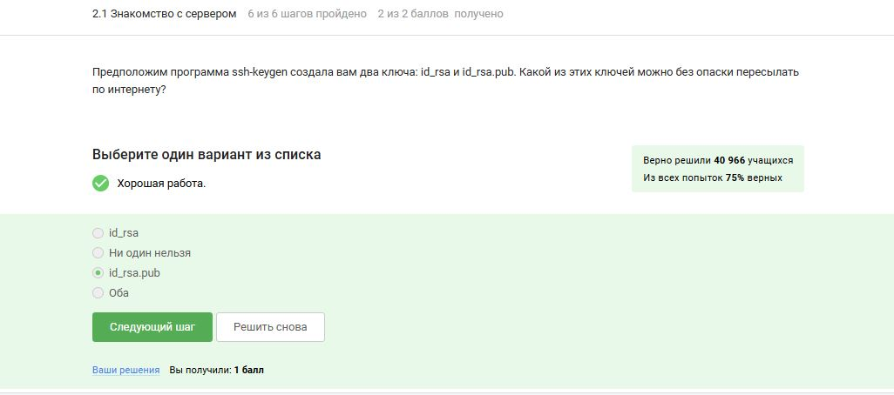
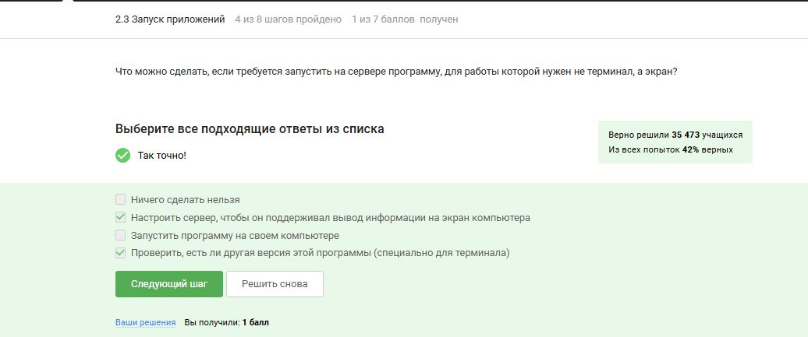
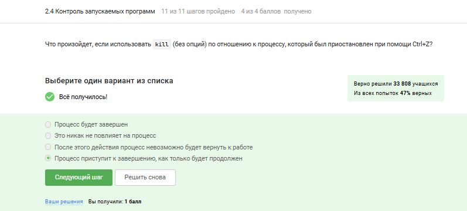
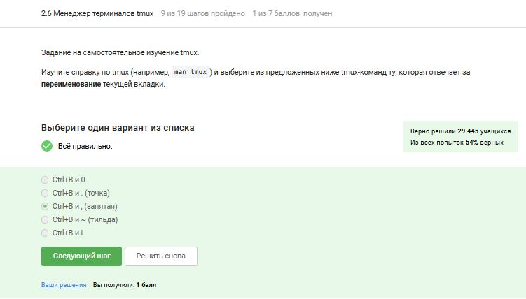

---
## Front matter
title: "По внешнему курсу «Введение в Linux»"
subtitle: "Операционные системы"
author: "Головина Мария Игоревна"

## Generic otions
lang: ru-RU
toc-title: "Содержание"

## Bibliography
bibliography: bib/cite.bib
csl: pandoc/csl/gost-r-7-0-5-2008-numeric.csl

## Pdf output format
toc: true # Table of contents
toc-depth: 2
lof: true # List of figures
lot: true # List of tables
fontsize: 12pt
linestretch: 1.5
papersize: a4
documentclass: scrreprt
## I18n polyglossia
polyglossia-lang:
  name: russian
  options:
	- spelling=modern
	- babelshorthands=true
polyglossia-otherlangs:
  name: english
## I18n babel
babel-lang: russian
babel-otherlangs: english
## Fonts
mainfont: IBM Plex Serif
romanfont: IBM Plex Serif
sansfont: IBM Plex Sans
monofont: IBM Plex Mono
mathfont: STIX Two Math
mainfontoptions: Ligatures=Common,Ligatures=TeX,Scale=0.94
romanfontoptions: Ligatures=Common,Ligatures=TeX,Scale=0.94
sansfontoptions: Ligatures=Common,Ligatures=TeX,Scale=MatchLowercase,Scale=0.94
monofontoptions: Scale=MatchLowercase,Scale=0.94,FakeStretch=0.9
mathfontoptions:
## Biblatex
biblatex: true
biblio-style: "gost-numeric"
biblatexoptions:
  - parentracker=true
  - backend=biber
  - hyperref=auto
  - language=auto
  - autolang=other*
  - citestyle=gost-numeric
## Pandoc-crossref LaTeX customization
figureTitle: "Рис."
tableTitle: "Таблица"
listingTitle: "Листинг"
lofTitle: "Список иллюстраций"
lotTitle: "Список таблиц"
lolTitle: "Листинги"
## Misc options
indent: true
header-includes:
  - \usepackage{indentfirst}
  - \usepackage{float} # keep figures where there are in the text
  - \floatplacement{figure}{H} # keep figures where there are in the text
---

# Цель работы

Познакомятся с операционной системой Linux и её базовыми возможностями. 

# Задание

1. Работа на сервере
2. Знакомство с сервером
3. Обмен файлами
4. Запуск приложений
5. Контроль запускаемых программ
6. Многопоточные приложения
7. Менеджер терминалов tmux
8. Как установить Linux: расширенное руководство

# Теоретическое введение

Здесь описываются теоретические аспекты, связанные с выполнением работы.
Например, в табл. 3.1 приведено краткое описание стандартных каталогов Linux.

В табл. [-@tbl:std-dir] приведено краткое описание стандартных каталогов Linux.

: Описание некоторых каталогов файловой системы GNU Linux {#tbl:std-dir}

| Имя каталога | Описание каталога                                                                                                          |
|--------------|----------------------------------------------------------------------------------------------------------------------------|
| `/`          | Корневая директория, содержащая всю файловую                                                                               |
| `bin`        | Основные системные утилиты, необходимые как в однопользовательском режиме, так и при обычной работе всем пользователям     |
| `/etc`       | Общесистемные конфигурационные файлы и файлы конфигурации установленных программ                                           |
| `/ home`     | Содержит домашние директории пользователей, которые, в свою очередь, содержат персональные настройки и данные пользователя |
| `/ root`     | Домашняя директория пользователя root                                                                                      |
|`/tmp`        | временные файлы                                                                                                            |

Более подробно об Linux см. в [1–6].

# Выполнение лабораторной работы

1. Познакомились с сервером и отвечаем на несколько тестовых вопросов (рис. 4.1-4.2).

{#fig:001 width=70%}

{#fig:002 width=70%}

2. Рассмотрели обмен файлами и отвечаем на несколько тестовых вопросов (рис. 4.3-4.5).

{#fig:003 width=70%}

{#fig:004 width=70%}

{#fig:005 width=70%}

3. Рассмотрели запуск приложений и отвечаем на несколько тестовых вопросов (рис. 4.6-4.9).

{#fig:006 width=70%}

{#fig:007 width=70%}

{#fig:008 width=70%}

{#fig:009 width=70%}

4. Рассмотрели контроль запускаемых приложений и отвечаем на несколько тестовых вопросов (рис. 4.10-4.13).

{#fig:010 width=70%}

{#fig:011 width=70%}

{#fig:012 width=70%}

{#fig:013 width=70%}

5. Познакомились с многопоточными приложениями и отвечаем на несколько тестовых вопросов (рис. 4.14-4.18).

{#fig:014 width=70%}

{#fig:015 width=70%}

{#fig:016 width=70%}

{#fig:017 width=70%}

{#fig:018 width=70%}

6. Познакомились с  Менеджером терминалов tmux и отвечаем на несколько тестовых вопросов (рис. 4.19-4.24).

{#fig:019 width=70%}

{#fig:020 width=70%}

{#fig:021 width=70%}

{#fig:022 width=70%}

{#fig:023 width=70%}

{#fig:024 width=70%}

# Выводы

Познакомились с операционной системой Linux и её базовыми возможностями. 

# Список литературы{.unnumbered}

1. http://rus-linux.net/  -- виртуальная энциклопедия Linux 
2. http://www.f-notes.info/linux:linux_command -- довольно обширный список полезных команд терминала.
3. http://ru.najomi.org/_nix -- полезные примеры использования команд терминала
4. http://forum.ubuntu.ru/ -- форум русскоязычного сообщества Ubuntu.
5. http://ru.najomi.org/vim -- команды vim
6. http://lib.ru/LINUXGUIDE/torvalds_jast_for_fun.txt -- книга создателя Linux Линуса Торвальдса "Just for fun".

::: {#refs}
:::
