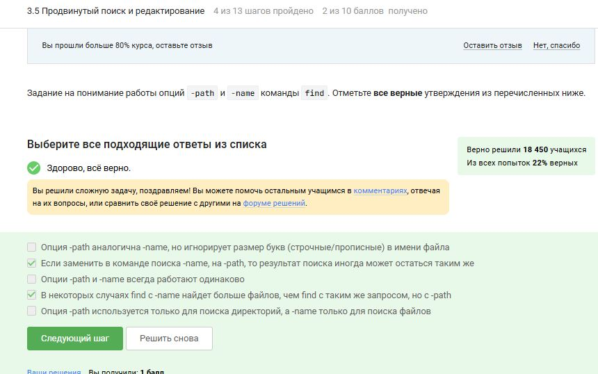
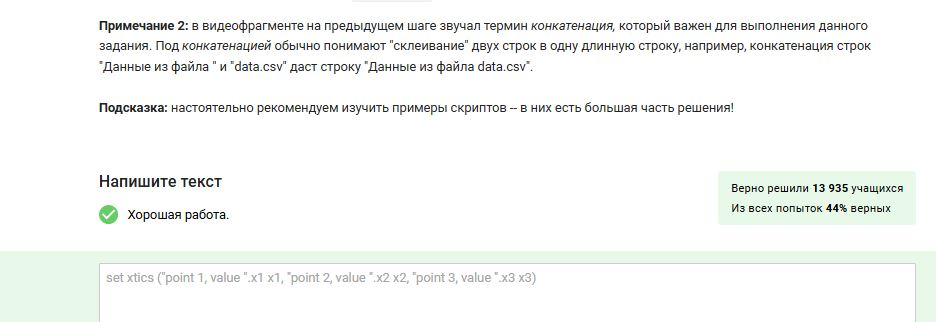
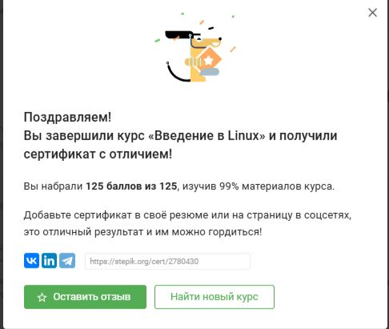

---
## Front matter
lang: ru-RU
title: По внешнему курсу «Введение в Linux»
subtitle: Операционные системы
author:
  - Головина М.И.
institute:
  - Российский университет дружбы народов, Москва, Россия
  - Факультет Физико-математических и естественных наук
date: 17 мая 2025

## i18n babel
babel-lang: russian
babel-otherlangs: english

## Formatting pdf
toc: false
toc-title: Содержание
slide_level: 2
aspectratio: 169
section-titles: true
theme: metropolis
header-includes:
 - \metroset{progressbar=frametitle,sectionpage=progressbar,numbering=fraction}
 - '\makeatletter'
 - '\beamer@ignorenonframefalse'
 - '\makeatother'
---

# Информация

## Докладчик

:::::::::::::: {.columns align=center}
::: {.column width="70%"}

  * Головина Мария Игоревна
  * Бакалавр направления подготовки Математика и механика
  * студентка группы НММбд - 02- 24
  * Российский университет дружбы народов
  * [1132246810@pfur.ru](mailto:1132246810@pfur.ru)

:::
::: {.column width="30%"}

:::
::::::::::::::

## Цель

- Познакомятся с операционной системой Linux и её базовыми возможностями. 
  
## Задание

1. Продвинутые темы
2. Текстовый редактор vim
3. Скрипты на bash: основы
4. Скрипты на bash: ветвления и циклы
5. Скрипты на bash: разное
6. Продвинутый поиск и редактирование
7. Строим графики в gnuplot
8. Разное

# Ход работы

## Задание 3.1.5, 3.1.7, 3.1.8, 3.1.10 и 3.1.11
::::::::::::: {.columns align=center}
::: {.column width="40%"}
Познакомились Текстовым редактор vim и отвечаем на несколько тестовых вопросов
:::
::: {.column width="60%"}

:::
::::::::::::::

## Задание 3.1.5, 3.1.7, 3.1.8, 3.1.10 и 3.1.11
::::::::::::: {.columns align=center}
::: {.column width="40%"}
Познакомились Текстовым редактор vim и отвечаем на несколько тестовых вопросов
:::
::: {.column width="60%"}

:::
::::::::::::::

## Задание 3.1.5, 3.1.7, 3.1.8, 3.1.10 и 3.1.11
::::::::::::: {.columns align=center}
::: {.column width="40%"}
Познакомились Текстовым редактор vim и отвечаем на несколько тестовых вопросов
:::
::: {.column width="60%"}

:::
::::::::::::::

## Задание 3.1.5, 3.1.7, 3.1.8, 3.1.10 и 3.1.11
::::::::::::: {.columns align=center}
::: {.column width="40%"}
Познакомились Текстовым редактор vim и отвечаем на несколько тестовых вопросов
:::
::: {.column width="60%"}

:::
::::::::::::::

## Задание 3.1.5, 3.1.7, 3.1.8, 3.1.10 и 3.1.11
::::::::::::: {.columns align=center}
::: {.column width="40%"}
Познакомились Текстовым редактор vim и отвечаем на несколько тестовых вопросов
:::
::: {.column width="60%"}

:::
::::::::::::::

## Задание 3.2.3, 3.2.5, 3.2.7 и 3.2.10
::::::::::::: {.columns align=center}
::: {.column width="40%"}
Познакомились с основами скриптов на bash и отвечаем на несколько тестовых вопросов
:::
::: {.column width="60%"}

:::
::::::::::::::

## Задание 3.2.3, 3.2.5, 3.2.7 и 3.2.10
::::::::::::: {.columns align=center}
::: {.column width="40%"}
Познакомились с основами скриптов на bash и отвечаем на несколько тестовых вопросов
:::
::: {.column width="60%"}

:::
::::::::::::::

## Задание 3.2.3, 3.2.5, 3.2.7 и 3.2.10
::::::::::::: {.columns align=center}
::: {.column width="40%"}
Познакомились с основами скриптов на bash и отвечаем на несколько тестовых вопросов
:::
::: {.column width="60%"}

:::
::::::::::::::

## Задание 3.2.3, 3.2.5, 3.2.7 и 3.2.10
::::::::::::: {.columns align=center}
::: {.column width="40%"}
Познакомились с основами скриптов на bash и отвечаем на несколько тестовых вопросов
:::
::: {.column width="60%"}

:::
::::::::::::::

## Задание 3.3.3, 3.3.5, 3.3.6, 3.3.8 и 3.3.9
::::::::::::: {.columns align=center}
::: {.column width="40%"}
Изучили  скрипты на bash: ветвления и циклы и отвечаем на несколько тестовых вопросов
:::
::: {.column width="60%"}

:::
::::::::::::::

## Задание 3.3.3, 3.3.5, 3.3.6, 3.3.8 и 3.3.9
::::::::::::: {.columns align=center}
::: {.column width="40%"}
Изучили  скрипты на bash: ветвления и циклы и отвечаем на несколько тестовых вопросов
:::
::: {.column width="60%"}

:::
::::::::::::::

## Задание 3.3.3, 3.3.5, 3.3.6, 3.3.8 и 3.3.9
::::::::::::: {.columns align=center}
::: {.column width="40%"}
Изучили  скрипты на bash: ветвления и циклы и отвечаем на несколько тестовых вопросов
:::
::: {.column width="60%"}

:::
::::::::::::::

## Задание 3.3.3, 3.3.5, 3.3.6, 3.3.8 и 3.3.9
::::::::::::: {.columns align=center}
::: {.column width="40%"}
Изучили  скрипты на bash: ветвления и циклы и отвечаем на несколько тестовых вопросов
:::
::: {.column width="60%"}

:::
::::::::::::::

## Задание 3.3.3, 3.3.5, 3.3.6, 3.3.8 и 3.3.9
::::::::::::: {.columns align=center}
::: {.column width="40%"}
Изучили  скрипты на bash: ветвления и циклы и отвечаем на несколько тестовых вопросов
:::
::: {.column width="60%"}

:::
::::::::::::::

## Задание 3.4.3, 3.4.5, 3.4.6, 3.4.8, 3.4.9 и 3.4.10
::::::::::::: {.columns align=center}
::: {.column width="40%"}
Изучили  скрипты на bash: разное и отвечаем на несколько тестовых вопросов
:::
::: {.column width="60%"}

:::
::::::::::::::

## Задание 3.4.3, 3.4.5, 3.4.6, 3.4.8, 3.4.9 и 3.4.10
::::::::::::: {.columns align=center}
::: {.column width="40%"}
Изучили  скрипты на bash: разное и отвечаем на несколько тестовых вопросов
:::
::: {.column width="60%"}

:::
::::::::::::::

## Задание 3.4.3, 3.4.5, 3.4.6, 3.4.8, 3.4.9 и 3.4.10
::::::::::::: {.columns align=center}
::: {.column width="40%"}
Изучили  скрипты на bash: разное и отвечаем на несколько тестовых вопросов
:::
::: {.column width="60%"}

:::
::::::::::::::

## Задание 3.4.3, 3.4.5, 3.4.6, 3.4.8, 3.4.9 и 3.4.10
::::::::::::: {.columns align=center}
::: {.column width="40%"}
Изучили  скрипты на bash: разное и отвечаем на несколько тестовых вопросов
:::
::: {.column width="60%"}

:::
::::::::::::::

## Задание 3.4.3, 3.4.5, 3.4.6, 3.4.8, 3.4.9 и 3.4.10
::::::::::::: {.columns align=center}
::: {.column width="40%"}
Изучили  скрипты на bash: разное и отвечаем на несколько тестовых вопросов
:::
::: {.column width="60%"}

:::
::::::::::::::

## Задание 3.4.3, 3.4.5, 3.4.6, 3.4.8, 3.4.9 и 3.4.10
::::::::::::: {.columns align=center}
::: {.column width="40%"}
Изучили  скрипты на bash: разное и отвечаем на несколько тестовых вопросов
:::
::: {.column width="60%"}

:::
::::::::::::::

## Задание 3.5.3, 3.5.4, 3.5.5, 3.5.7, 3.5.9, 3.5.11 и 3.5.12
::::::::::::: {.columns align=center}
::: {.column width="40%"}
Изучили  продвинутый поиск и редактирование и отвечаем на несколько тестовых вопросов
:::
::: {.column width="60%"}

:::
::::::::::::::

## Задание 3.5.3, 3.5.4, 3.5.5, 3.5.7, 3.5.9, 3.5.11 и 3.5.12
::::::::::::: {.columns align=center}
::: {.column width="40%"}
Изучили  продвинутый поиск и редактирование и отвечаем на несколько тестовых вопросов
:::
::: {.column width="60%"}

:::
::::::::::::::

## Задание 3.5.3, 3.5.4, 3.5.5, 3.5.7, 3.5.9, 3.5.11 и 3.5.12
::::::::::::: {.columns align=center}
::: {.column width="40%"}
Изучили  продвинутый поиск и редактирование и отвечаем на несколько тестовых вопросов
:::
::: {.column width="60%"}

:::
::::::::::::::

## Задание 3.5.3, 3.5.4, 3.5.5, 3.5.7, 3.5.9, 3.5.11 и 3.5.12
::::::::::::: {.columns align=center}
::: {.column width="40%"}
Изучили  продвинутый поиск и редактирование и отвечаем на несколько тестовых вопросов
:::
::: {.column width="60%"}

:::
::::::::::::::

## Задание 3.5.3, 3.5.4, 3.5.5, 3.5.7, 3.5.9, 3.5.11 и 3.5.12
::::::::::::: {.columns align=center}
::: {.column width="40%"}
Изучили  продвинутый поиск и редактирование и отвечаем на несколько тестовых вопросов
:::
::: {.column width="60%"}

:::
::::::::::::::

## Задание 3.5.3, 3.5.4, 3.5.5, 3.5.7, 3.5.9, 3.5.11 и 3.5.12
::::::::::::: {.columns align=center}
::: {.column width="40%"}
Изучили  продвинутый поиск и редактирование и отвечаем на несколько тестовых вопросов
:::
::: {.column width="60%"}

:::
::::::::::::::

## Задание 3.5.3, 3.5.4, 3.5.5, 3.5.7, 3.5.9, 3.5.11 и 3.5.12
::::::::::::: {.columns align=center}
::: {.column width="40%"}
Изучили  продвинутый поиск и редактирование и отвечаем на несколько тестовых вопросов
:::
::: {.column width="60%"}

:::
::::::::::::::

## Задание 3.6.3, 3.6.5, 3.6.7 и 3.6.10
::::::::::::: {.columns align=center}
::: {.column width="40%"}
Изучили построение графиков в gnuplot и отвечаем на несколько тестовых вопросов
:::
::: {.column width="60%"}

:::
::::::::::::::

## Задание 3.6.3, 3.6.5, 3.6.7 и 3.6.10
::::::::::::: {.columns align=center}
::: {.column width="40%"}
Изучили построение графиков в gnuplot и отвечаем на несколько тестовых вопросов
:::
::: {.column width="60%"}

:::
::::::::::::::

## Задание 3.6.3, 3.6.5, 3.6.7 и 3.6.10
::::::::::::: {.columns align=center}
::: {.column width="40%"}
Изучили построение графиков в gnuplot и отвечаем на несколько тестовых вопросов
:::
::: {.column width="60%"}

:::
::::::::::::::

## Задание 3.6.3, 3.6.5, 3.6.7 и 3.6.10
::::::::::::: {.columns align=center}
::: {.column width="40%"}
Изучили построение графиков в gnuplot и отвечаем на несколько тестовых вопросов
:::
::: {.column width="60%"}

:::
::::::::::::::

## Задание 3.7.4, 3.7.5, 3.7.7, 3.7.8 и 3.7.10
::::::::::::: {.columns align=center}
::: {.column width="40%"}
Изучили  пункт Разное и отвечаем на несколько тестовых вопросов
:::
::: {.column width="60%"}

:::
::::::::::::::

## Задание 3.7.4, 3.7.5, 3.7.7, 3.7.8 и 3.7.10
::::::::::::: {.columns align=center}
::: {.column width="40%"}
Изучили  пункт Разное и отвечаем на несколько тестовых вопросов
:::
::: {.column width="60%"}

:::
::::::::::::::

## Задание 3.7.4, 3.7.5, 3.7.7, 3.7.8 и 3.7.10
::::::::::::: {.columns align=center}
::: {.column width="40%"}
Изучили  пункт Разное и отвечаем на несколько тестовых вопросов
:::
::: {.column width="60%"}

:::
::::::::::::::

## Задание 3.7.4, 3.7.5, 3.7.7, 3.7.8 и 3.7.10
::::::::::::: {.columns align=center}
::: {.column width="40%"}
Изучили  пункт Разное и отвечаем на несколько тестовых вопросов
:::
::: {.column width="60%"}

:::
::::::::::::::

## Задание 3.7.4, 3.7.5, 3.7.7, 3.7.8 и 3.7.10
::::::::::::: {.columns align=center}
::: {.column width="40%"}
Изучили  пункт Разное и отвечаем на несколько тестовых вопросов
:::
::: {.column width="60%"}

:::
::::::::::::::

## Итог
::::::::::::: {.columns align=center}
::: {.column width="40%"}
Итог
:::
::: {.column width="60%"}

:::
::::::::::::::

# Вывод
## Заключение
Познакомились с операционной системой Linux и её базовыми возможностями.

# Дорогу осилит идущий

